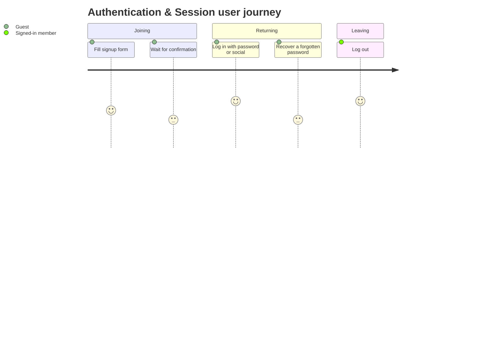

# F002_AuthenticationAndSession — Functional Spec

**Priority**: P0
**Type**: mixed
**Generated**: 2026-08-21

**See also:** [`technical-spec.md`](./technical-spec.md) — endpoints, Source citations, pseudocode,
key entities, and DB writes for a Dev/QA/SA audience.

## 1. Overview

**Problem:** A visitor needs a way to become a recognized member (or come back as one) so the
marketplace can attach listings, messages, and transactions to a real identity, and members need
a way to end that session on a shared device.
**Solution:** The system lets a guest create an account with email/password or a social account
(Facebook/Google/LinkedIn), lets a returning member log back in with credentials or the same
social account, lets a member who forgot their password recover it by email, lets a signed-in
member log out, and periodically purges expired sessions and stale auth tokens in the background
so accumulated login state does not build up forever.
**Scope:** Account creation (email or social), credential login, forgotten-password recovery,
logout, and scheduled session/token housekeeping.
**Non-Scope:** Community consent/terms acceptance, email-confirmation waiting/resend, and
access-denied handling for banned/unconfirmed members are a separate gate that runs right after
these flows — see Dependencies. Account editing, deletion, and profile settings are also out of
scope here.

**Actors**

| Actor | Description | Primary goal |
|-------|--------------|---------------|
| Guest | A visitor with no active session in this community | Create an account or log back into an existing one |
| Signed-in member | A member with an active session, any membership status | End their session on this device |
| System | The scheduled-housekeeping process, not a human actor | Keep session/token tables from growing unbounded |

This feature is part of the broader account-onboarding sequence together with
[F006_CommunityAccessGating] (consent, email confirmation, terms) — no `flows/` cross-reference
exists yet for this run.

## 2. Functional Capabilities

| ID | Capability | What the user can do | User Stories | Requirements | Business Rules | Screens |
|----|------------|------------------------|-----------------|---------------|-------------------|---------|
| CAP-01 | Sign up with email | Create a new account with email + password | US004 | FR-001, FR-002, FR-101, FR-104, FR-201, FR-202, FR-203 | BR-001, BR-002, BR-003, BR-004, BR-005 | SCR136, SCR122 |
| CAP-02 | Sign up / log in via social account | Use Facebook, Google, or LinkedIn instead of a password | US005 | FR-105 | DEC-001 | N/A — social buttons render inline on the signup and login screens already owned by CAP-01 and CAP-03, not a screen of their own |
| CAP-03 | Log in with password | Authenticate with existing username-or-email + password | US006 | FR-102, FR-103, FR-301, FR-302, FR-401 | DEC-002, DEC-003 | SCR138, SCR123 |
| CAP-04 | Reset a forgotten password | Request a reset email and set a new password from the link | US007 | FR-303, FR-304, FR-402, FR-602 | BR-006, DEC-004 | SCR119, SCR120 |
| CAP-05 | Log out | End the current session from any account status | US008 | FR-403, FR-601 | BR-007 | N/A — logout is an action with no dedicated screen in this feature |
| CAP-06 | Scheduled housekeeping | (system) purge stale sessions and auth tokens | US140 | FR-003, FR-603 | BR-008, SM-001 | N/A — background job, no screen |

## 3. Open Decisions

None — no unresolved domain confirmations. The one behavior that reads as questionable (differing
flash messages between a found and not-found password-reset email) is a recorded current-behavior
defect, not an open question — see § 11 RISK-01.

## 4. Requirements

### Foundation (0xx)

- **FR-001** A new account uses a generated (non-sequential) ID as its primary key, rather than an auto-increment counter, whether created via email or a social account.
- **FR-002** A newly created account is not usable to browse as a member until its community membership and (usually) email confirmation are settled.
- **FR-003** Session and auth-token housekeeping only runs when an operator has configured an external, recurring schedule — nothing in the app triggers it on its own.

### Navigation (1xx)

- **FR-101** A guest reaches the signup form from `/signup`, from the "create account" link on the login screen, or directly.
- **FR-102** A guest reaches the login form from `/login`, or after being redirected there by a page that requires login.
- **FR-103** A guest who is already logged in and visits the login screen is redirected to the search page.
- **FR-104** A guest who is already logged in can still view the signup form itself, even though submitting it behaves the same regardless of login state.
- **FR-105** Social sign-up/sign-in buttons appear on both the signup and login screens (gated by community configuration) and route through the same provider callback no matter which screen was used.

### Sign Up (2xx)

- **FR-201** The signup form offers an invitation-code field for invite-only communities, per-community custom fields, and a spam CAPTCHA.
- **FR-202** Submitting signup checks the CAPTCHA, a hidden spam-trap field, the invitation code (if required), and that the email is available and allowed for the community, in that order, before creating anything.
- **FR-203** A successful signup creates the account with a pending membership and, unless the community skips email confirmation, sends a confirmation email and sends the guest to wait for it.

### Login & Password Reset (3xx)

- **FR-301** The login form accepts a username or email plus password and has an inline "forgot my password" link.
- **FR-302** A correct login is only completed once the member has accepted the community's current terms/consent version; otherwise the member is signed back out and sent to accept terms instead.
- **FR-303** Submitting the forgot-password form always returns to the login page; a matching email gets a reset link, a non-matching one does not.
- **FR-304** The emailed reset link opens a dedicated screen where the member sets a new password.

### Interaction (4xx)

- **FR-401** After a completed login, the member is sent back to the page they originally wanted, then to a secondary saved destination, and only then to the default search page.
- **FR-402** The forgot-password form can be revealed by clicking the "forgot my password" link on the login screen, or automatically if the login page is opened with that intent already flagged, without navigating away.
- **FR-403** Logging out always clears the session and sends the member to the marketplace landing/home entry point.

### Security (6xx)

- **FR-601** Logging out stays available even to a banned, unconfirmed, or consent-pending member, even though those same statuses block them everywhere else.
- **FR-602** Password-reset email lookups are scoped to the current community, with a platform-admin exception that can look up across communities.
- **FR-603** Background session/auth-token cleanup sweeps every community at once — it is not scoped per community.

## 5. Business Rules

- A signup submission with the hidden spam-trap field filled in is treated as spam: no account is created and the guest is bounced back to the signup page (BR-001)
- A failed CAPTCHA re-shows the signup form with an error and creates nothing (BR-002)
- Communities that are invite-only require a usable, not-yet-exhausted invitation code before an account can be created (BR-003)
- Signup is refused if the email is already taken or is not on the community's allowed list (BR-004)
- A new account starts in a pending-confirmation state; it is auto-confirmed only if the community has confirmation disabled (BR-005)
- A password-reset request always redirects back to the login page regardless of whether the email matched anyone (BR-006)
- Logging out is exempt from every access restriction (banned, unconfirmed, consent-pending) that would otherwise block that same account (BR-007)
- Sessions idle for more than a month, and expired auth tokens, are purged by an external, scheduled process, which reports failure loudly instead of continuing silently (BR-008)
- Authorizing a social provider either logs in an already-linked account, or creates a new account and defers consent to the next step — unless the provider will not share an email or shares one that is not yet confirmed, in which case sign-in is refused with a plain-language error (DEC-001)
- A member cannot complete login without accepting the community's current terms; failing that check signs them back out immediately instead of leaving them half-logged-in (DEC-002)
- After a completed login, the member returns to the page they were trying to reach, then to a saved secondary destination, before finally falling back to the default search page (DEC-003)
- A signed-in-looking guest can reveal the forgot-password form on the login screen either by clicking the link or automatically when the login page is opened with that intent already flagged (DEC-004)
- A server-side session record tracks whether a login is newly created, actively refreshed, or torn down (SM-001)

## 6. Screens

| Screen Name | SCR### | What User Sees | What User Can Do |
|-------------|--------|-----------------|-------------------|
| SignUp | SCR136_SignUp | The app's own signup form: social buttons, invitation-code field (invite-only communities), custom fields, and a CAPTCHA | Create an account with email/password or a social account |
| Login | SCR138_Login | The app's own login form: username-or-email + password, social buttons, and an inline "forgot password" popup | Log in, switch to signup, or request a password reset |
| ResetPasswordForm | SCR119_ResetPasswordForm | The password-reset form reached from the emailed link | Set a new password |
| ForgotPasswordStock | SCR120_ForgotPasswordStock | A stock, unstyled "forgot your password" form `[INFERRED]` not linked from any in-app navigation | Technically submit a password-reset request, though no real user path reaches this page |
| SignUpStock | SCR122_SignUpStock | A stock, unstyled signup form `[INFERRED]` that is never actually rendered because the app's own signup view always wins | Nothing observable — this page is dead code, kept only because the framework still generates its route |
| DeviseLoginStock | SCR123_DeviseLoginStock | A stock, unstyled login form at a separate URL from the app's real login page | Log in through the stock framework-default form; not linked from any in-app navigation |

### User Journey

1. A guest opens SignUp and either fills in email/password or picks a social account.
2. On success, the guest is sent to wait for email confirmation (or straight into the marketplace if confirmation is disabled).
3. A returning guest instead opens Login, enters credentials or picks a social account, and reaches the marketplace search page (or wherever they were headed before being asked to log in).
4. A guest who forgot their password uses the inline popup on Login, receives an email, and follows its link to ResetPasswordForm to set a new password, then returns to Login.
5. A signed-in member logs out from anywhere and lands on the landing/home page.



## 7. User Stories

### US004_SignUpWithEmail — Sign up for an account with email/password

**Actor:** Guest
**Goal:** Create an account with my email and password.
**Business value:** Turns an anonymous visitor into a member who can be attached to listings, messages, and transactions.

**Acceptance Criteria:**
- [ ] Submitting valid signup details with no invite requirement creates the account and a pending membership.
- [ ] The hidden spam-trap field being filled in blocks account creation and bounces back to signup with an error, without revealing why to a real spammer.
- [ ] The confirmation-email path and the skip-confirmation path both end with the guest able to proceed (waiting screen vs. straight to search).

### US005_SignInWithOmniauth — Sign up or log in via Facebook/Google/LinkedIn

**Actor:** Guest
**Goal:** Sign up or log in using a social account instead of creating a new password.
**Business value:** Removes the password-creation friction point that otherwise costs signups.

**Acceptance Criteria:**
- [ ] Authorizing a provider that is already linked to an account logs that account in.
- [ ] Authorizing a provider for the first time creates a new account and sends the guest onward to the consent step.
- [ ] A provider that will not share an email, or shares an unconfirmed one, produces a plain-language error instead of a broken sign-in.

### US006_LogInWithPassword — Log in with email/username and password

**Actor:** Guest
**Goal:** Log in with my existing credentials.
**Business value:** Lets a returning member resume using their account.

**Acceptance Criteria:**
- [ ] Correct credentials with terms already accepted complete the login and return the member to what they were doing.
- [ ] Correct credentials but an unaccepted terms update sign the member back out and send them to accept terms instead of completing login.
- [ ] Incorrect credentials re-show the login form with an error and repopulate the login field.

### US007_ResetForgottenPassword — Reset a forgotten password

**Actor:** Guest
**Goal:** Request a reset link by email and set a new password.
**Business value:** Lets a member regain access without contacting support.

**Acceptance Criteria:**
- [ ] Submitting a matching email sends a reset link and returns to login with a success notice.
- [ ] Submitting a non-matching email returns to login with an error and sends nothing.
- [ ] Following the emailed link opens a working password-reset form.

### US008_LogOut — Log out of the current session

**Actor:** Signed-in member
**Goal:** Log out so my session is cleared on a shared device.
**Business value:** Protects account access on devices the member does not control.

**Acceptance Criteria:**
- [ ] Visiting logout clears the session and lands on the landing/home entry point.
- [ ] Logout works even for a member whose account is banned, unconfirmed, or awaiting consent.

### US140_RunScheduledHousekeepingTasks — Run scheduled housekeeping tasks

**Actor:** System
**Goal:** Periodically purge expired sessions and stale auth-token state.
**Business value:** Keeps session/token tables from growing without bound and keeps downstream flows (unsubscribe/magic links) working on fresh data.

**Acceptance Criteria:**
- [ ] Sessions untouched for over a month are deleted by the scheduled cleanup.
- [ ] Expired auth tokens are deleted by a separate scheduled task.
- [ ] A failure during cleanup is surfaced as a non-zero exit so the external scheduler reports it.

## 8. Scenarios

### US004_SignUpWithEmail — Happy Path

**Given** a guest with no invite requirement and a passing CAPTCHA, **When** they submit the signup form with a valid email/password, **Then** the account and a pending membership are created and the guest is sent to wait for (or skip) email confirmation.

### US004_SignUpWithEmail — Error: honeypot triggered

**Given** the hidden spam-trap field is filled in, **When** the guest submits the signup form, **Then** no account is created and the guest is bounced back to the signup page with a generic error.

### US005_SignInWithOmniauth — Happy Path

**Given** a guest authorizing a social provider that returns a usable email, **When** the provider redirects back, **Then** the guest is either logged into their existing linked account or a new account is created and they are sent to the consent step.

### US005_SignInWithOmniauth — Error: provider denies the request

**Given** the provider cancels or denies authorization, **When** the callback is reached, **Then** the guest sees a plain-language error and returns to the search page with no account state changed.

### US006_LogInWithPassword — Happy Path

**Given** correct credentials and accepted terms, **When** the guest submits the login form, **Then** they are signed in and returned to where they were headed.

### US006_LogInWithPassword — Error: terms not accepted

**Given** correct credentials but an unaccepted terms update, **When** the guest submits the login form, **Then** they are signed back out immediately and sent to accept terms instead of completing login.

### US007_ResetForgottenPassword — Happy Path

**Given** an email that matches a member of this community, **When** the guest submits the forgot-password form, **Then** a reset email is sent and the guest sees a success notice on the login page.

### US007_ResetForgottenPassword — Error: email not found

**Given** an email that matches no one in this community, **When** the guest submits the forgot-password form, **Then** no email is sent and the guest sees an error notice on the login page.

### US008_LogOut — Happy Path

**Given** an active session, **When** the member visits logout, **Then** the session is cleared and they land on the landing/home page.

## 9. Edge Cases

| Scenario | What Happens | User-Facing Message |
|----------|--------------|----------------------|
| Guest already logged in visits the login URL | Redirected away to the search page | None — silent redirect |
| Guest already logged in visits the signup URL | The signup form still renders (the view itself is not blocked, though submitting is unaffected by login state) | None — form renders normally |
| Guest submits signup with an email already registered, or not allowed for this community | Signup is rejected, nothing is created | "This email is already in use." or "This email is not allowed for this community." |
| Correct login credentials but the member's community consent has changed since last login | Signed back out immediately instead of completing login | Redirected to accept the updated terms |
| Password-reset request for an email that does not match anyone in the community | No email sent, generic outcome, same redirect as success | "We couldn't find that email address." |
| A social sign-in provider will not share an email address | No account is created or signed in | "We couldn't get your email address from {provider}." |
| A social sign-in email belongs to an account whose email is unconfirmed | Login refused | "Your {provider} email address is not confirmed." |
| Banned, unconfirmed, or consent-pending member visits logout | Logout still succeeds despite the account being blocked everywhere else | "You have been logged out." |
| Scheduled cleanup encounters an internal error mid-run | The job stops and reports failure rather than silently continuing | None — operator-facing failure signal only |

## 10. Edge Behaviours to Verify

- **FR-103** → confirm an already-logged-in guest is bounced from the login screen to search.
- **FR-104** → confirm the signup form still renders for an already-logged-in guest.
- **FR-202** → confirm the signup validation order (CAPTCHA → honeypot → invitation code → email checks) so a later check never runs after an earlier one already failed.
- **FR-302** → confirm a login with unaccepted terms signs the member back out rather than leaving a half-completed session.
- **FR-401** → confirm the redirect-target priority (originally requested page, then saved secondary destination, then default search) after a successful login.
- **FR-601** → confirm logout succeeds for banned/unconfirmed/consent-pending accounts specifically.

## 11. Risks & Known Issues

| ID | Type | Description | Impact | Status |
|----|------|--------------|--------|--------|
| RISK-01 | known-issue | The forgot-password flow shows a different flash message for a matching vs. non-matching email (a generic "sent" notice vs. an explicit "email not found" error), even though both redirect to the same page | Lets anyone probe, one address at a time, whether a given email is registered in this community (account enumeration) | confirmed |
| RISK-02 | known-issue | Two framework-default scaffolds (SignUpStock, DeviseLoginStock) and one legacy framework-default password page (ForgotPasswordStock) stay live/routed alongside the app's own screens even though they are unstyled and not linked from any in-app navigation | Unstyled/dead surface area that still executes real signup/login/password-reset logic if directly navigated to; not tested or maintained as user-facing UI | [INFERRED] |
| RISK-03 | risk | Session/auth-token cleanup depends entirely on an operator-configured external scheduler (Heroku Scheduler/crontab); nothing in this codebase runs it on its own | If the external schedule is ever removed or misconfigured, expired sessions and tokens accumulate indefinitely with no in-app fallback or alert | confirmed |

## 12. Dependencies

| Dependency | Type | Why this feature needs it | Evidence |
|------------|------|-----------------------------|----------|
| F006_CommunityAccessGating | feature | Every successful signup/login hands off into that feature's consent, email-confirmation, and terms-acceptance gates before the member reaches the marketplace | US009, US010, US011 |
| Facebook / Google / LinkedIn OAuth | external-service | Social sign-up and sign-in depend on each provider's OAuth callback returning a usable identity and (ideally) an email | US005 |
| Outbound email delivery | infrastructure | Confirmation and password-reset links only reach the guest/member if outbound mail delivery is working | US004, US007 |
| External scheduler (Heroku Scheduler / crontab) | infrastructure | Session and auth-token cleanup only run if an operator has configured a recurring external trigger; nothing in-repo schedules them | US140 |

## 13. Configuration

```text
SESSION_TTL_MONTHS = 1        # a server-side session record idle this long is purged by cleanup
SESSION_REFRESH_INTERVAL_DAYS = 1   # how often an active session's freshness timestamp is bumped
AUTH_TOKEN_EXPIRY_WEEKS = 4    # unsubscribe/magic-link auth tokens older than this are purged
```
