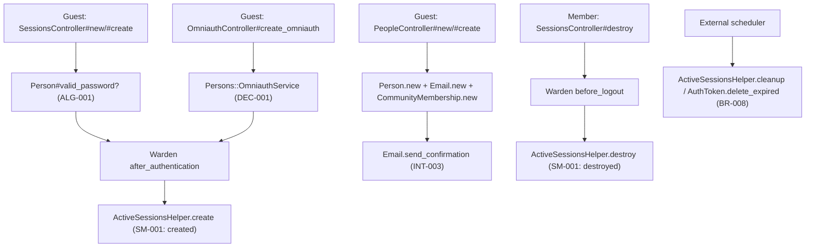

# Technical Spec — F002_AuthenticationAndSession

**Priority**: P0
**Type**: mixed
**Generated**: 2026-08-21

**See also:** [`functional-spec.md`](./functional-spec.md) — plain-language overview, open
decisions, requirements/business rules stated in one-liners, screens, user stories, scenarios,
edge cases, and configuration for a BA/QA audience.

## 1. Technical Overview

Three Rails controllers — `SessionsController` (password login/logout/forgot-password),
`PeopleController < Devise::RegistrationsController` (signup), and `OmniauthController`
(Facebook/Google/LinkedIn callbacks) — front Devise's `database_authenticatable`,
`registerable`, `recoverable`, `rememberable`, `trackable`, `omniauthable` modules on `Person`.
A parallel, app-authored session layer (`ActiveSessionsHelper`, hooked into Warden's
authentication callbacks) tracks server-side session freshness independent of Devise's own
cookie/DB session store, and is swept by an externally-scheduled cleanup job alongside expired
`AuthToken` rows.

## 2. Functional → Technical Mapping

| Code | Name | Where it is implemented | Technical notes | Source |
|------|------|--------------------------|-------------------|--------|
| FR-001 | New account gets a generated (non-sequential) ID | `Person#before_validation(:on => :create)` | `SecureRandom.urlsafe_base64`; shared by signup and OAuth signup paths | `app/models/person.rb:237-241` |
| FR-002 | New account not usable until membership/confirmation settled | `PeopleController#create` | `CommunityMembership.status = "pending_email_confirmation"` | `app/controllers/people_controller.rb:94-100` |
| FR-003 | Housekeeping runs only on an external schedule | `lib/tasks/sharetribe.rake`, `ActiveSessionsHelper.cleanup` | No in-repo cron/scheduler registers these | `docs/scheduled_tasks.md` (referenced, not in this repo's runtime) |
| FR-101 | Signup entry points | `PeopleController#new` | Routes `/signup` (alias), `/people/new` (resource) all hit the same action; a 3rd alias `/new` is cited in `route-list.md` as ROUTE653 but was not re-located in `config/routes.rb` in this pass — `[UNVERIFIED]` | `config/routes.rb:816,820-828` |
| FR-102 | Login entry points | `SessionsController#new` | Routes `/login` (top-level alias), `/sessions/new` (resource) | `config/routes.rb:143,797-802` |
| FR-103 | Already-logged-in guest bounced from login | `SessionsController#new` | `redirect_to search_path if logged_in?` | `app/controllers/sessions_controller.rb:16` |
| FR-104 | Signup form view stays reachable while logged in | `PeopleController` | `skip_before_action :require_no_authentication, :only => [:new]` | `app/controllers/people_controller.rb:5` |
| FR-105 | Social buttons on both signup/login, shared callback | `OmniauthController`, `sessions/new.haml`, `people/new.haml` | One controller serves both entry screens via `omniauth.rb` devise config | `app/controllers/omniauth_controller.rb:1-13`, `config/routes.rb:110` |
| FR-201 | Signup form fields (invite code, custom fields, CAPTCHA) | `PeopleController#new`, `people/new.haml` | `@service = Persons::SettingsService.new(...)` | `app/controllers/people_controller.rb:33-40` |
| FR-202 | Signup validation order | `PeopleController#create` | CAPTCHA → honeypot → invite code → email checks, in that order | `app/controllers/people_controller.rb:53-81` |
| FR-203 | Signup success behavior | `PeopleController#create` | Branches on `APP_CONFIG.skip_email_confirmation` | `app/controllers/people_controller.rb:111-120` |
| FR-301 | Login form fields + forgot-password link | `sessions/new.haml` | `#password_forgotten_link` toggles the inline popup | `app/views/sessions/new.haml:26-40` |
| FR-302 | Login requires accepted consent | `SessionsController#create` | See DEC-002 | `app/controllers/sessions_controller.rb:48-55` |
| FR-303 | Forgot-password submit outcome | `SessionsController#request_new_password` | Same redirect target regardless of match; flash differs (see BR-006/RISK-01) | `app/controllers/sessions_controller.rb:91-106` |
| FR-304 | Reset-password screen usage | `devise/passwords#edit`/`#update` (Devise `:recoverable`) | Not an app-authored controller; `Person` includes `:recoverable` | `app/models/person.rb:82-84` |
| FR-401 | Post-login redirect priority | `SessionsController#create` | See DEC-003 | `app/controllers/sessions_controller.rb:64-72` |
| FR-402 | Forgot-password popup reveal | `initialize_login_form()` (client JS) | See DEC-004 | `app/assets/javascripts/kassi.js:269-280` |
| FR-403 | Logout clears session + redirects | `SessionsController#destroy` | `sign_out` + `redirect_to landing_page_path` | `app/controllers/sessions_controller.rb:75-85` |
| FR-601 | Logout bypasses banned/unconfirmed/consent gates | `SessionsController` | 4 `skip_before_action` calls scoped to `:destroy` | `app/controllers/sessions_controller.rb:5-8` |
| FR-602 | Password-reset lookup scoped to community | `SessionsController#request_new_password` | `people.is_admin = '1' OR people.community_id = :cid` | `app/controllers/sessions_controller.rb:92-96` |
| FR-603 | Background cleanup is not community-scoped | `ActiveSessionsHelper.cleanup`, `AuthToken.delete_expired` | Neither query filters on `community_id` | `lib/active_sessions_helper.rb:41-43`, `app/models/auth_token.rb:36-38` |
| BR-001 | Honeypot hit treated as spam | `PeopleController#create` | `params[:person][:input_again].present?` | `app/controllers/people_controller.rb:59-63` |
| BR-002 | Failed CAPTCHA re-renders signup | `PeopleController#create` | `validate_recaptcha` | `app/controllers/people_controller.rb:53-57` |
| BR-003 | Invite-only requires usable code | `PeopleController#create` | `Invitation.code_usable?` | `app/controllers/people_controller.rb:65-79` |
| BR-004 | Signup refused on taken/disallowed email | `PeopleController#email_not_valid` | `Email.email_available?`, `community.email_allowed?` | `app/controllers/people_controller.rb:395-414` |
| BR-005 | Pending-confirmation vs. skip-confirm | `PeopleController#create` | `APP_CONFIG.skip_email_confirmation` | `app/controllers/people_controller.rb:111-120` |
| BR-006 | Password-reset always redirects to login | `SessionsController#request_new_password` | Same `redirect_to login_path` on both branches | `app/controllers/sessions_controller.rb:97-105` |
| BR-007 | Logout exempt from access gates | `SessionsController` | See FR-601 | `app/controllers/sessions_controller.rb:5-8` |
| BR-008 | Scheduled cleanup deletes stale rows, re-raises on failure | `ActiveSessionsHelper.cleanup` | `rescue StandardError; raise` | `lib/active_sessions_helper.rb:165-176` |
| DEC-001 | OAuth callback resolves to login, create, or refuse | `OmniauthController#create_omniauth`, `Persons::OmniauthService` | See § 4.2 Decision Logic | `app/services/persons/omniauth_service.rb:37-80`, `app/controllers/omniauth_controller.rb:46-68` |
| SM-001 | Server-side session record: created → refreshed → destroyed | `ActiveSessionsHelper` | See § 3.3 State Management | `lib/active_sessions_helper.rb:128-176` |
| US004 | Sign up for an account with email/password | `PeopleController#new`/`#create` | End-to-end signup story | `app/controllers/people_controller.rb:33-121` |
| US005 | Sign up or log in via Facebook/Google/LinkedIn | `OmniauthController#create_omniauth`, `Persons::OmniauthService` | End-to-end OAuth story | `app/controllers/omniauth_controller.rb:37-69` |
| US006 | Log in with email/username and password | `SessionsController#new`/`#create` | End-to-end password-login story | `app/controllers/sessions_controller.rb:15-73` |
| US007 | Reset a forgotten password | `SessionsController#request_new_password`, `devise/passwords` | End-to-end reset story | `app/controllers/sessions_controller.rb:91-106` |
| US008 | Log out of the current session | `SessionsController#destroy` | End-to-end logout story | `app/controllers/sessions_controller.rb:75-85` |
| US140 | Run scheduled housekeeping tasks | `ActiveSessionsHelper.cleanup`, `lib/tasks/sharetribe.rake` | End-to-end background story | `lib/active_sessions_helper.rb:165-176`, `lib/tasks/sharetribe.rake:28-29` |
| US009 | (F006_CommunityAccessGating) Post-signup consent/join gate — this feature only hands off into it | `PeopleController#create`, `Persons::OmniauthService` | Creates the `CommunityMembership` row with status `pending_email_confirmation`/`pending_consent` that F006's gate consumes onward; the gate screens themselves are out of scope here (see § 12 Dependencies) | `app/controllers/people_controller.rb:94-100`, `app/services/persons/omniauth_service.rb:68-76` |
| US010 | (F006_CommunityAccessGating) Await email confirmation — this feature only triggers the wait | `PeopleController#create` | Sends the confirmation email and redirects the guest to wait, per FR-203; the waiting/resend screen itself belongs to F006 | `app/controllers/people_controller.rb:111-120` |
| US011 | (F006_CommunityAccessGating) Accept community terms — this feature only triggers the redirect | `SessionsController#create` | Signs the member back out and redirects to `terms_path` when consent is stale, per DEC-002/FR-302; the terms-acceptance screen itself belongs to F006 | `app/controllers/sessions_controller.rb:48-55` |

## 3. System Design

### 3.1 Components

| Component | Responsibility | File |
|-----------|------------------|------|
| SessionsController | Password login/new/create, logout, forgot-password request | `app/controllers/sessions_controller.rb` |
| PeopleController | Signup (`Devise::RegistrationsController` subclass) | `app/controllers/people_controller.rb` |
| OmniauthController | Facebook/Google/LinkedIn OAuth callbacks | `app/controllers/omniauth_controller.rb` |
| Persons::OmniauthService | Resolves/creates a `Person` from an OAuth callback payload | `app/services/persons/omniauth_service.rb` |
| ActiveSessionsHelper | Server-side session lifecycle: create/refresh/destroy/cleanup | `lib/active_sessions_helper.rb` |
| Warden hooks | Wires ActiveSessionsHelper into Devise/Warden's sign-in/sign-out/fetch events | `config/initializers/warden.rb` |
| MigrateToCookieStore | Legacy DB-session → cookie-session cutover session store | `config/initializers/session_store.rb` |
| AuthToken | Expiring tokens for unsubscribe/magic-login links, purged on schedule | `app/models/auth_token.rb` |
| sharetribe.rake | Houses the `delete_expired_auth_tokens` scheduled task | `lib/tasks/sharetribe.rake` |

### 3.2 Data Model

#### Key Entities

| Entity | Table | Key Columns | Purpose |
|--------|-------|--------------|---------|
| Person | `people` | id, username, email, encrypted_password, legacy_encrypted_password, reset_password_token, facebook_id, google_oauth2_id, linkedin_id | Core account row created at signup, authenticated at login, updated on password reset |
| Email | `emails` | person_id, address, confirmed_at, confirmation_token | Confirmable address created alongside the `Person` at signup |
| CommunityMembership | `community_memberships` | person_id, community_id, status | Created at signup (`pending_email_confirmation`/`pending_consent`); consumed onward by F006_CommunityAccessGating, not managed further by this feature |
| AuthToken | `auth_tokens` | id, token, token_type, person_id, expires_at, usages_left | This feature's only touch is the scheduled expiry purge; token creation/consumption for `login`-type tokens belongs to other flows (out of scope) |
| sessions (legacy AR session store) | `sessions` | session_id, data | Rows read once and deleted during the DB→cookie session-store cutover |
| ActiveSession | `active_sessions` | id, person_id, community_id, refreshed_at | Server-side session-freshness record, created/refreshed/deleted across the Devise/Warden login lifecycle, purged by scheduled cleanup |

#### Polymorphic Behavior

##### DISC-010 — AuthToken.token_type

| Value | Render | Validation | Persistence |
|-------|--------|------------|-------------|
| unsubscribe | N/A — not rendered by this feature; consumed by the email-unsubscribe flow (out of scope) | `validates_inclusion_of :token_type, :in => ["unsubscribe", "login"]` | Equally eligible for deletion by the housekeeping sweep — `AuthToken.delete_expired` filters only on `expires_at`, never on `token_type` |
| login | N/A — not rendered by this feature; created/consumed by the marketplace-bootstrap magic-link flow (out of scope, see `app/controllers/application_controller.rb:449-451`) | Same inclusion validation | Same as above — deleted purely by expiry, regardless of type |

**Source:** `docs/generated/entities.md` § auth_tokens > Discriminator Fields; `app/models/auth_token.rb:20-38`

### 3.3 State Management

### A login's server-side session record moves from created, to periodically refreshed, to torn down (SM-001)
**kind:** entity
**Linked FR:** FR-401
**Source:** `lib/active_sessions_helper.rb:128-176`, `config/initializers/warden.rb:1-40`
**States:** created, refreshed, destroyed

```mermaid
stateDiagram-v2
    [*] --> created: Warden after_authentication / after_set_user
    created --> refreshed: Warden after_fetch, refreshed_at older than 1 day
    refreshed --> refreshed: Warden after_fetch, refreshed_at still fresh (no-op)
    refreshed --> destroyed: Warden before_logout (explicit sign_out)
    refreshed --> destroyed: scheduled cleanup, refreshed_at older than 1 month
    destroyed --> [*]
```



**Transition rules:**
- `[*] → created`: guard = a Warden `after_authentication`/`after_set_user` callback fires (password login, OAuth login, or manual `sign_in`); side effect = `active_sessions` row inserted, `session[:db_id]` set (`lib/active_sessions_helper.rb:128-137`).
- `created/refreshed → refreshed`: guard = every subsequent request that fetches the user from the session; side effect = `refreshed_at` bumped only if older than `SESSION_REFRESH_INTERVAL` (1 day), else a no-op read (`lib/active_sessions_helper.rb:139-153`).
- `refreshed → destroyed`: guard = explicit logout (`Warden::Manager.before_logout`); side effect = row deleted immediately (`lib/active_sessions_helper.rb:155-161`).
- `refreshed → destroyed`: guard = scheduled cleanup finds `refreshed_at` older than `SESSION_TTL` (1 month); side effect = bulk delete (`lib/active_sessions_helper.rb:165-176`).

### 3.4 API & Endpoints

| Method | Path | Handler | Linked Code | Source |
|--------|------|---------|--------------|--------|
| GET | (/:locale)/signup, /people/new, /new | `PeopleController#new` | FR-101, US004 | `app/controllers/people_controller.rb:33-40` |
| POST | (/:locale)/people | `PeopleController#create` | FR-202/203, US004 | `app/controllers/people_controller.rb:49-121` |
| GET | (/:locale)/login, /sessions/new | `SessionsController#new` | FR-102/103, US006 | `app/controllers/sessions_controller.rb:15-23` |
| POST | (/:locale)/sessions | `SessionsController#create` | FR-302/401, US006 | `app/controllers/sessions_controller.rb:25-73` |
| GET | (/:locale)/logout | `SessionsController#destroy` | FR-403/601, US008 | `app/controllers/sessions_controller.rb:75-85` |
| POST | (/:locale)/sessions/request_new_password | `SessionsController#request_new_password` | FR-303/602, US007 | `app/controllers/sessions_controller.rb:91-106` |
| GET/POST | /people/auth/:provider(/callback) | `OmniauthController#:provider`/`#create_omniauth` | FR-105, US005 | `app/controllers/omniauth_controller.rb:2-13,37-69` |
| GET | /people/auth/:provider | `OmniauthController#passthru` | US005 | `app/controllers/omniauth_controller.rb:24-26` |
| GET | (/:locale)/people/password/new, .../edit | `devise/passwords#new`/`#edit` (Devise `:recoverable`) | FR-304, US007 | `app/models/person.rb:82-84` (not app-authored) |
| GET | (/:locale)/people/login | `devise/sessions#new` (stock, SCR123) | dead/unlinked | `config/routes.rb:808` |

### 3.5 Algorithms & Processing Logic

### Legacy password verification transparently rehashes into Devise's own format (ALG-001)
**Linked FR:** FR-001
**Source:** `app/models/person.rb:576-590,594-598,611-614`
**Input:** plaintext password submitted at login
**Output:** boolean match result; on legacy match, the account's stored credential is upgraded
**File Schema**: N/A — not a file-exchange type
**Complexity:** O(1)
**Description:** Overrides Devise's `valid_password?`. If `legacy_encrypted_password` is present,
compares a SHA-256 digest of `password + password_salt` against it; on match, sets the plaintext
`password=` (which itself clears `legacy_encrypted_password`/`password_salt` before delegating to
Devise's own bcrypt hashing) and saves. If no legacy password is present, delegates straight to
Devise's own `valid_password?`.

**Pseudocode:**
```text
def valid_password(password):
  if legacy_encrypted_password present:
    if sha256(password + password_salt) == legacy_encrypted_password:
      self.password = password   # triggers bcrypt rehash, clears legacy fields
      save!
      return true
    return false
  return devise_valid_password(password)
```

### 3.6 Integrations

### Social sign-up/sign-in via Facebook, Google, or LinkedIn OAuth (INT-001)
**Linked FR:** FR-105
**Linked US:** US005
**Source:** `app/controllers/omniauth_controller.rb:1-69`, `app/services/persons/omniauth_service.rb:1-140`, `config/routes.rb:110`
**Type:** api-call
**Target:** Facebook / Google OAuth2 / LinkedIn, via the `omniauth` gem's provider strategies
**Trigger:** guest clicks a social button on SignUp or Login
**Payload:** provider UID, email (if shared), first/last name — no secrets forwarded in app code
**Failure handling:** `OmniauthController#failure` catches provider-side denial and flashes a
generic error; a missing/unconfirmed email is handled inside `create_omniauth` itself (DEC-001) —
no retry, no DLQ.

**Pseudocode:**
```text
callback(provider) -> create_omniauth:
  service = OmniauthService.new(request)
  if service.person: sign_in_and_redirect(service.person)
  elsif service.no_email?: redirect signup, flash error
  elsif service.email_unconfirmed?: redirect login, flash error
  else: service.create_person(); sign_in; redirect pending_consent
```

### Outbound password-reset email (INT-002)
**Linked FR:** FR-303
**Linked US:** US007
**Source:** `app/controllers/sessions_controller.rb:98-99`, `app/mailers/person_mailer.rb:385`, `app/views/person_mailer/reset_password_instructions.haml:1-10`
**Type:** notification
**Target:** `MailCarrier.deliver_later(PersonMailer.reset_password_instructions(...))`
**Trigger:** a matching email is found in `#request_new_password`
**Payload:** person display name, a reset link built from `edit_password_url` + the raw reset token
**Failure handling:** delivery is queued (`deliver_later`); no explicit retry/DLQ handling is visible in this feature's own code — mail-delivery infra failure handling is out of scope here.

**Pseudocode:**
```text
request_new_password:
  person = Person.where(email in scope of current_community or is_admin).first
  if person:
    token = person.reset_password_token_if_needed
    MailCarrier.deliver_later(PersonMailer.reset_password_instructions(person, email, token, community))
  redirect_to login_path
```

### Outbound signup-confirmation email (INT-003)
**Linked FR:** FR-203
**Linked US:** US004
**Source:** `app/controllers/people_controller.rb:116`
**Type:** notification
**Target:** `Email.send_confirmation(email, @current_community)`
**Trigger:** signup succeeds and `APP_CONFIG.skip_email_confirmation` is false
**Payload:** confirmation link scoped to the new `Email` row
**Failure handling:** `[UNVERIFIED]` — `Email.send_confirmation`'s own retry/failure behavior lives
outside this feature's controller code and was not traced in this pass.

### 3.7 Configuration

```text
SESSION_TTL = 1.month                    # active_sessions rows idle longer than this are purged
SESSION_REFRESH_INTERVAL = 1.day         # how often a fetched session's refreshed_at is bumped
AUTH_TOKEN_EXPIRY_CUTOFF = 4.weeks       # hardcoded cutoff used by AuthToken.delete_expired
APP_CONFIG.skip_email_confirmation       # per-deployment flag; true auto-confirms new signups
```

**Client behavior:** see
[`behavior-logic.md`](../../generated/behavior-logic.md) (client-side patterns — debounce, optimistic UI, polling, upload, realtime),
[`permissions.md`](../../system/permissions.md) (feature flags / experiments / env / locale gates),
[`architecture.md`](../../system/architecture.md) (guards / deep-link state restoration / unsaved-changes protection).

## 4. Technical Behavior by Capability

### 4.1 Sign up with email

**Business Rules**

### A signup submission with the honeypot field filled is treated as spam (BR-001)
**Linked FR:** FR-202
**Source:** `app/controllers/people_controller.rb:59-63`
**Applies to:** `POST (/:locale)/people`

**Pseudocode:**
```text
if params[:person].blank? or params[:person][:input_again].present?:
  flash[:error] = "registration_considered_spam"
  redirect_to error_redirect_path
```

### A failed CAPTCHA re-renders the signup form (BR-002)
**Linked FR:** FR-202
**Source:** `app/controllers/people_controller.rb:53-57`
**Applies to:** `POST (/:locale)/people`

**Pseudocode:**
```text
unless validate_recaptcha(params['g-recaptcha-response']):
  flash[:error] = "recaptcha_verification_failure"
  service_init; render :new
```

### An invite-only community requires a usable invitation code (BR-003)
**Linked FR:** FR-202
**Source:** `app/controllers/people_controller.rb:65-79`
**Applies to:** `POST (/:locale)/people`

**Pseudocode:**
```text
if community.invite_only? or params[:invitation_code]:
  unless Invitation.code_usable?(code, community):
    flash[:error] = "unknown_error"; redirect
  else:
    invitation = Invitation.find_by_code(code.upcase)
```

### Signup is refused for a taken or disallowed email (BR-004)
**Linked FR:** FR-202
**Source:** `app/controllers/people_controller.rb:395-414`
**Applies to:** `POST (/:locale)/people`

**Pseudocode:**
```text
email = params[:person][:email].downcase.strip
unless Email.email_available?(email, community.id): error "email_is_in_use"
if community and not community.email_allowed?(email): error "email_not_allowed"
```

### A new account is auto-confirmed only if the community skips confirmation (BR-005)
**Linked FR:** FR-203
**Source:** `app/controllers/people_controller.rb:111-120`
**Applies to:** `POST (/:locale)/people`

**Pseudocode:**
```text
if APP_CONFIG.skip_email_confirmation:
  email.confirm!; redirect_to search_path
else:
  Email.send_confirmation(email, community)
  redirect_to confirmation_pending_path
```

**Decision Logic**

N/A — no user-facing decision logic beyond DISC-### Polymorphic Behavior. Signup's branches are
all single-boolean/single-field guard clauses (BR-001..005 above), not multi-predicate render,
interaction, or flow decisions.

#### Edge Cases

| Scenario | Behavior |
|----------|----------|
| Honeypot field filled in | Redirect to signup with a generic spam error, HTTP 302; no record created |
| Email already registered for this community | `flash[:error]` "email_is_in_use", redirect 302 to signup, no record created |
| Invitation code missing/exhausted on an invite-only community | `flash[:error]` "unknown_error", redirect 302 to signup, invitation code cleared from session |

### 4.2 Sign up / log in via social account

**Business Rules**

N/A — this capability's only governing logic is the multi-branch flow decision below (DEC-001);
there is no separate single-predicate Business Rule.

**Decision Logic**

#### An OAuth callback either logs an existing linked account in, creates a new one, or is refused (DEC-001)
**subtype:** flow
**Triggers in:** OmniauthController callback (no dedicated screen — provider redirect)
**Involved entities:** `Person` (existing linked record, matched by provider UID), `OmniauthService.no_ominauth_email?`, `OmniauthService.person_email_unconfirmed`
**Source:** `app/services/persons/omniauth_service.rb:37-80`, `app/controllers/omniauth_controller.rb:46-68`

```pseudo
if service.person present -> sign_in_and_redirect(service.person)
elsif service.no_ominauth_email? -> flash error, redirect sign_up_path
elsif service.person_email_unconfirmed -> flash error, redirect login_path
else -> service.create_person(); sign_in; redirect pending_consent_path
```

#### Edge Cases

| Scenario | Behavior |
|----------|----------|
| Provider will not share an email | No record touched; `flash[:error]`, redirect 302 to `sign_up_path` |
| Provider shares an email tied to an unconfirmed account | No sign-in; `flash[:error]`, redirect 302 to `login_path` |
| Provider denies/cancels authorization | `OmniauthController#failure`, `flash[:error]`, redirect 302 to `search_path` |

### 4.3 Log in with password

**Business Rules**

N/A — this capability's governing logic is both multi-predicate flow decisions below (DEC-002,
DEC-003); neither reduces to a single-predicate Business Rule.

**Decision Logic**

#### A login only completes once the current terms/consent version is accepted (DEC-002)
**subtype:** flow
**Triggers in:** SCR138_Login, `SessionsController#create` submit
**Involved entities:** `Person.is_admin`, `terms_accepted?(user, community)` (`community.consent == person.consent`)
**Source:** `app/controllers/sessions_controller.rb:48-55`

```pseudo
unless current_user.is_admin? or terms_accepted?(current_user, community):
  sign_out(current_user)
  session[:temp_cookie] = "pending acceptance of new terms"
  redirect_to terms_path
  return
```

#### After login, the member returns to what they were doing before falling back to search (DEC-003)
**subtype:** flow
**Triggers in:** SCR138_Login, `SessionsController#create` submit, post-consent-check
**Involved entities:** `session[:return_to]`, `session[:return_to_content]`
**Source:** `app/controllers/sessions_controller.rb:64-72`

```pseudo
if session[:return_to]: redirect_to session[:return_to]; clear it
elsif session[:return_to_content]: redirect_to session[:return_to_content]; clear it
else: redirect_to search_path
```

#### Edge Cases

| Scenario | Behavior |
|----------|----------|
| Incorrect username/password | Devise `:recall => "sessions#new"` re-renders login with `flash.now[:error]` already set; `session[:form_login]` repopulated |
| Correct credentials, terms not yet accepted | Signed back out immediately, redirect 302 to `terms_path`, `session[:temp_cookie]` set |
| `session[:return_to]` points to an admin path the user cannot reach | Not specially handled — the redirect still fires; `going_to_admin` only affects the flash copy, not access control |

### 4.4 Reset a forgotten password

**Business Rules**

### A password-reset request always redirects to login regardless of match (BR-006)
**Linked FR:** FR-303
**Source:** `app/controllers/sessions_controller.rb:91-106`
**Applies to:** `POST (/:locale)/sessions/request_new_password`

**Pseudocode:**
```text
person = Person.joins(emails).where(email: params[:email], scope: community or admin).first
if person: token = person.reset_password_token_if_needed; deliver reset email; notice
else: flash[:error] "email_not_found"
redirect_to login_path   # same target either branch
```

**Decision Logic**

#### The forgot-password form can be revealed without leaving the login page (DEC-004)
**subtype:** interaction
**Triggers in:** SCR138_Login, click on `#password_forgotten_link`, or page load with `password_forgotten=true`
**Involved entities:** none persisted — pure client-side DOM state
**Source:** `app/assets/javascripts/kassi.js:269-280`, `app/views/sessions/new.haml:1-2,26-41`

```pseudo
on page load: if password_forgotten param == true -> slideDown(#password_forgotten); focus input
on click(#password_forgotten_link): slideToggle(#password_forgotten); focus input
```

#### Edge Cases

| Scenario | Behavior |
|----------|----------|
| Email matches no one in scope | `flash[:error]` "email_not_found", HTTP 302 to `login_path`, no email sent — see RISK-01 |
| `edit_password_path`/`password_path` (Devise-macro routes) | `[UNVERIFIED]` — not enumerated in `route-list.md`'s manual extraction; only confirmed live via `:recoverable` + the mailer's `edit_password_url` reference |

### 4.5 Log out

**Business Rules**

### Logout is exempt from every access-restriction gate (BR-007)
**Linked FR:** FR-601
**Source:** `app/controllers/sessions_controller.rb:5-8`
**Applies to:** `GET (/:locale)/logout`

**Pseudocode:**
```text
skip_before_action :cannot_access_if_banned, :cannot_access_without_confirmation,
                    :ensure_consent_given, :ensure_user_belongs_to_community,
                    only: [:destroy, :confirmation_pending]
```

**Decision Logic**

N/A — no user-facing decision logic beyond DISC-### Polymorphic Behavior; logout is a single
unconditional action.

#### Edge Cases

| Scenario | Behavior |
|----------|----------|
| Banned/unconfirmed/consent-pending member visits `/logout` | Gate before_actions skipped for `:destroy`; `sign_out` + redirect 302 to `landing_page_path` succeed anyway |

### 4.6 Scheduled housekeeping

**Business Rules**

### Scheduled cleanup purges stale rows and re-raises on failure (BR-008)
**Linked FR:** FR-603
**Source:** `lib/active_sessions_helper.rb:165-176`, `app/models/auth_token.rb:36-38`
**Applies to:** external-scheduler-invoked job

**Pseudocode:**
```text
def cleanup:
  begin
    count = ActiveSession.where("refreshed_at < ?", 1.month.ago).delete_all
  rescue StandardError => e
    raise   # non-zero exit signals the external scheduler
```

**Decision Logic**

N/A — no user-facing decision logic; this capability has no human actor.

#### Edge Cases

| Scenario | Behavior |
|----------|----------|
| Cleanup raises mid-run | Error re-raised (not swallowed); external scheduler run reports non-zero exit |
| Rake tasks invoked with no expired rows | Deletes 0 rows, exits 0 — no special-cased empty-state handling |

## 5. Verification & Technical Notes

### 5.1 Technical Verification

- **SC-001** A signup with the honeypot filled in creates zero `people`/`emails`/`community_memberships` rows (covers FR-202, BR-001)
- **SC-002** A login with unaccepted terms leaves no active Warden session after the request completes (covers FR-302, DEC-002)
- **SC-003** After a successful login with `session[:return_to]` set, the response redirects to that exact path (covers FR-401, DEC-003)
- **SC-004** `/logout` returns a 302 to the landing path for a banned account specifically (covers FR-601, BR-007)
- **SC-005** `ActiveSessionsHelper.cleanup` deletes only rows with `refreshed_at` older than 1 month, and a raised error inside it propagates out of the method (covers FR-603, BR-008, SM-001)

#### US004_SignUpWithEmail

**Independent Test:** POST valid signup params to `/en/people` with no invite requirement; assert a `Person`, an `Email`, and a `CommunityMembership` with status `pending_email_confirmation` all exist, and the response redirects to `confirmation_pending_path`.

**Acceptance Scenarios:**

1. **Given** `APP_CONFIG.skip_email_confirmation` is false, **When** signup succeeds, **Then** response is a 302 to `confirmation_pending_path` and `Email#confirmed_at` is nil.
2. **Given** `params[:person][:input_again]` is present, **When** the form is submitted, **Then** no `Person` row is created and the response is a 302 to the signup page.

#### US005_SignInWithOmniauth

**Independent Test:** Stub `request.env["omniauth.auth"]` for `google_oauth2` with a fresh UID and email; hit the callback route; assert a new `Person`/`Email` (confirmed) exist and the response redirects to `pending_consent_path`.

**Acceptance Scenarios:**

1. **Given** the provider UID already matches a `Person`, **When** the callback fires, **Then** `sign_in_and_redirect` is called with that person and no duplicate record is created.
2. **Given** the provider omits an email, **When** the callback fires, **Then** response is a 302 to `sign_up_path` with `flash[:error]` set.

#### US006_LogInWithPassword

**Independent Test:** POST correct credentials to `/en/sessions` for a person whose `community_membership.consent` matches the current community's `consent`; assert `person_signed_in?` is true post-request and the redirect matches `session[:return_to]`.

**Acceptance Scenarios:**

1. **Given** terms accepted, **When** login succeeds, **Then** the response redirects per the DEC-003 priority chain.
2. **Given** terms not accepted, **When** login is attempted, **Then** the response is a 302 to `terms_path` and the session is signed out again.

#### US007_ResetForgottenPassword

**Independent Test:** POST an email that matches a person in `@current_community` to `/en/sessions/request_new_password`; assert `person.reset_password_token` is set and a `PersonMailer.reset_password_instructions` job is enqueued.

**Acceptance Scenarios:**

1. **Given** a matching email, **When** the form is submitted, **Then** a reset-password mail is enqueued and the response is a 302 to `login_path` with `flash[:notice]`.
2. **Given** a non-matching email, **When** the form is submitted, **Then** no mail is enqueued and the response is a 302 to `login_path` with `flash[:error]`.

#### US008_LogOut

**Independent Test:** Sign in a banned `Person`, then GET `/en/logout`; assert the response is a 302 to `landing_page_path` and `person_signed_in?` is false afterward, despite the banned status.

**Acceptance Scenarios:**

1. **Given** an active session, **When** `/logout` is visited, **Then** `active_sessions` no longer has a row for that session id.

#### US140_RunScheduledHousekeepingTasks

**Independent Test:** Insert an `ActiveSession` row with `refreshed_at` 2 months old and one 1 day old; invoke `ActiveSessionsHelper.cleanup`; assert only the stale row is deleted.

**Acceptance Scenarios:**

1. **Given** a stale `ActiveSession` row, **When** `cleanup` runs, **Then** the row is deleted and no exception propagates.
2. **Given** `CacheStore.cleanup` raises, **When** `cleanup` runs, **Then** the exception re-raises out of the method (non-zero exit for the external scheduler).

### 5.2 Assumptions

- `authenticate_person!` and `allow_params_authentication!` are Devise-provided methods, not defined in this repo; their exact recall/failure semantics are assumed to follow Devise's documented `:recall` convention rather than verified against the gem's own source in this pass.
- Devise's `:trackable` module is assumed to write `sign_in_count`/`current_sign_in_at`/`last_sign_in_at`/`*_ip` on every successful sign-in, matching the columns present on `people` — not confirmed by reading the Devise gem source in this pass.
- `Email.send_confirmation`'s and Devise `:recoverable`'s own retry/failure handling on mail-delivery errors is assumed to be out of this feature's controller-level scope.

### 5.3 Unresolved Questions

1. **Devise-macro route enumeration**: `edit_password_path`/`password_path` (and the stock `/people/login`, `/people/password/new` routes) are Devise `devise_for` macro-expanded routes not enumerated in `route-list.md`'s manual extraction — their exact set of HTTP verbs/paths was not independently re-derived from `config/routes.rb`'s macro output in this pass.
2. **Devise `:recoverable` update path**: the exact DB write shape of `devise/passwords#update` (which `people` columns it touches beyond `encrypted_password`/`reset_password_token`) lives in the Devise gem, not this repo, and was not traced further.
3. **`community_updates_last_sent_at`/preferences interaction with signup**: `Person#set_default_preferences` (`people_controller.rb:293`) is called during signup but its own body was not read in this pass — treated as out of scope for this feature's authentication-and-session focus.

### 5.4 Source References

| Order | Symbol | Path | Purpose |
|-------|--------|------|---------|
| 1 | Person | `app/models/person.rb:71-90,237-245,503-511,576-598,611-614` | Devise modules, ID generation, reset-token issuance, legacy password rehash |
| 2 | SessionsController | `app/controllers/sessions_controller.rb:1-116` | Login, logout, forgot-password request |
| 3 | PeopleController | `app/controllers/people_controller.rb:1-121,271-334,395-414` | Signup (`new`/`create`) + validation helpers |
| 4 | OmniauthController | `app/controllers/omniauth_controller.rb:1-69` | Social OAuth callbacks |
| 5 | Persons::OmniauthService | `app/services/persons/omniauth_service.rb:1-140` | Resolves/creates a `Person` from an OAuth payload |
| 6 | ActiveSessionsHelper | `lib/active_sessions_helper.rb:1-191` | Server-side session lifecycle + scheduled cleanup |
| 7 | Warden hooks | `config/initializers/warden.rb:1-40` | Wires ActiveSessionsHelper into Devise/Warden events |
| 8 | MigrateToCookieStore | `config/initializers/session_store.rb:1-70` | Legacy DB-session → cookie-session cutover |
| 9 | AuthToken | `app/models/auth_token.rb:1-45` | Expiring tokens, scheduled expiry purge |
| 10 | sharetribe.rake | `lib/tasks/sharetribe.rake:27-29` | `delete_expired_auth_tokens` scheduled task |
| 11 | sessions/new.haml | `app/views/sessions/new.haml:1-41` | Renders Login (SCR138), inline forgot-password popup |
| 12 | kassi.js | `app/assets/javascripts/kassi.js:269-280` | Client-side popup reveal (DEC-004) |

### 5.5 Artifact References

| Artifact | File | Codes Used | Reviewed |
|----------|------|------------|----------|
| System Overview | [system-overview.md](../../system/overview.md) | — | [x] |
| Architecture | [architecture.md](../../system/architecture.md) | — | [x] |
| Feature List | [feature-list.md](../../generated/feature-list.md) | F002 | [x] |
| API Map | [api-map.md](../../generated/api-map.md) | ROUTE046, ROUTE061, ROUTE063, ROUTE599, ROUTE605, ROUTE623, ROUTE627, ROUTE633, ROUTE640 | [ ] |
| Entities | [entities.md](../../generated/entities.md) | people, emails, auth_tokens, sessions, active_sessions, community_memberships, DISC-010 | [ ] |
| Screens | [functional-spec.md § 6](../../features/F002_AuthenticationAndSession/functional-spec.md#6-screens) | SCR136, SCR138, SCR119, SCR120, SCR122, SCR123 | [ ] |
| Behavior Logic | [behavior-logic.md](../../generated/behavior-logic.md) | BL001, BL003 | [ ] |
| Permissions Matrix | [permissions-matrix.md](../../generated/permissions-matrix.md) | PERM005, PERM007, PERM008 | [ ] |
| User Stories | [user-stories.md](../../generated/user-stories.md) | US004, US005, US006, US007, US008, US140 | [ ] |

**Rule:** Every code listed in Codes Used MUST exist in its source artifact. Orphan refs = reviewer critical.

## Source Walkthrough

1. **File:** `app/models/person.rb:71-90,237-245` — why start here: defines the `Person` entity every flow in this feature revolves around (Devise modules + generated ID).
2. **File:** `app/controllers/sessions_controller.rb:15-73` — next: the login entry point, including the consent-gate and redirect-priority decisions (DEC-002, DEC-003).
3. **File:** `app/controllers/people_controller.rb:33-121` — next: the signup entry point and its validation chain (BR-001..005).
4. **File:** `app/controllers/omniauth_controller.rb:37-69` — next: the social sign-in/up entry point (DEC-001).
5. **File:** `app/views/sessions/new.haml:1-41` — next: renders Login, including the client-side forgot-password reveal (DEC-004).
6. **File:** `app/services/persons/omniauth_service.rb:37-80` — next: the business logic behind step 4's branching.
7. **File:** `lib/active_sessions_helper.rb:128-176` — last: the background session lifecycle (SM-001) and the scheduled cleanup job (US140, BR-008).

### Call Hierarchy



**Related files:** see `### 5.4 Source References` above — the **Order** column on that table
IS this section's related-files table, re-cast with the reading sequence.

## DB Impact per Event

| Event/Endpoint | Table | Columns | Operation | Value Derivation | Source |
|----------------|-------|---------|-----------|-------------------|--------|
| POST /people (signup) | `people` | id, username, email, encrypted_password, community_id | INSERT | Literal from form, ID generated | `app/controllers/people_controller.rb:283-289` |
| POST /people (signup) | `emails` | person_id, address, send_notifications | INSERT | Literal from form | `app/controllers/people_controller.rb:280,285` |
| POST /people (signup) | `community_memberships` | person_id, community_id, status | INSERT | `status` defaulted to `"pending_email_confirmation"` | `app/controllers/people_controller.rb:95-98` |
| OAuth callback, new person | `people` | id, username, given_name, family_name, facebook_id/google_oauth2_id/linkedin_id | INSERT | Derived from provider profile data | `app/services/persons/omniauth_service.rb:37-66` |
| OAuth callback, new person | `emails` | person_id, address, confirmed_at | INSERT | `confirmed_at` set immediately (provider is trusted) | `app/services/persons/omniauth_service.rb:68` |
| OAuth callback, new person | `community_memberships` | person_id, community_id, status | INSERT | `status` defaulted to `"pending_consent"` | `app/services/persons/omniauth_service.rb:76` |
| OAuth callback, existing linked person | `people` | facebook_id \| google_oauth2_id \| linkedin_id | UPDATE | Literal provider UID | `app/services/persons/omniauth_service.rb:120-133` |
| Any successful sign-in (password/OAuth) | `people` | sign_in_count, current_sign_in_at, last_sign_in_at, current/last_sign_in_ip | UPDATE | `[INFERRED]` — Devise `:trackable` module, not app-authored | `[INFERRED]` — `app/models/person.rb:82-84` |
| Any successful sign-in | `active_sessions` | id, person_id, community_id, refreshed_at | INSERT | `refreshed_at` = now | `lib/active_sessions_helper.rb:128-137` |
| Authenticated request, session stale > 1 day | `active_sessions` | refreshed_at | UPDATE | Bumped to now | `lib/active_sessions_helper.rb:139-153,78-82` |
| GET /logout | `active_sessions` | (row deleted) | DELETE | By session id | `lib/active_sessions_helper.rb:155-161` |
| POST /sessions/request_new_password (match found) | `people` | reset_password_token, reset_password_sent_at | UPDATE | Token generated, timestamp = now | `app/models/person.rb:503-511` |
| PATCH/PUT /people/password (reset submit) | `people` | encrypted_password, reset_password_token | UPDATE | `[INFERRED]` — Devise `:recoverable` module, not app-authored | `[INFERRED]` — `app/models/person.rb:82-84` |
| Legacy DB-session cutover on any request | `sessions` | (row deleted) | DELETE | Migrated into the cookie store | `config/initializers/session_store.rb:27-48` |
| Scheduled cleanup | `active_sessions` | (rows deleted, bulk) | DELETE | `refreshed_at` older than 1 month | `lib/active_sessions_helper.rb:165-176,41-43` |
| Scheduled cleanup | `auth_tokens` | (rows deleted, bulk) | DELETE | `expires_at` older than 4 weeks | `lib/tasks/sharetribe.rake:28-29`, `app/models/auth_token.rb:36-38` |
