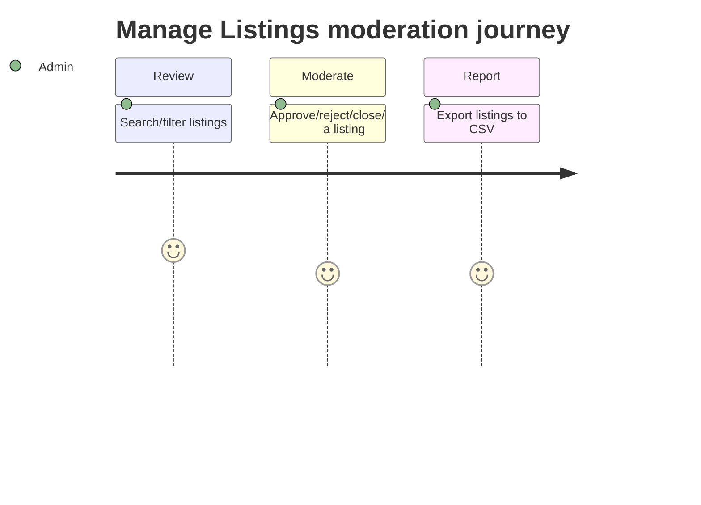

<!-- Contract: references/feature-spec-researcher-contract.md -->

# Functional Spec — F011_ListingModeration

**Priority**: P1
**Type**: ui
**Generated**: 2026-08-21

**See also:** [`technical-spec.md`](./technical-spec.md) — endpoints, Source citations, pseudocode,
key entities, and DB writes for a Dev/QA/SA audience.

## 1. Overview

**Problem:** Marketplace admins need a single place to review the listings posted on their
marketplace, catch policy violations, and remove or reject content, so the marketplace stays
trustworthy and searchable inventory stays clean.
**Solution:** A moderation table lets an admin search and filter every listing on the marketplace,
inline-edit a listing's status, approve or reject a listing awaiting admin pre-approval, close or
permanently delete any listing, and export the full listing set to a CSV report — all from one
screen and four confirmation popups.
**Scope:** Search/filter the community's listings; approve/reject listings that are pending
pre-approval; close a listing without deleting it; permanently delete a listing; export the
community's listings to CSV.
**Non-Scope:** Editing a listing's content (title, price, images, etc.) — that opens the normal
listing edit page and belongs to listing authoring, not moderation. Reviewing transactions or
testimonials is a separate export/moderation surface.

**Actors**

| Actor | Description | Primary goal |
|-------|--------------|---------------|
| Marketplace admin | A user with admin rights on the current community (platform superadmin or a community membership flagged admin) | Keep the marketplace's listing inventory compliant and up to date |

## 2. Functional Capabilities

| ID | Capability | What the user can do | User Stories | Requirements | Business Rules | Screens |
|----|------------|------------------------|-----------------|---------------|-------------------|---------|
| CAP-01 | Review, search, and moderate marketplace listings | Search/filter the listings table, approve/reject/close/delete individual listings inline, and export the full set to CSV | US127, US128, US160 | FR-001, FR-101, FR-201, FR-202, FR-203, FR-204, FR-205, FR-206, FR-207, FR-401, FR-402, FR-601 | BR-001, BR-002, BR-003, BR-004, BR-005, BR-006, DEC-001, DEC-002, DEC-003, SM-001, SM-002 | SCR044 |

**Single-capability rationale:** US127's search/export and US128's approve/reject/close/delete both
operate on the exact same ManageListings table row, sharing one moderation outcome for the admin.

## 3. Open Decisions

None — no unresolved domain confirmations found while researching this feature.

## 4. Requirements

### Foundation (0xx)

- **FR-001** Only a marketplace admin (platform superadmin or a community-admin membership) can reach this screen; regular members and guests are redirected away.

### Navigation (1xx)

- **FR-101** An admin reaches Manage Listings from the admin console's Listings sidebar/dashboard link.

### ManageListings (2xx)

- **FR-201** The screen shows a paginated table of the community's listings with title, provider (admin view only), created/updated date, category, and status.
- **FR-202** An admin can filter the table by free-text search (title, provider name, category name) and by one or more statuses (open, closed, expired, pending approval, rejected).
- **FR-203** An admin can request a CSV export of the community's full listing set; the export runs in the background and the page polls for a download link.
- **FR-204** An admin can approve a listing that is awaiting pre-approval, making it live on the marketplace.
- **FR-205** An admin can reject a listing that is awaiting pre-approval.
- **FR-206** An admin can close an open listing, taking it off active display without deleting it.
- **FR-207** An admin can permanently delete any listing.

### Interaction (4xx)

- **FR-401** Approving, rejecting, closing, or deleting a listing updates that row in place and refreshes the status filter counts, without a full page reload.
- **FR-402** The export control is disabled whenever a search term or status filter is active, since export always covers the community's complete listing set.

### Security (6xx)

- **FR-601** Every action on this screen requires an active admin session; the check happens before any listing data loads.

## 5. Business Rules

- Approve and reject are only meaningful while a listing is awaiting pre-approval (BR-001)
- Closing a listing turns off its `open` display flag but the record and its data remain fully intact and still shows up in the moderation table (BR-002)
- Deleting a listing is permanent and independent of closing — a listing does not need to be closed first (BR-003)
- The first time a listing is approved, its followers are emailed; approving it again later does not re-notify them (BR-004)
- CSV export always covers every listing in the community, ignoring whatever search/status filter is currently applied on screen (BR-005)
- The actions menu only offers Approve/Reject to an admin viewing a listing that is awaiting pre-approval (DEC-001)
- The actions menu hides Close for a listing that is already closed, awaiting approval, or rejected (DEC-002)
- The Edit link reads "Edit & Reopen" instead of "Edit" for a closed or rejected listing, signaling that saving it will bring it back live (DEC-003)
- A finished CSV export's download link expires 10 seconds after it is generated, so the page must fetch and trigger the download immediately once the export finishes (BR-006)
- The listing moderation state (pending / approved / rejected) tracked by this screen (SM-001)
- The export-button polling status (idle / polling / finished / error) that drives the CSV download prompt (SM-002)

## 6. Screens

| Screen Name | SCR### | What User Sees | What User Can Do |
|-------------|--------|-----------------|-------------------|
| ManageListings | SCR044_ManageListings | A filterable, paginated table of the community's listings with status badges, plus 4 confirmation popups (approve, reject, close, delete) | Search/filter listings, approve/reject/close/delete a listing, export listings to CSV |

### User Journey

1. Admin arrives at ManageListings and sees every listing in the community, newest-updated first.
2. Admin narrows the table by typing a search term or picking a status filter.
3. Admin opens a listing row's action menu and picks Approve, Reject, Close, or Delete.
4. A confirmation popup opens; admin confirms, the row updates in place, and the status counts refresh.
5. Admin instead clicks "Export to CSV"; the button shows a loading state while the export runs, then the browser downloads the finished file automatically.

## 7. User Stories

### US127_SearchAndExportListings — Search, filter, and export listings

**Actor:** Marketplace admin
**Goal:** Search, filter, and export the listings table to review and report on marketplace inventory.
**Business value:** Lets an admin find specific listings quickly and produce an offline record of the whole catalog.

**Acceptance Criteria:**
- [ ] Admin can filter the listings table by search text and/or status without leaving the page.
- [ ] Clicking export starts a background job and the page automatically downloads the CSV once it is ready, with no further clicks.

### US128_ModerateListingStatus — Moderate a listing's status

**Actor:** Marketplace admin
**Goal:** Approve, reject, close, or delete a listing to enforce content policy on marketplace inventory.
**Business value:** Keeps the marketplace's live listings compliant and lets policy violations be removed quickly.

**Acceptance Criteria:**
- [ ] Approving or rejecting a pending listing updates its status visibly in the table.
- [ ] Closing a listing removes it from active display without deleting its data.
- [ ] Deleting a listing removes it from the table permanently, with no undo.

### US160_ExportCommunityDataToCsv — Export community data to CSV

**Actor:** Marketplace admin
**Goal:** Get a CSV export of the community's listings on request, generated in the background.
**Business value:** Lets an admin analyze marketplace inventory offline without blocking on a slow report while the page stays usable.

**Acceptance Criteria:**
- [ ] The export includes every listing's id, title, owner, dates, status, category, order type, price, and main image URL.
- [ ] The export always reflects the full community listing set, not a filtered subset.

## 8. Scenarios

### US127_SearchAndExportListings — Happy Path

**Given** an admin is viewing the Manage Listings table, **When** the admin clicks "Export to CSV", **Then** the export button shows a loading state, the CSV is generated in the background, and the browser automatically downloads it once ready.

### US127_SearchAndExportListings — Error: export lookup fails

**Given** the export's tracking token no longer matches any export record, **When** the page polls for status, **Then** the loading state clears and no file downloads (silent failure, no user-facing message).

### US128_ModerateListingStatus — Happy Path

**Given** a listing is awaiting pre-approval, **When** the admin approves it, **Then** the listing becomes live and its row updates to show the open status.

### US128_ModerateListingStatus — Error: delete is permanent

**Given** an admin opens the delete confirmation for a listing, **When** the admin confirms, **Then** the listing is permanently removed from the table with no way to undo it.

## 9. Edge Cases

| Scenario | What Happens | User-Facing Message |
|----------|--------------|----------------------|
| Admin approves a listing that is already approved | The system re-applies the approval and counts it again, but does not re-notify followers a second time | None — the row simply re-renders as open |
| Two admins approve/close the same listing at nearly the same time | Both requests apply in sequence; the approval count can be incremented by both without one seeing the other's change first | None — silent, last write wins |
| No listings match the current search/status filter | The table renders empty with a "0 of 0" pagination summary | "No listings match your search" (via the standard empty pagination summary) |
| A non-admin requests any moderation action directly | The request is blocked before it reaches listing data | Redirected to sign in or to search, no listing data is shown |
| Admin approves/rejects/closes a listing another admin already deleted in a different tab | The lookup for that listing raises an error that is not specifically handled on those 3 actions (only Delete catches this case) | A generic error page/response rather than a specific "already deleted" message |

## 10. Edge Behaviours to Verify

- **FR-204** → Confirm approving a listing not currently pending does not resend the follower notification email.
- **FR-206** → Confirm closing a listing leaves its data intact and it still appears (dimmed) in the moderation table.
- **FR-402** → Confirm the export control visibly disables the moment a search term or status filter is applied.

## 11. Risks & Known Issues

| ID | Type | Description | Impact | Status |
|----|------|--------------|--------|--------|
| RISK-01 | known-issue | The Approve and Reject confirmation popups submit their form to the plain listings-index URL (`admin2_listings_manage_listings_path`) with `PATCH`, instead of the dedicated `update` action path that the Close and Delete popups correctly target — the index route only accepts `GET`. Separately, dedicated Approve/Reject routes DO exist but no screen element links to them, suggesting the UI was refactored to a shared popup/action and the path helper was not updated to match. | Clicking Approve or Reject in the UI would hit a URL/verb combination no declared route matches, so the moderation action would not reach the `#update` action as coded. | [INFERRED] |
| RISK-02 | known-issue | The `.approve-listing` / `.reject-listing` click handlers in `manage_listings.js` are never attached to any element in the rendered popups (the buttons carry no such class) | Dead code; harmless on its own, but signals the approve/reject wiring changed since these handlers were written | confirmed |
| RISK-03 | risk | The finished export's signed download URL expires only 10 seconds after issue, and the same 1-second polling response that reports "finished" is the one that carries that URL | If the browser is slow to act on the response (slow network, background tab throttling), the download can fail with an expired-link error | [UNVERIFIED] |
| RISK-04 | known-issue | Approve, reject, and close do not rescue a missing-record error the way delete does, so requesting one of those on a listing already deleted elsewhere is unhandled | Admin sees a generic error instead of the "already deleted" style handling delete provides | [INFERRED] |

## 12. Dependencies

| Dependency | Type | Why this feature needs it | Evidence |
|------------|------|-----------------------------|----------|
| Marketplace admin console access | feature | This screen lives entirely inside the admin2 console; a user must already have admin rights to reach it | FR-001 |
| Community `pre_approved_listings` setting | config | Only when this setting is on do new listings arrive in "pending" state for an admin to approve/reject here; otherwise listings are approved automatically at creation and this screen's approve/reject controls rarely apply | BR-001 |
| Listing follower notifications | feature | Approving a listing triggers a follower-notification path owned by the listing lifecycle, not this screen | BR-004 |

## 13. Configuration

N/A — no user-facing configuration constants for this feature.
