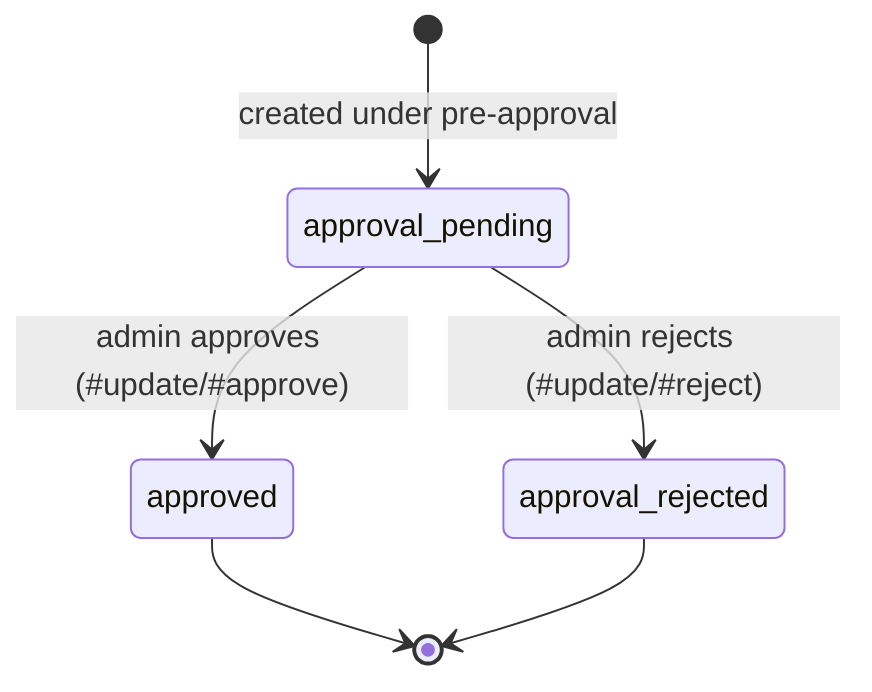
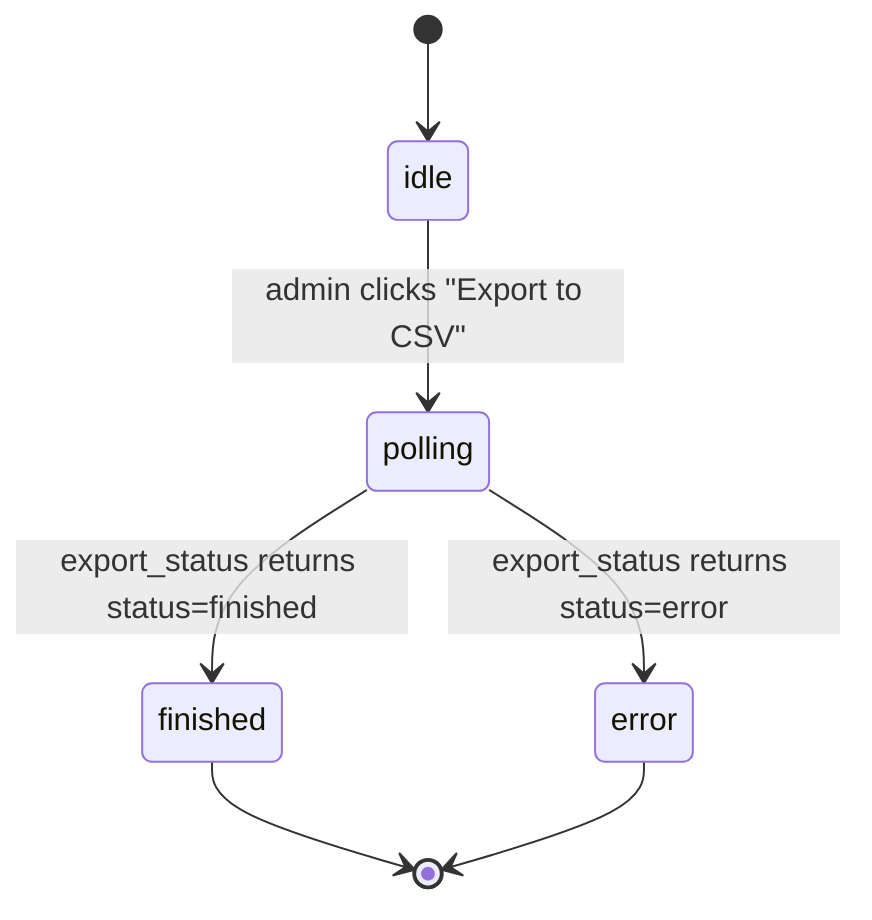

<!-- Contract: references/feature-spec-researcher-contract.md -->

# Technical Spec — F011_ListingModeration

**Priority**: P1
**Type**: ui
**Generated**: 2026-08-21

**See also:** [`functional-spec.md`](./functional-spec.md) — plain-language overview, open
decisions, requirements/business rules stated in one-liners, screens, user stories, scenarios,
edge cases, and configuration for a BA/QA audience.

## 1. Technical Overview

A single Rails admin2 controller (`Admin2::Listings::ManageListingsController`) backs the whole
moderation screen: it renders one `index` view and exposes six mutating collection/member actions
(`update`, `close`, `delete`, `approve`, `reject`, `export`/`export_status`) that AJAX partials
re-render in place. `Admin2::ListingsService` holds the approve/reject/close/delete business logic
against the `Listing` model's `state` enum and `open`/`deleted` flags; `Listing::ListPresenter`
(shared with the author-facing listing list) drives search/filter/pagination and the row-level
visibility rules. Export is fully asynchronous: the controller enqueues `ExportListingsJob`
(BL017) via `Delayed::Job`, and the page polls `export_status` until an `ExportTaskResult` reports
`finished` with a signed download URL.

## 2. Functional → Technical Mapping

| Code | Name | Where it is implemented | Technical notes | Source |
|------|------|--------------------------|-------------------|--------|
| FR-001 | Only a marketplace admin can reach this screen | `before_action :ensure_is_admin` on the shared admin2 base controller | Same PERM001 gate as the whole admin2 console; not screen-specific | `app/controllers/admin2/admin_base_controller.rb:5` |
| FR-101 | Admin reaches Manage Listings from the console sidebar | Sidebar/dashboard link to `admin2_listings_manage_listings_path` | Plain navigation link, no guard of its own | `app/views/admin2/_sidebar.haml:93` |
| FR-201 | Paginated listings table with title/provider/dates/category/status | `#index` renders `Listing::ListPresenter#listings` via `will_paginate` | Provider column only shown when `presenter.admin_mode` | `app/controllers/admin2/listings/manage_listings_controller.rb:5`, `app/views/admin2/listings/manage_listings/index.haml:1-23` |
| FR-202 | Search/filter by text and status | `ListPresenter#resource_scope` filters on `q` and `status[]` params | `q` matches title/category/author via SQL `LIKE`; statuses OR-merged | `app/presenters/listing/list_presenter.rb:83-109` |
| FR-203 | CSV export runs async, page polls for download | `#export` enqueues `ExportListingsJob`; `#export_status` returns token/status/url | See INT-001 and BL017 (behavior-logic.md) for the job itself | `app/controllers/admin2/listings/manage_listings_controller.rb:35-49` |
| FR-204 | Admin approves a pending listing | `Admin2::ListingsService#approve` via `#update` | Sets `state`, increments `approval_count`, mails, notifies followers | `app/services/admin2/listings_service.rb:33-38` |
| FR-205 | Admin rejects a pending listing | `Admin2::ListingsService#reject` via `#update` | Sets `state`, mails rejection | `app/services/admin2/listings_service.rb:40-43` |
| FR-206 | Admin closes a listing | `Admin2::ListingsService#close` via `#close` | `listing.update!(open: false)`; no soft-delete | `app/services/admin2/listings_service.rb:25-27` |
| FR-207 | Admin permanently deletes a listing | `Admin2::ListingsService#delete` via `#delete` | `listing.update!(deleted: true)`; only action with a rescue | `app/services/admin2/listings_service.rb:29-31`; `app/controllers/admin2/listings/manage_listings_controller.rb:27-33` |
| FR-401 | Row updates in place, no full reload | `*.js.erb` responses re-render the `_row` partial and status counts | `update.js.erb`, `close.js.erb`, `delete.js.erb` | `app/views/admin2/listings/manage_listings/update.js.erb:1`, `close.js.erb:1-3`, `delete.js.erb:1-10` |
| FR-402 | Export disabled while filtered | `_filter.haml` appends `is-disabled` class when `params[:status]`/`params[:q]` present | Client-visual only; `#export` itself does not check filter params | `app/views/admin2/listings/manage_listings/_filter.haml:7` |
| FR-601 | Every action requires an admin session | Same `ensure_is_admin` gate applies to all 8 routes | See PERM001 (permissions.md) | `route-list.md` rows ROUTE204-211 (`ensure_is_admin` tag) |
| BR-001 | Approve/reject only apply while pending | `ListPresenter#show_approval_link?` gates the UI; `ListingsService#update` dispatches by submitted state regardless | See DEC-001; service itself does not re-validate current state before applying | `app/presenters/listing/list_presenter.rb:53-59`; `app/services/admin2/listings_service.rb:15-23` |
| BR-002 | Closing does not delete | `open: false` update only, `deleted` untouched | Listing remains in `exist` scope and exportable | `app/services/admin2/listings_service.rb:25-27` |
| BR-003 | Delete is permanent and independent of close | `deleted: true` update, no dependency on `open` | Soft-delete flag; filtered out via `Listing.exist` scope everywhere else | `app/services/admin2/listings_service.rb:29-31`; `app/models/listing.rb:118` |
| BR-004 | First approval notifies followers, later ones don't | `notify_followers` returns early unless `approval_count == 1` | Guards a `Delayed::Job.enqueue(NotifyFollowersJob...)` | `app/services/admin2/listings_service.rb:83-87` |
| BR-005 | Export always covers the full community | `ExportListingsJob#generate_csv_content` reads `community.listings.for_export`, ignoring any request params | `for_export` scope = `exist.order('created_at DESC')`, no filter args | `app/jobs/export_listings_job.rb:19,42`; `app/models/listing.rb:141` |
| BR-006 | Download link expires 10s after issue | `ExportTaskResult::AWS_S3_URL_EXPIRES_SECONDS` used in `expiring_url(...)` | See RISK-03 (functional-spec § 11) | `app/models/export_task_result.rb:30`; `app/controllers/admin2/listings/manage_listings_controller.rb:44` |
| DEC-001 | Approve/reject menu items only for a pending listing viewed by an admin | `app/views/admin2/listings/manage_listings/_actions.haml` renders the block only `if presenter.show_approval_link?(listing)` | See § 4 Decision Logic | `app/views/admin2/listings/manage_listings/_actions.haml:4`; `app/presenters/listing/list_presenter.rb:57-59` |
| DEC-002 | Close menu item hidden for closed/pending/rejected listings | `app/views/admin2/listings/manage_listings/_actions.haml` 3-predicate `if` | See § 4 Decision Logic | `app/views/admin2/listings/manage_listings/_actions.haml:18` |
| DEC-003 | Edit link label/icon swaps to "Edit & Reopen" | `app/views/admin2/listings/manage_listings/_actions.haml` branches on `opacity` (itself `rejected? \|\| closed?`) | See § 4 Decision Logic | `app/views/admin2/listings/manage_listings/_actions.haml:18-30`; `app/views/admin2/listings/manage_listings/_row.haml:1` |
| SM-001 | Listing moderation lifecycle | `Listing` `enum :state, APPROVALS` + `Admin2::ListingsService#approve`/`#reject` | See § 3.3; same field as DISC-012 in entities.md | `app/models/listing.rb:144-149`; `app/services/admin2/listings_service.rb:33-43` |
| SM-002 | Export button polling status | `app/assets/javascripts/admin2/export.js` `initializeExportPolling` | See § 3.3 | `app/assets/javascripts/admin2/export.js:1-30` |
| US127 | Search, filter, and export listings | `#index` + `#export`/`#export_status` | Independent Test in § 5.1 | `app/controllers/admin2/listings/manage_listings_controller.rb:5,35-49` |
| US128 | Moderate a listing's status | `#update`/`#close`/`#delete`/`#approve`/`#reject` | Independent Test in § 5.1 | `app/controllers/admin2/listings/manage_listings_controller.rb:7-33` |
| US160 | Export community data to CSV | `ExportListingsJob#perform`/`#generate_csv_rows` | System-type story; independent test in § 5.1 | `app/jobs/export_listings_job.rb:14-79` |

## 3. System Design

### 3.1 Components

| Component | Responsibility | File |
|-----------|------------------|------|
| Admin2::Listings::ManageListingsController | HTTP entry points for the moderation screen and its 6 actions | `app/controllers/admin2/listings/manage_listings_controller.rb` |
| Admin2::ListingsService | Approve/reject/close/delete business logic against `Listing` | `app/services/admin2/listings_service.rb` |
| Listing::ListPresenter | Search/filter/pagination/status-label logic (shared with author's own-listings view) | `app/presenters/listing/list_presenter.rb` |
| ExportListingsJob | Background CSV generation for the export (BL017) | `app/jobs/export_listings_job.rb` |
| ExportTaskResult | Tracks export status/token and stores the generated file | `app/models/export_task_result.rb` |
| manage_listings.js | Wires popup open/submit and the status-filter auto-submit | `app/assets/javascripts/admin2/manage_listings.js` |
| export.js | Polls `export_status` and triggers the browser download | `app/assets/javascripts/admin2/export.js` |

### 3.2 Data Model

#### Key Entities

| Entity | Table | Key Columns | Purpose |
|--------|-------|-------------|---------|
| Listing | `listings` | `state`, `open`, `deleted`, `approval_count`, `title`, `category_id`, `author_id` | The record this whole screen searches, filters, and moderates |
| ExportTaskResult | `export_task_results` | `token`, `status`, `file_*` | Tracks one export request's async progress and the resulting file |
| ListingImage | `listing_images` | `listing_id`, `image_file_name` | Source of the `main_image_url` export column |
| Category | `categories` | `id`, `parent_id` | Source of the `|`-joined category breadcrumb in the table and export |

#### Polymorphic Behavior

##### DISC-012 — Listing.state

| Value | Render | Validation | Persistence |
|-------|--------|------------|-------------|
| approval_pending | Row shows the "pending" badge; action menu offers Approve/Reject (DEC-001); status filter option only shown when the community has `pre_approved_listings` on | None beyond the enum's allowed values | Set on listing creation when pre-approval is required (outside this feature's scope) |
| approved | Row shows no pending/rejected badge; open/closed styling instead follows `open`/`valid_until` | None | Set by `Admin2::ListingsService#approve`, also increments `approval_count` |
| approval_rejected | Row dimmed (`opacity_03`); "rejected" badge shown; action menu offers Edit & Reopen instead of Close | None | Set by `Admin2::ListingsService#reject` |

**Source:** docs/generated/entities.md § listings > Discriminator Fields

### 3.3 State Management

### Listing moderation lifecycle (SM-001)
**kind:** entity
**Linked FR:** FR-204
**Source:** `app/models/listing.rb:144-149`
**States:** approval_pending, approved, approval_rejected



**Transition rules:**
- `approval_pending → approved`: guard = admin submits `listing[state]=approved`; side effects = `approval_count` +1, `send_listing_approved` mail, follower notification job (first approval only)
- `approval_pending → approval_rejected`: guard = admin submits `listing[state]=approval_rejected`; side effects = `send_listing_rejected` mail

### Export button polling status (SM-002)
**kind:** ui
**Linked FR:** FR-203



| From | To | Guard | Side effect |
|------|----|-------|-------------|
| idle | polling | click on `#export-as-csv` | button shows loading markup, 1s polling interval starts |
| polling | finished | `export_status` JSON `status: 'finished'` | clears interval, restores button, triggers file download via the signed URL |
| polling | error | `export_status` JSON `status: 'error'` (token not found) | clears interval, restores button, no download |

### 3.4 API & Endpoints

| Method | Path | Handler | Linked Code | Source |
|--------|------|---------|--------------|--------|
| GET | (/:locale)/admin/listings/manage-listings | `ManageListingsController#index` | FR-201, FR-202 | `app/controllers/admin2/listings/manage_listings_controller.rb:5` |
| PATCH | (/:locale)/admin/listings/manage-listings/update | `ManageListingsController#update` | FR-204, FR-205, BR-001 | `app/controllers/admin2/listings/manage_listings_controller.rb:7-10` |
| PATCH | (/:locale)/admin/listings/manage-listings/close | `ManageListingsController#close` | FR-206, BR-002 | `app/controllers/admin2/listings/manage_listings_controller.rb:12-15` |
| DELETE | (/:locale)/admin/listings/manage-listings/delete | `ManageListingsController#delete` | FR-207, BR-003 | `app/controllers/admin2/listings/manage_listings_controller.rb:27-33` |
| GET | (/:locale)/admin/listings/manage-listings/export | `ManageListingsController#export` | FR-203, INT-001 | `app/controllers/admin2/listings/manage_listings_controller.rb:35-38` |
| GET | (/:locale)/admin/listings/manage-listings/export_status | `ManageListingsController#export_status` | FR-203, SM-002 | `app/controllers/admin2/listings/manage_listings_controller.rb:41-49` |
| PUT | (/:locale)/admin/listings/manage-listings/:id/approve | `ManageListingsController#approve` | FR-204 | `app/controllers/admin2/listings/manage_listings_controller.rb:17-20` — `[INFERRED]` declared and implemented but no view/JS links to it; see RISK-01 |
| PUT | (/:locale)/admin/listings/manage-listings/:id/reject | `ManageListingsController#reject` | FR-205 | `app/controllers/admin2/listings/manage_listings_controller.rb:22-25` — `[INFERRED]` same as above |

### 3.5 Algorithms & Processing Logic

### Build a category breadcrumb string for export (ALG-001)
**Linked FR:** FR-203
**Source:** `app/jobs/export_listings_job.rb:93-101`
**Input:** a category id + a pre-loaded `{id => {parent, name}}` hash for the community's categories
**Output:** a `" | "`-joined string from root ancestor down to the leaf category
**File Schema**:

| Column | Type | Required | Notes |
|--------|------|----------|-------|
| listing_id | integer | yes | |
| listing_title | string | yes | |
| user_id | integer | yes | listing author id |
| created_at | datetime | yes | formatted `%Y-%m-%d %H:%M:%S` |
| updated_at | datetime | yes | formatted `%Y-%m-%d %H:%M:%S` |
| status | string | yes | localized status label |
| category | string | yes | this algorithm's `" | "`-joined breadcrumb output |
| order_type | string | yes | localized shape/process name |
| price | decimal | no | 0 if absent |
| currency | string | no | empty if no price |
| pricing_unit | string | no | |
| main_image_url | string | no | first listing image URL |

**Complexity:** O(depth) — walks `parent_id` pointers, typically ≤2 hops
**Description:** Avoids N+1 category lookups during CSV generation by walking an in-memory hash
built once per export instead of querying per row.

**Pseudocode:**
```text
def category_title(id, categories):
  out = []
  record = categories[id]
  while record:
    out.append(record.name)
    record = categories[record.parent]
  return " | ".join(reversed(out))
```

### 3.6 Integrations

### Enqueue the async listings CSV export (INT-001)
**Linked FR:** FR-203
**Source:** `app/controllers/admin2/listings/manage_listings_controller.rb:35-38`
**Type:** queue-job
**Target:** `ExportListingsJob` via `Delayed::Job`
**Trigger:** admin clicks "Export to CSV" (`#export`)
**Payload:** current admin's user id, community id, a freshly created `ExportTaskResult` id
**Failure handling:** none observed — no rescue around the enqueue call; job failures are only whatever `Delayed::Job`'s own retry/dead-job handling provides

### Send approval/rejection notification emails (INT-002)
**Linked FR:** FR-204
**Source:** `app/services/admin2/listings_service.rb:94-114`
**Type:** notification
**Target:** `PersonMailer#listing_approved` / `#listing_rejected`, delivered to the listing's author
**Trigger:** `Admin2::ListingsService#approve` / `#reject`
**Payload:** the listing itself
**Failure handling:** `handle_asynchronously` queues the mailer call via `Delayed::Job`; no explicit rescue in the mailer call site

### 3.7 Configuration

```text
AWS_S3_URL_EXPIRES_SECONDS = 10   # how long a finished export's signed download URL stays valid
STATUSES = [pending, started, finished]   # ExportTaskResult lifecycle values
```

**Client behavior:** see
[`behavior-logic.md`](../../generated/behavior-logic.md) (client-side patterns — debounce, optimistic UI, polling, upload, realtime),
[`permissions.md`](../../system/permissions.md) (feature flags / experiments / env / locale gates),
[`screen-flow.md`](../../generated/screen-flow.md) (guards / deep-link state restoration / unsaved-changes protection).

## 4. Technical Behavior by Capability

### 4.1 Review, search, and moderate marketplace listings

**Business Rules**

### Approve/reject only apply while a listing is pending (BR-001)
**Linked FR:** FR-204
**Source:** `app/services/admin2/listings_service.rb:15-23`
**Applies to:** `#update` action

**Pseudocode:**
```text
case params[:listing][:state]
when APPROVED then approve
when APPROVAL_REJECTED then reject
end
```

### Closing does not delete (BR-002)
**Linked FR:** FR-206
**Source:** `app/services/admin2/listings_service.rb:25-27`
**Applies to:** `#close` action

**Pseudocode:**
```text
listing.update!(open: false)
```

### Delete is permanent and independent of close (BR-003)
**Linked FR:** FR-207
**Source:** `app/services/admin2/listings_service.rb:29-31`
**Applies to:** `#delete` action

**Pseudocode:**
```text
listing.update!(deleted: true)
```

### First approval notifies followers, later ones don't (BR-004)
**Linked FR:** FR-204
**Source:** `app/services/admin2/listings_service.rb:33-38,83-87`
**Applies to:** `#update`/`#approve` action

**Pseudocode:**
```text
listing.update_columns(state: APPROVED, approval_count: approval_count + 1)
send_listing_approved(listing.id)
return if listing.approval_count != 1
enqueue NotifyFollowersJob(listing.id, community.id)
```

### Export always covers the full community (BR-005)
**Linked FR:** FR-203
**Source:** `app/jobs/export_listings_job.rb:19,42`
**Applies to:** `ExportListingsJob#generate_csv_content`

**Pseudocode:**
```text
listings = community.listings.for_export   # exist.order(created_at desc); no q/status args
rows = generate_csv_rows(listings, locale, categories_hash)
```

### Download link expires 10 seconds after issue (BR-006)
**Linked FR:** FR-203
**Source:** `app/models/export_task_result.rb:30`; `app/controllers/admin2/listings/manage_listings_controller.rb:44`
**Applies to:** `#export_status` action

**Pseudocode:**
```text
url = export_result.file.expiring_url(AWS_S3_URL_EXPIRES_SECONDS)  # 10
render json: { token:, status:, url: }
```

**Decision Logic**

User-facing decisions with business outcome user-visible to the end user. Scope is by OUTCOME,
not by source code location.

**Subtypes** (declared per block below):
- `render` — multi-predicate render branches (single-field → DISC)

**Out of scope** (do NOT create DEC): loading spinner toggles, generic API dispatch, cosmetic
style toggles, single-field conditions.

---

#### Approve/reject menu items only for a pending listing viewed by an admin (DEC-001)
**subtype:** render
**Triggers in:** SCR044_ManageListings row action-menu render
**Involved entities:** ListPresenter.admin_mode, Listing.state
**Source:** `app/views/admin2/listings/manage_listings/_actions.haml:4-16`

```pseudo
if presenter.admin_mode AND listing.state == 'approval_pending'
  render Approve link + Reject link
else
  omit both
```

---

#### Close menu item hidden for closed/pending/rejected listings (DEC-002)
**subtype:** render
**Triggers in:** SCR044_ManageListings row action-menu render
**Involved entities:** Listing.open, Listing.valid_until, Listing.state
**Source:** `app/views/admin2/listings/manage_listings/_actions.haml:18-23`

```pseudo
if NOT listing.closed?
   AND NOT (presenter.admin_mode AND listing.state == 'approval_pending')
   AND listing.state != 'approval_rejected'
  render Close link
else
  omit Close link
```

---

#### Edit link label/icon swaps to "Edit & Reopen" (DEC-003)
**subtype:** render
**Triggers in:** SCR044_ManageListings row action-menu render
**Involved entities:** Listing.state, Listing.open, Listing.valid_until

```pseudo
opacity = listing.state == 'approval_rejected' OR listing.closed?
if opacity
  render "Edit & Reopen" link (positive style)
else
  render "Edit" link (neutral style)
```
**Source:** `app/views/admin2/listings/manage_listings/_actions.haml:18-30`; `app/views/admin2/listings/manage_listings/_row.haml:1`

---

#### Edge Cases

| Scenario | Behavior |
|----------|----------|
| Admin approves a listing that is already `approved` | `#update` re-runs; `approval_count` increments again but the `!= 1` guard skips a second follower-notification enqueue |
| Two admins approve/close the same listing concurrently | Both `update_columns`/`update!` calls apply in whatever order they arrive; `approval_count + 1` is read-then-write, not atomic — a lost update is possible |
| Admin approves/rejects/closes a listing already deleted in another tab | `resource_scope.find(params[:id])` raises `ActiveRecord::RecordNotFound`; only `#delete` rescues `StandardError`, so `#update`/`#close` let it propagate |
| Non-admin requests any of these 8 routes directly | `ensure_is_admin` before_action redirects before the resource lookup runs |

## 5. Verification & Technical Notes

### 5.1 Technical Verification

- **SC-001** A listing whose `state` is `approval_pending` shows Approve/Reject and, once actioned, its `state` changes to `approved`/`approval_rejected` (covers FR-204, FR-205, BR-001, SM-001)
- **SC-002** A closed listing has `open = false` and `deleted = false`; a deleted listing has `deleted = true` (covers FR-206, FR-207, BR-002, BR-003)
- **SC-003** An export request creates an `ExportTaskResult`, transitions `pending → started → finished`, and the community's full `exist` listing set appears in the generated CSV regardless of the table's current filter (covers FR-203, BR-005)

#### US127_SearchAndExportListings

**Independent Test:** With ≥1 filterable listing present, apply a search/status filter and confirm the table narrows; separately click Export and confirm a CSV download begins without further clicks.

**Acceptance Scenarios:**

1. **Given** a community with mixed-status listings, **When** the admin filters by status "closed", **Then** only closed listings appear in the table.
2. **Given** the admin clicks "Export to CSV", **When** the background job finishes, **Then** `export_status` returns `status: 'finished'` with a signed `url`.

#### US128_ModerateListingStatus

**Independent Test:** Create a listing in `approval_pending`, approve it via `#update`, and confirm `state` becomes `approved` and `approval_count` becomes 1.

**Acceptance Scenarios:**

1. **Given** a listing with `state: approval_pending`, **When** the admin submits `listing[state]=approved`, **Then** the listing's `state` becomes `approved` and `approval_count` is 1.
2. **Given** an open listing, **When** the admin closes it, **Then** `open` becomes `false` and the listing is still present (not deleted).

#### US160_ExportCommunityDataToCsv

**Independent Test:** Run `ExportListingsJob#perform` against a community with listings that have missing images/categories and confirm the CSV still emits a row per listing with the documented fallback values.

**Acceptance Scenarios:**

1. **Given** a community with listings across all statuses, **When** the export job runs, **Then** the CSV contains one row per `exist` listing with the fixed 12-column schema.

### 5.2 Assumptions

- The Approve/Reject popups are assumed to actually reach `#update` in production despite the path-helper mismatch (RISK-01) — this could not be confirmed by executing the app in this pass; documented as observed code, not as working/broken fact.
- `community.listings.for_export` is assumed to be bounded enough to run synchronously inside one background job invocation without its own pagination/batching; no batch/chunking logic was found in `ExportListingsJob`.

### 5.3 Unresolved Questions

1. **Dead vs. reachable member routes**: whether `PUT :id/approve` / `PUT :id/reject` (ROUTE210/ROUTE211) are truly unreachable dead code, or a fallback path invoked from somewhere outside `app/views/admin2/listings/manage_listings/` and `app/assets/javascripts/admin2/manage_listings.js` that this pass's grep did not surface.
2. **Runtime confirmation of RISK-01**: whether the Approve/Reject popups' `PATCH` to the bare index path actually 404s in a running instance, or whether some Rails routing behavior not evident from `config/routes.rb` alone (e.g. a default action fallback) makes it resolve to `#update` anyway.

### 5.4 Source References

| Order | Symbol | Path | Purpose |
|-------|--------|------|---------|
| 1 | Listing | `app/models/listing.rb:118,144-149,220-221` | `state` enum, `exist`/`closed?` — the entity this feature moderates |
| 2 | ManageListingsController | `app/controllers/admin2/listings/manage_listings_controller.rb:1-61` | HTTP entry points for all 8 routes |
| 3 | Admin2::ListingsService | `app/services/admin2/listings_service.rb:1-124` | approve/reject/close/delete business logic |
| 4 | Listing::ListPresenter | `app/presenters/listing/list_presenter.rb:1-142` | search/filter/pagination + row visibility rules |
| 5 | ExportListingsJob | `app/jobs/export_listings_job.rb:1-106` | background CSV generation (BL017) |
| 6 | index.haml / _actions.haml | `app/views/admin2/listings/manage_listings/index.haml:1-29`, `app/views/admin2/listings/manage_listings/_actions.haml:1-48` | table + action-menu rendering |

### 5.5 Artifact References

| Artifact | File | Codes Used | Reviewed |
|----------|------|------------|----------|
| System Overview | [system-overview.md](../../system/overview.md) | — | [x] |
| Architecture | [architecture.md](../../system/architecture.md) | — | [x] |
| Feature List | [feature-list.md](../../generated/feature-list.md) | F011 | [x] |
| API Map | [api-map.md](../../generated/api-map.md) | ROUTE204, ROUTE205, ROUTE206, ROUTE207, ROUTE208, ROUTE209, ROUTE210, ROUTE211 | [ ] |
| Entities | [entities.md](../../generated/entities.md) | listings, DISC-012 | [ ] |
| Screens | [functional-spec.md § 6](../functional-spec.md#6-screens) | SCR044 | [ ] |
| Behavior Logic | [behavior-logic.md](../../generated/behavior-logic.md) | BL017 | [ ] |
| Permissions Matrix | [permissions-matrix.md](../../generated/permissions-matrix.md) | — (PERM001 gates this screen via the blanket admin2 `ensure_is_admin` filter — cross-feature, not owned by F011, see FR-001/FR-601; feature-list.md's PERM016 assignment does not govern this screen — PERM016 only guards the public `ListingsController#move_to_top`/`#show_in_updates_email` actions, see permissions-matrix.md § PERM016) | [ ] |
| User Stories | [user-stories.md](../../generated/user-stories.md) | US127, US128, US160 | [ ] |

**Rule:** Every code listed in Codes Used MUST exist in its source artifact. Orphan refs = reviewer critical. `{ROUTE###}` on the API Map row resolves to `route-list.md`'s `Code` column, not `api-map.md`.

## Source Walkthrough

1. **File:** `app/models/listing.rb:144-149` — start here: defines the `state` enum (DISC-012) this whole feature moderates.
2. **File:** `app/controllers/admin2/listings/manage_listings_controller.rb:1-61` — next: the entry point receiving all 8 routes.
3. **File:** `app/services/admin2/listings_service.rb:1-124` — next: where approve/reject/close/delete actually mutate the listing.
4. **File:** `app/presenters/listing/list_presenter.rb:1-142` — next: search/filter/pagination and the row-visibility rules the view reads.
5. **File:** `app/views/admin2/listings/manage_listings/index.haml:1-29` — last: ties the table, filter, and 4 popups together.

### Call Hierarchy

```text
ManageListingsController#index
  -> ListPresenter#listings (search/filter/paginate)
  -> index.haml -> _filter, _listing -> _row -> _actions, _badges

ManageListingsController#update/#close/#delete
  -> Admin2::ListingsService#update/#close/#delete
  -> Listing#update!/#update_columns
  -> {update,close,delete}.js.erb re-renders _row + _statuses

ManageListingsController#export
  -> ExportTaskResult.create
  -> Delayed::Job.enqueue(ExportListingsJob)   [async]
       -> ExportListingsJob#perform -> #generate_csv_content -> #generate_csv_rows
ManageListingsController#export_status (polled every 1s by export.js)
  -> ExportTaskResult#file.expiring_url
```

**Related files:** see `### 5.4 Source References` above — the **Order** column on that table
IS this section's related-files table, re-cast with the reading sequence.

## DB Impact per Event

| Event/Endpoint | Table | Columns | Operation | Value Derivation | Source |
|----------------|-------|---------|-----------|-------------------|--------|
| PATCH .../update (approve) | `listings` | state, approval_count | UPDATE | `state` literal from submitted param; `approval_count` derived as current+1 | `app/services/admin2/listings_service.rb:33-38` |
| PATCH .../update (reject) | `listings` | state | UPDATE | literal from submitted param | `app/services/admin2/listings_service.rb:40-43` |
| PATCH .../close | `listings` | open | UPDATE | literal `false` | `app/services/admin2/listings_service.rb:25-27` |
| DELETE .../delete | `listings` | deleted | UPDATE | literal `true` | `app/services/admin2/listings_service.rb:29-31` |
| GET .../export | `export_task_results` | status | INSERT then UPDATE | `status` defaulted `'pending'` on create, then set `'started'`/`'finished'` by the background job | `app/models/export_task_result.rb:32-37`; `app/jobs/export_listings_job.rb:17,25` |
| GET .../export (background) | `export_task_results` | file_file_name, file_content_type, file_file_size, file_updated_at | UPDATE | derived from the generated CSV filename/content via the Paperclip attachment | `app/jobs/export_listings_job.rb:22-25` |
