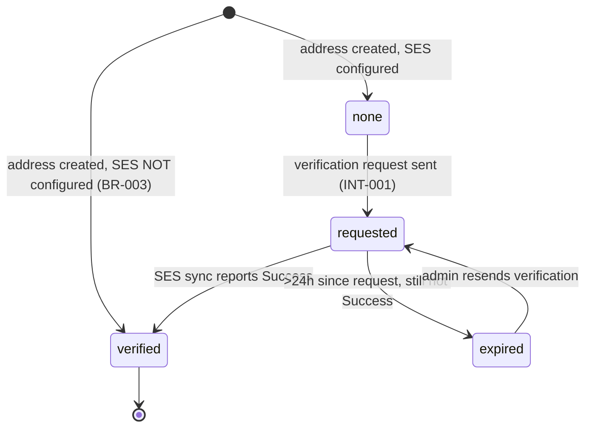

<!-- layout-exempt: rebuild-spec owns all docs/system|features|generated|flows paths — all references here are output targets or internal definitions -->
<!-- Contract: references/feature-spec-researcher-contract.md -->

# Technical Spec — F026_TransactionalEmailSettings

**Priority**: P2
**Type**: mixed
**Generated**: 2026-08-21

**See also:** [`functional-spec.md`](./functional-spec.md) — plain-language overview, open
decisions, requirements/business rules stated in one-liners, screens, user stories, scenarios,
edge cases, and configuration for a BA/QA audience.

## 1. Technical Overview

Two independent admin2 screens: a 3-endpoint sender-address/verification workflow backed by
`EmailService::API::Addresses` + AWS SES, and a single-endpoint welcome-email settings page whose
real persistence happens through the shared Mercury inline-editor endpoint, not the page's own
action. A separate queued job (`SendWelcomeEmail`, triggered from signup/confirmation, outside
this feature's own controllers) is the actual consumer of the welcome-email content at send time.

## 2. Functional → Technical Mapping

| Code | Name | Where it is implemented | Technical notes | Source |
|------|------|--------------------------|-------------------|--------|
| FR-001 | Plan features gate what this feature allows | `GET /admin/emails/custom-outgoing-address` via `Admin2::Emails::OutgoingEmailsController#index` | Reads `@current_plan[:features][:admin_email]` and `[:whitelabel]` — two distinct plan features, not one | `app/controllers/admin2/emails/outgoing_emails_controller.rb:31,33,115-117` |
| FR-002 | SES configuration gates the verification workflow | `EmailService::EmailServiceInjector#build_ses_client` | `nil` unless all three AWS env vars are present | `app/services/email_service/email_service_injector.rb:17-29` |
| FR-101 | Admin reaches settings via the Emails sidebar section | Two `Admin2::Emails` controllers, routed under `namespace :emails` | No dedicated nav component — sidebar link config, not read | `config/routes.rb:401-413` |
| FR-201 | Sender-address page shows current state on load | `GET /admin/emails/custom-outgoing-address` via `OutgoingEmailsController#index` | Loads sender + user-defined address, builds status/resend URLs | `app/controllers/admin2/emails/outgoing_emails_controller.rb:6-35` |
| FR-202 | Admin submits a sender name/email | `POST /admin/emails/custom-outgoing-address` via `OutgoingEmailsController#create` | Same-email resubmit updates name only; otherwise creates a new address record | `app/controllers/admin2/emails/outgoing_emails_controller.rb:37-73` |
| FR-203 | Verification workflow on new addresses | `EmailService::API::Addresses#create` → `#enqueue_verification_request` | See SM-001 / ALG-001 / INT-001 below | `app/services/email_service/api/addresses.rb:47-84` |
| FR-204 | Resend verification independently of set | `POST /admin/emails/custom-outgoing-address/resend_verification_email` via `#resend_verification_email` | No guard against resending an already-verified address (§ 5.3) | `app/controllers/admin2/emails/outgoing_emails_controller.rb:91-94` |
| FR-205 | Async status polling | `GET /admin/emails/custom-outgoing-address/check_email_status` via `#check_email_status` | Client polls every 1s, up to 15 tries or until `updated_at` changes | `app/controllers/admin2/emails/outgoing_emails_controller.rb:75-89`; `app/views/admin2/emails/outgoing_emails/_waiting.haml:4-42` |
| FR-301 | Inline rich-text editing of welcome-email content | Mercury WYSIWYG div + `PUT /mercury_update` via `MercuryUpdateController#update` (shared, cross-feature) | Not one of this feature's own routes — see § 5.3 | `app/views/admin2/emails/welcome_emails/index.haml:24-31`; `app/controllers/mercury_update_controller.rb:11-26` |
| FR-302 | Send test welcome email to self | `PATCH /admin/emails/welcome-email/update_email` via `WelcomeEmailsController#update_email` (test_email=1 branch) | See INT-002 | `app/controllers/admin2/emails/welcome_emails_controller.rb:6-15` |
| FR-303 | New member receives welcome email automatically | `SendWelcomeEmail` job, enqueued from `ConfirmationsController#show` / `CommunityMembershipsController#create` (BL031, outside this feature's own controllers) | Skips deleted persons and admins | `app/jobs/send_welcome_email.rb:5-15` |
| FR-401 | Verified address becomes the transactional-mail "from" | `EmailService::API::Addresses#get_sender` | Falls back to a configured default sender when no verified address exists | `app/services/email_service/api/addresses.rb:16-32` |
| FR-601 | Admin-only access | `before_action :ensure_is_admin` on `Admin2::AdminBaseController` | Shared base controller for both screens | `app/controllers/admin2/admin_base_controller.rb:5` |
| FR-602 | Disallowed sender domains rejected | `Addresses#valid_email_address?` / `#valid_email_domain?` | Own-domain check always runs; webmail-provider check only when SES is active | `app/services/email_service/api/addresses.rb:135-156` |
| BR-001 | Plan gates setting a sender address | `before_action :ensure_white_label_plan, only: %i[create]` | See § 4.1 | `app/controllers/admin2/emails/outgoing_emails_controller.rb:4,108-113` |
| BR-002 | Address format/domain validation | `Addresses#create` | See § 4.1 | `app/services/email_service/api/addresses.rb:47-61` |
| BR-003 | Auto-verify when SES absent | `Addresses#create` | See § 4.1 | `app/services/email_service/api/addresses.rb:62` |
| BR-004 | Same-email resubmit only updates name | `OutgoingEmailsController#create` | See § 4.1 | `app/controllers/admin2/emails/outgoing_emails_controller.rb:38-44` |
| BR-005 | Verified address used as sender | `Addresses#get_sender` | See § 4.1 | `app/services/email_service/api/addresses.rb:16-32` |
| DEC-001 | Plan features jointly gate the form and the upgrade notice | `app/views/admin2/emails/outgoing_emails/index.haml` | See § 4.1 | `app/views/admin2/emails/outgoing_emails/index.haml:8` |
| DEC-002 | Address presence + status jointly decide the waiting view | `app/views/admin2/emails/outgoing_emails/index.haml` | See § 4.1 | `app/views/admin2/emails/outgoing_emails/index.haml:24-31` |
| BR-006 | Content persists via Mercury autosave, not the page's own action | `MercuryUpdateController#update` | See § 4.2 | `app/controllers/mercury_update_controller.rb:11-26` |
| BR-007 | Test send never mutates saved content | `WelcomeEmailsController#update_email` | See § 4.2 | `app/controllers/admin2/emails/welcome_emails_controller.rb:6-15` |
| BR-008 | Auto-send skips deleted/admin recipients | `SendWelcomeEmail#perform` | See § 4.2 | `app/jobs/send_welcome_email.rb:9,12-14` |
| US120 | Set a custom outgoing email address | `Admin2::Emails::OutgoingEmailsController` (`#index`/`#create`/`#check_email_status`/`#resend_verification_email`) | Priority rationale: P2 — improves brand trust but is not required for transactional email to function (shared default sender covers the gap) | `app/controllers/admin2/emails/outgoing_emails_controller.rb:6-94` |
| US121 | Configure the member welcome email | `Admin2::Emails::WelcomeEmailsController` + Mercury autosave | Priority rationale: P2 — cosmetic/onboarding content, not blocking any core transaction flow | `app/controllers/admin2/emails/welcome_emails_controller.rb:1-16` |

## 3. System Design

### 3.1 Components

| Component | Responsibility | File |
|-----------|------------------|------|
| OutgoingEmailsController | Load/create/poll/resend the marketplace's sender address | `app/controllers/admin2/emails/outgoing_emails_controller.rb` |
| WelcomeEmailsController | Handle the welcome-email settings page's test-send action | `app/controllers/admin2/emails/welcome_emails_controller.rb` |
| EmailService::API::Addresses | Validate, create, and drive verification/sync for sender addresses | `app/services/email_service/api/addresses.rb` |
| EmailService::Store::Address | Persistence layer over `marketplace_sender_emails` | `app/services/email_service/store/address.rb` |
| EmailService::SES::Synchronize | Reconciles local verification state against AWS SES | `app/services/email_service/ses/synchronize.rb` |
| MercuryUpdateController (shared) | Persists any `CommunityCustomization::CONTENT_FIELDS` value, including `welcome_email_content` | `app/controllers/mercury_update_controller.rb` |
| SendWelcomeEmail (job) | Sends the customized welcome email to a newly confirmed/joined member | `app/jobs/send_welcome_email.rb` |
| PersonMailer | Renders/delivers the welcome-email template (both the real send and the test send) | `app/mailers/person_mailer.rb` |

### 3.2 Data Model

#### Key Entities

| Entity | Table | Key Columns | Purpose |
|--------|-------|-------------|---------|
| MarketplaceSenderEmail | `marketplace_sender_emails` | community_id, name, email, verification_status, verification_requested_at | The custom outgoing sender address and its verification state, one row created per address change |
| CommunityCustomization | `community_customizations` | community_id, locale, welcome_email_content | Per-locale welcome-email content edited on SCR039 |
| MarketplacePlan [read-only] | `marketplace_plans` | community_id, features (JSON), status | Source of the `admin_email`/`whitelabel` feature flags this feature gates on |

#### Polymorphic Behavior

##### DISC-006 — MarketplaceSenderEmail.verification_status

| Value | Render | Validation | Persistence |
|-------|--------|------------|-------------|
| none | Waiting spinner shown (bundled with `requested`/`expired`) if the row exists at all | No admin action blocked | Set at row creation when SES is configured |
| requested | Waiting spinner shown; page polls `check_email_status` | No admin action blocked | Set by `RequestEmailVerification` job after SES accepts the verify request |
| verified | Save form shown, fields enabled, "Verified" label shown | Row's address is eligible to become the transactional-mail sender (BR-005) | Set by the SES sync algorithm (ALG-001) when SES reports success |
| expired | "Expired" notice + resend link shown, fields disabled | Admin must resend; cannot edit name/email in place | Set by the SES sync algorithm when >24h elapsed since request with no success |

**Source:** docs/generated/entities.md § marketplace_sender_emails > Discriminator Fields

### 3.3 State Management

### Sender-address verification lifecycle (SM-001)
**kind:** entity
**Linked FR:** FR-203
**Source:** `app/services/email_service/store/address.rb:3-18`, `app/services/email_service/ses/synchronize.rb:71-96`
**States:** none, requested, verified, expired



**Transition rules:**
- `none → requested`: guard = `@ses_client` present at create time; side effect = `RequestEmailVerification` job enqueued, `verification_requested_at` set.
- `requested → verified`: guard = SES `get_identity_verification_attributes` reports `Success` for the email; side effect = `verification_status` set to `verified`.
- `requested → expired`: guard = `verification_requested_at < 24.hours.ago` and still not `Success`; side effect = `verification_status` set to `expired`.
- `expired → requested`: guard = admin clicks resend; side effect = same as `none → requested`.

### 3.4 API & Endpoints

| Method | Path | Handler | Linked Code | Source |
|--------|------|---------|--------------|--------|
| GET | (/:locale)/admin/emails/custom-outgoing-address | `OutgoingEmailsController#index` | FR-201 | `app/controllers/admin2/emails/outgoing_emails_controller.rb:6-35` |
| POST | (/:locale)/admin/emails/custom-outgoing-address | `OutgoingEmailsController#create` | FR-202, US120 | `app/controllers/admin2/emails/outgoing_emails_controller.rb:37-73` |
| GET | (/:locale)/admin/emails/custom-outgoing-address/check_email_status | `OutgoingEmailsController#check_email_status` | FR-205 | `app/controllers/admin2/emails/outgoing_emails_controller.rb:75-89` |
| POST | (/:locale)/admin/emails/custom-outgoing-address/resend_verification_email | `OutgoingEmailsController#resend_verification_email` | FR-204 | `app/controllers/admin2/emails/outgoing_emails_controller.rb:91-94` |
| GET | (/:locale)/admin/emails/welcome-email | `WelcomeEmailsController#index` | US121 | `app/controllers/admin2/emails/welcome_emails_controller.rb:4` |
| PATCH | (/:locale)/admin/emails/welcome-email/update_email | `WelcomeEmailsController#update_email` | FR-302, US121 | `app/controllers/admin2/emails/welcome_emails_controller.rb:6-15` |

Note: `(/:locale)/admin/emails/custom-outgoing-address/new|:id|:id/edit|:id(PUT/PATCH)|:id(DELETE)` are routed to `OutgoingEmailsController#new/show/edit/update/destroy` but no such methods exist on the controller — routed-but-unimplemented, excluded from this table (`docs/generated/api-map.md:21-23`).

### 3.5 Algorithms & Processing Logic

### SES verification-status reconciliation (ALG-001)
**Linked FR:** FR-203
**Source:** `app/services/email_service/ses/synchronize.rb:10-96`
**Input:** one address (single sync, triggered from `check_email_status?sync=1`) or a paginated batch of up to 100 addresses (batch sync, triggered from the `synchronize_verified_with_ses` rake task) plus AWS SES's `get_identity_verification_attributes` response for those emails.
**Output:** four ID buckets — `verified`, `expired`, `touch` (no status change, just refresh `updated_at`), `none` — each written with one `update_all` call.
**Complexity:** O(n) per batch of ≤100 addresses; one SES API call per batch (rate-limited to 1/sec per SES docs, `synchronize.rb:32-34`).
**Description:** For each address, `classify` combines its current `verification_status` with whether SES currently reports it as verified, using a fixed table (e.g. `requested` + not-yet-verified-but-still-within-24h ⇒ stays `requested` via `touch`; `requested` + past 24h ⇒ `expired`). This is the same rule used for both the on-demand single sync and the scheduled batch sync.

**Pseudocode:**
```text
def classify(addr, verified_emails):
  case [addr.status, verified_emails.include?(addr.email)]
  when [:verified, true]:  :touch
  when [:verified, false]: :none
  when [:requested, true]: :verified
  when [:requested, false]:
    addr.requested_at < 24h.ago ? :expired : :touch
  when [:none, true], [:expired, true]: :verified
  when [:none, false], [:expired, false]: :touch
```

### 3.6 Integrations

### AWS SES address verification + status sync (INT-001)
**Linked FR:** FR-203
**Source:** `app/services/email_service/jobs/request_email_verification.rb:8-34`, `app/services/email_service/ses/synchronize.rb:10-44`
**Type:** api-call
**Target:** Amazon SES (`verify_address`, `get_identity_verification_attributes`, `set_notification_topic`, `disable_email_forwarding`)
**Trigger:** address created or resend requested (verification request); `check_email_status?sync=1` or the scheduled `synchronize_verified_with_ses` rake task (status sync)
**Payload:** the sender email address only
**Failure handling:** no explicit retry/backoff in this code; the enqueuing `Delayed::Job` gets whatever retry policy Delayed::Job applies generally. Bounce/complaint SNS notifications triggered by a first-time verification (`set_notification_topics`) are routed to a separate webhook, `F030_ExternalPlatformWebhooks` (`app/controllers/amazon_bounces_controller.rb`).

**Pseudocode:**
```text
on create/resend: ses.verify_address(email)
  on success: if first-time, ses.set_notification_topic(bounce/complaint); ses.disable_email_forwarding
              store.set_verification_requested(id)
on sync: ses.get_identity_verification_attributes(emails) -> classify() -> bulk update
```

### Test welcome-email delivery (INT-002)
**Linked FR:** FR-302
**Source:** `app/controllers/admin2/emails/welcome_emails_controller.rb:8`
**Type:** notification
**Target:** `PersonMailer#welcome_email` via `MailCarrier.deliver_later`
**Trigger:** admin submits the welcome-email form with `test_email=1`
**Payload:** the admin's own confirmed notification email address; renders the currently-persisted `welcome_email_content` (not a draft/unsaved value — see BR-006)
**Failure handling:** rescued `StandardError` re-renders the page with `status: :unprocessable_entity` and the exception message; no retry.

### 3.7 Configuration

```text
aws_ses_region / aws_access_key_id / aws_secret_access_key = <unset by default>  # all 3 required for SES verification to activate (FR-002)
aws_ses_sns_topic = <unset by default>                                           # bounce/complaint notification topic
sharetribe_mail_from_address = <shared default sender>                           # fallback sender when no verified custom address exists (FR-401)
support_email, knowledge_base_url = <marketplace-config-driven>                  # surfaced in address-error messaging
```

{`N/A` does not apply — this feature does have technical configuration beyond framework defaults, as listed above.}

**Client behavior:** see
[`behavior-logic.md`](../../generated/behavior-logic.md) (client-side patterns — debounce, optimistic UI, polling, upload, realtime),
[`permissions.md`](../../system/permissions.md) (feature flags / experiments / env / locale gates),
[`screen-flow.md`](../../generated/screen-flow.md) (guards / deep-link state restoration / unsaved-changes protection).

## 4. Technical Behavior by Capability

### 4.1 Set and verify a custom outgoing sender address

**Business Rules**

### Plan gates setting a sender address (BR-001)
**Linked FR:** FR-001
**Source:** `app/controllers/admin2/emails/outgoing_emails_controller.rb:4,108-113`
**Applies to:** `OutgoingEmailsController#create`

**Pseudocode:**
```text
before_action(only: [:create]) do
  unless plan.features[:admin_email]
    flash[:error] = "not_in_plan"
    redirect_to action: :index
  end
end
```

### Address format/domain validation (BR-002)
**Linked FR:** FR-602
**Source:** `app/services/email_service/api/addresses.rb:47-61,125-156`
**Applies to:** `Addresses#create`

**Pseudocode:**
```text
email = params[:email].downcase
return error(:invalid_email) unless email =~ FORMAT_REGEX
return error(:invalid_email_address) if email.domain =~ /sharetribe\./
return error(:invalid_domain) if ses_active? && email.domain in [yahoo, gmail, googlemail]
```

### Auto-verify when SES absent (BR-003)
**Linked FR:** FR-002
**Source:** `app/services/email_service/api/addresses.rb:62`
**Applies to:** `Addresses#create`

**Pseudocode:**
```text
create_in_status = @ses_client ? :none : :verified
```

### Same-email resubmit only updates name (BR-004)
**Linked FR:** FR-202
**Source:** `app/controllers/admin2/emails/outgoing_emails_controller.rb:38-44`
**Applies to:** `OutgoingEmailsController#create`

**Pseudocode:**
```text
existing = addresses.get_user_defined(community_id)
if existing && existing.email == params[:email].downcase.strip
  addresses.update(id: existing.id, name: params[:name])  # name only, no new row
  return success
end
```

### Verified address used as sender (BR-005)
**Linked FR:** FR-401
**Source:** `app/services/email_service/api/addresses.rb:16-32`
**Applies to:** all outgoing transactional email for the marketplace

**Pseudocode:**
```text
sender = latest_verified_address(community_id) || default_sender
```

**Decision Logic**

**Subtypes** (list — declare ≥1, may declare multiple):
- `render` — multi-predicate render branches (single-field → DISC)

**Out of scope** (do NOT create DEC):
- Loading spinner toggles (`isLoading ? <Spinner/> : <Content/>`)
- Generic API dispatch (`if success → dispatch SUCCESS`)
- Cosmetic style toggles
- Single-field conditions (those are DISC)

---

#### Plan features jointly gate the form and the upgrade notice (DEC-001)
**subtype:** render
**Triggers in:** SCR038_OutgoingEmailAddress mount
**Involved entities:** MarketplacePlan.features.whitelabel, MarketplacePlan.features.admin_email
**Source:** `app/views/admin2/emails/outgoing_emails/index.haml:8`

```pseudo
show_branding_info = !plan.features[:whitelabel]        # ctrl :33
can_set_sender_address = plan.features[:admin_email]     # ctrl :115-117
disable = show_branding_info || !can_set_sender_address
if disable: show UpgradeNotice banner; sender fields disabled
```

#### Address presence + status jointly decide the waiting view (DEC-002)
**subtype:** render
**Triggers in:** SCR038_OutgoingEmailAddress mount / status poll
**Involved entities:** MarketplaceSenderEmail (presence), MarketplaceSenderEmail.verification_status
**Source:** `app/views/admin2/emails/outgoing_emails/index.haml:24-31`

```pseudo
waiting = user_defined_address.present? &&
          [:none, :requested, :expired].include?(user_defined_address.status)
if waiting: render spinner + poll(status_check_url)
else: render verified/expired/unverified fields; show save button
```

---

#### Edge Cases

| Scenario | Behavior |
|----------|----------|
| Disallowed domain submitted | HTTP `422 unprocessable_entity`: `{message: <domain-specific translation>}` — `outgoing_emails_controller.rb:56-72` |
| Resend clicked while a scheduled sync job is also running | Both writes hit `marketplace_sender_emails` independently; last `update_all` wins, no lock — `store/address.rb:59-72` |
| No sender address ever configured | `get_sender` falls back to `default_sender`; `#index` renders with `user_defined_address: nil`, no polling started — `outgoing_emails_controller.rb:14-18` |
| `create` attempted while plan lacks `admin_email` feature | `before_action` redirects to `#index` with `flash[:error]` before the controller body runs | `outgoing_emails_controller.rb:108-113` |

### 4.2 Configure and test the welcome email

**Business Rules**

### Content persists via Mercury autosave, not the page's own action (BR-006)
**Linked FR:** FR-301
**Source:** `app/controllers/mercury_update_controller.rb:11-26`
**Applies to:** `community_customizations.welcome_email_content`

**Pseudocode:**
```text
# on Mercury edit event (client-side, not this feature's own route):
PUT /mercury_update  content: {welcome_email_content: {value: <html>}}
if community_customization: update(param_hash) else: create(param_hash + locale)
```

### Test send never mutates saved content (BR-007)
**Linked FR:** FR-302
**Source:** `app/controllers/admin2/emails/welcome_emails_controller.rb:6-15`
**Applies to:** `WelcomeEmailsController#update_email`

**Pseudocode:**
```text
if params[:test_email] == '1':
  MailCarrier.deliver_later(PersonMailer.welcome_email(current_user, current_community, true, true))
  render success message  # no DB write either branch
else:
  render success message   # also no DB write — see § 5.3
```

### Auto-send skips deleted/admin recipients (BR-008)
**Linked FR:** FR-303
**Source:** `app/jobs/send_welcome_email.rb:9,12-14`
**Applies to:** `SendWelcomeEmail#perform`

**Pseudocode:**
```text
return if person.deleted
unless person.has_admin_rights?(community)
  MailCarrier.deliver_now(PersonMailer.welcome_email(person, community))
```

**Decision Logic**

`N/A — no user-facing decision logic beyond DISC-### Polymorphic Behavior.`

#### Edge Cases

| Scenario | Behavior |
|----------|----------|
| New member is themself a marketplace admin | `SendWelcomeEmail#perform` returns without sending, silently — `send_welcome_email.rb:12-14` |
| Test send raises | HTTP `422 unprocessable_entity`: `{message: e.message}` — `welcome_emails_controller.rb:13-14` |
| Viewer is a platform-wide (global) superadmin rather than a marketplace-scoped admin (functional-spec.md § 11 RISK-01) | The page's access gate (`Admin2::AdminBaseController`'s `before_action :ensure_is_admin`, `admin_base_controller.rb:5`) requires `@is_current_community_admin`, set from `@current_user&.has_admin_rights?(@current_community)` (`application_controller.rb:353-354`; `ensure_admin.rb:6-16`), which is `is_admin? \|\| is_marketplace_admin?(community)` (`person.rb:415-417`) — an OR of the platform-wide flag (`person.rb:372-374`) and the marketplace-scoped one (`person.rb:411-413`). The view instead branches on `@current_user.is_admin?` alone: `true` (global superadmin) renders the saved content escaped, `false` (marketplace-scoped admin, who also satisfies the gate via `is_marketplace_admin?`) renders it `.html_safe` — `welcome_emails/index.haml:26-29` |

## 5. Verification & Technical Notes

### 5.1 Technical Verification

- **SC-001** Submitting a valid, allowed sender address while the plan permits it results in a `marketplace_sender_emails` row with the submitted name/email (covers FR-202, BR-002)
- **SC-002** An address's `verification_status` only ever transitions through `none/requested → verified` or `→ expired → requested` (never skips or reverses outside those paths) (covers FR-203, SM-001)
- **SC-003** A `test_email=1` submission never changes `community_customizations.welcome_email_content` (covers FR-302, BR-007)

#### US120_SetOutgoingEmailAddress

**Independent Test:** With SES configured, POST a valid new address and confirm the response plus a subsequent `GET check_email_status` reflect `requested` then (after a stubbed SES success) `verified`.

**Acceptance Scenarios:**

1. **Given** no sender address exists and SES is configured, **When** admin POSTs a valid address, **Then** the response is `200` with a success message and the address is `none`/`requested`.
2. **Given** an `expired` address, **When** admin POSTs to `resend_verification_email`, **Then** `verification_status` becomes `requested` again and `verification_requested_at` updates.

#### US121_ConfigureWelcomeEmail

**Independent Test:** PATCH `update_email` with `test_email=1` and confirm a `PersonMailer.welcome_email(..., true, true)` delivery is enqueued while `community_customizations.welcome_email_content` is unchanged.

**Acceptance Scenarios:**

1. **Given** saved welcome-email content exists, **When** admin submits `test_email=1`, **Then** a test email is queued to the admin's own confirmed address and the saved content is untouched.
2. **Given** the test send raises, **When** admin submits `test_email=1`, **Then** the response is `422` with the error message.

### 5.2 Assumptions

- SES is treated as optional per-environment: an environment without the three AWS credential env vars set auto-verifies every new address instead of erroring (`email_service_injector.rb:17-29`).
- `plan[:features][:admin_email]` and `plan[:features][:whitelabel]` are assumed to be two intentionally distinct plan entitlements (one gates the sender-address feature, the other only the branding notice), not a naming inconsistency — both are read independently in the same controller action.

### 5.3 Unresolved Questions

1. **Batch-sync scheduling**: the `synchronize_verified_with_ses` rake task (`lib/tasks/sharetribe.rake:38-41`) exists but no `schedule.rb`/whenever-gem/cron config was found in this repo confirming it actually runs on a recurring basis in production.
2. **Non-test `update_email` submission**: the `else` branch of `WelcomeEmailsController#update_email` (`welcome_emails_controller.rb:10-11`) renders a "welcome email updated" success message but performs no database write of its own — could not confirm from source whether a plain (non-test) form submit is ever actually triggered client-side, since the visible content persists solely through the separate Mercury autosave path (BR-006).
3. **Resend-while-verified**: no guard was found preventing `resend_verification_email` from being called on an address that is already `verified` — unclear whether this is reachable given the UI hides the resend link once verified, or only reachable via a direct request.

### 5.4 Source References

| Order | Symbol | Path | Purpose |
|-------|--------|------|---------|
| 1 | MarketplaceSenderEmail | `app/models/marketplace_sender_email.rb:1-25` | Entity CAP-01 revolves around |
| 2 | OutgoingEmailsController | `app/controllers/admin2/emails/outgoing_emails_controller.rb:1-119` | CAP-01 entry point (index/create/check_email_status/resend_verification_email) |
| 3 | EmailService::Store::Address | `app/services/email_service/store/address.rb:1-93` | Persistence + verification-status enum |
| 4 | EmailService::SES::Synchronize | `app/services/email_service/ses/synchronize.rb:1-109` | ALG-001 reconciliation logic |
| 5 | WelcomeEmailsController | `app/controllers/admin2/emails/welcome_emails_controller.rb:1-16` | CAP-02 entry point |
| 6 | CommunityCustomization | `app/models/community_customization.rb:43-75` | CAP-02's persisted field + shared content-fields list |
| 7 | MercuryUpdateController | `app/controllers/mercury_update_controller.rb:1-28` | Shared save path that actually persists `welcome_email_content` |
| 8 | SendWelcomeEmail | `app/jobs/send_welcome_email.rb:1-24` | Background consumer of the saved content at member signup |

### 5.5 Artifact References

| Artifact | File | Codes Used | Reviewed |
|----------|------|------------|----------|
| System Overview | [overview.md](../../system/overview.md) | — | [x] |
| Architecture | [architecture.md](../../system/architecture.md) | — | [x] |
| Feature List | [feature-list.md](../../generated/feature-list.md) | F026 | [x] |
| API Map | [api-map.md](../../generated/api-map.md) | ROUTE267, ROUTE269, ROUTE275, ROUTE276, ROUTE277, ROUTE278 | [x] |
| Entities | [entities.md](../../generated/entities.md) | marketplace_sender_emails, community_customizations, DISC-006 | [x] |
| Screens | [functional-spec.md § 6](./functional-spec.md#6-screens) | SCR038, SCR038/REG001, SCR038/REG002, SCR038/REG003, SCR039 | [x] |
| Behavior Logic | [behavior-logic.md](../../generated/behavior-logic.md) | BL031 | [x] |
| Permissions Matrix | [permissions-matrix.md](../../generated/permissions-matrix.md) | — (no PERM### mapped to F026) | [x] |
| User Stories | [user-stories.md](../../generated/user-stories.md) | US120, US121 | [x] |

**Rule:** Every code listed in Codes Used MUST exist in its source artifact. Orphan refs = reviewer critical. For region ownership, use `SCR###/REG###` format in Codes Used (e.g. `SCR001/REG001`). `{ROUTE###}` on the API Map row resolves to `route-list.md`'s `Code` column (not `api-map.md`, which has no code scheme) — `validate_feature_api_link.py` enforces this plus the reverse `Owner F###` twin-consistency check.

## Source Walkthrough

1. **File:** `app/models/marketplace_sender_email.rb:1-25` — defines the entity CAP-01 revolves around; thin model, most rules live in the service layer below it.
2. **File:** `app/controllers/admin2/emails/outgoing_emails_controller.rb:6-94` — the entry point for all four CAP-01 endpoints; read this next to see what each action delegates to.
3. **File:** `app/services/email_service/store/address.rb:1-93` — the persistence layer and the `verification_status` enum (DISC-006/SM-001) the controller relies on.
4. **File:** `app/services/email_service/ses/synchronize.rb:1-109` — the reconciliation algorithm (ALG-001) that actually drives verification-status transitions.
5. **File:** `app/controllers/admin2/emails/welcome_emails_controller.rb:1-16` — CAP-02's entry point; note it has no `update` DB write of its own.
6. **File:** `app/controllers/mercury_update_controller.rb:1-28` — the shared endpoint that actually persists `welcome_email_content` (BR-006); read after step 5 to see where the real save happens.
7. **File:** `app/jobs/send_welcome_email.rb:1-24` — the background job that consumes the saved content at real member signup, outside this feature's own controllers.

### Call Hierarchy

```text
CAP-01: OutgoingEmailsController#create -> EmailService::API::Addresses#create -> EmailService::Store::Address#create (INSERT)
                                                                               -> #enqueue_verification_request -> RequestEmailVerification job -> AWS SES
        OutgoingEmailsController#check_email_status(sync=1) -> #enqueue_status_sync -> SingleSync job -> Synchronize.run_single_synchronization! -> AWS SES
        (scheduled) rake synchronize_verified_with_ses -> BatchSync job -> Synchronize.run_batch_synchronization! -> AWS SES

CAP-02: welcome_emails/index.haml (Mercury div) -> PUT /mercury_update -> MercuryUpdateController#update -> CommunityCustomization#update (UPDATE)
        WelcomeEmailsController#update_email(test_email=1) -> PersonMailer.welcome_email -> MailCarrier.deliver_later
        ConfirmationsController#show / CommunityMembershipsController#create -> SendWelcomeEmail job -> PersonMailer.welcome_email -> MailCarrier.deliver_now
```

**Related files:** see `### 5.4 Source References` above — the **Order** column on that table
IS this section's related-files table, re-cast with the reading sequence (F15 DRY: one table,
never two).

## DB Impact per Event

| Event/Endpoint | Table | Columns | Operation | Value Derivation | Source |
|----------------|-------|---------|-----------|-------------------|--------|
| POST `custom-outgoing-address` (`#create`, new email) | `marketplace_sender_emails` | community_id, name, email, verification_status | INSERT | name/email literal from request; verification_status defaulted to `none` (SES active) or `verified` (SES absent) | `app/services/email_service/store/address.rb:51-57` |
| POST `custom-outgoing-address` (`#create`, same email resubmitted) | `marketplace_sender_emails` | name | UPDATE | name literal from request; email/status unchanged | `app/services/email_service/store/address.rb:81-84` |
| POST `.../resend_verification_email`, or verification-request side effect of `#create` | `marketplace_sender_emails` | verification_status, verification_requested_at | UPDATE | verification_status hardcoded to `requested`; verification_requested_at = now | `app/services/email_service/jobs/request_email_verification.rb:18` |
| GET `check_email_status?sync=1` → SingleSync job | `marketplace_sender_emails` | verification_status, updated_at | UPDATE | derived from AWS SES's reported state via ALG-001 `classify` | `app/services/email_service/ses/synchronize.rb:60-66` |
| Scheduled rake `synchronize_verified_with_ses` → BatchSync job | `marketplace_sender_emails` | verification_status, updated_at | UPDATE | same derivation as above, applied in pages of 100 | `app/services/email_service/ses/synchronize.rb:10-36` |
| `PUT /mercury_update` (shared endpoint saving SCR039's field) | `community_customizations` | welcome_email_content | UPDATE (INSERT if no row yet for that locale) | literal HTML value posted by the Mercury editor | `app/controllers/mercury_update_controller.rb:12-24` |
