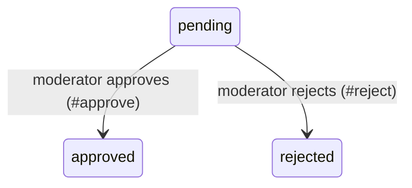

<!-- layout-exempt: rebuild-spec owns all docs/system|features|generated|flows paths -- all references here are output targets or internal definitions -->
<!-- Contract: references/feature-spec-researcher-contract.md -->

# F999_BackfillPending — Technical Spec

**Priority**: P2
**Type**: api
**Generated**: 2026-08-24

**See also:** [`functional-spec.md`](./functional-spec.md) — plain-language overview, open
decisions, requirements/business rules stated in one-liners, screens, user stories, scenarios,
edge cases, and configuration for a BA/QA audience.

## 1. Technical Overview

`Listings::ModerationController#approve` moves a `Listing` from `pending` to `approved` via
`Listing::ModerationService#approve!`, which flips the `state` enum column. Hand-authored SYNTHETIC
fixture (C1 proof obligation #1, plans/260824-1846-rebuild-spec-action-self-sufficiency-v27-8) --
already Action-Index-shaped, carrying zero unresolved-rule markers, one real `SM-###` heading
block, one writing action, and no State rung. Reproduces the installed-base backfill gap: a
feature that finished the fill pass is invisible to `--migrate --only action-thread` even though a
newly registered detector (`FeatureSpec.state_rung_missing`) now fires on it.

## 2. Action Index

| # | Action (handler) | Method · Path | Codes | Writes | Detail |
|---|------------------|---------------|-------|--------|--------|
| **A0** | *cross-cutting — belongs to no single action* | — | FR-001 | — | § 4.4 |
| **A1** | `Listings::ModerationController#approve` | `POST` `/listings/:id/approve` | FR-201, BR-001, SM-001 | `listings.state` | § 3.1 |

## 3. Actions

### 3.1 CAP-01 — Moderate a listing

#### A1 · Approve a pending listing

`POST /listings/:id/approve` → `Listings::ModerationController#approve`
`BR-001` `FR-201` `SM-001`

**BE** · **FR-201** A pending listing can be approved by a moderator — `Listings::ModerationController#approve` calls `Listing::ModerationService#approve!` [`app/controllers/listings/moderation_controller.rb:12-18`]; the same call is the **SM-001** transition itself, moving the listing from pending to approved.
**Rule** ·

**Approve only applies while the listing is pending (BR-001)**

**Linked FR:** FR-201
**Applies to:** `Listing::ModerationService#approve!`, called from `Listings::ModerationController#approve`.

```ruby
def approve!
  raise InvalidTransition unless listing.pending?
  listing.update!(state: "approved")
end
```
**Result** · `listings.state` flips `pending` → `approved`.
**Source:** `app/services/listing/moderation_service.rb:20-27`

## 4. Shared Foundation

### 4.1 Components

| Component | Responsibility | File |
|-----------|------------------|------|
| Listings::ModerationController | `approve`/`reject` member actions | `app/controllers/listings/moderation_controller.rb` |
| Listing::ModerationService | Enforces the pending-only transition guard | `app/services/listing/moderation_service.rb` |

### 4.2 Data Model

#### Key Entities

| Table | Key Columns | Notes |
|-------|-------------|-------|
| listings | id, state | `state` enum: `pending`, `approved`, `rejected` |

#### Polymorphic Behavior

N/A — no discriminator fields in Key Entities.

### 4.3 State Management

### A listing moves from pending to approved on moderator approval (SM-001)

**Source:** `app/services/listing/moderation_service.rb:20-27`



### 4.4 Shared Rules

#### Bin 2 — used by ≥2 named actions

#### Bin 3 — cross-cutting, belongs to no single action

**A0 · cross-cutting** — codes with no single-action owner:
- **FR-001** Only a moderator can reach this screen — `before_action :ensure_is_moderator` [`app/controllers/listings/moderation_controller.rb:3`]

**Only a moderator can reach the moderation screen (FR-001 owner)**

**Linked FR:** FR-001
**Source:** `app/controllers/listings/moderation_controller.rb:3`
**Applies to:** every action on `Listings::ModerationController`.

### 4.5 Algorithms & Integrations

None.

### 4.6 Configuration

N/A — no technical configuration beyond framework defaults.

**Client behavior:** see
[`behavior-logic.md`](../../generated/behavior-logic.md) (client-side patterns — debounce, optimistic UI, polling, upload, realtime),
[`permissions.md`](../../system/permissions.md) (feature flags / experiments / env / locale gates),
[`screen-flow.md`](../../generated/screen-flow.md) (guards / deep-link state restoration / unsaved-changes protection).

## 5. Verification & Technical Notes

### 5.1 Technical Verification

- **SC-001** A POST to `/listings/:id/approve` for a `pending` listing sets `state` to `approved`.
  (covers FR-201, BR-001)

### 5.2 Assumptions

- None beyond the pending-only guard shown above.

### 5.3 Unresolved Questions

None.

### 5.4 Source References

| Action | Order | Symbol | Path | Purpose |
|--------|-------|--------|------|---------|
| A1 | 1 | Listings::ModerationController | `app/controllers/listings/moderation_controller.rb:1-20` | Entry point for approve/reject |
| — | 2 | Listing::ModerationService | `app/services/listing/moderation_service.rb:1-30` | Pending-only transition guard |

### 5.5 Artifact References

| Artifact | File | Codes Used | Reviewed |
|----------|------|------------|----------|
| System Overview | [overview.md](../../system/overview.md) | — | [x] |
| Architecture | [architecture.md](../../system/architecture.md) | — | [x] |

**Rule:** Every code listed in Codes Used MUST exist in its source artifact. Orphan refs =
reviewer critical.
