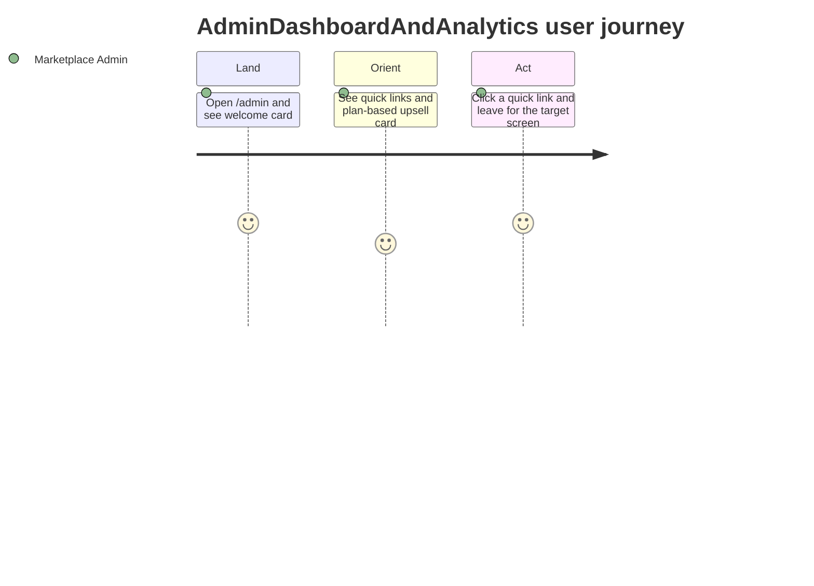

<!-- layout-exempt: rebuild-spec owns all docs/system|features|generated|flows paths — all references here are output targets or internal definitions -->
<!-- Contract: references/feature-spec-researcher-contract.md -->

# Functional Spec — F950_CleanMigrated

**Priority**: P2
**Type**: ui
**Generated**: 2026-08-21

**See also:** [`technical-spec.md`](./technical-spec.md) — endpoints, Source citations, pseudocode,
key entities, and DB writes for a Dev/QA/SA audience.

## 1. Overview

**Problem:** An admin who has just signed into the marketplace's admin console has no single
starting point — without a landing page, they would need to already know the console's full menu
structure to find the screens they use most, and would have no visible signal of how far along
the marketplace's setup/plan journey they are.
**Solution:** The console's `/admin` root shows a static landing page: a personal greeting, quick
links to the console's most-used management screens, a plan-dependent upsell card, and outward
links to Sharetribe's own guide/academy/help resources — a single jumping-off point, not an
independent data screen of its own.
**Scope:** Land the admin on one dashboard that surfaces quick links to Manage Users, Manage
Listings, Manage Transactions, Manage Reviews, and Conversations, plus payment-settings links when
the marketplace has a payment provider configured; show a plan-appropriate upsell card and
academy/help links.
**Non-Scope:** Configuring anything shown on the dashboard — users, listings, transactions,
payment settings, or the plan itself all belong to their own features; showing any actual
analytics data or metrics. Despite this feature's working name pairing "Dashboard" with
"Analytics," the dashboard renders none — Google Analytics/Tag Manager configuration and event
dispatch are a separate, unrelated feature (`F024_AnalyticsIntegration`) with its own screen and
routes; nothing under `/admin` (root) reads or writes analytics data.

**Actors**

| Actor | Description | Primary goal |
|-------|--------------|---------------|
| Marketplace Admin | A platform superadmin, or a member whose community membership is flagged as admin for this community | Land somewhere useful right after opening the admin console, and jump straight to the management screen they need |

## 2. Functional Capabilities

| ID | Capability | What the user can do | User Stories | Requirements | Business Rules | Screens |
|----|------------|------------------------|-----------------|---------------|-------------------|---------|
| CAP-01 | View the admin console dashboard | See a personalized landing page with quick links to the console's most-used screens, a plan-based upsell card, and guide/help links, then jump to any of those screens | US084 | FR-001, FR-101, FR-201, FR-202, FR-203, FR-204, FR-401, FR-601 | BR-001, BR-002, BR-003, DEC-001 | SCR001 |

## 3. Open Decisions

None — no unresolved domain confirmations.

## 4. Requirements

### Foundation (0xx)

- **FR-001** Viewing the dashboard requires the visitor to hold admin rights on the current
  community (platform superadmin, or a community membership flagged admin).

### Navigation (1xx)

- **FR-101** The admin reaches the dashboard at the marketplace's `/admin` root address.

### AdminDashboard (2xx)

- **FR-201** The dashboard's welcome card shows the admin's given name and the marketplace's
  current live address.
- **FR-202** The dashboard always shows quick links to Manage Users, Manage Listings, Manage
  Transactions, Manage Reviews, and Conversations.
- **FR-203** The dashboard shows one upsell/next-step card whose content depends on the
  marketplace's current billing plan.
- **FR-204** The dashboard always shows Sharetribe Academy guide links and a help card with a
  live-chat trigger and a browse-help link.

### Interaction (4xx)

- **FR-401** Payment-related quick links (transaction size, Stripe, PayPal) appear only for the
  specific payment provider(s) the marketplace has provisioned; a marketplace with neither shows
  no payment-links section at all.

### Security (6xx)

- **FR-601** A visitor without admin rights on the current community is redirected away before
  the dashboard renders — they never see any dashboard content.

## 5. Business Rules

- Payment-method quick links (transaction size, Stripe, PayPal) are shown only for the payment
  provider(s) confirmed provisioned for the community; none of the three appears when neither
  provider is provisioned. (BR-001)
- The welcome card shows the marketplace's own custom-domain address when the plan is
  white-labeled and a custom domain is in use; otherwise it shows the default `ident.sharetribe.com`
  subdomain address. (BR-002)
- A visitor without admin rights is redirected to the marketplace's search page if already signed
  in, or to the login page (returning to the dashboard afterwards) if signed out — never shown any
  dashboard content. (BR-003)
- Which of the three upsell/next-step cards shows depends on whether the marketplace's plan
  includes the white-label and landing-page features. (DEC-001)

## 6. Screens

| Screen Name | SCR### | What User Sees | What User Can Do |
|-------------|--------|-----------------|-------------------|
| AdminDashboard | SCR001_AdminDashboard | A welcome card with the admin's name and marketplace address, quick links grouped by day-to-day/transactions/payments, a plan-based upsell card, an Academy guide card, and a help card | Jump to Manage Users/Listings/Transactions/Reviews/Conversations, open payment-settings screens (if provisioned), open Academy guide links, or start an Intercom chat |

### User Journey

1. The admin arrives at AdminDashboard right after opening the console and sees a personalized
   welcome message plus the marketplace's live address.
2. The admin sees quick links grouped into day-to-day management (Manage Users, Manage Listings)
   and transactions/conversations (Manage Transactions, Manage Reviews, View Conversations), plus
   payment-settings links only for the payment provider(s) the marketplace has set up.
3. The admin sees a plan-based upsell card suggesting a relevant next step, and a guide/help card
   linking to Sharetribe's Academy and an Intercom chat trigger.
4. The admin clicks a quick link and is taken to the corresponding management screen elsewhere in
   the console.

## 7. User Stories

### US084_ViewAdminDashboard — View the marketplace admin dashboard

**Actor:** Marketplace Admin
**Goal:** View the admin dashboard so they can jump to the console's most-used management screens
and see the marketplace's onboarding/plan status.
**Business value:** Gives a returning or first-time admin one place to orient and act from,
instead of hunting the full console menu on every visit.

**Acceptance Criteria:**
- [ ] Dashboard renders quick links to Manage Users, Manage Listings, Manage
  Transactions/Reviews, Conversations, and payment settings (when provisioned).
- [ ] A plan-dependent upsell card (one of three variants) is chosen based on the current plan's
  white-label/landing-page features.
- [ ] A visitor without admin rights on the current community is redirected away and never sees
  the dashboard.

## 8. Scenarios

### US084_ViewAdminDashboard — Happy Path

**Given** the visitor holds admin rights on the current community, **When** they open `/admin`,
**Then** the dashboard renders with the welcome card, the full set of quick links applicable to
this community's payment provisioning, and the upsell card matching the plan's white-label/
landing-page features.

### US084_ViewAdminDashboard — Error: visitor lacks admin rights

**Given** the visitor does not hold admin rights on the current community, **When** they request
`/admin`, **Then** they are redirected to the search page (if signed in) or the login page (if
signed out) and never see any dashboard content.

## 9. Edge Cases

| Scenario | What Happens | User-Facing Message |
|----------|--------------|----------------------|
| Visitor lacks admin rights on the current community | Request is redirected before the dashboard renders; no dashboard markup is ever sent | "Please log in with an admin account to access this area." |
| Marketplace has neither Stripe nor PayPal provisioned | The entire online-payments quick-links group is omitted — no transaction-size, Stripe, or PayPal link appears | "None — silent handling" |
| Marketplace's plan has neither the white-label nor the landing-page feature | The default upsell card variant is shown | "None — normal card content" |
| Marketplace's plan has the white-label feature but not the landing-page feature | A different upsell card variant, recommending the landing-page upgrade, is shown | "None — normal card content" |

## 10. Edge Behaviours to Verify

- **FR-401** → Confirm the payment-links group is completely absent for a marketplace with
  neither Stripe nor PayPal provisioned, and shows only the applicable link(s) otherwise.
- **FR-601** → Confirm a visitor without admin rights never receives dashboard markup — only a
  redirect response.
- **FR-201** → Confirm the welcome card's shown address matches the custom-domain-vs-subdomain
  rule (BR-002) for the community's current white-label/domain-use state.

## 11. Risks & Known Issues

| ID | Type | Description | Impact | Status |
|----|------|--------------|--------|--------|
| RISK-01 | known-issue | This feature's own acceptance criteria describe a visitor without admin rights as landing on the search page or the login page. In practice, a marketplace-only admin who is specifically banned from this community is caught earlier by a separate banned-member gate (owned by `F006_CommunityAccessGating`) that redirects to a different page, before this feature's own admin check ever runs. | A test written strictly against this feature's own acceptance-criteria wording would expect the search or login page and observe a different redirect target for a banned marketplace-only admin. | confirmed |

## 12. Dependencies

| Dependency | Type | Why this feature needs it | Evidence |
|------------|------|-----------------------------|----------|
| F019_MarketplaceGeneralSettings | feature | The welcome card's shown marketplace address is computed by a presenter/service pair that F019's custom-domain feature owns, not this dashboard | BR-002 |
| F005_PaymentAndTransactionConfiguration | feature | Whether the payment-related quick links appear depends on Stripe/PayPal provisioning state that this feature reads but does not manage | BR-001 |
| F030_ExternalPlatformWebhooks | feature | The plan's white-label/landing-page feature flags that choose the upsell card come from plan records that this feature's inbound provisioning webhook creates | DEC-001 |
| F006_CommunityAccessGating | feature | The banned/pending-confirmation/pending-consent gates that can redirect a visitor away run ahead of this feature's own admin check on every request | FR-601 |

## 13. Configuration

N/A — no user-facing configuration constants for this feature.
