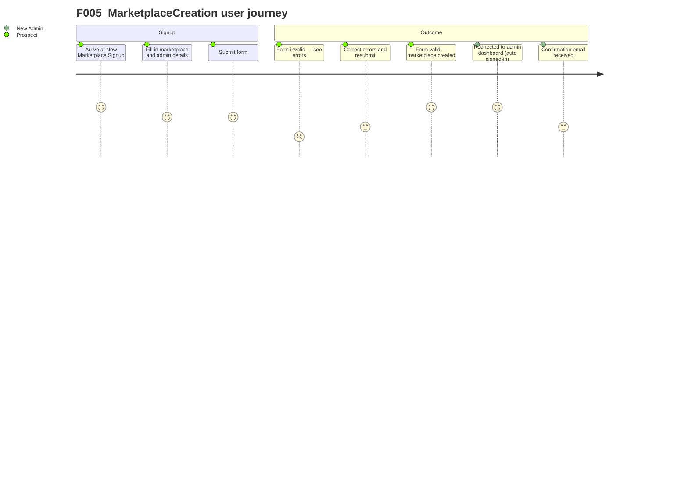

# F005_MarketplaceCreation

**Priority**: P2
**Type**: ui
**Generated**: migrated

**See also:** [`technical-spec.md`](./technical-spec.md) — endpoints, Source citations, pseudocode, key entities, and DB writes for a Dev/QA/SA audience.

## 1. Overview

**Problem:** Marketplace creation is the top-of-funnel moment for the entire platform. It is the single action that converts a prospect into a paying customer. Every feature in the system exists to serve marketplaces that were created through this flow. Making it fast, reliable, and self-service is a direct revenue driver.

**Solution:** F005_MarketplaceCreation provides two parallel paths for creating a new marketplace. The **React SPA path** (`GET /communities/new` → `POST /int_api/create_trial_marketplace`) serves the new marketplace signup UI backed by a JSON API; `IntAPI::MarketplacesController#create` validates reCAPTCHA + `NewMarketplaceForm`, calls `MarketplaceService.create` to build the `Community` scaffold, provisions payment gateways, creates the admin `Person` via `UserService::API::Users.create_user`, generates a one-time auth token, enables feature flags, and returns `{"marketplace_url": "…?auth=<token>"}`. The **legacy HTML path** (`GET /communities/new` → `POST /communities`) uses `CommunitiesController` which calls the same `MarketplaceService.create` and `UserService` pattern but redirects server-side. Both paths create: Community, CommunityMembership (admin=true, pending_email_confirmation), Email, TransactionProcess records, ListingShapes, and a 31-day trial PlanService record.

**Users:**

- **Marketplace founders (prospective operators)** — Individuals or businesses who want to launch their own online marketplace. They fill in a short form and immediately receive a ready-to-configure marketplace with their admin account set up.
- **Platform (Marketplace)** — The platform automatically sets up a trial account, provisions payment gateway integrations, and enables key features so the new marketplace is usable from day one.

**Goals:**

1. A prospective marketplace operator visits the new marketplace signup page and sees a form asking for the marketplace name, the type of marketplace (products, rentals, services, events, or free exchanges), the country, the language, and their own name, email address, and password.
2. They fill in the form and submit it.
3. The system checks that all fields are valid and that the submitted email is not already registered. It also verifies the submission is not from a bot using an invisible security check.
4. If the form is valid, the system creates the marketplace with a unique web address derived from the marketplace name. It sets up default categories, listing types, and payment gateway integrations automatically.
5. The operator's admin account is created and linked to the new marketplace as its first administrator.
6. A 31-day free trial is activated for the marketplace.
7. The operator is redirected immediately to their new marketplace's admin dashboard — they are signed in automatically without needing to log in separately. A confirmation email is sent to their registered address.
8. From the admin dashboard, the operator can customise their marketplace, configure payments, and invite their first members.

**Non-Goals:** None called out.

## 2. Open Decisions

None — no unresolved domain confirmations.

## 3. Requirements

### Foundation (0xx)

- **FR-001** reCAPTCHA token validated before any marketplace/user creation
- **FR-002** `NewMarketplaceForm` validates all required fields before creation
- **FR-003** `MarketplaceService.create` builds Community + customization + category + transaction processes + listing shapes + feature flags
- **FR-004** `UserService::API::Users.create_user` creates admin Person + Email + CommunityMembership(admin=true)
- **FR-005** Auth token generated for immediate admin login; admin redirected to admin2 via token URL
- **FR-006** 31-day trial `PlanService` record created at marketplace init (int_api path only)
- **FR-007** Stripe and PayPal transaction settings provisioned at marketplace creation (int_api path only)

## 4. Business Rules

- reCAPTCHA validation runs via `verify_recaptcha!` with 5-second timeout. Behaviour controlled by `APP_CONFIG.recaptcha_mode`: `:enforce` → return 400 on failure; `:log` → log failure but continue; no recaptcha_secret_key → skip validation entirely. (BR-001)
- `NewMarketplaceForm` requires: admin_email (format validated), admin_first_name (1–255 chars), admin_last_name (1–255 chars), admin_password (presence), marketplace_country, marketplace_language, marketplace_name, marketplace_type. `marketplace_type` must be one of: `product`, `rental`, `service`, `event`, `free`. (BR-002)
- Subdomain (`ident`) derived from marketplace_name via URL-safe slug, truncated to 30 chars. If already taken or in RESERVED_DOMAINS list, numeric suffix appended and retried until unique. (BR-003)
- If `community.community_memberships.count == 0`, the new membership gets `admin=true`. This ensures the marketplace creator is always the first admin, using all-status count (not just accepted) to handle unconfirmed admin edge case. (BR-004)
- Raises `ArgumentError` if admin email already in use in the community (`Email.email_available?` returns false). This is caught by the StandardError rescue in the transaction block, returning `Result::Error`. (BR-005)
- Trial plan expires at 09:00 local time exactly 31 days from creation. Provisioned via `PlanService::API::API.plans.create_initial_trial`. (BR-006)
- On success, admin is redirected to their new marketplace's admin2 dashboard with a one-time login token in the URL, authenticating them automatically without requiring a separate login step. (DEC-001)
- In enforce mode, failed reCAPTCHA returns a 400 error; in log mode, the failure is logged but creation proceeds; with no key configured, reCAPTCHA is skipped entirely. (DEC-002)
- Tracks the marketplace creation flow state machine (SM-001)

## 5. Screens

| Screen Name | SCR### | What User Sees | What User Can Do |
|-------------|--------|-----------------|-------------------|
| New Marketplace Signup | SCR019 | A form asking for marketplace name, marketplace type (dropdown), country, language, and admin account details (first name, last name, email, password) | Fill in and submit the form to create a new marketplace; see inline validation errors if any field is invalid |
| Create Trial Marketplace (API) | SCR260 | No visible page — this is a JSON API endpoint consumed by the React signup form; the browser does not navigate to it directly | Nothing directly — the React form on the signup page posts to this endpoint behind the scenes |

### User Journey

1. A prospective marketplace operator arrives at the New Marketplace Signup screen.
2. They enter their marketplace name, select the marketplace type that best matches their use case, choose their country and language, and fill in their personal details for the admin account.
3. They submit the form.
4. The system validates the form in the background. If any field is missing or invalid, the form is shown again with error messages pointing to the specific fields that need correction.
5. If everything is valid, the marketplace is created and the operator is automatically redirected to their new marketplace's admin dashboard — they are signed in automatically via a secure one-time link.
6. A confirmation email is sent to the admin email address they provided. They must click the link in that email to confirm their address before certain admin actions become available.

## 6. User Stories

### US026_CreateNewMarketplace — Sign up to create a new marketplace

A visitor navigates to `GET /communities/new` and is served the React-based new marketplace signup form (or the legacy HTML form). They submit marketplace name, type, country, language, admin first/last name, email, and password. The int_api path validates reCAPTCHA, then runs `NewMarketplaceForm` validation. On success: `MarketplaceService.create` builds the Community and all scaffolding (customization, default category, listing shapes, transaction processes, feature flags); `UserService::API::Users.create_user` creates the admin Person + Email + CommunityMembership(admin=true, pending_email_confirmation); a 31-day trial plan is provisioned; Stripe + PayPal settings enabled. A one-time auth login token is generated and embedded in the redirect URL to admin2 dashboard, so the creator is signed in automatically. A confirmation email is sent to the admin.

**Acceptance Criteria:**
- [ ] HTTP 201 returned; Community + Person + CommunityMembership(admin=true) created; marketplace_url in response with auth token
- [ ] HTTP 400 returned with form.errors JSON; no records created
- [ ] UserService returns Result::Error; HTTP error response (exact status unverified — TODO in controller)
- [ ] HTTP 400 with `{recaptcha_error: "validation failed"}`; no records created
- [ ] ident is URL-safe, ≤30 chars, unique
- [ ] redirect to marketplace full_domain URL with auth token; no JSON response

## 7. Scenarios

### US026_CreateNewMarketplace — Happy Path

**Given** valid form data + passing reCAPTCHA, **When** `POST` /int_api/create_trial_marketplace, **Then** HTTP 201 returned; Community + Person + CommunityMembership(admin=true) created; marketplace_url in response with auth token.

### US026_CreateNewMarketplace — Scenario 2

**Given** invalid form (missing marketplace_name), **When** `POST`, **Then** HTTP 400 returned with form.errors JSON; no records created.

### US026_CreateNewMarketplace — Scenario 3

**Given** admin email already taken, **When** `POST`, **Then** UserService returns Result::Error; HTTP error response (exact status unverified — TODO in controller).

### US026_CreateNewMarketplace — Scenario 4

**Given** reCAPTCHA fails in enforce mode, **When** `POST`, **Then** HTTP 400 with `{recaptcha_error: "validation failed"}`; no records created.

### US026_CreateNewMarketplace — Scenario 5

**Given** marketplace name with special chars, **When** ident generated, **Then** ident is URL-safe, ≤30 chars, unique.

### US026_CreateNewMarketplace — Scenario 6

**Given** CommunitiesController (legacy HTML path), **When** form valid, **Then** redirect to marketplace full_domain URL with auth token; no JSON response.

## 8. Edge Cases

| Scenario | What Happens | User-Facing Message |
|----------|--------------|----------------------|
| reCAPTCHA verification fails in enforce mode | Creation blocked immediately; no records created | "reCAPTCHA validation failed. Please try again." |
| reCAPTCHA verification fails in log mode | Failure logged silently; creation proceeds as normal | None — transparent to the user |
| Required form field missing (e.g. no marketplace name) | Form validation fails; no records created; errors returned | Form error listing each missing or invalid field |
| Invalid marketplace type submitted (not in allowed list) | Form validation fails; no records created | Form error: "Marketplace type is not included in the list" |
| Admin email address already registered in the new community | `UserService.create_user` raises an error; creation fails | Error response — exact message not confirmed; see Unresolved Questions in technical-spec.md |
| Marketplace name produces a subdomain already taken | System automatically appends a numeric suffix and uses the next available subdomain | None — operator is not informed of the change during signup |
| Marketplace name produces a reserved platform subdomain (e.g. "www") | Same suffix logic applies; creation proceeds with an incremented subdomain | None — transparent to the user |
| Legacy HTML signup path accessed when communities already exist | `ensure_no_communities` guard redirects to landing page | None — silent redirect |
| Payment gateway provisioning fails after community is created | Community and admin account exist but payment settings may be absent; no rollback observed | None — partial creation state; unhandled (TODO in source) |
| Feature flag service call fails after community and user created | Community operational but topbar_v1 / stripe_connect_onboarding features not enabled | None — silent failure; features can be enabled later via admin |
| Auth token URL used after token expires | Admin is not signed in automatically; redirected to login page | Standard login page — no specific error message |

## 9. Edge Behaviours to Verify

- **FR-001** → — `POST` /int_api/create_trial_marketplace with valid form + recaptcha: returns 201 with marketplace_url containing auth token
- **FR-001** → — Valid creation returns 201 + marketplace_url
- **FR-002** → — `POST` /int_api/create_trial_marketplace with valid form + recaptcha: returns 201 with marketplace_url containing auth token
- **FR-002** → — `POST` /int_api/create_trial_marketplace with invalid form: returns 400 with errors JSON
- **FR-003** → — Community, CommunityMembership(admin=true, pending_email_confirmation), Email created in DB
- **FR-004** → — Community, CommunityMembership(admin=true, pending_email_confirmation), Email created in DB
- **FR-005** → — `POST` /int_api/create_trial_marketplace with valid form + recaptcha: returns 201 with marketplace_url containing auth token
- **FR-007** → — Valid creation returns 201 + marketplace_url

## 10. Configuration

N/A — no user-facing configuration constants for this feature.
