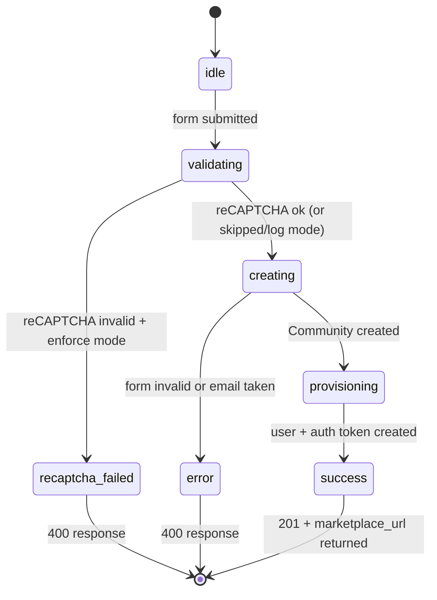

<!-- Contract: references/feature-spec-researcher-contract.md -->

# F005_MarketplaceCreation — Technical Spec

**Priority**: P1
**Type**: mixed
**Generated**: 2026-06-04

## Overview

F005_MarketplaceCreation provides two parallel paths for creating a new marketplace. The **React SPA path** (`GET /communities/new` → `POST /int_api/create_trial_marketplace`) serves the new marketplace signup UI backed by a JSON API; `IntAPI::MarketplacesController#create` validates reCAPTCHA + `NewMarketplaceForm`, calls `MarketplaceService.create` to build the `Community` scaffold, provisions payment gateways, creates the admin `Person` via `UserService::API::Users.create_user`, generates a one-time auth token, enables feature flags, and returns `{"marketplace_url": "…?auth=<token>"}`. The **legacy HTML path** (`GET /communities/new` → `POST /communities`) uses `CommunitiesController` which calls the same `MarketplaceService.create` and `UserService` pattern but redirects server-side. Both paths create: Community, CommunityMembership (admin=true, pending_email_confirmation), Email, TransactionProcess records, ListingShapes, and a 31-day trial PlanService record.

## Polymorphic Behavior

### DISC-005 — CommunityMembership.status (marketplace creation path)

| Value | Render | Validation | Persistence |
|-------|--------|------------|-------------|
| `pending_email_confirmation` | Admin creator must confirm email before accessing admin2 dashboard (unless skip_email_confirmation=true) | `cannot_access_without_confirmation` fires; admin bypass skips this in admin controllers | Set by `make_user_a_member_of_community`; first membership in community gets `admin=true` |
| `accepted` (skip confirmation) | Admin creator redirected directly to admin2 via auth token URL | No confirmation gate | `email.confirm!` called directly when `APP_CONFIG.skip_email_confirmation=true` |

**Source:** `app/services/user_service/api/users.rb:56-75`, `app/services/user_service/api/users.rb:42-47`

N/A for other DISC — Community has DISC-001/DISC-002/DISC-003 but they are display preferences set post-creation, not relevant to the creation flow itself.

## Cross-Cutting Logic

### Requirements

| Code | Description | Endpoint/Handler | Verifiable |
|------|-------------|------------------|------------|
| FR-001 | reCAPTCHA token validated before any marketplace/user creation | `POST /int_api/create_trial_marketplace` via `IntAPI::MarketplacesController#create` | yes |
| FR-002 | `NewMarketplaceForm` validates all required fields before creation | Both `POST /int_api/create_trial_marketplace` and `POST /communities` | yes |
| FR-003 | `MarketplaceService.create` builds Community + customization + category + transaction processes + listing shapes + feature flags | Both creation paths | yes |
| FR-004 | `UserService::API::Users.create_user` creates admin Person + Email + CommunityMembership(admin=true) | Both creation paths | yes |
| FR-005 | Auth token generated for immediate admin login; admin redirected to admin2 via token URL | Both creation paths | yes |
| FR-006 | 31-day trial `PlanService` record created at marketplace init (int_api path only) | `POST /int_api/create_trial_marketplace` | yes |
| FR-007 | Stripe and PayPal transaction settings provisioned at marketplace creation (int_api path only) | `POST /int_api/create_trial_marketplace` | yes |

**Source:** `app/controllers/int_api/marketplaces_controller.rb:1-97`, `app/controllers/communities_controller.rb:1-65`, `app/services/marketplace_service.rb:120-250`

### Business Rules

None.

### reCAPTCHA validation runs via `verify_recaptcha!` with 5-second timeout. Behaviour controlled by `APP_CONFIG.recaptcha_mode`: `:enforce` → return 400 on failure; `:log` → log failure but continue; no recaptcha_secret_key → skip validation entirely. (BR-001)
**Linked FR:** FR-001
**Source:** `app/controllers/int_api/marketplaces_controller.rb:11`, `app/controllers/int_api/marketplaces_controller.rb:75-91`
**Applies to:** POST /int_api/create_trial_marketplace

**Pseudocode:**
```ruby
mode = APP_CONFIG.recaptcha_mode.to_sym
if APP_CONFIG.recaptcha_secret_key && [:log, :enforce].include?(mode)
  verify_recaptcha!(response: token, secret_key: ..., timeout: 5)
rescue Recaptcha::RecaptchaError => e
  return mode != :enforce  # :log → true (continue), :enforce → false (block)
end
return true
```

### `NewMarketplaceForm` requires: admin_email (format validated), admin_first_name (1–255 chars), admin_last_name (1–255 chars), admin_password (presence), marketplace_country, marketplace_language, marketplace_name, marketplace_type. `marketplace_type` must be one of: `product`, `rental`, `service`, `event`, `free`. (BR-002)
**Linked FR:** FR-002
**Source:** `app/forms/form.rb:2-12`
**Applies to:** Both creation endpoints

**Pseudocode:**
```ruby
validates_presence_of :admin_email, :admin_first_name, :admin_last_name, :admin_password
validates_format_of   :admin_email, with: EMAIL_REGEX
validates_length_of   :admin_first_name, :admin_last_name, in: 1..255
validates_presence_of :marketplace_country, :marketplace_language, :marketplace_name, :marketplace_type
validates :marketplace_type, inclusion: { in: %w(product rental service event free) }
```

### Subdomain (`ident`) derived from marketplace_name via URL-safe slug, truncated to 30 chars. If already taken or in RESERVED_DOMAINS list, numeric suffix appended and retried until unique. (BR-003)
**Linked FR:** FR-003
**Source:** `app/services/marketplace_service.rb:239-251`
**Applies to:** MarketplaceService.create — ident generation

**Pseudocode:**
```ruby
current_ident = marketplace_name.to_url[0..29] || "trial_site"
base_ident = current_ident
i = 1
while Community.exists?(ident: current_ident) || RESERVED_DOMAINS.include?(current_ident)
  current_ident = "#{base_ident}#{i}"; i += 1
end
```

### If `community.community_memberships.count == 0`, the new membership gets `admin=true`. This ensures the marketplace creator is always the first admin, using all-status count (not just accepted) to handle unconfirmed admin edge case. (BR-004)
**Linked FR:** FR-004
**Source:** `app/services/user_service/api/users.rb:71-73`
**Applies to:** `make_user_a_member_of_community`

**Pseudocode:**
```ruby
if community.community_memberships.count == 0
  membership.admin = true
end
membership.save!
```

### Raises `ArgumentError` if admin email already in use in the community (`Email.email_available?` returns false). This is caught by the StandardError rescue in the transaction block, returning `Result::Error`. (BR-005)
**Linked FR:** FR-004
**Source:** `app/services/user_service/api/users.rb:10`
**Applies to:** `UserService::API::Users.create_user`

**Pseudocode:**
```ruby
raise ArgumentError.new("Email #{email} is already in use.") unless Email.email_available?(email, community_id)
```

### Trial plan expires at 09:00 local time exactly 31 days from creation. Provisioned via `PlanService::API::API.plans.create_initial_trial`. (BR-006)
**Linked FR:** FR-006
**Source:** `app/controllers/int_api/marketplaces_controller.rb:30-33`
**Applies to:** POST /int_api/create_trial_marketplace only

**Pseudocode:**
```ruby
plan = { expires_at: Time.now.change({ hour: 9, min: 0, sec: 0 }) + 31.days }
PlanService::API::API.plans.create_initial_trial(community_id: marketplace.id, plan: plan)
```

### Decision Logic

#### On success, admin is redirected to their new marketplace's admin2 dashboard with a one-time login token in the URL, authenticating them automatically without requiring a separate login step. (DEC-001)
**subtype:** flow
**Triggers in:** SCR019_NewCommunity — form submission
**Involved entities:** Community.full_url, UserService auth_token
**Source:** `app/controllers/int_api/marketplaces_controller.rb:56-70`

```ruby
base_url = URI(marketplace.full_url)
url = admin2_url(host: base_url.host, port: base_url.port)
auth_token = UserService::API::AuthTokens.create_login_token(user[:id])
url = URLUtils.append_query_param(url, "auth", auth_token[:token])
FeatureFlagService::API::API.features.enable(...)  # topbar_v1, stripe_connect_onboarding
render status: :created, json: {"marketplace_url" => url, "marketplace_id" => marketplace.id}
```

#### In enforce mode, failed reCAPTCHA returns a 400 error; in log mode, the failure is logged but creation proceeds; with no key configured, reCAPTCHA is skipped entirely. (DEC-002)
**subtype:** flow
**Triggers in:** SCR260_IntApiCreateMarketplace — POST /int_api/create_trial_marketplace
**Involved entities:** APP_CONFIG.recaptcha_mode, APP_CONFIG.recaptcha_secret_key
**Source:** `app/controllers/int_api/marketplaces_controller.rb:75-91`

```ruby
if recaptcha_secret_key && mode in [:log, :enforce]
  begin verify_recaptcha!(...) rescue RecaptchaError
    if mode == :enforce → return false (block request)
    else → return true (log and continue)
  end
end
return true  # no key → always pass
```

### State Machines

None.

### Tracks the marketplace creation flow state machine (SM-001)
**kind:** ui
**Linked FR:** FR-001, FR-002
**Source:** `app/controllers/int_api/marketplaces_controller.rb:10-71`



| From | To | Guard | Side effect |
|------|----|-------|-------------|
| idle | validating | form submitted | reCAPTCHA token passed |
| validating | creating | form.valid? + recaptcha ok | MarketplaceService.create called |
| creating | provisioning | Community.create succeeds | TransactionSettings + PlanService provisioned |
| provisioning | success | UserService.create_user succeeds | auth_token generated, feature flags enabled |
| validating | error | form.invalid? | 400 + form.errors JSON |

### Algorithms

None.

### Slugifies marketplace_name, truncates to 30 chars, then appends incrementing integer suffix until a unique ident is found in DB and not in RESERVED_DOMAINS list. (ALG-001)
**Linked FR:** FR-003
**Source:** `app/services/marketplace_service.rb:239-251`
**Input:** `marketplace_name` string
**Output:** unique URL-safe subdomain string ≤30 chars
**Complexity:** O(n) where n = number of existing communities with similar ident
**Description:** Slugifies marketplace_name, truncates to 30 chars, then appends incrementing integer suffix until a unique ident is found in DB and not in RESERVED_DOMAINS list.

**Pseudocode:**
```ruby
base = marketplace_name.to_url[0..29] || "trial_site"
ident = base; i = 1
while Community.exists?(ident: ident) || RESERVED_DOMAINS.include?(ident)
  ident = "#{base}#{i}"; i += 1
end
ident
```

### External Integrations

None.

### Sends api call (internal service) to `PlanService::API::API.plans.create_initial_trial` (INT-001)
**Linked FR:** FR-006
**Source:** `app/controllers/int_api/marketplaces_controller.rb:30-33`
**Type:** api-call (internal service)
**Target:** `PlanService::API::API.plans.create_initial_trial`
**Trigger:** After Community created in int_api path
**Payload:** community_id, plan: { expires_at: 31 days from now at 09:00 }
**Failure handling:** Not explicitly handled — error would bubble up; TODO comment in controller

### Sends api call (internal service) to `TransactionService::API::API.settings.provision` (INT-002)
**Linked FR:** FR-007
**Source:** `app/controllers/int_api/marketplaces_controller.rb:36-46`
**Type:** api-call (internal service)
**Target:** `TransactionService::API::API.settings.provision`
**Trigger:** After Community created; called twice (PayPal + Stripe)
**Payload:** community_id, payment_gateway: :paypal/:stripe, payment_process: :preauthorize, active: true
**Failure handling:** Not explicitly handled — TODO comment present

### Sends api call (internal service) to `FeatureFlagService::API::API.features.enable` (INT-003)
**Linked FR:** FR-005
**Source:** `app/controllers/int_api/marketplaces_controller.rb:64-66`
**Type:** api-call (internal service)
**Target:** `FeatureFlagService::API::API.features.enable`
**Trigger:** After user + auth token created
**Payload:** community_id, person_id (for topbar_v1), features: [:topbar_v1, :stripe_connect_onboarding]
**Failure handling:** Not explicitly handled

### Sends queue job (via Email.send_confirmation or email.confirm!) to `EmailConfirmationJob` → PersonMailer (unless skip_email_confirmation) (INT-004)
**Linked FR:** FR-004
**Source:** `app/services/user_service/api/users.rb:43-47`
**Type:** queue-job (via Email.send_confirmation or email.confirm!)
**Target:** `EmailConfirmationJob` → PersonMailer (unless skip_email_confirmation)
**Trigger:** After admin user created in DB transaction
**Payload:** email record, community
**Failure handling:** User can resend via confirmation flow (F003)

### Verification

- **SC-001** — POST /int_api/create_trial_marketplace with valid form + recaptcha: returns 201 with marketplace_url containing auth token (covers FR-001, FR-002, FR-005)
- **SC-002** — Community, CommunityMembership(admin=true, pending_email_confirmation), Email created in DB (covers FR-003, FR-004, BR-004)
- **SC-003** — POST /int_api/create_trial_marketplace with invalid form: returns 400 with errors JSON (covers FR-002, BR-002)
- **SC-004** — Ident uniqueness: two marketplaces with same name get distinct subdomain idents (covers BR-003)

---

**Client behavior:** see
[`behavior-logic.md`](../../generated/behavior-logic.md) (client-side patterns — debounce, optimistic UI, polling, upload, realtime),
[`permissions.md`](../../system/permissions.md) (feature flags / experiments / env / locale gates),
[`screen-flow.md`](../../generated/screen-flow.md) (guards / deep-link state restoration / unsaved-changes protection).

## User Stories

### US026_CreateNewMarketplace — Sign up to create a new marketplace (Priority: P1)

**What happens:** A visitor navigates to `GET /communities/new` and is served the React-based new marketplace signup form (or the legacy HTML form). They submit marketplace name, type, country, language, admin first/last name, email, and password. The int_api path validates reCAPTCHA, then runs `NewMarketplaceForm` validation. On success: `MarketplaceService.create` builds the Community and all scaffolding (customization, default category, listing shapes, transaction processes, feature flags); `UserService::API::Users.create_user` creates the admin Person + Email + CommunityMembership(admin=true, pending_email_confirmation); a 31-day trial plan is provisioned; Stripe + PayPal settings enabled. A one-time auth login token is generated and embedded in the redirect URL to admin2 dashboard, so the creator is signed in automatically. A confirmation email is sent to the admin.
**Why this priority:** Marketplace creation is the top-of-funnel entry point for the entire platform. No marketplace → no revenue, no users, no product value.
**Independent Test:** POST /int_api/create_trial_marketplace with valid params → verify Community row created, CommunityMembership with admin=true, response contains marketplace_url with auth param.

**Acceptance Scenarios:**

1. **Given** valid form data + passing reCAPTCHA, **When** POST /int_api/create_trial_marketplace, **Then** HTTP 201 returned; Community + Person + CommunityMembership(admin=true) created; marketplace_url in response with auth token.
2. **Given** invalid form (missing marketplace_name), **When** POST, **Then** HTTP 400 returned with form.errors JSON; no records created.
3. **Given** admin email already taken, **When** POST, **Then** UserService returns Result::Error; HTTP error response (exact status unverified — TODO in controller).
4. **Given** reCAPTCHA fails in enforce mode, **When** POST, **Then** HTTP 400 with `{recaptcha_error: "validation failed"}`; no records created.
5. **Given** marketplace name with special chars, **When** ident generated, **Then** ident is URL-safe, ≤30 chars, unique.
6. **Given** CommunitiesController (legacy HTML path), **When** form valid, **Then** redirect to marketplace full_domain URL with auth token; no JSON response.

**Requirements fulfilled:**
- **FR-001** reCAPTCHA validated before creation — `POST /int_api/create_trial_marketplace` via `IntAPI::MarketplacesController#create`
  **Source:** `app/controllers/int_api/marketplaces_controller.rb:11, 75-91`
- **FR-002** `NewMarketplaceForm` validates all fields — both creation paths
  **Source:** `app/forms/form.rb:2-12`
- **FR-003** `MarketplaceService.create` builds full Community scaffold — both creation paths
  **Source:** `app/services/marketplace_service.rb:120-144`
- **FR-004** `UserService::API::Users.create_user` creates admin Person + first-member-admin CommunityMembership — both paths
  **Source:** `app/services/user_service/api/users.rb:8-54`
- **FR-005** Auth token URL redirects admin to admin2 dashboard — both paths
  **Source:** `app/controllers/int_api/marketplaces_controller.rb:56-70`, `app/controllers/communities_controller.rb:39-42`
- **FR-006** 31-day trial plan provisioned — int_api path only
  **Source:** `app/controllers/int_api/marketplaces_controller.rb:29-33`
- **FR-007** Stripe + PayPal transaction settings enabled — int_api path only
  **Source:** `app/controllers/int_api/marketplaces_controller.rb:36-46`

**Rules enforced:** BR-001, BR-002, BR-003, BR-004, BR-005, BR-006

**State transitions:** SM-001 — idle → success / error

**Verification:**
- **SC-001** — Valid creation returns 201 + marketplace_url (covers FR-001 through FR-007)
- **SC-003** — Invalid form returns 400 errors JSON (covers BR-002)
- **SC-005** — Duplicate admin email returns error (covers BR-005)

---

### Edge Cases

| Scenario | Behavior |
|----------|----------|
| reCAPTCHA fails in enforce mode | Creation blocked; 400 returned immediately | "reCAPTCHA validation failed. Please try again." |
| reCAPTCHA fails in log mode | Failure logged; creation proceeds normally | None — transparent to user |
| Marketplace name generates ident already taken by existing community | Numeric suffix appended until unique ident found; creation proceeds | None — transparent to user |
| Marketplace name generates ident in RESERVED_DOMAINS list | Same suffix logic applies; creation proceeds with modified ident | None — transparent to user |
| Admin email already registered in new community | `UserService.create_user` raises ArgumentError; caught as StandardError; Result::Error returned | Error response (exact message unconfirmed — TODO comment in controller) |
| `marketplace_type` not in allowed list | `NewMarketplaceForm` validation fails; 400 + errors JSON | Form errors listing invalid marketplace type |
| `CommunitiesController` used but communities already exist | `ensure_no_communities` before_filter redirects to landing_page_path | None — silent redirect |
| Payment gateway provisioning fails | No explicit error handling (TODO in controller); creation may partially succeed with Community + user but no payment settings | Unhandled — unclear user-facing behaviour |
| Feature flag service fails | No explicit error handling; creation succeeds without topbar_v1 / stripe_connect_onboarding flags | Unhandled — feature flag absent but marketplace functional |

## Key Entities

| Entity | Table | Key Columns | Purpose |
|--------|-------|-------------|---------|
| Community | `communities` | id, ident, consent, currency, country, settings | Central tenant created; ident is the subdomain |
| Person | `people` | id, given_name, family_name, community_id, username | Admin creator account |
| CommunityMembership | `community_memberships` | id, person_id, community_id, admin, status | First membership; admin=true; status=pending_email_confirmation |
| Email | `emails` | id, person_id, address, confirmed_at, community_id | Admin email; confirmed immediately if skip_email_confirmation=true |
| TransactionProcess | `transaction_processes` | id, community_id, process, author_is_seller | 3 processes created: none×2 + preauthorize×1 |

## Artifact References

| Artifact | File | Codes Used | Reviewed |
|----------|------|------------|----------|
| System Overview | [system-overview.md](../../system-overview.md) | — | [x] |
| Feature List | [feature-list.md](../../feature-list.md) | F005_MarketplaceCreation | [x] |
| Screen Flow | `docs/generated/screen-flow.md` | N/A | Yes |
| User Stories | [user-stories.md](../../user-stories.md) | US026 | [x] |
| Screens | [screen-list.md](../../screen-list.md) | SCR019, SCR260 | [x] |
| Entities | [data-model.md](../../data-model.md) | MODEL001 (Community), MODEL002 (Person), MODEL003 (CommunityMembership), DISC-005 | [x] |
| Permissions Matrix | [permissions-matrix.md](../../permissions-matrix.md) | PERM047 | [x] |
| Behavior Logic | [behavior-logic.md](../../behavior-logic.md) | BL027 | [x] |
| Route List | [route-list.md](../../route-list.md) | GET /communities/new, POST /int_api/create_trial_marketplace | [x] |

## Assumptions

- `CommunitiesController` (legacy HTML path) is only reachable when no communities exist (`ensure_no_communities` guard). In production multi-tenant usage, `/communities/new` likely serves the React SPA which posts to `/int_api/create_trial_marketplace` instead.
- `community.full_url` vs `community.full_domain`: The int_api path uses `full_url`; CommunitiesController uses `full_domain({with_protocol: true})`. Assumed equivalent for redirect purposes.
- `UserService::API::AuthTokens.create_login_token` generates a short-lived token that is consumed by `check_auth_token` before_action in ApplicationController on the first admin2 request.
- `TransactionTypeCreator.create(community, marketplace_type)` creates default listing shapes for the chosen marketplace type; implementation not read.
- The `RESERVED_DOMAINS` constant in `MarketplaceService` contains platform-reserved subdomains (e.g., "www", "admin"); its full contents were not read.

## Source Code References

| Symbol | Path | Purpose |
|--------|------|---------|
| `IntAPI::MarketplacesController` | `app/controllers/int_api/marketplaces_controller.rb:1-97` | JSON API creation endpoint; reCAPTCHA, form validation, orchestration |
| `CommunitiesController` | `app/controllers/communities_controller.rb:1-65` | Legacy HTML creation endpoint |
| `MarketplaceService.create` | `app/services/marketplace_service.rb:120-144` | Community scaffold builder |
| `MarketplaceService.available_ident_based_on` | `app/services/marketplace_service.rb:239-251` | Unique subdomain generation |
| `UserService::API::Users.create_user` | `app/services/user_service/api/users.rb:8-54` | Admin user + membership creation |
| `UserService::API::Users.make_user_a_member_of_community` | `app/services/user_service/api/users.rb:56-75` | First-member admin promotion |
| `Form::NewMarketplace` | `app/forms/form.rb:2-12` | Input validation |

## Unresolved Questions

1. **Error handling gaps**: The int_api controller has `# TODO handle error cases with proper response` after user creation. If `UserService.create_user` returns `Result::Error` (e.g., duplicate email), the response behaviour is not defined — could be a 500 or an unhandled exception.
2. **Auth token expiry**: `UserService::API::AuthTokens.create_login_token` source not read. Token lifetime unknown — unclear if admin can only use the redirect URL once or if it expires after a time window.
3. **`check_auth_token` consumption**: ApplicationController presumably reads the `?auth=` param and signs in the user. The before_action source was not confirmed but implied by security overview in system-overview.md.
4. **React SPA vs CommunitiesController routing**: Which path `/communities/new` actually serves in a standard deployment is unclear — may depend on whether the page renders the React `OnboardingGuideApp` or the legacy HTML form.
5. **Payment gateway provisioning failure**: No error handling for `TransactionService::API::API.settings.provision` failures. A marketplace could be created without payment gateways if this call fails silently.
