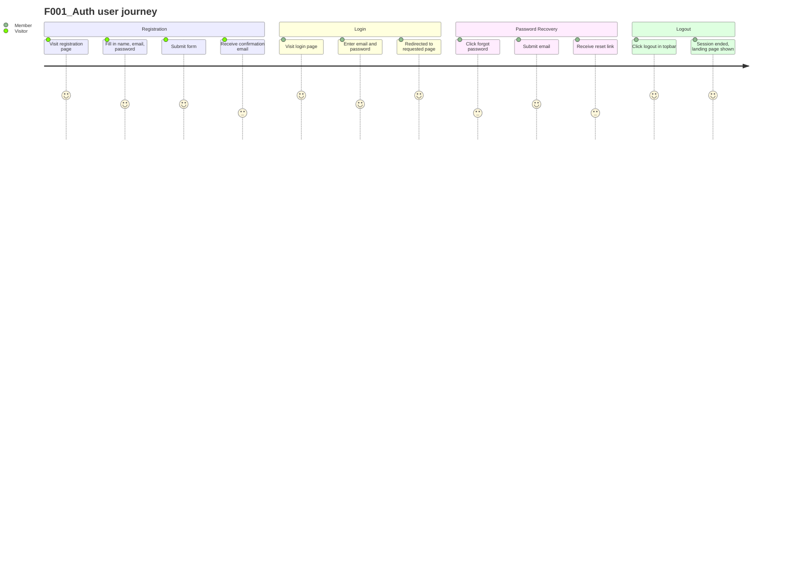

# Screens — F001_Auth

## Screen List

| Screen Name | What User Sees | What User Can Do |
|-------------|----------------|------------------|
| Login Page | Email and password fields; link to sign up; link to reset password; OAuth provider buttons (if enabled) | Submit credentials; navigate to sign-up; request password reset; click OAuth login buttons |
| Registration Page | Name, email, username, password fields; optional invite code field (invite-only communities) | Fill in and submit the registration form; enter invite code if required |
| Password Reset Request | Single email input field with submit button | Enter registered email address and request a reset link |
| Access Denied | Message explaining the account cannot access the marketplace | Read explanation; no action available beyond navigating away |
| Homepage / Topbar | Logout link in site navigation bar | Click logout to end the session |

## User Journey

1. User arrives at the Login Page and sees the email/password form.
2. If not yet registered, user clicks the sign-up link and arrives at the Registration Page.
3. User fills in their name, email, username, and password; enters an invite code if the marketplace requires one; submits the form.
4. User is taken to the Awaiting Confirmation screen (see F003_EmailConfirmation) and waits for the confirmation email.
5. Alternatively, a returning member enters email and password on the Login Page and submits.
6. On success, the member is redirected to the page they originally requested, or to the marketplace search page.
7. If the marketplace terms have been updated, the member is redirected to the Terms Accept screen (see F004_TermsConsent) before continuing.
8. A member who forgets their password clicks the "forgot password" link on the Login Page, arrives at the Password Reset Request screen, submits their email, and receives a reset link by email.
9. A banned member who attempts to access the marketplace sees the Access Denied screen.
10. A logged-in member clicks the logout link in the topbar and is returned to the marketplace landing page with a confirmation message.

