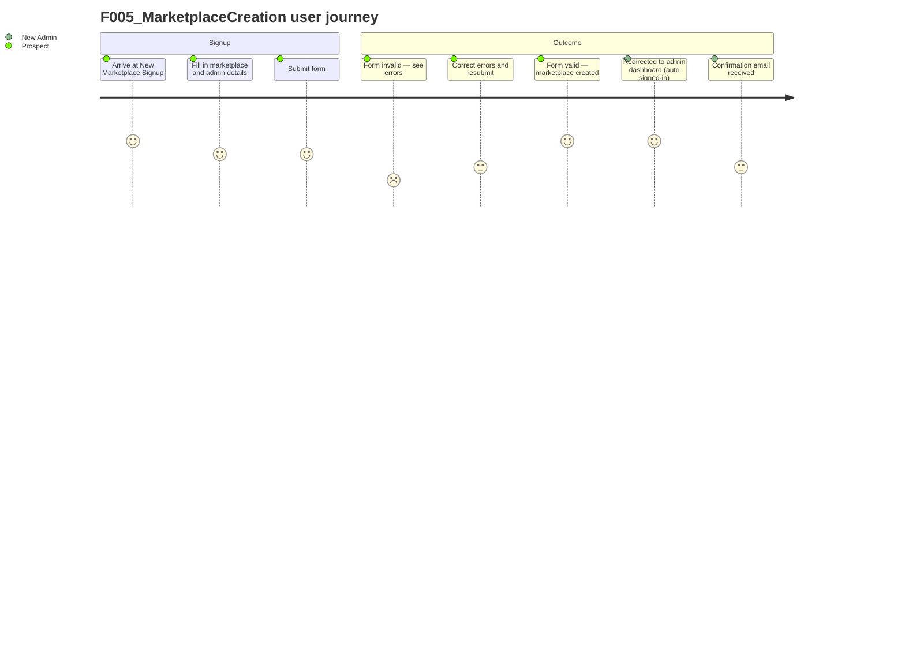

# Screens — F005_MarketplaceCreation

## Screen List

| Screen Name | What User Sees | What User Can Do |
|-------------|----------------|------------------|
| New Marketplace Signup | A form asking for marketplace name, marketplace type (dropdown), country, language, and admin account details (first name, last name, email, password) | Fill in and submit the form to create a new marketplace; see inline validation errors if any field is invalid |
| Create Trial Marketplace (API) | No visible page — this is a JSON API endpoint consumed by the React signup form; the browser does not navigate to it directly | Nothing directly — the React form on the signup page posts to this endpoint behind the scenes |

## User Journey

1. A prospective marketplace operator arrives at the New Marketplace Signup screen.
2. They enter their marketplace name, select the marketplace type that best matches their use case, choose their country and language, and fill in their personal details for the admin account.
3. They submit the form.
4. The system validates the form in the background. If any field is missing or invalid, the form is shown again with error messages pointing to the specific fields that need correction.
5. If everything is valid, the marketplace is created and the operator is automatically redirected to their new marketplace's admin dashboard — they are signed in automatically via a secure one-time link.
6. A confirmation email is sent to the admin email address they provided. They must click the link in that email to confirm their address before certain admin actions become available.

