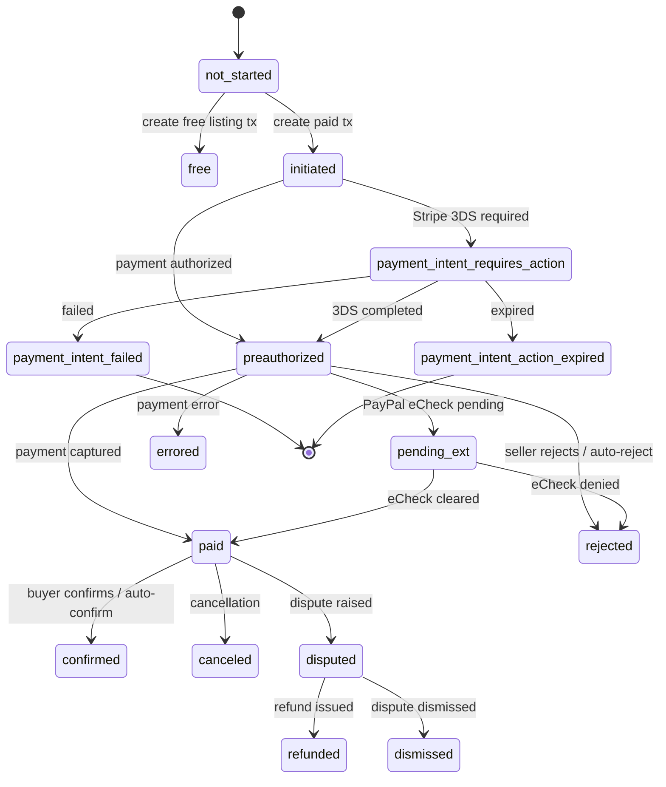

# F051_TransactionStateMachine — Technical Spec

**Priority**: P1
**Type**: background
**Generated**: 2026-06-04

## Overview

`TransactionProcessStateMachine` is the authoritative Statesman-based state machine that orchestrates all lifecycle transitions for Transaction records. It is triggered by controllers, payment service callbacks, and delayed_job workers; it fires after_transition hooks that enqueue side-effect jobs (email, payment void, auto-confirmation scheduling). No direct HTTP surface — purely internal.

## Polymorphic Behavior

### DISC-011 — Transaction.current_state

| Value | Render | Validation | Persistence |
|-------|--------|------------|-------------|
| `not_started` | Initial Statesman state (NULL in DB) | No transition guards | `current_state` set to first valid state on first transition |
| `initiated` | — | before_transition to preauthorized: validates listing lock + transaction/booking validity | `current_state` updated by after_transition callback |
| `preauthorized` | — | `validate_before_preauthorized` guard; listing row-locked | Enqueues TransactionPreauthorizedJob, AutomaticallyRejectPreauthorizedTransactionJob, reminder job |
| `payment_intent_requires_action` | — | Same guard as preauthorized | Enqueues TransactionPaymentIntentCancelJob at DELAY from now |
| `paid` | — | — | Schedules auto-confirmation (booking: at `final_end + 2 days`, non-booking: community default); enqueues SendPaymentReceipts |
| `confirmed` | — | — | Triggers ConfirmConversation#confirm! (releases payment, schedules testimonials) |
| `rejected` | — | — | Enqueues TransactionStatusChangedJob with rejecter = listing author |
| `errored` | — | — | Called via PayPal event handler on voided/errored payment |
| `canceled` | — | — | Triggers ConfirmConversation#cancel! |
| `disputed` | — | — | Enqueues TransactionDisputedJob |
| `refunded` | — | — | Sets starter_skipped_feedback=false; enqueues TransactionRefundedJob |
| `dismissed` | — | — | Sets starter_skipped_feedback=false; enqueues TransactionCancellationDismissedJob; calls ConfirmConversation#confirm! |
| `pending_ext` | — | — | PayPal-only: external capture pending; transitions to paid or rejected |
| `free` | — | — | Sends new transaction email if conversation.payment? |
| `payment_intent_failed` | — | — | Calls reject_transaction (soft-deletes transaction record) |
| `payment_intent_action_expired` | — | — | Calls reject_transaction + void_payment on failure |
| `pending` | — (deprecated) | — | Legacy state; no active transitions defined |
| `accepted` | — (deprecated) | — | Legacy state; no active transitions defined |

**Source:** `app/state_machines/transaction_process_state_machine.rb:1-197`

### DISC-012 — Transaction.payment_gateway

| Value | Render | Validation | Persistence |
|-------|--------|------------|-------------|
| `paypal` | — | `handle_preauthorized`: expiration = PayPal estimate (days) minus 10 min buffer | AutoReject job scheduled at paypal expiration |
| `stripe` | — | `handle_preauthorized`: expiration = Stripe days minus 10 min buffer | AutoReject job scheduled at stripe expiration |
| `none` / `checkout` / `braintree` | — | `handle_preauthorized` raises ArgumentError for unknown gateway | No preauth job |

**Source:** `app/state_machines/transaction_process_state_machine.rb:136-160`

## Cross-Cutting Logic

### Requirements

| Code | Description | Endpoint/Handler | Verifiable |
|------|-------------|------------------|------------|
| FR-001 | State machine enforces valid transitions only via Statesman guards | TransactionProcessStateMachine | yes |
| FR-002 | after_transition(after_commit:true) hooks enqueue side-effect jobs atomically with DB commit | TransactionProcessStateMachine | yes |
| FR-003 | `current_state` and `last_transition_at` updated in every after_transition callback | `Transaction#update_columns` | yes |
| FR-004 | validate_before_preauthorized row-locks listing to prevent concurrent booking conflicts | Listing.lock.find | yes |
| FR-005 | void_payment called on preauthorized transition failure | after_transition_failure | yes |

**Source:** `app/state_machines/transaction_process_state_machine.rb:31-196`

### Business Rules

#### BR-001_PreauthorizedValidation
**Linked FR:** FR-004
**Source:** `app/state_machines/transaction_process_state_machine.rb:190-195`
**Applies to:** before_transition to :preauthorized and :payment_intent_requires_action
**Rule:** Listing row-locked; transaction and booking (if present) must be valid. Failure raises Statesman::TransitionFailedError.

**Pseudocode:**
```ruby
Listing.lock.find(transaction.listing_id)
unless transaction.valid? && (transaction.booking ? transaction.booking.valid? : true)
  raise Statesman::TransitionFailedError
end
```

#### BR-002_AutoRejectScheduling
**Linked FR:** FR-002
**Source:** `app/state_machines/transaction_process_state_machine.rb:135-161`
**Applies to:** after_transition to :preauthorized
**Rule:** AutomaticallyRejectPreauthorizedTransactionJob scheduled at gateway expiration minus 10 minutes. PayPal and Stripe each have distinct expiration periods. Not scheduled in test environment.

**Pseudocode:**
```ruby
expiration_period = TransactionService::Transaction.authorization_expiration_period(gateway)
expire_at = expiration_period.days.from_now - 10.minutes
Delayed::Job.enqueue(AutoRejectJob.new(tx.id), priority: 8, run_at: expire_at) unless Rails.env.test?
```

#### BR-003_BookingAutoConfirmTiming
**Linked FR:** FR-002
**Source:** `app/state_machines/transaction_process_state_machine.rb:37-50`
**Applies to:** after_transition to :paid
**Rule:** If booking present, auto-confirm at `booking.final_end + 2 days`. Otherwise uses community-configured automatic_confirmation period.

**Pseudocode:**
```ruby
if transaction.booking.present?
  confirm_at = booking.final_end + 2.days
  ConfirmConversation.new(tx, payer, community).activate_automatic_booking_confirmation_at!(confirm_at)
else
  ConfirmConversation.new(tx, payer, community).activate_automatic_confirmation!
end
```

#### BR-004_SendNewTransactionEmailGuard
**Linked FR:** FR-002
**Source:** `app/state_machines/transaction_process_state_machine.rb:125-129`
**Applies to:** after_transition to :preauthorized and :free
**Rule:** New transaction email only sent if `community.email_admins_about_new_transactions` is truthy.

**Pseudocode:**
```ruby
if transaction.community.email_admins_about_new_transactions
  Delayed::Job.enqueue(SendNewTransactionEmail.new(transaction.id))
end
```

#### BR-005_VoidPaymentOnFailure
**Linked FR:** FR-005
**Source:** `app/state_machines/transaction_process_state_machine.rb:95-101, 174-184`
**Applies to:** after_transition_failure to :preauthorized and :payment_intent_action_expired
**Rule:** Gateway adapter's `reject_payment` called to void the payment authorization. Errors logged but not re-raised (silent on payment void failure).

### Decision Logic

N/A — no user-facing decision logic beyond DISC-### Polymorphic Behavior.

### State Machines

#### SM-001_TransactionLifecycle
**kind:** entity
**Linked FR:** FR-001
**Source:** `app/state_machines/transaction_process_state_machine.rb:1-30`
**States:** not_started, initiated, payment_intent_requires_action, preauthorized, pending_ext, paid, confirmed, canceled, rejected, errored, dismissed, disputed, refunded, free, payment_intent_failed, payment_intent_action_expired, pending (deprecated), accepted (deprecated)



**Transition rules:**
- `initiated → preauthorized`: guard=validate_before_preauthorized; side effects=send email, handle_preauthorized (schedule auto-reject + reminder)
- `initiated → payment_intent_requires_action`: guard=validate_before_preauthorized; side effects=enqueue TransactionPaymentIntentCancelJob
- `preauthorized → paid`: guard=none; side effects=schedule auto-confirm, enqueue SendPaymentReceipts
- `preauthorized → rejected`: guard=none; side effects=enqueue TransactionStatusChangedJob
- `paid → confirmed`: guard=none; side effects=ConfirmConversation#confirm!
- `paid → canceled`: guard=none; side effects=ConfirmConversation#cancel!
- `paid → disputed`: guard=none; side effects=enqueue TransactionDisputedJob
- `disputed → refunded`: guard=none; side effects=reset starter_skipped_feedback, enqueue TransactionRefundedJob
- `disputed → dismissed`: guard=none; side effects=reset starter_skipped_feedback, enqueue TransactionCancellationDismissedJob, ConfirmConversation#confirm!
- `payment_intent_failed → [*]`: side effects=reject_transaction (soft-delete)
- `payment_intent_action_expired → [*]`: side effects=reject_transaction, void_payment

### Algorithms

#### ALG-001_PreauthorizationExpiryCalculation
**Linked FR:** FR-002
**Source:** `app/state_machines/transaction_process_state_machine.rb:136-161`
**Input:** transaction (payment_gateway, booking.final_end)
**Output:** expire_at datetime for auto-reject job
**Complexity:** O(1)
**Description:** Computes when to auto-reject a preauthorized transaction. Gateway expiration period (days) minus 10-minute buffer. If booking present, `preauth_expires_at` takes the minimum of gateway expiry and `booking.final_end`.

**Pseudocode:**
```ruby
expiration_period = TransactionService::Transaction.authorization_expiration_period(gateway)
gateway_expires_at = expiration_period.days.from_now - 10.minutes
booking_ends_on = transaction.booking&.final_end
expire_at = TransactionService::Transaction.preauth_expires_at(gateway_expires_at, booking_ends_on)
reminder_at = expire_at - 1.day
```

#### ALG-002_SetupPreauthorizeReminder
**Linked FR:** FR-002
**Source:** `app/state_machines/transaction_process_state_machine.rb:163-171`
**Input:** transaction_id, expire_at
**Output:** Schedules TransactionPreauthorizedReminderJob or skips if already past
**Complexity:** O(1)
**Description:** Reminder scheduled 1 day before preauthorization expiry, but only if `reminder_at > Time.zone.now` — prevents stale reminders for short-duration preauths.

**Pseudocode:**
```ruby
reminder_at = expire_at - 1.day
if reminder_at > Time.zone.now
  Delayed::Job.enqueue(TransactionPreauthorizedReminderJob.new(tx_id), priority: 9, run_at: reminder_at)
end
```

### External Integrations

#### INT-001_AutoRejectJob
**Linked FR:** FR-002
**Source:** `app/state_machines/transaction_process_state_machine.rb:157`
**Type:** queue-job
**Target:** delayed_job queue → AutomaticallyRejectPreauthorizedTransactionJob
**Trigger:** after_transition to :preauthorized
**Payload:** transaction_id, run_at=expire_at, priority=8
**Failure handling:** DelayedAirbrakeNotification mixin catches exception; standard delayed_job retry

#### INT-002_SendPaymentReceipts
**Linked FR:** FR-002
**Source:** `app/state_machines/transaction_process_state_machine.rb:49`
**Type:** queue-job
**Target:** delayed_job → SendPaymentReceipts job
**Trigger:** after_transition(to: :paid, after_commit: true)
**Payload:** transaction_id
**Failure handling:** DelayedAirbrakeNotification; delayed_job retry

#### INT-003_GatewayVoidPayment
**Linked FR:** FR-005
**Source:** `app/state_machines/transaction_process_state_machine.rb:174-184`
**Type:** api-call
**Target:** PaypalService or StripeService gateway adapter
**Trigger:** after_transition_failure to :preauthorized
**Payload:** tx record, reason=""
**Failure handling:** Error logged via MarketplaceLogger; not re-raised

### Verification

- **SC-001** — Transaction.current_state must equal the last TransactionTransition.to_state for any transaction (covers FR-001, SM-001)
- **SC-002** — AutomaticallyRejectPreauthorizedTransactionJob exists in delayed_jobs with correct run_at after preauthorized transition (covers BR-002, ALG-001)
- **SC-003** — ConfirmConversation#cancel! invoked when paid→canceled; ConfirmConversation#confirm! invoked when paid→confirmed (covers BR-003)

---

**Client behavior:** see
[`behavior-logic.md`](../../generated/behavior-logic.md) (client-side patterns — debounce, optimistic UI, polling, upload, realtime),
[`permissions.md`](../../system/permissions.md) (feature flags / experiments / env / locale gates),
[`screen-flow.md`](../../generated/screen-flow.md) (guards / deep-link state restoration / unsaved-changes protection).

## User Stories

### US190_SystemAutoConfirmTransaction — Auto-confirm transaction after timeout (Priority: P1)

**What happens:** When a transaction has been in `paid` state past the community's `automatic_confirmation_after_days` threshold (or past booking end + 2 days for booking transactions), the system transitions it to `confirmed`, releases payment to the seller, and notifies the requester.
**Why this priority:** Core financial integrity — prevents payment indefinitely held without resolution.
**Independent Test:** Create a non-booking paid transaction; set community.automatic_confirmation_after_days to past; trigger AutomaticConfirmationJob; verify Transaction.current_state = 'confirmed'.

**Acceptance Scenarios:**

1. **Given** a transaction in `paid` state older than community threshold, **When** AutomaticConfirmationJob runs, **Then** state transitions to `confirmed` and TransactionAutomaticallyConfirmedJob enqueued.
2. **Given** a booking transaction in `paid` state past `final_end + 2 days`, **When** AutomaticBookingConfirmationJob runs, **Then** state transitions to `confirmed` and booking confirmation email sent.
3. **Given** transaction already in `confirmed` state, **When** job runs, **Then** `can_transition_to?(:confirmed)` returns false, no duplicate transition.

**Requirements fulfilled:**
- **FR-006** AutomaticConfirmationJob checks `can_transition_to?(:confirmed)` before calling `transition_to` — `AutomaticConfirmationJob#perform` via `TransactionService::StateMachine`
  **Source:** `app/jobs/automatic_confirmation_job.rb:14-21`
- **FR-007** AutomaticBookingConfirmationJob sends `booking_transaction_automatically_confirmed` email via PersonMailer
  **Source:** `app/jobs/automatic_booking_confirmation_job.rb:14-23`

**Rules enforced:**

#### BR-006_CanTransitionGuard
**Linked FR:** FR-006
**Source:** `app/jobs/automatic_confirmation_job.rb:18-20`
**Applies to:** AutomaticConfirmationJob, AutomaticBookingConfirmationJob
**Rule:** Both jobs check `TransactionService::StateMachine.can_transition_to?(transaction.id, :confirmed)` before executing transition. If false, job silently exits (idempotent on double-run).

**Pseudocode:**
```ruby
if TransactionService::StateMachine.can_transition_to?(transaction.id, :confirmed)
  TransactionService::StateMachine.transition_to(transaction.id, :confirmed)
  # booking variant also sends email
end
```

#### BR-007_PlanExpiredGuard
**Linked FR:** FR-006
**Source:** `app/jobs/confirm_reminder_job.rb:14`
**Applies to:** ConfirmReminderJob
**Rule:** If `PlanService::API::API.plans.get_current(community_id:).data[:expired]` is truthy, job returns without sending reminder — prevents notifications for expired marketplace plans.

**Pseudocode:**
```ruby
return if Maybe(PlanService::API::API.plans.get_current(community_id: community_id).data)[:expired].or_else(false)
```

**State transitions:** SM-001 (paid → confirmed)

**Verification:**
- **SC-004** — AutomaticConfirmationJob exits cleanly when transaction not in `paid` state (idempotent) (covers FR-006, BR-006)
- **SC-005** — ConfirmReminderJob does not deliver email when plan is expired (covers BR-007)

---

### Edge Cases

| Scenario | Behavior |
|----------|----------|
| AutoRejectJob fires but transaction already manually accepted (paid) | Job finds `current_state != 'preauthorized'`, no-ops silently |
| AutomaticConfirmationJob fires on already-confirmed transaction | `can_transition_to?(:confirmed)` returns false; job exits without error |
| Preauthorization guard fails (invalid booking dates on double-book) | Statesman::TransitionFailedError raised; `void_payment` called to release authorization; transaction left in prior state |
| Unknown payment_gateway on handle_preauthorized | ArgumentError raised; no auto-reject job scheduled; transaction stuck in preauthorized |
| IPN arrives and transitions to paid but commission charge fails | charge_commission_and_retry retries; if permanently fails, TransactionRetryChargeCommission job enqueued |

## Key Entities

| Entity | Table | Key Columns | Purpose |
|--------|-------|-------------|---------|
| Transaction | `transactions` | id, current_state, payment_gateway, payment_process, community_id, listing_id, last_transition_at | Central state-machine subject; state persisted here |
| TransactionTransition | `transaction_transitions` | id, transaction_id, to_state, sort_key, most_recent, metadata | Immutable Statesman event log |
| Booking | `bookings` | id, transaction_id, final_end | Provides booking deadline for auto-confirm timing |
| DelayedJob | `delayed_jobs` | id, handler, run_at, priority, failed_at | Queue for auto-reject, confirmation, receipt jobs |

## Artifact References

| Artifact | File | Codes Used | Reviewed |
|----------|------|------------|----------|
| System Overview | [system-overview.md](../../system-overview.md) | — | [x] |
| Route List | `docs/generated/route-list.md` | N/A | Yes |
| Feature List | [feature-list.md](../../feature-list.md) | F051 | [x] |
| Screen Flow | `docs/generated/screen-flow.md` | N/A | Yes |
| Behavior Logic | [behavior-logic.md](../../behavior-logic.md) | BL080, BL001, BL002, BL003, BL008, BL078, BL079 | [x] |
| User Stories | [user-stories.md](../../user-stories.md) | US190 | [x] |
| Entities | [data-model.md](../../data-model.md) | DISC-011, DISC-012, DISC-013 | [x] |

## Assumptions

- `TransactionService::Transaction.authorization_expiration_period` returns an integer (days) per gateway; actual values not confirmed from source — assumed PayPal=3, Stripe=7 (common defaults).
- `ConfirmConversation#activate_automatic_confirmation!` reads `community.automatic_confirmation_after_days` internally; value not set in state machine code directly.
- `Rails.env.test?` guard on AutoRejectJob enrollment means this job is never validated in automated test suite.
- `void_payment` failure is silently logged — no compensating transaction or alert mechanism confirmed.

## Source Code References

| Symbol | Path | Purpose |
|--------|------|---------|
| TransactionProcessStateMachine | `app/state_machines/transaction_process_state_machine.rb:1-197` | Full state machine definition, all transitions and hooks |
| AutomaticallyRejectPreauthorizedTransactionJob | `app/jobs/automatically_reject_preauthorized_transaction_job.rb:1-24` | Auto-reject preauthorized transactions on timeout |
| AutomaticBookingConfirmationJob | `app/jobs/automatic_booking_confirmation_job.rb:1-24` | Auto-confirm booking transactions after deadline |
| AutomaticConfirmationJob | `app/jobs/automatic_confirmation_job.rb:1-24` | Auto-confirm non-booking transactions after deadline |
| ConfirmReminderJob | `app/jobs/confirm_reminder_job.rb:1-23` | Remind buyer to confirm before auto-confirm deadline |
| TransactionService::PaypalEvents | `app/services/transaction_service/paypal_events.rb:1-166` | Maps PayPal payment states to Statesman transitions |
| Events | `app/services/events.rb:1-19` | Callback dispatcher used by PayPal/transaction service layers |

## Unresolved Questions

1. **Authorization expiration periods**: Exact day values for `authorization_expiration_period` per gateway not confirmed from source; assumed from PayPal (3 days) and Stripe (7 days) defaults.
2. **ConfirmConversation internals**: `activate_automatic_confirmation!` and `activate_automatic_booking_confirmation_at!` methods not read — community-specific timeout parameter not confirmed.
3. **pending/accepted deprecated states**: No migration removing these; existing transactions with these states behavior on transition attempt not documented.
