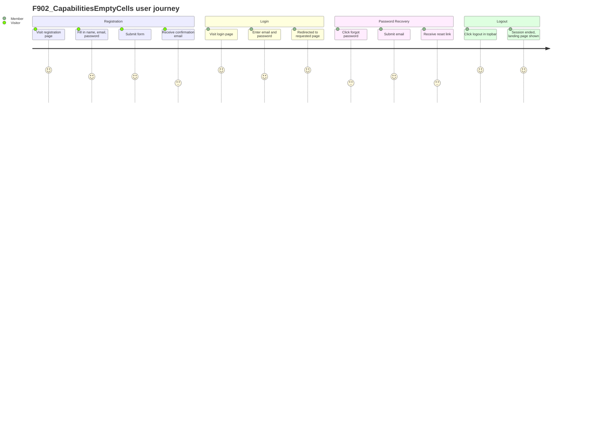

# F902_CapabilitiesEmptyCells

**Priority**: P2
**Type**: ui
**Generated**: migrated

**See also:** [`technical-spec.md`](./technical-spec.md) — endpoints, Source citations, pseudocode, key entities, and DB writes for a Dev/QA/SA audience.

## 1. Overview

**Problem:** Authentication is the gateway to every marketplace activity: buying, selling, messaging, and administering. Without a working login and registration system, no member can participate in the marketplace, and marketplace operators cannot trust that their community is secure.

**Solution:** F902_CapabilitiesEmptyCells covers the full credential-based authentication lifecycle: visitor registration (`POST` /people), email/password login (`POST` /sessions), password reset request (`POST` /sessions/request_new_password), session logout (`DELETE` /sessions/:id), and access-denied display (`GET` /community_memberships/access_denied). Every request passes through `ApplicationController` before_actions that enforce bans, email confirmation, terms consent, and community membership. The feature creates and manages `Person`, `CommunityMembership`, and `Email` records, and enqueues `SendWelcomeEmail`, `EmailConfirmationJob`, and `CommunityJoinedJob` background jobs.

**Scope:**

1. A visitor opens the login or registration page and fills in their details (name, email, password). If the marketplace requires an invitation, they also enter an invite code.
2. The system checks that the email is not already taken in this marketplace and, if the marketplace restricts sign-ups to certain email domains, that the email address is permitted.
3. After submitting, the new member receives a confirmation email with a link. Until they click that link, they cannot access protected marketplace content.
4. Once the confirmation link is clicked, the account is activated and the member is welcomed into the marketplace.
5. An existing member enters their email and password to log in. If the marketplace's terms of service have been updated since the member last accepted them, they are asked to review and accept the new terms before continuing.
6. A member who has forgotten their password submits their email address and receives a password reset link. They click the link, set a new password, and regain access.
7. When a member is done, they click the logout link in the navigation bar. Their session is ended immediately.
8. A member whose account has been banned is shown an access-denied page explaining that they cannot use the marketplace.

**Non-Scope:** None called out.

**Actors**

<!-- carried from the old block:
**Users:**

- **Visitors (not yet registered)** — Sign up for the first time to join the marketplace as a member. They need a simple form to create an account and receive a confirmation email.
- **Registered members** — Log in to access their account, manage listings, and communicate with other members. They also need a way to recover their password if forgotten.
- **Banned members** — Encounter an access-denied screen explaining they cannot use the marketplace.
- **Marketplace admins** — Log in with the same flow but receive additional prompts to visit the admin area after signing in.
-->

| Actor | Description | Primary goal |
|-------|--------------|---------------|

## 2. Functional Capabilities

| ID | Capability | What the user can do | User Stories | Requirements | Business Rules | Screens |
|----|------------|------------------------|---------------|---------------|-----------------|---------|
| CAP-01 |  |  |  |  |  |  |
| CAP-02 |  |  |  |  |  |  |

## 3. Open Decisions

| D### | Decision | Default proposal | Rationale | Blocks work |
|------|----------|-------------------|-----------|--------------|
| D001 | Screen "Access Denied" has no SCR### binding | Bind manually against `generated/screen-list.md`, or confirm the screen no longer exists | No exact or normalized name match in the Screen Index during v26→v27 migration | no |
| D002 | Screen "Homepage / Topbar" has no SCR### binding | Bind manually against `generated/screen-list.md`, or confirm the screen no longer exists | No exact or normalized name match in the Screen Index during v26→v27 migration | no |

## 4. Requirements

### Foundation (0xx)

- **FR-001** Redirect already-logged-in visitors away from login/signup
- **FR-002** Store `session[:return_to]` before redirecting to login
- **FR-003** Terms check on login: if community.consent ≠ user.consent, sign out and redirect to /terms
- **FR-004** Honey-pot spam guard on registration
- **FR-005** Recaptcha validation on registration
- **FR-006** Devise `allow_params_authentication!` before_filter enables form-based authentication
- **FR-007** `session[:return_to]` preserved and honored on successful login
- **FR-008** Password reset token generated via Devise `reset_password_token_if_needed` and mailed
- **FR-009** `sign_out` clears Devise session; `mark_logged_out` sets flash indicator
- **FR-010** Access denied page renders for banned/blocked users

## 5. Business Rules

- After successful Devise authentication, if `community.consent != user.consent` and user is not admin, sign out the user and store temp session vars for deferred acceptance. Redirect to /terms. (BR-001)
- If `community.join_with_invite_only?` or `params[:invitation_code]` present, validate invitation code via `Invitation.code_usable?`. Abort with flash error and redirect on failure. On success, find invitation by code (upcased). (BR-002)
- If `params[:person]` is blank or `params[:person][:input_again]` is present (honey pot field), reject as spam and redirect. (BR-003)
- Email must not be taken in community (`Email.email_available?`) and must be allowed by community (`community.email_allowed?`). Returns HTTP 302 to error_redirect_path with flash[:error] on failure. (BR-004)
- `cannot_access_if_banned` fires on every request. If `@current_user.banned?` (and not global admin), redirect to access_denied_path. SessionsController skips this filter for `destroy` and `confirmation_pending`. (BR-005)
- User is sent to the page they originally requested, or to admin2 path, or to search_path after login. (DEC-001)
- In test/dev environments, registration bypasses email confirmation and redirects directly to search; in production, redirects to confirmation_pending_path. (DEC-002)
- Admin users go to admin2 dashboard; normal users go to return_to or search_path; unauthenticated confirmers go to login. (DEC-003)
- Tracks the community membership status state machine (states: `pending_email_confirmation`, `pending_consent`, `accepted`, `banned`, `deleted_user`) (SM-001)
- Tracks the login form status state machine (SM-002)
- `person_can_join_community_only_once` validation prevents duplicate membership for same person_id + community_id combination. (BR-006)

## 6. Screens

| Screen Name | SCR### | What User Sees | What User Can Do |
|-------------|--------|-----------------|-------------------|
| Login Page | SCR020 | Email and password fields; link to sign up; link to reset password; OAuth provider buttons (if enabled) | Submit credentials; navigate to sign-up; request password reset; click OAuth login buttons |
| Registration Page | SCR021 | Name, email, username, password fields; optional invite code field (invite-only communities) | Fill in and submit the registration form; enter invite code if required |
| Password Reset Request | SCR025 | Single email input field with submit button | Enter registered email address and request a reset link |

### Unbound Screens

These screens were named in the pre-v27 source but could not be bound to a SCR### code during migration. Each has an Open Decision row in § 3.

- **Access Denied** — Message explaining the account cannot access the marketplace *(User can: Read explanation; no action available beyond navigating away.)*
- **Homepage / Topbar** — Logout link in site navigation bar *(User can: Click logout to end the session.)*

### User Journey

1. User arrives at the Login Page and sees the email/password form.
2. If not yet registered, user clicks the sign-up link and arrives at the Registration Page.
3. User fills in their name, email, username, and password; enters an invite code if the marketplace requires one; submits the form.
4. User is taken to the Awaiting Confirmation screen (see F003_EmailConfirmation) and waits for the confirmation email.
5. Alternatively, a returning member enters email and password on the Login Page and submits.
6. On success, the member is redirected to the page they originally requested, or to the marketplace search page.
7. If the marketplace terms have been updated, the member is redirected to the Terms Accept screen (see F004_TermsConsent) before continuing.
8. A member who forgets their password clicks the "forgot password" link on the Login Page, arrives at the Password Reset Request screen, submits their email, and receives a reset link by email.
9. A banned member who attempts to access the marketplace sees the Access Denied screen.
10. A logged-in member clicks the logout link in the topbar and is returned to the marketplace landing page with a confirmation message.

## 7. User Stories

### US020_RegisterAccount — Register a new account

A visitor navigates to the registration page, fills in name, email, username, and password (optionally an invite code for restricted communities), and submits. The system validates uniqueness and community rules, creates a `Person` and `CommunityMembership` (status: `pending_email_confirmation`), enqueues `CommunityJoinedJob`, sends a confirmation email, and redirects to the confirmation-pending page.

**Acceptance Criteria:**
- [ ] Person + Email + CommunityMembership(pending_email_confirmation) created; redirected to confirmation_pending_path
- [ ] flash error shown and redirect back; no records created
- [ ] flash error "email is in use"; redirect to sign_up_path
- [ ] flash error "email not allowed"

### US021_Login — Log in with email and password

A visitor submits email and password. Devise `authenticate_person!` runs against the community-scoped Person. On success, terms-mismatch check fires (BR-001). If terms are stale, user is temporarily signed out and redirected to /terms. Otherwise, session is established and user redirected per return_to chain (DEC-001).

**Acceptance Criteria:**
- [ ] sign_in called, flash notice shown, redirect to return_to or search_path
- [ ] flash.now[:error] = login_failed; form re-rendered
- [ ] session created briefly then `cannot_access_if_banned` redirects to access_denied_path on next request

### US023_RequestPasswordReset — Request a password reset email

A visitor submits their email to `POST` /sessions/request_new_password. The system looks up Person by email JOIN across community members and global admins. If found, generates a reset token and sends `PersonMailer.reset_password_instructions`. If not found, shows "email_not_found" flash (NOTE: this differs from security best practice — the system reveals whether an email exists).

**Acceptance Criteria:**
- [ ] token generated, email sent, flash[:notice] = "password_recovery_sent", redirect to login_path
- [ ] flash[:error] = "email_not_found", redirect to login_path

### US028_Logout — Log out of the current session

A logged-in user clicks the logout link (topbar). `DELETE` /sessions/:id destroys the Devise session via `sign_out`, shuts down Intercom (if admin), sets a logout flash, and redirects to the landing page.

**Acceptance Criteria:**
- [ ] session cleared, flash[:notice] = "logout_successful", redirect to landing_page_path

### US030_ViewAccessDenied — View access-denied page

Members who are banned, in an invite-only community without an invitation, or otherwise blocked are redirected to `GET` /community_memberships/access_denied. The controller renders `access_denied.haml` with no additional logic.

**Acceptance Criteria:**
- [ ] `cannot_access_if_banned` redirects to access_denied_path; access_denied page rendered

## 8. Scenarios

### US020_RegisterAccount — Happy Path

**Given** an open community (join_with_invite_only=false), **When** visitor submits valid registration form, **Then** Person + Email + CommunityMembership(pending_email_confirmation) created; redirected to confirmation_pending_path.

### US020_RegisterAccount — Scenario 2

**Given** invite-only community, **When** visitor submits without valid invite code, **Then** flash error shown and redirect back; no records created.

### US020_RegisterAccount — Scenario 3

**Given** email already taken in community, **When** visitor submits, **Then** flash error "email is in use"; redirect to sign_up_path.

### US020_RegisterAccount — Scenario 4

**Given** community restricts emails to a domain, **When** visitor submits disallowed email, **Then** flash error "email not allowed".

### US021_Login — Happy Path

**Given** active member with correct credentials, **When** `POST` /sessions submitted, **Then** sign_in called, flash notice shown, redirect to return_to or search_path.

### US021_Login — Scenario 2

**Given** wrong password, **When** `POST` /sessions submitted, **Then** flash.now[:error] = login_failed; form re-rendered.

### US021_Login — Scenario 3

**Given** banned member, **When** `POST` /sessions submitted, **Then** session created briefly then `cannot_access_if_banned` redirects to access_denied_path on next request.

### US023_RequestPasswordReset — Happy Path

**Given** registered email in community, **When** `POST` /sessions/request_new_password, **Then** token generated, email sent, flash[:notice] = "password_recovery_sent", redirect to login_path.

### US023_RequestPasswordReset — Scenario 2

**Given** unknown email, **When** `POST` /sessions/request_new_password, **Then** flash[:error] = "email_not_found", redirect to login_path.

### US028_Logout — Happy Path

**Given** logged-in member, **When** `DELETE` /sessions/:id, **Then** session cleared, flash[:notice] = "logout_successful", redirect to landing_page_path.

### US030_ViewAccessDenied — Happy Path

**Given** banned member, **When** any protected page accessed, **Then** `cannot_access_if_banned` redirects to access_denied_path; access_denied page rendered.

## 9. Edge Cases

| Scenario | What Happens | User-Facing Message |
|----------|--------------|----------------------|
| Registration with an email already taken in this marketplace | System aborts account creation and redirects back to the sign-up page | "That email address is already in use. Please use a different one." |
| Registration with an email domain not permitted by this marketplace | System aborts account creation and redirects back to the sign-up page | "That email address is not allowed for this marketplace." |
| Registration with honey-pot field filled (bot detected) | Controller logs an error and redirects back to sign-up; no records created | "Your registration appeared to be spam and was rejected." |
| reCAPTCHA validation fails on registration | System aborts before creating any records; redirects back to sign-up | "We could not verify that you are human. Please try again." |
| Login with incorrect password | Devise authentication fails; form re-rendered with error in place | "Wrong email address or password." |
| Login when community terms have been updated since last acceptance | User is temporarily signed out; redirected to Terms Accept screen | (Terms Accept screen shown — see F004_TermsConsent) |
| Login attempt by a banned member | Session established momentarily; `cannot_access_if_banned` guard fires on next request and redirects to Access Denied screen | "Your account has been suspended. Contact the marketplace admin if you think this is a mistake." |
| Login attempt by a member belonging to a different community (stale cross-community session) | `ensure_user_belongs_to_community` fires; user is automatically signed out | "You have been automatically logged out. Please sign in again." |
| Invalid or already-used invite code on invite-only community registration | Account creation aborted; redirect to sign-up page | "An unexpected error occurred. Please try again or contact support." |
| Password reset request for an unknown email address | System shows an error flash (no email sent) | "We could not find an account with that email address." |
| Logout while already banned or in pending-confirmation state | `destroy` action still completes (ban/confirmation guards skipped for logout) | "You have been logged out successfully." |
| Membership status is `deleted_user` at login | No explicit auth-flow handling confirmed in source; behavior unverified | Unknown — see Unresolved Questions in technical-spec.md |

## 10. Edge Behaviours to Verify

- **FR-001** → — `POST` /people with valid data creates Person + CommunityMembership(pending_email_confirmation) and redirects to confirmation_pending_path
- **FR-001** → — `POST` /sessions with valid credentials sets session and redirects per return_to
- **FR-001** → — Registration with duplicate email shows "email_is_in_use" flash; no new records
- **FR-002** → — `POST` /sessions with valid credentials sets session and redirects per return_to
- **FR-006** → — Login with valid credentials sets session and delivers flash notice
- **FR-007** → — Login with valid credentials sets session and delivers flash notice
- **FR-008** → — Valid email triggers password reset email and success flash
- **FR-009** → — `DELETE` /sessions/:id clears session and redirects to landing page
- **FR-010** → — Banned user accessing any route is redirected to access_denied_path

## 11. Risks & Known Issues

| ID | Type | Description | Impact | Status |
|----|------|--------------|--------|--------|

N/A — none found.

## 12. Dependencies

| Dependency | Type | Why this feature needs it | Evidence |
|------------|------|-----------------------------|----------|

N/A — none found.

## 13. Configuration

N/A — no user-facing configuration constants for this feature.
