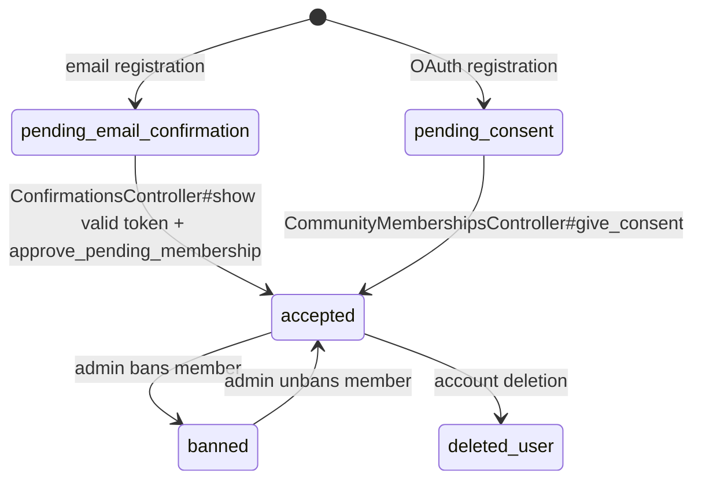
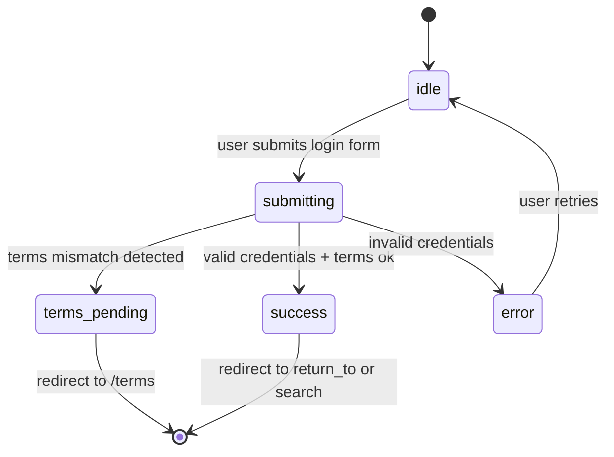

<!-- Contract: references/feature-spec-researcher-contract.md -->

# F903_DuplicateOpenDecisions — Technical Spec

**Priority**: P1
**Type**: mixed
**Generated**: 2026-06-04

## 1. Technical Overview

F903_DuplicateOpenDecisions covers the full credential-based authentication lifecycle: visitor registration (POST /people), email/password login (POST /sessions), password reset request (POST /sessions/request_new_password), session logout (DELETE /sessions/:id), and access-denied display (GET /community_memberships/access_denied). Every request passes through `ApplicationController` before_actions that enforce bans, email confirmation, terms consent, and community membership. The feature creates and manages `Person`, `CommunityMembership`, and `Email` records, and enqueues `SendWelcomeEmail`, `EmailConfirmationJob`, and `CommunityJoinedJob` background jobs.

## 2. Action Index

| # | Action (handler) | Method · Path | Codes | Writes | Detail |
|---|------------------|---------------|-------|--------|--------|
| **A0** | *cross-cutting — belongs to no single action* | — | BR-001, BR-002, BR-003, BR-004, BR-005, BR-006, DEC-001, DEC-002, DEC-003, FR-002, FR-005, FR-006, FR-007, FR-008, FR-009, FR-010, SM-001, SM-002, US020, US020_RegisterAccount, US021, US021_Login, US023, US028, US030 | — | § 4.4 |
| **A1** | `—` | `GET` `/login`,` | FR-001 | — *(read-only)* | § 3.5 |
| **A2** | `—` | `GET` `/signup` | FR-001 | — *(read-only)* | § 3.5 |
| **A3** | `—` | `POST` `/sessions` | FR-003 | — *(no DB write observed)* | § 3.5 |
| **A4** | `—` | `POST` `/people` | FR-004 | — *(no DB write observed)* | § 3.5 |
| **A5** | `—` | `POST` `/sessions/request_new_password` | US023_RequestPasswordReset | — *(no DB write observed)* | § 3.5 |
| **A6** | `—` | `DELETE` `/sessions/:id` | US028_Logout | — *(no DB write observed)* | § 3.5 |
| **A7** | `—` | `GET` `/community_memberships/access_denied` | US030_ViewAccessDenied | — *(read-only)* | § 3.5 |
| **A8** | `SendWelcomeEmail#perform` *(background, no FE)* | queue · `Delayed::Job` | — | — *(no DB write observed)* | § 3.5 |
| **A9** | `CommunityJoinedJob#perform` *(background, no FE)* | queue · `Delayed::Job` | — | — *(no DB write observed)* | § 3.5 |
| **A10** | `UNFILLED#perform` *(background, no FE)* | queue · `Delayed::Job` | — | `{UNFILLED SCAFFOLD}` | § 3.5 |

## 3. Actions

### 3.1 CAP-01 — Sign in with credentials

### 3.2 CAP-02 — Register a new account

### 3.3 CAP-03 — Reset a forgotten password

### 3.4 CAP-04 — Log out of the current session

### 3.5 CAP-05 — View the access-denied notice

#### A1 · Redirect already-logged-in visitors away from login/signup

`GET /login`,` → `—`
`FR-001`

**BE** · **FR-001** Redirect already-logged-in visitors away from login/signup — `GET /login`, `GET /signup` via `SessionsController#new`, `PeopleController#new` [`app/controllers/sessions_controller.rb:15-72`, `app/controllers/people_controller.rb:49-120`, `app/controllers/application_controller.rb:239-248`]
**Result** · — **read-only**.
**Source:** —

---

#### A2 · Redirect already-logged-in visitors away from login/signup

`GET /signup` → `—`
`FR-001`

**Result** · — **read-only**.
**Source:** —

---

#### A3 · Terms check on login: if community.consent ≠ user.consent, sign out and redirect to /terms

`POST /sessions` → `—`
`FR-003`

**BE** · **FR-003** Terms check on login: if community.consent ≠ user.consent, sign out and redirect to /terms — `POST /sessions` via `SessionsController#create` [`app/controllers/sessions_controller.rb:15-72`, `app/controllers/people_controller.rb:49-120`, `app/controllers/application_controller.rb:239-248`]
**Result** · — **no DB write observed**.
**Source:** —

---

#### A4 · Honey-pot spam guard on registration

`POST /people` → `—`
`FR-004`

**BE** · **FR-004** Honey-pot spam guard on registration — `POST /people` via `PeopleController#create` [`app/controllers/sessions_controller.rb:15-72`, `app/controllers/people_controller.rb:49-120`, `app/controllers/application_controller.rb:239-248`]
**Result** · — **no DB write observed**.
**Source:** —

---

#### A5 · Request a password reset email

`POST /sessions/request_new_password` → `—`
`US023_RequestPasswordReset`

**BE** · **US023_RequestPasswordReset** Request a password reset email — `POST /sessions/request_new_password`` (Priority rationale: Without password reset, users who forget their password are permanently locked out.)
**Result** · — **no DB write observed**.
**Source:** —

---

#### A6 · Log out of the current session

`DELETE /sessions/:id` → `—`
`US028_Logout`

**BE** · **US028_Logout** Log out of the current session — `DELETE /sessions/:id`` (Priority rationale: Session security — users on shared devices need a reliable logout.)
**Result** · — **no DB write observed**.
**Source:** —

---

#### A7 · View access-denied page

`GET /community_memberships/access_denied` → `—`
`US030_ViewAccessDenied`

**BE** · **US030_ViewAccessDenied** View access-denied page — `GET /community_memberships/access_denied`` (Priority rationale: P2 — users must understand why they cannot access the marketplace; lower priority than core auth flows.)
**Result** · — **read-only**.
**Source:** —

---

#### A8 · Perform

queue · `Delayed::Job` → `SendWelcomeEmail#perform`

**Result** · — **no DB write observed**.

---

#### A9 · Perform

queue · `Delayed::Job` → `CommunityJoinedJob#perform`

**Result** · — **no DB write observed**.

---

#### A10 · Perform

queue · `Delayed::Job` → `UNFILLED#perform`

**Result** · {UNFILLED SCAFFOLD} `{UNFILLED SCAFFOLD}` {UNFILLED SCAFFOLD} — {UNFILLED SCAFFOLD}
**Source:** {fill via `run_doc_migrations.py --migrate --only a3-b4`}

### 3.6 Edge Cases

| Scenario | Behavior |
|----------|----------|
| Honey-pot field `input_again` filled | HTTP 302 redirect to sign_up_path; flash "registration_considered_spam"; no records created |
| reCAPTCHA validation fails | HTTP 302 redirect to sign_up_path; flash "recaptcha_verification_failure"; PeopleController#create aborts |
| Terms mismatch on login | Devise signs in then immediately signs out; session temps stored; redirect to /terms |
| Invalid invitation code on invite-only community | HTTP 302 redirect to error_redirect_path; flash "unknown_error"; no Person created |

## 4. Shared Foundation

### 4.1 Components

{UNFILLED SCAFFOLD -- no v27.0 predecessor section; list this feature's primary components/services/classes here.}

| Component | Responsibility | File |
|-----------|------------------|------|

### 4.2 Data Model

#### Key Entities

| Entity | Table | Key Columns | Purpose |
|--------|-------|-------------|---------|
| Person | `people` | id, username, given_name, family_name, community_id, is_admin, facebook_id, google_oauth2_id, linkedin_id | Account holder; Devise authenticatable |
| CommunityMembership | `community_memberships` | id, person_id, community_id, status, consent, admin, invitation_id | Tracks membership state within a community; DISC-005 drives access gates |
| Email | `emails` | id, person_id, address, confirmed_at, confirmation_token, community_id | Confirmable email addresses per person per community |
| Community | `communities` | id, ident, join_with_invite_only, consent, private, allowed_emails | Tenant config driving invite/email/terms rules |
| Invitation | `invitations` | id, code, community_id, usages_left | Invite codes consumed at registration |

#### Polymorphic Behavior

##### DISC-005 — CommunityMembership.status

| Value | Render | Validation | Persistence |
|-------|--------|------------|-------------|
| `accepted` | Full site access; all guards pass | No redirect fires | status = "accepted" in DB |
| `pending_email_confirmation` | Redirect to confirmation_pending_path on any protected page | `cannot_access_without_confirmation` fires; redirects unless already has valid email | status set at registration; cleared by ConfirmationsController#show |
| `pending_consent` | Redirect to pending_consent_path | `ensure_consent_given` fires; blocks all non-exempt routes | set by OmniAuth flow; cleared by CommunityMembershipsController#give_consent |
| `banned` | Redirect to access_denied_path | `cannot_access_if_banned` fires; global_admin bypasses | set by admin action; SessionsController skips ban check only on destroy |
| `deleted_user` | unverified — no explicit UI branch found in auth controllers | unverified | DB status; no auth flow path confirmed |

**Source:** `app/models/community_membership.rb:26-32`

##### DISC-004 — Person.is_admin

| Value | Render | Validation | Persistence |
|-------|--------|------------|-------------|
| `0` (regular) | Normal member UI; community-scoped access | All guards apply; community membership required | people.is_admin = 0 |
| `1` (global admin) | Admin badge; cross-community access | Bypasses ban, confirmation, consent, and community membership checks | people.is_admin = 1 |

**Source:** `app/controllers/application_controller.rb:317-351`

### 4.3 State Management

### Tracks the community membership status state machine (states: `pending_email_confirmation`, `pending_consent`, `accepted`, `banned`, `deleted_user`) (SM-001)
**kind:** entity
**Linked FR:** FR-001, FR-002
**Source:** `app/models/community_membership.rb:26-84`
**States:** `pending_email_confirmation`, `pending_consent`, `accepted`, `banned`, `deleted_user`



**Transition rules:**
- `[*] → pending_email_confirmation`: guard = email registration; PeopleController#create sets status
- `[*] → pending_consent`: guard = OAuth registration; OmniauthService#create_person sets status
- `pending_email_confirmation → accepted`: guard = valid token + valid email for community; side effect = SendWelcomeEmail enqueued
- `pending_consent → accepted`: guard = consent=on + valid email + valid invite; side effects = CommunityJoinedJob + SendWelcomeEmail enqueued
- `accepted → banned`: guard = admin action; blocks access on all routes
- `banned → accepted`: guard = admin action; restores access

### Tracks the login form status state machine (SM-002)
**kind:** ui
**Linked FR:** FR-001
**Source:** `app/controllers/sessions_controller.rb:25-73`



| From | To | Guard | Side effect |
|------|----|-------|-------------|
| idle | submitting | form valid | flash.now[:error] set preemptively |
| submitting | success | authenticate_person! succeeds + terms ok | flash[:error]=nil; sign_in; setup_intercom |
| submitting | terms_pending | terms mismatch | sign_out; store session temps |
| submitting | error | authentication fails | flash.now[:error] = login_failed |

### 4.4 Shared Rules

#### Bin 2 — used by ≥2 named actions

#### Bin 3 — cross-cutting, belongs to no single action

**A0 · cross-cutting** — codes with no single-action owner:
- **BR-001** After successful Devise authentication, if `community.consent != user.consent` and user is not admin, sign out the user and store temp session vars for deferred acceptance. Redirect to /terms. — see § 4 capability bucket [`app/controllers/sessions_controller.rb:48-55`]
- **BR-002** If `community.join_with_invite_only?` or `params[:invitation_code]` present, validate invitation code via `Invitation.code_usable?`. Abort with flash error and redirect on failure. On success, find invitation by code (upcased). — see § 4 capability bucket [`app/controllers/people_controller.rb:65-79`]
- **BR-003** If `params[:person]` is blank or `params[:person][:input_again]` is present (honey pot field), reject as spam and redirect. — see § 4 capability bucket [`app/controllers/people_controller.rb:59-63`]
- **BR-004** Email must not be taken in community (`Email.email_available?`) and must be allowed by community (`community.email_allowed?`). Returns HTTP 302 to error_redirect_path with flash[:error] on failure. — see § 4 capability bucket [`app/controllers/people_controller.rb:395-413`]
- **BR-005** `cannot_access_if_banned` fires on every request. If `@current_user.banned?` (and not global admin), redirect to access_denied_path. SessionsController skips this filter for `destroy` and `confirmation_pending`. — see § 4 capability bucket [`app/controllers/application_controller.rb:317-329`]
- **BR-006** `person_can_join_community_only_once` validation prevents duplicate membership for same person_id + community_id combination. — see § 4 capability bucket [`app/models/community_membership.rb:56-59`]
- **DEC-001** User is sent to the page they originally requested, or to admin2 path, or to search_path after login. — guard / render branch [`app/controllers/sessions_controller.rb:59-73`]
- **DEC-002** In test/dev environments, registration bypasses email confirmation and redirects directly to search; in production, redirects to confirmation_pending_path. — guard / render branch [`app/controllers/people_controller.rb:111-120`]
- **DEC-003** Admin users go to admin2 dashboard; normal users go to return_to or search_path; unauthenticated confirmers go to login. — guard / render branch [`app/controllers/confirmations_controller.rb:54-68`]
- **FR-002** Store `session[:return_to]` before redirecting to login — `ApplicationController#ensure_logged_in` [`app/controllers/sessions_controller.rb:15-72`, `app/controllers/people_controller.rb:49-120`, `app/controllers/application_controller.rb:239-248`]
- **FR-005** Recaptcha validation on registration — `POST /people` via `PeopleController#create` [`app/controllers/sessions_controller.rb:15-72`, `app/controllers/people_controller.rb:49-120`, `app/controllers/application_controller.rb:239-248`]
- **FR-006** Devise `allow_params_authentication!` before_filter enables form-based authentication — —
- **FR-007** `session[:return_to]` preserved and honored on successful login — —
- **FR-008** Password reset token generated via Devise `reset_password_token_if_needed` and mailed — —
- **FR-009** `sign_out` clears Devise session; `mark_logged_out` sets flash indicator — —
- **FR-010** Access denied page renders for banned/blocked users — —
- **SM-001** Tracks the community membership status state machine (states: `pending_email_confirmation`, `pending_consent`, `accepted`, `banned`, `deleted_user`) — see § 4 capability bucket [`app/models/community_membership.rb:26-84`]
- **SM-002** Tracks the login form status state machine — see § 4 capability bucket [`app/controllers/sessions_controller.rb:25-73`]
- **US020** — — —
- **US020_RegisterAccount** Register a new account — `POST /people`` (Priority rationale: Registration is the entry gate for all marketplace activity. Without it, no user can transact, list, or message.)
- **US021** — — —
- **US021_Login** Log in with email and password — `POST /sessions`` (Priority rationale: Login is the prerequisite for all authenticated actions — transactions, messaging, profile management.)
- **US023** — — —
- **US028** — — —
- **US030** — — —

**After successful Devise authentication, if `community.consent != user.consent` and user is not admin, sign out the user and store temp session vars for deferred acceptance. Redirect to /terms. (BR-001)**

[UNVERIFIED] carried from **Applies to:** — needs a researcher pass (original: "POST /sessions")

**Linked FR:** FR-003
**Source:** `app/controllers/sessions_controller.rb:48-55`
**Applies to:** POST /sessions

**Pseudocode:**
```ruby
unless @current_user.is_admin? || community.consent == @current_user.consent
  sign_out @current_user
  session[:temp_cookie] = "pending acceptance of new terms"
  session[:temp_person_id] = @current_user.id
  session[:temp_community_id] = @current_community.id
  session[:consent_changed] = true
  redirect_to terms_path
end
```

**If `community.join_with_invite_only?` or `params[:invitation_code]` present, validate invitation code via `Invitation.code_usable?`. Abort with flash error and redirect on failure. On success, find invitation by code (upcased). (BR-002)**

[UNVERIFIED] carried from **Applies to:** — needs a researcher pass (original: "POST /people")

**Linked FR:** FR-004
**Source:** `app/controllers/people_controller.rb:65-79`
**Applies to:** POST /people

**Pseudocode:**
```ruby
if community.join_with_invite_only? || params[:invitation_code]
  unless Invitation.code_usable?(params[:invitation_code], community)
    flash[:error] = t("layouts.notifications.unknown_error")
    redirect_to error_redirect_path and return
  end
  invitation = Invitation.find_by_code(params[:invitation_code].upcase)
end
```

**If `params[:person]` is blank or `params[:person][:input_again]` is present (honey pot field), reject as spam and redirect. (BR-003)**

[UNVERIFIED] carried from **Applies to:** — needs a researcher pass (original: "POST /people")

**Linked FR:** FR-004
**Source:** `app/controllers/people_controller.rb:59-63`
**Applies to:** POST /people

**Pseudocode:**
```ruby
if params[:person].blank? || params[:person][:input_again].present?
  flash[:error] = t("layouts.notifications.registration_considered_spam")
  redirect_to error_redirect_path and return
end
```

**Email must not be taken in community (`Email.email_available?`) and must be allowed by community (`community.email_allowed?`). Returns HTTP 302 to error_redirect_path with flash[:error] on failure. (BR-004)**

[UNVERIFIED] carried from **Applies to:** — needs a researcher pass (original: "POST /people")

**Linked FR:** FR-005
**Source:** `app/controllers/people_controller.rb:395-413`
**Applies to:** POST /people

**Pseudocode:**
```ruby
unless Email.email_available?(email, community.id)
  flash[:error] = t("people.new.email_is_in_use")
  redirect_to error_redirect_path; return true
end
unless community.email_allowed?(email)
  flash[:error] = t("people.new.email_not_allowed")
  redirect_to error_redirect_path; return true
end
```

**`cannot_access_if_banned` fires on every request. If `@current_user.banned?` (and not global admin), redirect to access_denied_path. SessionsController skips this filter for `destroy` and `confirmation_pending`. (BR-005)**

[UNVERIFIED] carried from **Applies to:** — needs a researcher pass (original: "All non-exempt actions for logged-in users")

**Linked FR:** FR-002
**Source:** `app/controllers/application_controller.rb:317-329`
**Applies to:** All non-exempt actions for logged-in users

**Pseudocode:**
```ruby
def cannot_access_if_banned
  return unless @current_user
  return if @current_user.is_admin?
  redirect_to access_denied_path if @current_user.banned?
end
```

**`person_can_join_community_only_once` validation prevents duplicate membership for same person_id + community_id combination. (BR-006)**

[UNVERIFIED] carried from **Applies to:** — needs a researcher pass (original: "CommunityMembership.create")

**Linked FR:** FR-001
**Source:** `app/models/community_membership.rb:56-59`
**Applies to:** CommunityMembership.create

**Pseudocode:**
```ruby
def person_can_join_community_only_once
  if CommunityMembership.find_by_person_id_and_community_id(person_id, community_id)
    errors.add(:base, "You are already a member of this community")
  end
end
```

**State transitions:** SM-001 — `[*] → pending_email_confirmation` on successful registration

**Verification:**
- **SC-005** — Registration with duplicate email shows "email_is_in_use" flash; no new records (covers FR-001, BR-004, BR-006)
- **SC-006** — Honey-pot field filled triggers "registration_considered_spam" flash and redirect (covers BR-003)

---
**Linked US:** US020_RegisterAccount

**User is sent to the page they originally requested, or to admin2 path, or to search_path after login. (DEC-001)**

[UNVERIFIED] no resolvable owner — needs a researcher pass

**subtype:** flow
**Triggers in:** SCR020_LoginPage — `POST /sessions` form submit
**Involved entities:** Session[:return_to], Session[:return_to_content]
**Source:** `app/controllers/sessions_controller.rb:59-73`

```ruby
controller_hash = routes.recognize_path(session[:return_to] || session[:return_to_content])
going_to_admin = controller_hash[:controller].to_s.start_with?('admin2')
flash[:notice] = "#{login_msg}#{admin_rights && !going_to_admin ? visit_admin_msg : ''}"
if session[:return_to]
  redirect_to session[:return_to]; session[:return_to] = nil
elsif session[:return_to_content]
  redirect_to session[:return_to_content]; session[:return_to_content] = nil
else
  redirect_to search_path
end
```

**In test/dev environments, registration bypasses email confirmation and redirects directly to search; in production, redirects to confirmation_pending_path. (DEC-002)**

[UNVERIFIED] no resolvable owner — needs a researcher pass

**subtype:** flow
**Triggers in:** SCR021_SignupPage — POST /people success
**Involved entities:** APP_CONFIG.skip_email_confirmation
**Source:** `app/controllers/people_controller.rb:111-120`

```ruby
if APP_CONFIG.skip_email_confirmation
  email.confirm!
  redirect_to search_path
else
  Email.send_confirmation(email, @current_community)
  flash[:notice] = t("...account_creation_succesful_you_still_need_to_confirm_your_email")
  redirect_to confirmation_pending_path
end
```

**Admin users go to admin2 dashboard; normal users go to return_to or search_path; unauthenticated confirmers go to login. (DEC-003)**

[UNVERIFIED] no resolvable owner — needs a researcher pass

**subtype:** flow
**Triggers in:** SCR022_EmailConfirmation — GET /people/confirmation callback
**Involved entities:** Person.has_admin_rights?, Session[:return_to]
**Source:** `app/controllers/confirmations_controller.rb:54-68`

```ruby
if @current_user&.has_admin_rights?(@current_community)
  redirect_to admin2_path
elsif @current_user
  redirect_to session[:return_to] || search_path
else
  redirect_to login_path
end
```

**Carried User Story Narratives**

- **US021_Login:** [UNVERIFIED] carried from technical-spec §User Stories — A visitor submits email and password. Devise `authenticate_person!` runs against the community-scoped Person. On success, terms-mismatch check fires (BR-001). If terms are stale, user is temporarily signed out and redirected to /terms. Otherwise, session is established and user redirected per return_to chain (DEC-001).
- **US023_RequestPasswordReset:** [UNVERIFIED] carried from technical-spec §User Stories — A visitor submits their email to POST /sessions/request_new_password. The system looks up Person by email JOIN across community members and global admins. If found, generates a reset token and sends `PersonMailer.reset_password_instructions`. If not found, shows "email_not_found" flash (NOTE: this differs from security best practice — the system reveals whether an email exists).
- **US028_Logout:** [UNVERIFIED] carried from technical-spec §User Stories — A logged-in user clicks the logout link (topbar). DELETE /sessions/:id destroys the Devise session via `sign_out`, shuts down Intercom (if admin), sets a logout flash, and redirects to the landing page.
- **US030_ViewAccessDenied:** [UNVERIFIED] carried from technical-spec §User Stories — Members who are banned, in an invite-only community without an invitation, or otherwise blocked are redirected to GET /community_memberships/access_denied. The controller renders `access_denied.haml` with no additional logic.

### 4.5 Algorithms & Integrations

### Looks up Person by email join (handles both community members and global admins). If found, calls `person.reset_password_token_if_needed` and sends `PersonMailer.reset_password_instructions`. If not found, shows error flash (intentionally NOT a security-safe "always success" pattern — user-visible difference exists). (ALG-001)
**Linked FR:** FR-002
**Source:** `app/controllers/sessions_controller.rb:91-106`
**Input:** `params[:email]` (string)
**Output:** redirect to login_path with flash notice/error
**Complexity:** O(1) — single DB query
**Description:** Looks up Person by email join (handles both community members and global admins). If found, calls `person.reset_password_token_if_needed` and sends `PersonMailer.reset_password_instructions`. If not found, shows error flash (intentionally NOT a security-safe "always success" pattern — user-visible difference exists).

**Pseudocode:**
```ruby
person = Person.joins("LEFT OUTER JOIN emails ...").where(email: params[:email], cid: community.id).first
if person
  token = person.reset_password_token_if_needed
  MailCarrier.deliver_later(PersonMailer.reset_password_instructions(person, email, token, community))
  flash[:notice] = t("password_recovery_sent")
else
  flash[:error] = t("email_not_found")
end
redirect_to login_path
```

### Sends queue job to `SendWelcomeEmail` delayed_job → PersonMailer#welcome_email (INT-001)
**Linked FR:** FR-001
**Source:** `app/controllers/confirmations_controller.rb:47-48`, `app/controllers/community_memberships_controller.rb:72`
**Type:** queue-job
**Target:** `SendWelcomeEmail` delayed_job → PersonMailer#welcome_email
**Trigger:** After email confirmation approved OR after give_consent completes
**Payload:** person.id, community.id
**Failure handling:** delayed_job retry; no compensating action — email may not be sent on failure

### Sends queue job (synchronous `Email.send_confirmation` call enqueuing job) to `EmailConfirmationJob` → PersonMailer#email_confirmation (INT-002)
**Linked FR:** FR-001
**Source:** `app/controllers/people_controller.rb:116`, `app/controllers/confirmations_controller.rb:97-98`
**Type:** queue-job (synchronous `Email.send_confirmation` call enqueuing job)
**Target:** `EmailConfirmationJob` → PersonMailer#email_confirmation
**Trigger:** At registration (unless skip_email_confirmation) or resend
**Payload:** email record, community
**Failure handling:** User can resend via ConfirmationsController#create

### Sends queue job to `CommunityJoinedJob` → PersonMailer (admin notification) + AnalyticService (INT-003)
**Linked FR:** FR-001
**Source:** `app/controllers/people_controller.rb:105`, `app/controllers/community_memberships_controller.rb:71`
**Type:** queue-job
**Target:** `CommunityJoinedJob` → PersonMailer (admin notification) + AnalyticService
**Trigger:** After registration (PeopleController) or consent given (CommunityMembershipsController)
**Payload:** person.id, community.id
**Failure handling:** delayed_job retry; no compensating action

### 4.6 Configuration

{UNFILLED SCAFFOLD -- no v27.0 predecessor section; confirm technical configuration (env vars, feature-flag keys, timeouts) against source.}

N/A — no technical configuration beyond framework defaults.

**Client behavior:** see
[`behavior-logic.md`](../../docs/generated/behavior-logic.md) (client-side patterns — debounce, optimistic UI, polling, upload, realtime),
[`permissions.md`](../../docs/system/permissions.md) (feature flags / experiments / env / locale gates),
[`architecture.md`](../../docs/system/architecture.md) (guards / deep-link state restoration / unsaved-changes protection).

## 5. Verification & Technical Notes

### 5.1 Technical Verification

- **SC-001** — POST /people with valid data creates Person + CommunityMembership(pending_email_confirmation) and redirects to confirmation_pending_path (covers FR-001, BR-002, BR-003, BR-004)
- **SC-002** — POST /sessions with valid credentials sets session and redirects per return_to (covers FR-001, FR-002, BR-001)
- **SC-003** — POST /sessions with banned user membership redirects to access_denied_path (covers BR-005)
- **SC-004** — GET /community_memberships/access_denied renders access denied page (covers US030)

---

**Client behavior:** see
[`behavior-logic.md`](../../generated/behavior-logic.md) (client-side patterns — debounce, optimistic UI, polling, upload, realtime),
[`permissions.md`](../../system/permissions.md) (feature flags / experiments / env / locale gates),
[`screen-flow.md`](../../generated/screen-flow.md) (guards / deep-link state restoration / unsaved-changes protection).

#### US020_RegisterAccount

**Independent Test:** Submit the registration form with a fresh email on an open community → verify CommunityMembership row created with status=pending_email_confirmation and confirmation email delivered.

**Acceptance Scenarios:**

1. **Given** an open community (join_with_invite_only=false), **When** visitor submits valid registration form, **Then** Person + Email + CommunityMembership(pending_email_confirmation) created; redirected to confirmation_pending_path.
2. **Given** invite-only community, **When** visitor submits without valid invite code, **Then** flash error shown and redirect back; no records created.
3. **Given** email already taken in community, **When** visitor submits, **Then** flash error "email is in use"; redirect to sign_up_path.
4. **Given** community restricts emails to a domain, **When** visitor submits disallowed email, **Then** flash error "email not allowed".

#### US021_Login

**Independent Test:** Submit login with valid credentials → verify session cookie set and redirect to search_path (or stored return_to).

**Acceptance Scenarios:**

1. **Given** active member with correct credentials, **When** POST /sessions submitted, **Then** sign_in called, flash notice shown, redirect to return_to or search_path.
2. **Given** wrong password, **When** POST /sessions submitted, **Then** flash.now[:error] = login_failed; form re-rendered.
3. **Given** banned member, **When** POST /sessions submitted, **Then** session created briefly then `cannot_access_if_banned` redirects to access_denied_path on next request.

**Rules enforced:** BR-001 (see Cross-Cutting), BR-005 (see Cross-Cutting)

**State transitions:** SM-002 — submitting → success/error/terms_pending

**Verification:**

- **SC-007** — Login with valid credentials sets session and delivers flash notice (covers FR-006, FR-007)
- **SC-008** — Login with terms mismatch signs out user and redirects to /terms (covers BR-001)

---

#### US023_RequestPasswordReset

**Independent Test:** Submit a registered email → verify flash notice shown and reset email enqueued.

**Acceptance Scenarios:**

1. **Given** registered email in community, **When** POST /sessions/request_new_password, **Then** token generated, email sent, flash[:notice] = "password_recovery_sent", redirect to login_path.
2. **Given** unknown email, **When** POST /sessions/request_new_password, **Then** flash[:error] = "email_not_found", redirect to login_path.

**Rules enforced:** PERM001 applies (public screen, no auth required)

**Verification:**

- **SC-009** — Valid email triggers password reset email and success flash (covers FR-008)
- **SC-010** — Unknown email shows error flash (no email sent) — potential security info-leak

---

#### US028_Logout

**Independent Test:** DELETE /sessions/:id while logged in → verify session cookie cleared and redirect to landing_page_path.

**Acceptance Scenarios:**

1. **Given** logged-in member, **When** DELETE /sessions/:id, **Then** session cleared, flash[:notice] = "logout_successful", redirect to landing_page_path.

**Rules enforced:** SessionsController skips banned/confirmation/consent/community checks for `destroy` (lines 5-8) — logout always works even for banned users.

**Verification:**

- **SC-011** — DELETE /sessions/:id clears session and redirects to landing page (covers FR-009)

---

#### US030_ViewAccessDenied

**Independent Test:** GET /community_memberships/access_denied while banned → verify access_denied page rendered.

**Acceptance Scenarios:**

1. **Given** banned member, **When** any protected page accessed, **Then** `cannot_access_if_banned` redirects to access_denied_path; access_denied page rendered.

**Verification:**

- **SC-012** — Banned user accessing any route is redirected to access_denied_path (covers FR-010, BR-005)

---

### 5.2 Assumptions

- `community.consent` and `user.consent` are compared as plain strings; no versioning schema beyond the string value observed in source.
- `Email.email_available?` scopes uniqueness per community_id, allowing the same email address across different communities.
- `reset_password_token_if_needed` is a Devise extension method; token expiry window is controlled by Devise configuration not directly visible in controller source.
- `mark_logged_out` helper on SessionsController#destroy is not visible in the reviewed source files; assumed to set a flash indicator.

### 5.3 Unresolved Questions

1. **Password reset security**: `request_new_password` reveals whether an email exists (flash[:error] vs flash[:notice] branch). Intentional design or oversight? Upstream Devise behavior would show success either way.
2. **`mark_logged_out` method**: Referenced in `SessionsController#destroy` but not found in the reviewed source. May be in ApplicationController or a concern not read.
3. **`email.confirm!` path**: When `APP_CONFIG.skip_email_confirmation = true`, `email.confirm!` is called. No enrollment of `CommunityJoinedJob` or `SendWelcomeEmail` is visible in this path — unclear if these are skipped intentionally.
4. **deleted_user status**: DISC-005 includes `deleted_user` but no auth-flow code path for this status was found in session/registration controllers.

### 5.4 Source References

| Action | Symbol | Path | Purpose |
|--------|--------|------|---------|
| — | `SessionsController` | `app/controllers/sessions_controller.rb:1-116` | Login, logout, password reset |
| — | `PeopleController` | `app/controllers/people_controller.rb:1-120, 271-413` | Registration, new_person helper, email validation |
| — | `CommunityMembershipsController` | `app/controllers/community_memberships_controller.rb:1-271` | Access denied, pending_consent, confirmation_pending |
| — | `ApplicationController` (guards) | `app/controllers/application_controller.rb:186-351` | All auth before_actions |
| — | `CommunityMembership` | `app/models/community_membership.rb:1-85` | VALID_STATUSES, scopes, state predicates |
| — | `Persons::OmniauthService` | `app/services/persons/omniauth_service.rb:1-272` | OAuth person lookup and create |
| — | `ConfirmationsController` | `app/controllers/confirmations_controller.rb:1-104` | Email confirmation token handling |

### 5.5 Artifact References

| Artifact | File | Codes Used | Reviewed |
|----------|------|------------|----------|
| System Overview | [system-overview.md](../../system-overview.md) | — | [x] |
| Feature List | [feature-list.md](../../feature-list.md) | F903_DuplicateOpenDecisions | [x] |
| Screen Flow | `docs/generated/screen-flow.md` | N/A | Yes |
| User Stories | [user-stories.md](../../user-stories.md) | US020, US021, US023, US028, US030 | [x] |
| Screens | [screen-list.md](../../screen-list.md) | SCR020, SCR021, SCR025, SCR028, SCR001 | [x] |
| Entities | [data-model.md](../../data-model.md) | MODEL001, MODEL002, MODEL003 (CommunityMembership), DISC-004, DISC-005 | [x] |
| Permissions Matrix | [permissions-matrix.md](../../permissions-matrix.md) | PERM001, PERM002, PERM005, PERM006, PERM007, PERM008, PERM009, PERM010 | [x] |
| Behavior Logic | [behavior-logic.md](../../behavior-logic.md) | BL006, BL013, BL027 | [x] |
| Route List | [route-list.md](../../route-list.md) | POST /people, POST /sessions, DELETE /sessions/:id, POST /sessions/request_new_password | [x] |

## Source Walkthrough

{UNFILLED SCAFFOLD -- this reading list has not been authored yet; it requires reading the feature's source. Fill it by running `run_doc_migrations.py --migrate --only a3-b4`.}

## DB Impact per Event

| Action | Event/Endpoint | Table | Columns | Operation | Value Derivation | Source |
|--------|----------------|-------|---------|-----------|------------------|--------|
| A10 | {UNFILLED SCAFFOLD} | {UNFILLED SCAFFOLD} | {UNFILLED SCAFFOLD} | {UNFILLED SCAFFOLD} | {UNFILLED SCAFFOLD} | {fill via `run_doc_migrations.py --migrate --only a3-b4`} |
