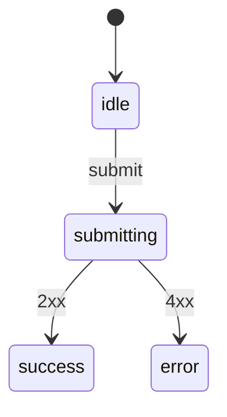

# F001_Auth

**Priority**: P2
**Type**: ui
**Generated**: 2026-01-01

## Overview

Authentication lets a registered user sign in with an email and a password, then reach their saved orders.

## Polymorphic Behavior

None.

## Cross-Cutting Logic

**Client behavior:** see behavior-logic.md, permissions.md, screen-flow.md (all N/A for this fixture).

### Requirements

| Code | Description | Endpoint/Handler | Verifiable |
|------|-------------|------------------|------------|
| FR-001 | The system stores a hashed password for every account. | AuthService.hash | yes |
| FR-101 | A user reaches the login form from the site header. | LoginController.show | yes |
| FR-201 | The login screen accepts an email and a password. | LoginController.submit | yes |

### Business Rules

See the rule blocks below.

### BR-001_PasswordComplexity
**Rule:** A password must be at least 8 characters long.
**Linked FR:** FR-001
**Source:** `app/Services/AuthService.php:20-28`
**Applies to:** account creation

**Pseudocode:**
```text
if len(password) < 8:
    reject()
```

### Decision Logic

See the decision blocks below.

#### DEC-001_LockAccountRedirect
**subtype:** flow
**Triggers in:** SCR001_Login submit
**Involved entities:** Account.failed_attempts
**Source:** `app/Http/Controllers/LoginController.php:40-55`
**user_visible_outcome:** After five failed attempts the user is redirected to a locked-account page.

**Pseudocode:**
```text
if account.failed_attempts >= 5:
    redirect(locked_page)
```

### State Machines

See the state-machine blocks below.

### SM-001_LoginFormSubmission
**kind:** ui
**Linked FR:** FR-201
**Source:** `web/src/pages/Login.vue:10-60`
**States:** idle, submitting, success, error



### Algorithms

None.

### External Integrations

None.

### Verification

- **SC-001** password hash always stored (covers FR-001, BR-001)
- **SC-002** account locks after five failures (covers FR-201, DEC-001, SM-001)

---

**Client behavior:** see behavior-logic.md, permissions.md, architecture.md.

## User Stories

### US001_SignIn — Sign in with email and password (Priority: P1)

**What happens:** A registered user enters their email and password and, if correct, reaches the dashboard.
**Why this priority:** Sign-in gates every other feature in the product.
**Independent Test:** Submit valid credentials and confirm the dashboard loads.

**Acceptance Scenarios:**

1. **Given** a registered user with a correct password, **When** they submit the login form, **Then** they land on the dashboard.
2. **Given** a user who has failed five times, **When** they submit again, **Then** they are redirected to the locked-account page.

**Requirements fulfilled:**
- **FR-001** The system stores a hashed password for every account. — `POST /auth/register` via `AuthService::hash`
  **Source:** `app/Services/AuthService.php:20-28`
- **FR-101** A user reaches the login form from the site header. — `GET /login` via `LoginController::show`
  **Source:** `app/Http/Controllers/LoginController.php:10-18`
- **FR-201** The login screen accepts an email and a password. — `POST /login` via `LoginController::submit`
  **Source:** `app/Http/Controllers/LoginController.php:40-55`

**Rules enforced:**

### BR-001_PasswordComplexity
**Rule:** A password must be at least 8 characters long.
**Linked FR:** FR-001
**Source:** `app/Services/AuthService.php:20-28`
**Applies to:** account creation

**Pseudocode:**
```text
if len(password) < 8:
    reject()
```

**State transitions:** SM-001 (see above)

**Verification:**
- **SC-001** password hash always stored (covers FR-001, BR-001)
- **SC-002** account locks after five failures (covers FR-201, DEC-001, SM-001)

---

### Edge Cases

| Scenario | Behavior |
|----------|----------|
| Empty password submitted | HTTP 422: `password_required` |
| Wrong password submitted five times | account locked, redirect to locked page |
| Unknown email submitted | HTTP 401: `invalid_credentials` |

## Key Entities

| Entity | Table | Key Columns | Purpose |
|--------|-------|-------------|---------|
| Account | `accounts` | id, email, password_hash, failed_attempts | stores credentials and lockout state |

## Artifact References

| Artifact | File | Codes Used | Reviewed |
|----------|------|------------|----------|
| System Overview | [system-overview.md](../../docs/system/system-overview.md) | — | [x] |

## Assumptions

- Password hashing uses the framework default algorithm.
- Lockout duration is not configurable per account.

## Source Code References

| Order | Symbol | Path | Purpose |
|-------|--------|------|---------|
| 1 | Account | `app/Models/Account.php:1-20` | entity definition |
| 2 | LoginController | `app/Http/Controllers/LoginController.php:1-60` | handles sign-in requests |

## Unresolved Questions

1. **Lockout duration**: the exact number of minutes an account stays locked is not confirmed from source.
