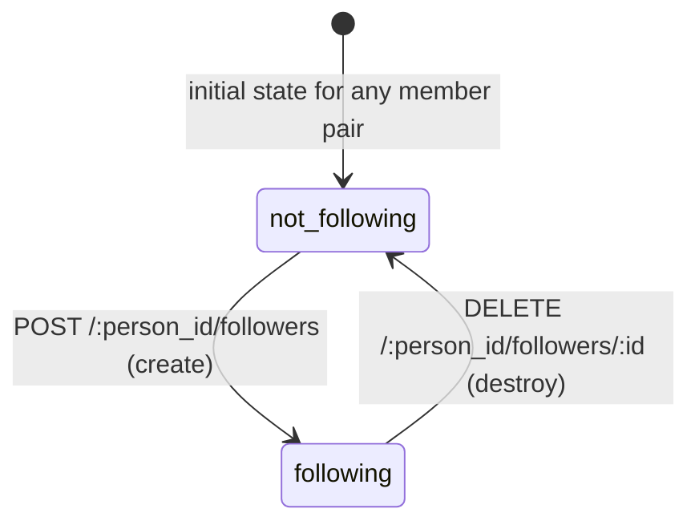
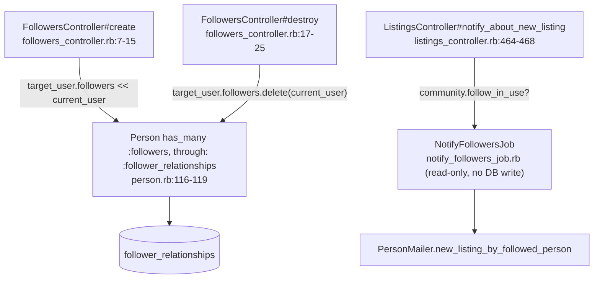

<!-- Contract: references/feature-spec-researcher-contract.md -->

# F010_FollowSystem — Technical Spec

**Priority**: P3
**Type**: mixed
**Generated**: 2026-06-04

## Overview

F010 allows logged-in members to follow and unfollow other sellers. Follow creates a `FollowerRelationship` record; unfollow destroys it. Both operations are gated by `community.follow_in_use?` and login. The background side: when a new listing is published and `follow_in_use?` is true, `NotifyFollowersJob` is enqueued with a 30-minute delay (priority 12) to send `new_listing_by_followed_person` emails to all opted-in followers of the author. All follow/unfollow actions use `FollowersController` and respond to both HTML and JS (AJAX partial re-render of the follow button).

## Polymorphic Behavior

N/A — no discriminator fields in Key Entities.

## Cross-Cutting Logic

### Requirements

| Code | Description | Endpoint/Handler | Verifiable |
|------|-------------|------------------|------------|
| FR-001 | Create follow relationship | POST /:person_id/followers → `FollowersController#create` | yes |
| FR-002 | Destroy follow relationship | DELETE /:person_id/followers/:id → `FollowersController#destroy` | yes |
| FR-003 | Render follow button partial (AJAX) after create/destroy | JS format → renders `people/follow_button` partial | yes |
| FR-004 | Notify followers of new listing via background job | `NotifyFollowersJob` enqueued from `ListingsController#notify_about_new_listing` | yes |

**Source:** `app/controllers/followers_controller.rb:1-27`, `app/controllers/listings_controller.rb:464-468`, `app/jobs/notify_followers_job.rb:1-43`

### Business Rules

None.


### `ensure_logged_in` before_action. Unauthenticated requests are redirected to login with "you must log in to view this content". (BR-001)
**Linked FR:** FR-001, FR-002
**Source:** `app/controllers/followers_controller.rb:3-5`
**Applies to:** POST and DELETE /:person_id/followers

**Pseudocode:**
```ruby
before_action do
  ensure_logged_in t("layouts.notifications.you_must_log_in_to_view_this_content")
end
```

### `follower_id` validates `exclusion: { in: lambda { |x| [x.person_id] } }`. A person cannot follow themselves; the DB-level validation rejects self-referential records. (BR-002)
**Linked FR:** FR-001
**Source:** `app/models/follower_relationship.rb:27-28`
**Applies to:** FollowerRelationship creation

**Pseudocode:**
```ruby
validates :follower_id,
  exclusion: { in: lambda { |x| [x.person_id] } }
```

### DB UNIQUE index on `(person_id, follower_id)` prevents duplicate follow relationships. Model-level `uniqueness: { scope: :person_id }` adds an AR-level guard. (BR-003)
**Linked FR:** FR-001
**Source:** `app/models/follower_relationship.rb:23-28`, schema line 15
**Applies to:** FollowerRelationship creation

**Pseudocode:**
```ruby
validates :follower_id, uniqueness: { scope: :person_id }
# DB: UNIQUE INDEX on (person_id, follower_id)
```

### The follow feature is gated by `community.follow_in_use?` (boolean, default true). When false: follow button not shown, `NotifyFollowersJob` not enqueued, and `email_about_new_listings_by_followed_people` is removed from valid notification types. (BR-004)
**Linked FR:** FR-001, FR-002, FR-004
**Source:** `app/controllers/listings_controller.rb:466`, `app/models/community.rb:695-698`
**Applies to:** Follow button display and notification dispatch

**Pseudocode:**
```ruby
# In ListingsController#notify_about_new_listing:
if community.follow_in_use? && !listing.approval_pending?
  Delayed::Job.enqueue(NotifyFollowersJob.new(...), run_at: 30.minutes.from_now, priority: 12)
end
# In Community#email_notification_types:
valid_types.delete('email_about_new_listings_by_followed_people') unless follow_in_use?
```

### Only followers who are members of the community AND have `preferences["email_about_new_listings_by_followed_people"] == true` receive the notification email. Followers who have opted out of this notification type are skipped. (BR-005)
**Linked FR:** FR-004
**Source:** `app/jobs/notify_followers_job.rb:25-29`
**Applies to:** `NotifyFollowersJob#perform`

**Pseudocode:**
```ruby
author.followers.members_of(community).select do |follower|
  follower.preferences["email_about_new_listings_by_followed_people"]
end
```

### If the listing is closed or the author no longer exists when the job runs, the job aborts silently. This handles the 30-minute delay window during which a listing could be closed before notifications fire. (BR-006)
**Linked FR:** FR-004
**Source:** `app/jobs/notify_followers_job.rb:15-16`
**Applies to:** `NotifyFollowersJob#perform`

**Pseudocode:**
```ruby
def perform
  return if !listing || listing.closed? || !author
  # proceed with notifications
end
```

### Job is scheduled with `run_at: NotifyFollowersJob::DELAY.from_now` (30 minutes). This prevents notification spam if a seller immediately edits or closes a new listing. (BR-007)
**Linked FR:** FR-004
**Source:** `app/jobs/notify_followers_job.rb:3`, `app/controllers/listings_controller.rb:467`
**Applies to:** `NotifyFollowersJob` enqueue

**Pseudocode:**
```ruby
DELAY = 30.minutes
Delayed::Job.enqueue(job, run_at: DELAY.from_now, priority: 12)
```

### Decision Logic

#### Button shows "Follow" if not following, "Following/Unfollow" if already following, or is hidden entirely if follow feature is disabled or user is viewing their own profile. (DEC-001)
**subtype:** render
**Triggers in:** SCR040_PublicProfile — profile page render / follow button AJAX response
**Involved entities:** Community.follow_in_use, current_user (present/nil), FollowerRelationship (exists for current_user → target)
**Source:** `app/controllers/followers_controller.rb:11-14`, community flag `app/models/community.rb:87`

```pseudo
if !community.follow_in_use? OR !current_user OR current_user == target_user
  show_button = false
elsif current_user follows target_user
  render "Following" / "Unfollow" button (DELETE action)
else
  render "Follow" button (POST action)
end
```

### State Machines

None.


### Tracks the follow relationship state state machine (states: not_following, following) (SM-001)
**kind:** entity
**Linked FR:** FR-001, FR-002
**Source:** `app/controllers/followers_controller.rb:7-25`, `app/models/follower_relationship.rb:18-29`

**States:** not_following, following



| From | To | Guard | Side effect |
|------|----|-------|-------------|
| not_following | following | logged in; not self; community.follow_in_use?; no duplicate | FollowerRelationship record created; follow button re-rendered |
| following | not_following | logged in; relationship exists | FollowerRelationship destroyed; follow button re-rendered |

### Algorithms

None.

### External Integrations

None.


### Sends queue job to `Delayed::Job` → `NotifyFollowersJob` → `PersonMailer.new_listing_by_followed_person` (INT-001)
**Linked FR:** FR-004
**Source:** `app/jobs/notify_followers_job.rb:1-43`, `app/controllers/listings_controller.rb:466-468`
**Type:** queue-job
**Target:** `Delayed::Job` → `NotifyFollowersJob` → `PersonMailer.new_listing_by_followed_person`
**Trigger:** New listing published when `community.follow_in_use?` and listing not in approval_pending state
**Payload:** `listing_id, community_id`; scheduled 30 minutes in future, priority 12
**Failure handling:** Job aborts if listing or author not found at run time; `DelayedAirbrakeNotification` notifies on exception; no retry logic visible in source

**Pseudocode:**
```ruby
# Enqueue (ListingsController#notify_about_new_listing):
Delayed::Job.enqueue(
  NotifyFollowersJob.new(listing.id, community.id),
  run_at: 30.minutes.from_now, priority: 12
)
# Perform (NotifyFollowersJob):
return if !listing || listing.closed? || !author
followers_to_notify.each do |follower|
  MailCarrier.deliver_now(PersonMailer.new_listing_by_followed_person(listing, follower, community))
end
```

### Verification

- **SC-001** — Logged-in member follows another; `FollowerRelationship` record created; button re-renders as "Following" (covers FR-001, SM-001)
- **SC-002** — Member unfollows; relationship destroyed; button re-renders as "Follow" (covers FR-002, SM-001)
- **SC-003** — Member tries to follow self; validation rejects with error (covers BR-002)
- **SC-004** — Second follow attempt returns duplicate validation error (covers BR-003)
- **SC-005** — When community.follow_in_use=false, follow button not shown; NotifyFollowersJob not enqueued on listing create (covers BR-004)
- **SC-006** — Follower with preference off receives no notification email (covers BR-005)
- **SC-007** — Listing closed before 30-minute delay expires; job aborts without sending emails (covers BR-006, BR-007)

---

**Client behavior:** see
[`behavior-logic.md`](../../generated/behavior-logic.md) (client-side patterns — debounce, optimistic UI, polling, upload, realtime),
[`permissions.md`](../../system/permissions.md) (feature flags / experiments / env / locale gates),
[`screen-flow.md`](../../generated/screen-flow.md) (guards / deep-link state restoration / unsaved-changes protection).

## User Stories

### US015_FollowSeller — Follow a seller (Priority: P3)

**What happens:** A logged-in member on a seller's public profile clicks the "Follow" button. A POST to `/:person_id/followers` is made. `FollowersController#create` finds the target user, appends `@current_user` to `target_user.followers`, and responds with HTML redirect or JS partial re-render of the follow button.
**Why this priority:** Social feature; drives retention but not core transaction flow.
**Independent Test:** Log in, navigate to another user's profile, click Follow — a `FollowerRelationship` row exists in DB and button changes to "Following".

**Acceptance Scenarios:**

1. **Given** a logged-in member viewing another user's profile with `follow_in_use=true`, **When** they click Follow, **Then** relationship created; button shows "Following".
2. **Given** `follow_in_use=false`, **When** member views any profile, **Then** no Follow button visible.
3. **Given** member tries to follow themselves, **When** POST submitted, **Then** validation error; no relationship created.

**Requirements fulfilled:**
- **FR-001** Create follow — `POST /:person_id/followers` via `FollowersController#create`
  **Source:** `app/controllers/followers_controller.rb:7-14`
- **FR-003** AJAX button re-render — JS format partial
  **Source:** `app/controllers/followers_controller.rb:12-13`

**Rules enforced:** BR-001, BR-002, BR-003, BR-004

**State transitions:** SM-001 (not_following → following)

**Verification:**
- **SC-001** Follow creates relationship and re-renders button (covers FR-001, FR-003, SM-001)
- **SC-003** Self-follow rejected (covers BR-002)
- **SC-004** Duplicate follow rejected (covers BR-003)
- **SC-005** Button hidden when follow_in_use=false (covers BR-004)

---

### US016_UnfollowSeller — Unfollow a seller (Priority: P3)

**What happens:** A logged-in member who already follows a seller clicks "Unfollow" on the profile. A DELETE to `/:person_id/followers/:id` is made. `FollowersController#destroy` finds target user, removes `@current_user` from followers, and re-renders the follow button partial.
**Why this priority:** Symmetric with follow; required for relationship lifecycle completeness.
**Independent Test:** Follow a user, then unfollow — `FollowerRelationship` row deleted; button resets to "Follow".

**Acceptance Scenarios:**

1. **Given** a member who already follows, **When** they click Unfollow, **Then** relationship destroyed; button resets to "Follow".

**Requirements fulfilled:**
- **FR-002** Destroy follow — `DELETE /:person_id/followers/:id` via `FollowersController#destroy`
  **Source:** `app/controllers/followers_controller.rb:17-25`
- **FR-003** AJAX button re-render — JS format partial
  **Source:** `app/controllers/followers_controller.rb:23-24`

**Rules enforced:** BR-001

**State transitions:** SM-001 (following → not_following)

**Verification:**
- **SC-002** Unfollow destroys relationship and re-renders button (covers FR-002, FR-003, SM-001)

---

### Edge Cases

| Scenario | Behavior |
|----------|----------|
| Member tries to follow themselves | `FollowerRelationship` validates `follower_id` exclusion from `person_id`; record rejected with validation error | None — JS partial re-renders button without creating relationship |
| Member follows same person twice (duplicate) | AR uniqueness validation + DB UNIQUE index reject second create; `target_user.followers << current_user` silently fails or raises | None — button state reflects existing relationship |
| `follow_in_use` disabled after relationships created | Existing `FollowerRelationship` rows persist in DB; follow button hidden; `NotifyFollowersJob` not enqueued for new listings | None — existing follows dormant until feature re-enabled |
| Listing closed within 30-minute notification delay window | `NotifyFollowersJob#perform` detects `listing.closed?`; aborts without sending emails | None — silent abort; no notification sent |
| Follower has opted out of new-listing notifications | `followers_to_notify` filter excludes them; no email sent | None — silent skip |
| Target user deleted/banned after follow created | `FollowerRelationship` record orphaned (person soft-deleted); job would call `listing.author` which may be nil → job aborts | None — silent abort |

## Key Entities

| Entity | Table | Key Columns | Purpose |
|--------|-------|-------------|---------|
| FollowerRelationship | `follower_relationships` | id, person_id, follower_id, created_at | Join table between followed person and follower; unique on (person_id, follower_id) |
| Person | `people` | id, username, community_id, preferences | Both sides of the relationship; preferences checked for notification opt-in |
| Community | `communities` | id, follow_in_use | Feature flag gating follow button and notification dispatch |

## Artifact References

| Artifact | File | Codes Used | Reviewed |
|----------|------|------------|----------|
| System Overview | [system-overview.md](../../system-overview.md) | — | [x] |
| Route List | `docs/generated/route-list.md` | N/A | Yes |
| Feature List | [feature-list.md](../../feature-list.md) | F010 | [x] |
| Screen Flow | `docs/generated/screen-flow.md` | N/A | Yes |
| User Stories | [user-stories.md](../../user-stories.md) | US015, US016 | [x] |
| Screen List | [screen-list.md](../../screen-list.md) | SCR040 | [x] |
| Permissions Matrix | [permissions-matrix.md](../../permissions-matrix.md) | PERM030 | [x] |
| Entities / Data Model | [data-model.md](../../data-model.md) | MODEL036 (FollowerRelationship), MODEL002 | [x] |
| Behavior Logic | [behavior-logic.md](../../behavior-logic.md) | BL022 | [x] |

## Assumptions

- The follow button state (Follow vs Following/Unfollow) is determined server-side in the partial `people/follow_button`; no client-side state management is needed.
- `FollowersController#destroy` uses `target_user.followers.delete(@current_user)` which deletes by matching the person record — it does not use `params[:id]` as a FollowerRelationship record id; the route's `:id` maps to the follower's person identifier.
- `NotifyFollowersJob` is also enqueued from `admin/listings_service.rb` and `admin2/listings_service.rb` when admins publish listings on behalf of sellers — same DELAY and preference checks apply.

## Source Code References

| Symbol | Path | Purpose |
|--------|------|---------|
| FollowersController#create | `app/controllers/followers_controller.rb:7-14` | Create follow relationship + HTML/JS response |
| FollowersController#destroy | `app/controllers/followers_controller.rb:17-25` | Destroy follow relationship + HTML/JS response |
| FollowerRelationship model | `app/models/follower_relationship.rb:1-30` | Schema, validations, belongs_to associations |
| NotifyFollowersJob | `app/jobs/notify_followers_job.rb:1-43` | 30-min delayed fan-out notification to opted-in followers |
| ListingsController#notify_about_new_listing | `app/controllers/listings_controller.rb:464-474` | Enqueue point for NotifyFollowersJob |
| Person follower associations | `app/models/person.rb:116-119` | has_many :followers and :followed_people via FollowerRelationship |
| Community#email_notification_types | `app/models/community.rb:693-699` | Removes follow notification type when follow_in_use=false |

## Unresolved Questions

1. **FollowersController#destroy params[:id]**: The route is `DELETE /:person_id/followers/:id` but the controller calls `target_user.followers.delete(@current_user)` without using `params[:id]`. Confirm whether `:id` in the route is the FollowerRelationship id or the follower's person username/id — the current code ignores it.
2. **Admin listing enqueue**: `admin/listings_service.rb` and `admin2/listings_service.rb` also enqueue `NotifyFollowersJob` but without the `DELAY` in the admin case (line 80 in admin service has no `run_at`). Confirm whether admin-published listings skip the 30-minute delay.

## Source Walkthrough

1. **Data model** — **File:** `app/models/follower_relationship.rb:1-30` — start here: schema (unique index on `person_id, follower_id`), `exclusion`/`uniqueness` validations (BR-002/BR-003).
2. **Association layer** — **File:** `app/models/person.rb:116-119` — `has_many :followers, :through => :follower_relationships` and `has_many :followed_people`; explains why `target_user.followers <<`/`.delete` below are what actually write/delete `follower_relationships` rows — there is no direct `FollowerRelationship.create` call in the controller.
3. **Entry point (follow)** — **File:** `app/controllers/followers_controller.rb:7-15` — `create` (POST /:person_id/followers).
4. **Entry point (unfollow)** — **File:** `app/controllers/followers_controller.rb:17-25` — `destroy` (DELETE /:person_id/followers/:id); note `params[:id]` is unused (Unresolved Question 1) — `@current_user` is removed via the association, not a record lookup by id.
5. **Feature gate** — **File:** `app/models/community.rb:693-699` — `email_notification_types` strips the follow-notification preference key when `follow_in_use?` is false (BR-004).
6. **Async fan-out (no DB write)** — **File:** `app/jobs/notify_followers_job.rb:1-43` — `perform` only reads (`listing`, `author`, `followers_to_notify`) and calls `MailCarrier.deliver_now`; it performs no persistence, which is why it does not appear in the DB Impact table below. Enqueued from **File:** `app/controllers/listings_controller.rb:464-468`.



Full symbol/path/purpose list: see **Source Code References** below.

## DB Impact per Event

| Event/Endpoint | Table | Columns | Operation | Value Derivation | Source |
|---|---|---|---|---|---|
| POST /:person_id/followers | `follower_relationships` | person_id, follower_id | INSERT (via `has_many :through` append) | `person_id` = target user (`params[:person_id]`), `follower_id` = `@current_user.id` | `app/controllers/followers_controller.rb:7-10` |
| DELETE /:person_id/followers/:id | `follower_relationships` | (row deleted) | DELETE (via `has_many :through` `.delete`) | matches on `person_id` = target user, `follower_id` = `@current_user.id`; `params[:id]` itself is unused | `app/controllers/followers_controller.rb:17-20` |
