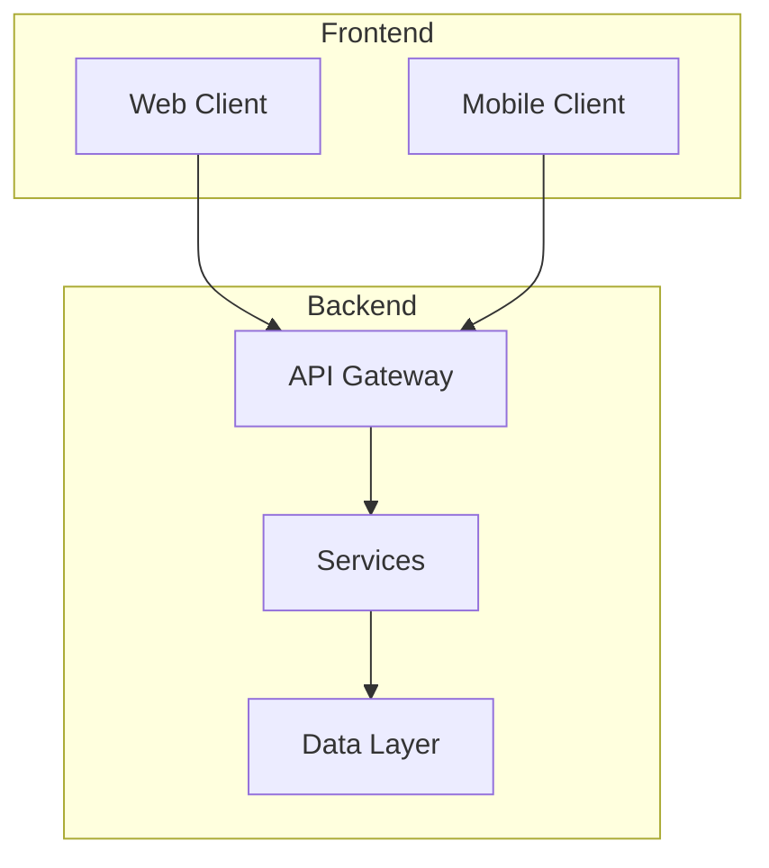
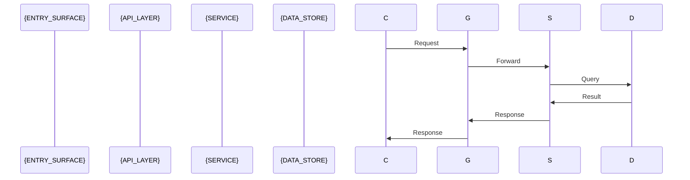

# Architecture

## System Architecture



## Tech Stack

| Layer | Technology | Version |
|-------|------------|---------|
| Frontend | {FRONTEND_TECH} | {VERSION} |
| Backend | {BACKEND_TECH} | {VERSION} |
| Database | {DB_TYPE} | {VERSION} |
| Cache | {CACHE_TYPE} | {VERSION} |
| Queue | {QUEUE_TYPE} | {VERSION} |

## Data Flow



## Deployment View

> Derived from repository infrastructure-as-code — not verified against production.

```mermaid
flowchart TB
    subgraph {HOST_1_LABEL}
        {NODE_1}[{NODE_1_LABEL}]
        {NODE_2}[{NODE_2_LABEL}]
    end
    subgraph {HOST_2_LABEL}
        {NODE_3}[{NODE_3_LABEL}]
    end
    {NODE_1} -->|{PORT}/{PROTOCOL}| {NODE_3}
    {NODE_2} -->|{PORT}/{PROTOCOL}| {NODE_3}
```

| Node / Edge | Description | Source |
|-------------|--------------|--------|
| {NODE_1} | {ROLE_DESCRIPTION} | `{file}:{line}` |
| {NODE_3} | {ROLE_DESCRIPTION} | `{file}:{line}` |
| {NODE_1} → {NODE_3} | {CONNECTION_DESCRIPTION} | `{file}:{line}` |

**Degradation:** when the repository has no docker-compose/Dockerfile/k8s manifest/Terraform/
systemd unit/Procfile/nginx config/PaaS manifest (`references/deployment-source-patterns.md`),
render `N/A — no infrastructure-as-code found in repository.` in place of the diagram and table
above — do not fabricate a topology. Every node and edge above MUST carry a `**Source**`-equivalent
`{file}:{line}` citation; a node with no citable source is omitted, not guessed (FR-7).
