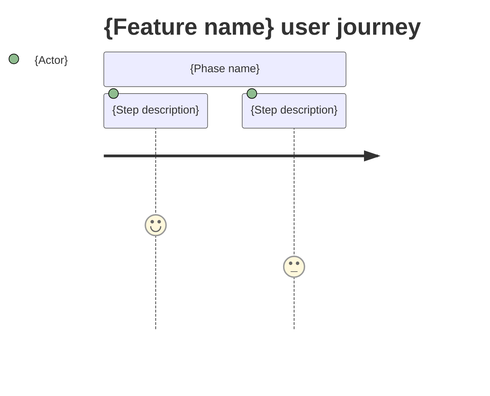

<!-- layout-exempt: rebuild-spec owns all docs/system|features|generated|flows paths — all references here are output targets or internal definitions -->
<!-- Contract: references/feature-spec-researcher-contract.md -->
<!-- v27.0.0 (audience split): this file is the BA/QA half of the feature spec pair — the
     widest-audience file in the repo. A BA/QA reader must answer "what does it do / how
     does it behave / what does the screen show" from THIS file alone, with no outbound
     link followed. Technical detail (endpoints, pseudocode, Source citations, DB writes)
     lives in the sibling technical-spec.md; link to it, never inline it here. -->
<!-- FORBIDDEN OUTSIDE FENCED CODE BLOCKS / HTML COMMENTS — researcher self-checks before
     writing: class names, `file:line` citations, HTTP verbs (GET/POST/PUT/DELETE/PATCH),
     pseudocode, secret-shaped values (API keys, DSNs, tokens, connection strings).
     FR-###/BR-###/SM-###/DEC-###/SCR###/US### CODES ARE ALLOWED and expected — this file is
     where they are stated (inverted from the old business-context.md rule, which forbade
     them). Any forbidden match outside a fence = CRITICAL contract violation; rewrite in
     plain language and move the technical detail to technical-spec.md instead.
     PERMITTED (D6, v27.x): the four status markers `[UNVERIFIED]`, `[INFERRED]`,
     `[NEEDS_DOMAIN_CONFIRMATION]`, `[EXPECTED]` — see references/confidence-report-contract.md
     § "v27 amendment — the 4th state". `[EXPECTED]` marks desired/agreed behavior that is not
     (yet, or not confirmably) what the code does — e.g. an accessibility recommendation. Never
     promote an observed current behavior into a should-statement: if code does X and X looks
     wrong, write X (marked, if uncertain) and open a § 11 Risks & Known Issues row instead. -->
<!-- LARGE OUTPUT NOTE: if this file exceeds 400 lines, signal to orchestrator for chunked review -->
<!-- RULE DENSITY: § 4 Requirements and § 5 Business Rules are ONE LINE PER RULE (≤2 lines,
     measured in lines, code bold-inline or as a trailing tag). This is a hard budget, not a
     style preference — a rule that needs a 3rd line belongs in technical-spec.md instead;
     leave a pointer here (e.g. "see technical-spec.md § Cross-Cutting Logic"). -->

# Functional Spec — {F###_NAME}

**Priority**: {P0|P1|P2|P3}
**Type**: {ui|background|mixed}
**Generated**: {DATE}

**See also:** [`technical-spec.md`](./technical-spec.md) — endpoints, Source citations, pseudocode,
key entities, and DB writes for a Dev/QA/SA audience.

<!-- FR-4 breadcrumb (rebuild-spec 27.11.0, phase-01). Placement is DELIBERATE, not
     incidental: this line sits BEFORE the "## 1. Overview" heading, so it is outside every
     numbered section in the `doc-writer.md` § Functional-Spec Section Guardrails table —
     that table marks § 1 Overview human-editable (Problem/Solution/Users/Goals/Non-Goals
     prose), and RT-4's blocking pre-check forbids writing a machine line into a
     human-editable section. This preamble block (Priority/Type/Generated/See also) is,
     like those three fields, 100% machine-authored today and applies uniformly whether the
     feature has UI screens or not — unlike § 5 Screens, which background-only features
     replace outright with "N/A". One line only — a POINTER into
     `docs/generated/traceability-matrix.md`, never a copy of it. Omit a hop with nothing to
     show for this feature (e.g. a background feature omits SCR###/US###) rather than
     printing an empty segment. Never add a section heading to make room for this. -->
**Traceability:** {F###_CODE} → {SCR###_LIST} → {US###_LIST} → {BL###_LIST} → {ROUTE###_LIST} → {TC###_LIST}

## 1. Overview

**Problem:** {1–2 sentences — the user problem or business need this feature solves. If code
provides no signal for rationale, write exactly: `N/A — inferred from code; domain confirmation
needed.` and add a row to § 3 Open Decisions.}
**Solution:** {1–2 sentences — what the feature does, in plain language, no component/class names.}
**Scope:** {What this feature IS for — 1–3 bullet-worthy outcomes, written as a single sentence
or short list.}
**Non-Scope:** {What this feature explicitly does NOT do — scope boundaries a reader would
otherwise assume. Write `None called out.` if the source gives no signal either way.}

**Actors**

<!-- Replaces the old single **Users:** line — same information, broken into rows so each
     actor's own goal is explicit. Plain role names only (e.g. "Shop Manager", "Guest
     Shopper") — no PERM### codes, no auth-class names. -->

| Actor | Description | Primary goal |
|-------|--------------|---------------|
| {Role name} | {who they are, one phrase} | {what they come to this feature to accomplish} |

{If this feature participates in a cross-feature flow, add:
This feature is part of [{Flow Name}](../../docs/flows/{slug}.md).}

## 2. Functional Capabilities

<!-- NEW (v27.x). The capability-bucket rollup that technical-spec.md § 4 "Technical Behavior
     by Capability" groups against — without this, that retaxonomy has no source of truth for
     its bucket list. `User Stories` cells cite comma-separated US### codes from § 7 below.
     `Requirements` cells cite comma-separated FR-### codes from § 4 below; every code cited
     here MUST also appear in § 4 (func.capability_fr_dangling enforces this). `Business Rules`
     cells cite comma-separated BR-###/DEC-###/SM-### tags from § 5. `Screens` cells cite
     SCR### codes from § 6.

     Exhaustiveness: every US###, FR-###, BR-###/DEC-###/SM-###, and SCR### declared anywhere in
     §§ 4-7 of this file must appear in exactly one § 2 row — see
     `references/feature-spec-researcher-contract.md` § "§ 2 Functional Capabilities" for the
     full rule (stated once, there). `cap.code_unclaimed` (critical — a code in §§ 4-7 claimed by
     no row; message opens with `family=US|BR|FR|SCR`) and `cap.double_claimed` (critical — a code
     claimed by more than one row) enforce this. `cap.claims_unfilled` (warning) fires instead of
     those two, whole-file, only when § 2 has ≥1 row and EVERY row's User Stories/Requirements/
     Business Rules/Screens cells are empty (e.g. right after a `--migrate --only cap-map`
     widening, before the claims are filled) — a single empty cell on an otherwise-populated row
     does NOT mute anything; `cap.code_unclaimed` keeps firing for it.

     What counts as a distinct capability (one row) vs. a variation of the same one is a
     judgment call, not a wording check — see `references/code-formats.md` §
     "Capability-Level Intent (authority)" for that rule; it is not restated here.

     Count-based review triggers (phase 06, capability-map plan): once § 2 has real claims
     and #CAP == 1, the feature's own US###/BL### count is checked against its Type's band
     (ui: warn 3-4 US, critical >=5; background: warn 5-7 BL, critical >=8; mixed: stricter
     of both). #CAP >= 2 silences this for every type — the count never forces a split (D-7).
     In the warning band: cap.review_advised (warning, no rationale needed). At or over the
     critical band: cap.analysis_required (critical) UNLESS a same-line
     "**Single-capability rationale:**" statement satisfies ALL THREE deterministic
     conditions:
       1. non-empty text on the SAME line as the label (a blank label never qualifies);
       2. >= 12 words;
       3. names >= 2 DISTINCT US###/BL### codes that THIS feature actually declares
          elsewhere in this file — a fabricated or duplicated code fails this condition,
          it is not simply ignored.
     Example that PASSES all three (18 words, 2 real distinct declared US codes) — replace
     with this feature's own codes and reasoning, never copy the sentence itself. NOTE the
     label below starts at column 0, not indented with this comment's prose: the check is
     same-line-anchored (`^\*\*Single-capability rationale:\*\*`), so an indented label
     would never match — that is also true of the real, uncommented line in a filled § 2.

**Single-capability rationale:** US001 and US002 both serve the single outcome of getting a returning user fully authenticated end to end.
     -->

| ID | Capability | What the user can do | User Stories | Requirements | Business Rules | Screens |
|----|------------|------------------------|-----------------|---------------|-------------------|---------|
| CAP-01 | {short capability name} | {one-sentence description of what the user can do} | {US001, US002} | {FR-101, FR-102} | {BR-001, BR-002} | {SCR###} |

## 3. Open Decisions

{Every `[NEEDS_DOMAIN_CONFIRMATION]` marker found while researching this feature is promoted to
a row here — never left inline as a marker. Each row needs a Default proposal (what ships if
nobody answers) and a Blocks work flag (does this block shipping, or can it ship with the
default and be revisited later).}

| D### | Decision | Default proposal | Rationale | Blocks work |
|------|----------|-------------------|-----------|--------------|
| D001 | {the open question, one sentence} | {what we ship if unanswered} | {why this default, 1 sentence} | {yes\|no} |

{`None — no unresolved domain confirmations.` when the feature has zero `[NEEDS_DOMAIN_CONFIRMATION]` markers.}

## 4. Requirements

<!-- Banding: 0xx foundation (data/setup) · 1xx navigation/entry · 2xx-3xx per-screen (one band
     per screen, in screen order) · 4xx interaction (cross-screen behavior) · 6xx security/permission.
     Every FR-### declared in technical-spec.md (US-scoped or Cross-Cutting) gets exactly one
     one-sentence line here, in the matching band. Code bold-inline; rest of the line is the
     plain-language sentence — no endpoint, no handler name, no pseudocode. -->

### Foundation (0xx)

- **FR-001** {one plain-language sentence — what must be true or set up before the feature works}

### Navigation (1xx)

- **FR-101** {one plain-language sentence — how a user reaches this feature}

### {Screen Name} (2xx)

- **FR-201** {one plain-language sentence describing this screen's requirement}

### Interaction (4xx)

- **FR-401** {one plain-language sentence describing cross-screen or stateful interaction behavior}

### Security (6xx)

- **FR-601** {one plain-language sentence describing an access/permission requirement}

## 5. Business Rules

<!-- One line per BR-###/DEC-###/SM-###, code as a trailing tag. BR = the plain rule statement
     that used to live in technical-spec.md's now-removed **Rule:** field. DEC = the 1-sentence
     user-visible outcome that used to live in technical-spec.md's now-removed
     **user_visible_outcome:** field. SM = the plain-language description of what the state
     machine represents (not its transition table — that stays in technical-spec.md).
     An observed behavior that looks like a DEFECT (should not happen, incorrect, a bug) is
     NEVER written here as if it were an intended rule — record it as-is in § 11 Risks &
     Known Issues instead (func.risk_as_rule warns when this line reads that way and § 11 has
     no counterpart). -->

- {Plain-language statement of what must hold, when it's enforced, and why} (BR-001)
- {Plain-language statement of the user-visible outcome this decision produces} (DEC-001)
- {Plain-language statement of what this state machine tracks} (SM-001)

## 6. Screens

{For background-only features with no UI, replace this section with:
`N/A — background feature; no user-facing screens.` — omit the table entirely (no SCR### rows).}

<!-- SCR### = the canonical screen code (SCR###_NameSlug) from generated/screen-list.md.
     It is the bridge to the full per-screen spec at docs/screens/SCR###_Name/spec.md, and
     the inverse of the **Feature** backlink in that spec's header. Each code MUST resolve
     to a row in screen-list.md (validate_feature_screen_link.py enforces this). -->

| Screen Name | SCR### | What User Sees | What User Can Do |
|-------------|--------|-----------------|-------------------|
| {ScreenName} | {SCR###_NameSlug from screen-list.md} | {plain description of page content} | {actions available to the user} |
| {ScreenName} | {SCR###_NameSlug from screen-list.md} | {plain description of page content} | {actions available to the user} |

### User Journey

{Numbered steps in plain language. Reference screen names from the table above.
Do NOT reference routes, endpoints, or component names.}

1. User arrives at {Screen Name} and sees {content description}.
2. User {action} — {what changes or what they see next}.
3. User is taken to {Screen Name} where {outcome}.

{Optional Mermaid journey diagram:}



## 7. User Stories

<!-- v27.0.0 disambiguation — THREE places share the name "User Stories", each for a different
     reader; do not confuse them:
       1. docs/generated/user-stories.md — the project-wide US### inventory (WHAT stories exist).
       2. This section — the per-feature narrative + observable acceptance criteria for THIS
          feature's US### codes, for a BA/QA reader (HOW the story plays out here).
       3. technical-spec.md § User Stories — the dev-facing endpoints/Source citations/rule
          blocks behind the SAME US### codes.
     This section carries NO Endpoint, Data Required, or Dependencies fields — those are
     technical-spec.md's job. Acceptance criteria here are observable checkboxes, not
     Given/When/Then (that structure lives in § 8 Scenarios).
     Actor -> Goal -> Business value (v27.x): every story block leads with these three
     bold-labeled fields before its narrative — **Actor** matches a row in § 1 Actors,
     **Goal** is what the actor wants, **Business value** is why it matters. func.user_story_shape
     warns when a block is missing one. -->

### {US001_CODE} — {US001_TITLE}

**Actor:** {plain role name — matches a row in § 1 Actors}
**Goal:** {what the actor wants to accomplish, one sentence}
**Business value:** {why it matters — the benefit to the actor or the business, one sentence}

{Optional: one-paragraph narrative with any detail the three fields above didn't cover — who
does what, under what conditions, to what end.}

**Acceptance Criteria:**
- [ ] {observable, user-facing outcome the story must produce}
- [ ] {a second observable outcome}

### {US002_CODE} — {US002_TITLE}

**Actor:** {plain role name — matches a row in § 1 Actors}
**Goal:** {what the actor wants to accomplish, one sentence}
**Business value:** {why it matters — the benefit to the actor or the business, one sentence}

**Acceptance Criteria:**
- [ ] {observable outcome}

## 8. Scenarios

<!-- Given/When/Then. At least one happy-path scenario and one error scenario per US### in § 7. -->

### {US001_CODE} — Happy Path

**Given** {initial state}, **When** {user action}, **Then** {observable outcome}.

### {US001_CODE} — Error: {condition}

**Given** {initial state}, **When** {user action under the error condition}, **Then** {observable outcome, plain-language message}.

## 9. Edge Cases

{MANDATORY — minimum 3 rows for UI features, 1 row for background features.
"User-Facing Message" must be plain language (e.g., "You don't have permission to do this").
A bare status code alone is rejected — always pair with the actual message shown to the user.}

| Scenario | What Happens | User-Facing Message |
|----------|--------------|----------------------|
| {boundary condition / invalid input} | {specific system behavior — what the system does internally} | "{plain-language error or feedback message shown to user}" |
| {concurrent operation / race condition} | {specific system behavior — queue, lock, reject, retry} | "{plain-language message, or "None — silent handling"}" |
| {missing prerequisite / empty state} | {fallback behavior or recovery path} | "{plain-language empty-state message or prompt}" |
| {permission / access violation} | {what the system enforces} | "{plain-language access denied message}" |

## 10. Edge Behaviours to Verify

<!-- Plain-language equivalent of technical-spec.md's Verification (SC-###) — back-references
     an FR-### from § 4 so a reader can trace "what must be true" to "how we check it." Format:
     one line per behaviour, FR code bold, arrow to the plain-language check. -->

- **FR-001** → {plain-language behaviour a tester should confirm}
- **FR-201** → {plain-language behaviour a tester should confirm}

## 11. Risks & Known Issues

<!-- NEW (v27.x). The third bucket: abnormal CURRENT behavior found in code that must not be
     silently folded into a Business Rule (misrepresents a bug as an intended rule) and must
     never be "fixed" by this spec. `Type` = `known-issue` (observed abnormal current behavior)
     or `risk` (future exposure). `Status` uses the § 5-of-target-shape-spec marker vocabulary
     ([UNVERIFIED]/[INFERRED]/[NEEDS_DOMAIN_CONFIRMATION]/[EXPECTED], or a plain confirmed
     state). Technical unknowns that need MORE CODE READING (not a stakeholder) stay in
     technical-spec.md's Unresolved Questions instead — this section is for a stakeholder
     decision or a recorded defect, not a research TODO. -->

| ID | Type | Description | Impact | Status |
|----|------|--------------|--------|--------|
| RISK-01 | {known-issue\|risk} | {the abnormal behavior or future exposure, as observed — do not editorialize a fix} | {who/what is affected if this stays as-is} | {[UNVERIFIED]\|[INFERRED]\|[EXPECTED]\|[NEEDS_DOMAIN_CONFIRMATION]\|confirmed} |

{`N/A — none found.` when the feature has zero known issues or recorded risks.}

## 12. Dependencies

<!-- NEW (v27.x). What this feature needs from elsewhere to work — another feature, an
     external service, a shared dataset, infrastructure, or a config value. This is the
     plain-language counterpart to whatever technical-spec.md's § 3 System Design cites as an
     integration; it exists so a BA/QA reader can see "what else has to be true" without
     following that link. -->

| Dependency | Type | Why this feature needs it | Evidence |
|------------|------|-----------------------------|----------|
| {F###_Name, or the external thing} | {feature\|external-service\|data\|infrastructure\|config} | {one sentence} | {SCR###/FR-###/BR-### code, or a plain pointer} |

{`N/A — none found.` when the feature has zero cross-feature or external dependencies.}

## 13. Configuration

<!-- One fenced block. Name = value pairs with a trailing comment explaining the business
     meaning — no secrets, no environment-specific values, no file:line. -->

```text
MAX_LOGIN_ATTEMPTS = 5     # accounts lock after this many consecutive failed attempts
SESSION_TIMEOUT_MIN = 30   # idle sessions expire after this many minutes
```

{`N/A — no user-facing configuration constants for this feature.` when none apply.}
