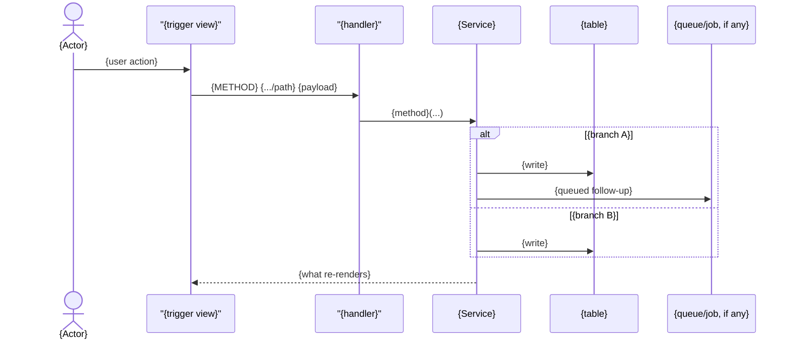
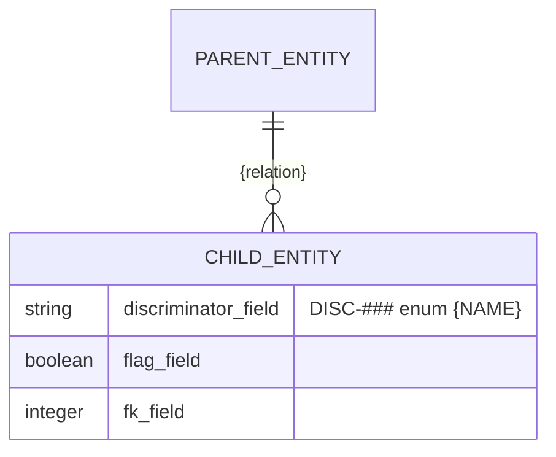
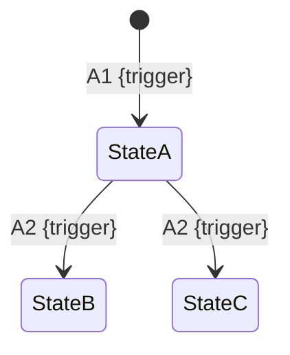

<!-- layout-exempt: rebuild-spec owns all docs/system|features|generated|flows paths — all references here are output targets or internal definitions -->
<!-- Contract: references/feature-spec-researcher-contract.md -->
<!-- v27.0.0 (audience split): this file is the DEV/QA/SA half of the feature spec pair.
     The BA/QA half — plain-language overview, one-line-per-rule requirements/business
     rules, screens, per-feature user-story elaboration, scenarios, edge cases — lives in
     the sibling functional-spec.md. Every code (FR/BR/SM/DEC/ALG/INT) is STATED once in
     functional-spec.md and IMPLEMENTED once here — do not restate plain-language rule
     prose in this file; cite the code and point to functional-spec.md § instead. -->
<!-- v27.7.0 (action-thread reshape, wire-format-contract.md is normative): the 5-bucket
     layer-first shape (§ 2 Functional → Technical Mapping / § 3 System Design / § 4
     Technical Behavior by Capability) is RETIRED — full-set replacement of §§ 2-4, not an
     incremental rename. The new spine is ACTION-first:
       § 2 Action Index    = the action→rule binding v27 lacked (`**Applies to:**` free text
                              resolved to an action only 26% of the time on a 43-feature
                              corpus; see ADR-0006). One row per action, keyed on the
                              HANDLER (not `METHOD PATH` — same path can be two actions;
                              a background action has no path at all).
       § 3 Actions          = the BODY, immediately after the index. One capability bucket
                              (`### 3.N CAP-NN`) per row in the twin functional-spec.md § 2,
                              each holding one `#### A<n>` block per action. Every block uses
                              the SAME labelled rung set — an absent rung is omitted, never
                              stubbed with "N/A" or "None." A rung carries FACTS (endpoint,
                              handler, table, file:line); a `sequenceDiagram` carries ORDER
                              and BRANCHING when the action crosses the diagram threshold —
                              two different kinds of information, never two records of one
                              fact. Ends with one feature-wide Edge cases table.
       § 4 Shared Foundation = what used to be § 3 System Design, DEMOTED to an appendix:
                              components, data model, state machines, shared rules (the
                              three-bin split — see § 4.4 below), algorithms & integrations,
                              configuration. Actions in § 3 POINT here; nothing here repeats
                              what a single action's rung already said.
     `## 5. Verification & Technical Notes` closes the file. The two unnumbered literal
     H2s that used to follow it (`## Source Walkthrough`, `## DB Impact per Event`) are
     RETIRED (phase 08, self-sufficiency v27.8, plans/260824-1846-...): both duplicated
     content § 3's per-action rungs already carry — A3's reading order is § 5.4 Source
     References' own Order column re-cast, and B4's per-(action,table) rollup is the
     Result rung's write, one action at a time. `screens/*/spec.md` keeps its own
     `## Source Walkthrough` (a genuinely different, UI-scoped section) — untouched. -->

# {F###_NAME} — Technical Spec

**Priority**: {P0|P1|P2|P3}
**Type**: {ui|background|mixed}
**Generated**: {DATE}

**See also:** [`functional-spec.md`](./functional-spec.md) — plain-language overview, open
decisions, requirements/business rules stated in one-liners, screens, user stories, scenarios,
edge cases, and configuration for a BA/QA audience.

**How to read this file:** § 2 is the index — pick the action you care about and read its block
in § 3 straight through; each block is one complete thread, top to bottom. § 4 is the shared
appendix — jump in only when a § 3 block points you there.

## 1. Technical Overview

{2–3 sentence narrative: what the feature does, who uses it, what triggers it, which subsystems it touches.}

{OPTIONAL overview diagram — a `flowchart LR` grouping actions by capability, showing
actor → action → table edges (mermaid `subgraph` per CAP-##). Include it when it clarifies the
actor/capability shape at a glance; omit for a trivial single-action feature. This diagram OWNS
how many actions exist, which capability each belongs to, who triggers what, and which tables get
written — § 2 and § 3 must not restate that in prose. Mark code that is declared/routed but never
reachable from any view/JS with a dimmed `classDef` and an `[INFERRED]` note, never silently drop
it from the diagram.}

## 2. Action Index

<!-- This is what v27 did not have: a machine-resolvable action→rule binding. Replaces the old
     `## 2. Functional → Technical Mapping` (a table keyed by CODE, not by action). The key is the
     HANDLER, not `METHOD PATH`: the same path can be two different actions, and a background
     action (queue/job/cron) has no path at all.
     COMPLETENESS RULE: every FR/BR/DEC/SM/US code declared anywhere in § 3 or § 4 MUST be
     claimed by AT LEAST ONE row here (or by A0) — `FeatureSpec.action_unclaimed`. A code claimed
     by ≥2 rows is legitimate fan-out (one requirement, several handling actions), not an error —
     see `docs/decisions/ADR-0006.md`'s addendum for the corpus measurement behind this. -->

| # | Action (handler) | Method · Path | Codes | Writes | Detail |
|---|---|---|---|---|---|
| **A0** | *cross-cutting — belongs to no single action* | — | {FR-001, FR-601} | — | § 4.4 |
| **A1** | `{Controller#method}` | `{METHOD}` `{.../path}` | {FR-###, DEC-###, US###} | — *(read-only)* | § 3.1 |
| **A2** | `{Controller#method}` | `{METHOD}` `{.../path}` | {FR-###, BR-###, SM-###, US###} | `{table_name}` | § 3.2 ▸ **diagram** |
| **A9** | `{JobClass#perform}` *(background, no FE)* | queue · `{QueueAdapter}` | {FR-###, BR-###, ALG-###, US###} | `{table_name}` | § 3.3 ▸ **diagram** |

**Column rules:**

| Column | Rule |
|---|---|
| `#` | `**A<n>**`, bold, contiguous from `A1`. `**A0**` is the reserved cross-cutting row — MANDATORY even when the feature resolves zero real actions (a feature with zero endpoints and zero DB-Impact rows still emits `A0`, so `FeatureSpec.action_index_missing` never fires on a legitimate infrastructure-only feature). |
| `Action (handler)` | Backticked `` `Class#method` `` (D2 — the handler IS the action's identity). Fall back to the bare `` `METHOD PATH` `` shape ONLY when the handler is genuinely unparseable; that fallback fires `action_key_not_handler` (warning) — it is a last resort, not a style choice. A background/no-FE action carries the italic suffix `*(background, no FE)*`. |
| `Method · Path` | Backticked method + backticked path: `` `GET` `` `` `.../path` ``. A queue-driven action uses `queue · ` + backticked adapter/job class. Literal `—` when neither an HTTP surface nor a queue trigger applies. |
| `Codes` | Comma-space separated bare codes. This column IS the binding — every FR/BR/DEC/SM/US/ALG/INT code declared in § 3 or § 4 must appear in AT LEAST ONE row's `Codes` (or `A0`'s); appearing in ≥2 rows is legitimate fan-out, not an error (`action_double_claimed` was retired — see `docs/decisions/ADR-0006.md`'s addendum). |
| `Writes` | Comma-space separated backticked table names, or `—` plus an italic reason: `— *(read-only)*`, `— *(unreachable)*`. Feeds the diagram threshold (≥2 tables). |
| `Detail` | `§ 3.<n>`, optionally ` ▸ **diagram**` when the action's block carries a `sequenceDiagram`. |

**Rung set** — every block in § 3 uses this exact order; **an absent rung is simply omitted, never
rendered as `N/A` or `None.`** (`rung_empty_rendered`). Presence of a rung is never required; the
RELATIVE ORDER of whichever rungs a block does carry is the contract (`rung_order`):

> **Who** → **FE** → **Request** → **BE** → **Rule** → **Result** → **State** → **Source**

**State** is authored ONLY when a researcher fill pass has confirmed the transition from source —
never inferred from a mermaid edge label or a method name (no automatic derivation exists; that
join was tried and dropped — see ADR-0006). Where it cannot be confirmed yet, omit the rung
entirely (never `N/A`); `FeatureSpec.state_rung_missing` (warning) flags a writing action inside
an SM-modelled feature that carries none, as a prompt for the fill pass. Exact form:
`**State** · \`SM-###\`: \`{from_state}\` → \`{to_state}\` *(§ 4.3)*` — same ` · ` separator as
every rung but Source. Unconfirmed: `**State** · [UNVERIFIED] \`SM-###\`: transition not
confirmed from source *(§ 4.3)*`.

**Every code cited in this section's H4 context line MUST be glossed in plain language somewhere
in the same action block** — a bare code with no gloss anywhere in its block is the defect
`FeatureSpec.action_ref_unglossed` (warning) exists to catch; see
`references/feature-spec-researcher-contract.md` § "Self-sufficiency of the H4 context line" for
the full rule (canonical statement — not restated here).

**Diagram threshold** — a block gains a `sequenceDiagram` when it satisfies **≥1** of:
*writes ≥2 tables* · *is a background/async-step action*. A third criterion (≥2 BR/DEC on the
action) is **deliberately deferred** until the action→rule binding this reshape introduces has run
on a real corpus (measured base rate 4.4% — see ADR-0006); do not re-add it from intuition. Rungs
still carry the FACTS (endpoint, handler, table, `file:line`); the diagram carries ORDER and
BRANCHING only — never `file:line` inside a mermaid fence (`diagram_cites_file_line`). Diagram cap:
**≤12 arrows, ≤2 `alt` blocks** — over the cap means the action is doing too much, not that the
diagram needs to be denser; split the action instead.

## 3. Actions

<!-- The body of the file, immediately after the index — not buried behind a "system design"
     wall the way § 3 used to be. One `### 3.N CAP-NN` bucket per row in the twin
     functional-spec.md § 2, in CAP- order; an action whose capability cannot be determined goes
     in the LAST bucket, never the first. Two actions that are fully symmetric (e.g. two member
     routes with identical shape) MAY share one `#### A<n> · ... · A<m> · ...` H4 — see A7/A8
     worked example in the researcher contract. -->

### 3.1 CAP-01 — {capability title, copied from functional-spec.md § 2}

#### A1 · {action title}
`{METHOD} {.../path}` → `` `{Controller#method}` ``
`{FR-###}` `{DEC-###}` `{US###}` · `{SCR###_Name}`

**Who** · {actor} *(gate A0 — § 4.4)*
**FE** · `{view_file.ext:start-end}` renders {what} via `{Presenter/Component}`. {UI details:
column visibility, client-side filter/submit behavior.}
**Request** · param `{name}` *({shape})* {and further params}
**BE** · `` `{Presenter/Service#method}` `` — {what it does}. `{file.ext:start-end}`
**Rule** · {ONE plain sentence describing what this action's decision logic decides — e.g. "decides
the per-row action menu:"}

<!-- DEC-### is a TABLE ROW inline in this rung, not a separate H4 block — the decision is a
     fact about THIS action, and the rung already owns facts. Columns are fixed. -->

| DEC | subtype | Condition | What the user sees | Source |
|---|---|---|---|---|
| **DEC-001** | render | `{predicate}` | {what renders / is hidden} | `{file.ext:line-line}` |

**Result** · {read-only — **no DB write** | what gets written, in plain terms}. {any other
observable side effect: pagination, badge/status derivation}. When this action's rendering
branches on a `DISC-###` field, name the SPECIFIC value and its effect inline — e.g. "hides the
Approve button when `DISC-002`'s `status` reads `archived`" — never a bare `DISC-002` cross-
reference with no stated value (`FeatureSpec.action_ref_unglossed`).
**Source:** `{view.ext:start-end}` → `{controller.ext:line}` → `{service.ext:start-end}`

<!-- No diagram: below threshold — state briefly why (read-only, single table, synchronous).
     If this action's real content is a branching TABLE (like the DEC table above), a diagram
     would make it HARDER to read, not easier; say so instead of adding one for its own sake. -->

---

#### A2 · {action title needing a diagram}
`{METHOD} {.../path}` → `` `{Controller#method}` ``
`{FR-###}` `{BR-###}` `{US###}` · `{SCR###_Name}` · `{SM-###}`

**Who** · {actor} *(gate A0)*
**FE** · {trigger UI element}, {file.ext:line} — **only shown when {gating DEC/condition} allows**
*(§ 3.{n})*. {JS/client behavior}.
**Request** · `{param}` = `{value_a}` \| `{value_b}`
**BE** · `` `{Service#method}` `` dispatches on {what} — `{file.ext:start-end}`
**Rule**
- **BR-001 — {one plain sentence}.** {what the code actually does, including any gap between
  what the UI implies and what the backend actually checks}. *(§ 4.4)*
- **BR-004 — {one plain sentence}.** {short mechanism}. *(§ 4.4)*
**Result**
- Writes `{table.column}` ← {how the value is derived} — `{file.ext:line-line}`
- Publishes `{event_name}` via `INT-001` — {one-clause gloss: what the integration does, e.g.
  "notifies the billing service so its ledger reflects the new status"} *(§ 4.5)*
- User sees: {what re-renders, e.g. `update.js.erb` re-rendering a row, no full page reload}
**State** · `{SM-###}`: `{state_a}` → `{state_b}` *(§ 4.3)*
**Source:** `{view.ext:line}` → `{controller.ext:line-line}` → `{service.ext:start-end}`

<!-- `INT-001` above is glossed INLINE ("notifies the billing service...") — never a bare
     `INT-001` with only the § 4.5 `**Used in:**` tag pointing back. Same self-sufficiency rule
     as BR-001/BR-004's Rule-rung gloss above, applied to the INT family
     (`FeatureSpec.action_ref_unglossed`). The `**State**` rung is its own line, between Result
     and Source — never a bullet inside Result (pre-v27.8 shape). -->



<!-- The diagram owns ORDER and BRANCHING (which write happens in which branch, what fires
     after the write). The rungs above own FACTS (which column, how derived, which file:line).
     No fact appears twice. -->

---

### 3.{N} CAP-{NN} — {a capability whose actions span multiple handlers}

{One paragraph, when the capability is a single thread stretched across ≥2 handlers with no one
handler owning the whole sequence (e.g. request → background job → poll/status endpoint) — place
the `sequenceDiagram` at the CAPABILITY level here, before the individual action blocks, instead
of duplicating it per action.}

#### A{n} · {first action title}
{...same rung shape as above...}

---

#### A{n+1} · {background/no-FE action title} *(background, no FE)*
`queue · {QueueAdapter}` → `` `{JobClass#perform}` ``
`{FR-###}` `{US###}` · {BL-### if applicable}

**Who** · *no human actor — background job triggered by {A#}*
**FE** · *none*
**Request** · *no HTTP request* — payload from the queue: {fields}
**BE** · `` `{JobClass#perform}` `` — `{file.ext:start-end}`
**Rule** · **BR-### — {one plain sentence}.** {mechanism}. `{file.ext:line}`
**Result**
- Writes `{table.column}` ← {derivation} — `{file.ext:line}`
**State** · [UNVERIFIED] `{SM-###}`: transition not confirmed from source *(§ 4.3)*
**Source:** `{job.ext:start-end}` → `{model.ext:line-line}`
**Shared structure:** `{ALG-###}` — {one-clause restatement of what the algorithm computes, e.g.
"derives the payout total from per-item commission rates"}, full detail *(§ 4.5)*

<!-- The breadcrumb states WHAT the algorithm computes inline, not just a bare `{ALG-###}` token
     pointing at § 4.5 — same self-sufficiency rule as the BR/INT/DISC examples above
     (`FeatureSpec.action_ref_unglossed`). The `**State**` rung here shows the `[UNVERIFIED]`
     shape: a transition genuinely not yet confirmed from source is marked so, never guessed and
     never rendered as `N/A`/`None.` (that would fire `rung_empty_rendered`).
     The `**FE**` rung in the NEXT block shows the other half of that rule. Three distinct states,
     only two of which render a rung:
       searched, genuinely absent  -> KEEP the rung, name what you searched (the block below).
                                      This is a FINDING and it is worth reading.
       not applicable / not known  -> OMIT the rung entirely. Silence is the contract.
       stubbed                     -> NEVER. A rung body of exactly `none.` / `None.` / `N/A`
                                      is `FeatureSpec.rung_empty_rendered`, a CRITICAL.
     Note the trap: the block below reads `*no entry point found* — grepped ...`, NOT
     `*none.* Grepped ...`. The second form passes today only because the trailing sentence
     defeats the check's end-of-body anchor — copy it and drop the justification and the file
     goes critical. Do not teach the token; state the finding. -->

---

#### A{m} · {two symmetric actions sharing one block} · A{m+1} · {the mirror action}
`{METHOD} {.../:id/verb1}` → `` `#verb1` `` `{FR-###}` · `{METHOD} {.../:id/verb2}` → `` `#verb2` `` `{FR-###}`

**Who** · *cannot be determined — no reachable entry point*
**FE** · *no entry point found* — grepped `{views dir}` and `{client JS}` this pass; nothing points here.
**BE** · implemented at `{controller.ext:line,line}`; route declared in `{routes file}`
(`{ROUTE###}`/`{ROUTE###}`)
**Rule** · {the rule(s) that would apply if this were reachable} *(§ 4.4)*
**Result** · **no write observed** — `[INFERRED]` dead code. See § 5.3 Unresolved Questions.

<!-- Two actions collapse into one block ONLY when they are fully symmetric AND neither has
     observable content of its own (e.g. both unreachable) — this is a block-level rung variance,
     not a shortcut for two actions that actually differ. -->

### 3.{N+1} Edge cases

<!-- Feature-wide, keyed by Action — this is what v27 did not have: every edge case anchored to a
     specific action instead of floating in a feature-wide list. Action column LEADING; no
     consumer parses this table by position. -->

| Action | Scenario | Behavior |
|---|---|---|
| A2 | {boundary condition / invalid input} | {specific system behavior} |
| A2 · A3 | {concurrent operation / race condition} | {specific system behavior — lock, last-write-wins, race window} |
| A1-A8 | {cross-cutting scenario, e.g. unauthenticated call to any route} | {behavior — cite A0 § 4.4} |

## 4. Shared Foundation

<!-- APPENDIX, not the opening act. Only what ≥2 actions use, or what belongs to no single
     action. Each item exists EXACTLY ONCE here; § 3 points in, never copies back out. This
     section replaces the old § 3 System Design — same content family (components, data model,
     state, algorithms, integrations, config), demoted from spine to appendix, plus § 4.4 Shared
     Rules replacing the old § 4 Technical Behavior by Capability's per-capability BR/DEC blocks. -->

### 4.1 Components

| Component | Responsibility | Used in | File |
|---|---|---|---|
| `{ControllerName}` | {HTTP entry point for all N routes} | A1-A{n} | `{path/to/controller.ext}` |
| `{ServiceName}` | {business logic this feature owns} | A2, A3, A4 | `{path/to/service.ext}` |
| `{PresenterName}` | {find/filter/paginate + row-level render rules} | A1 | `{path/to/presenter.ext}` |

### 4.2 Data Model



<!-- The erDiagram OWNS relationships + key columns. The table below stays to "used for" +
     Action — it does not repeat the column list. -->

| Entity | Table | Used for | Action |
|---|---|---|---|
| `{ModelName}` | `{table_name}` | {what this feature does with it} | A1-A4, A9 |
| `{ModelName2}` | `{table_name_2}` | {what it tracks} | A5, A6, A9 |

#### Polymorphic Behavior

{For each DISC-### whose entity appears in the Data Model table above, document per-value
behavior. Cross-reference docs/generated/entities.md for the authoritative values list.}

##### DISC-### — {EntityName}.{field_name}

| Value | Render | Validation | Persistence |
|-------|--------|------------|-------------|
| {val1} | {what the UI shows/hides, which components render} | {which rules apply, what is blocked} | {what DB writes/state changes occur — which action sets this value} |
| {val2} | {render behavior} | {validation behavior} | {persistence behavior} |

**Source:** docs/generated/entities.md § {EntityName} > Discriminator Fields

{If the Data Model table has NO DISC-### fields, write exactly:}
N/A — no discriminator fields in Key Entities.

### 4.3 State Management

{One SM-### block per state machine. `kind: entity` = persisted domain-object lifecycle;
`kind: ui` = client-local view-layer state (useState/ref/signal — never persisted). Threshold:
only use `kind: ui` for ≥3 states OR ≥2 transitions — smaller cases stay implicit in a BR-### rule
instead.}

None.

<!-- The "None." above is the default for a feature with no state machines — a real spec REPLACES
     it with one block per SM-### below. -->

### {Entity lifecycle stated in one plain sentence} (SM-001)
**kind:** entity
**Linked FR:** FR-???
**Source:** `{file}:{start}-{end}`



**Action transitions:** the guard and side effect for each edge live in the **Result** rung of
the action named on that edge (§ 3.{n}) — not repeated here (DRY; one record of each fact).

### 4.4 Shared Rules

<!-- THREE bins, not two. Bin 3 is the bin the corpus shows is LARGE: a rule that belongs to no
     action at all. Without it, that class of rule gets stuffed into one action for lack of
     anywhere else to go — which breaks exactly the binding § 2 exists to create.
     Bin 1 (used by exactly ONE action) is NOT here — it lives inline in that action's Rule
     rung in § 3, full statement + Source, same as any other fact that action owns. -->

#### Bin 3 — cross-cutting, belongs to no single action

**A0 · {FR-001} / {FR-601} — {one plain sentence, e.g. "every action requires an admin session."}**
`{before_action filter or middleware}` on the shared base controller — **applies to all N
routes**, not any one screen. Same gate as {other cross-cutting scope}; **not a rule of this
feature**. {Behavior on gate failure: redirect/403, and WHEN — e.g. before resource lookup
runs.}
**Source:** `{base_controller.ext:line}` · {route-list.md ROUTE### range}

#### Bin 2 — used by ≥2 named actions

**BR-001 — {one plain sentence}.**
Used in: **A2** · **A7** · **A8**. {full mechanism — what the UI implies vs. what the backend
actually checks}.
**Source:** `{presenter.ext:line-line}` · `{service.ext:line-line}`
```text
{≤20 lines of pseudocode capturing the check intent}
```

<!-- Every code (FR/BR/DEC/SM) that lands here MUST also be claimed by AT LEAST ONE § 2 row's
     Codes column (`FeatureSpec.action_unclaimed`) — usually A0 for a Bin-3 rule, or every action
     named in "Used in" for Bin-2. Claimed by ≥2 rows is legitimate fan-out, not an error — the
     exactly-one reading was retired (`docs/decisions/ADR-0006.md`'s addendum).
     This full block is NOT the only place BR-001 gets glossed: every action named in "Used in"
     ALSO carries its own inline gloss in that action's § 3 Rule rung — see
     references/feature-spec-researcher-contract.md § "Self-sufficiency of the H4 context line"
     (canonical statement, not restated here). -->

### 4.5 Algorithms & Integrations

<!-- ALG/INT blocks below are H3 (sibling of this H3, same as the pre-thread convention), NOT H4
     — deliberate deviation from the B-v sample's own H4 nesting. `_spec_block_lib.BLOCK_HEADING_RE`
     (the canonical, shared parser both the validator and this template must agree with —
     code-formats.md: "import them, never re-type them") matches ONLY `^### .+\((BR|SM|ALG|INT)-
     \d{3}\)\s*$`. Nesting these as H4 would silently stop the validator from finding them at all
     (a missing citation, missing Linked FR, etc. would go undetected) — re-nesting to fix the
     ADR-0005 heading-depth defect the sample's H4 choice was reaching for is a joint
     doc+validator change for a later phase, not a documentation-only deviation to make alone. -->

{One ALG-### block per non-trivial computation, one INT-### block per external integration (API
call, event publish, webhook emit, queue job, notification). Trivial CRUD passthroughs need
neither.}

None.

### {Algorithm stated in one plain sentence} (ALG-001)
**Linked FR:** FR-???
**Used in:** A{n}
**Source:** `{file}:{start}-{end}`
**Input:** {shape summary} · **Output:** {shape summary} · **Complexity:** {O(n) or N/A}
**Description:** {what it computes, why, invariants it preserves.}

**Pseudocode:**
```text
# ≤20 lines capturing the check intent — this cap exists so real credential-bearing
# source is never pasted wholesale into a spec; keep it on every relocated fence.
```

### {Integration stated in one plain sentence} (INT-001)
**Linked FR:** FR-???
**Used in:** A{n} → A{m}
**Source:** `{file}:{start}-{end}`
**Type:** {api-call | event-publish | webhook-emit | queue-job | notification}
**Target:** {service / topic / queue / endpoint}
**Payload:** {fields sent, excluding secrets}
**Failure handling:** {retry policy / DLQ / ignore / compensating action — state plainly when
there is none, e.g. "none — no rescue around the enqueue call; failures depend entirely on the
queue's own retry/dead-job handling."}

### 4.6 Configuration

<!-- TECHNICAL configuration only — env vars, feature-flag keys, framework settings, timeouts,
     retry counts. Different boundary from functional-spec.md § 13 (business-visible settings). -->

```text
FEATURE_X_TIMEOUT_MS = 5000        # request timeout for the downstream call (A5)
FEATURE_X_RETRY_MAX = 3            # retry attempts before falling back (A9)
```

{`N/A — no technical configuration beyond framework defaults.` when none apply.}

**Client behavior:** see
[`behavior-logic.md`](../../docs/generated/behavior-logic.md) (client-side patterns — debounce, optimistic UI, polling, upload, realtime),
[`permissions.md`](../../docs/system/permissions.md) (feature flags / experiments / env / locale gates),
[`architecture.md`](../../docs/system/architecture.md) (guards / deep-link state restoration / unsaved-changes protection).

## 5. Verification & Technical Notes

### 5.1 Technical Verification

{Global pass/fail conditions (SC-###), plus, per US### that needs a dev-facing validation
approach beyond functional-spec.md § 8's BA-worded Given/When/Then: an Independent Test
description and/or a technical GWT that carries status/response detail the BA-facing scenario
does not.}

- **SC-001** *(A2)* {pass/fail observable condition} (covers FR-001, BR-001)
- **SC-002** *(A5, A9)* {pass/fail observable condition} (covers FR-002, BR-005)

#### {US001_CODE} *(A1, A5, A6)*

**Independent Test:** {How this story can be validated alone — specific action + observable result.}

**Acceptance Scenarios:**

1. **Given** {initial state}, **When** {action}, **Then** {expected outcome}.
2. **Given** {initial state}, **When** {action}, **Then** {expected outcome}.

### 5.2 Assumptions

{MANDATORY — minimum 2 entries for non-trivial features.}

- *(A2)* {ASSUMPTION_1 — e.g., "the popup is assumed to actually reach A2 in production despite a
  path-helper discrepancy — this pass does not run the app, so this is recorded as observed code,
  not confirmed runtime behavior"}
- *(A9)* {ASSUMPTION_2}

### 5.3 Unresolved Questions

{MANDATORY for complex features (≥1 entry). Implementation-detail unknowns only — a
domain/business question belongs in functional-spec.md § 3 Open Decisions instead.}

1. **{Topic}** *(A7, A8)*: {Specific question about implementation detail not confirmed from source}
2. **{Topic}** *(A2)*: {Another unresolved question}

### 5.4 Source References

<!-- Action column LEADING — no consumer parses this table by position
     (derive_confidence_report.py, validate_source_citations.py, build_source_to_fcode.py are all
     whole-line/whole-document regexes with no table awareness). MINIMUM 3 entries. -->

| Action | Order | Symbol | Path | Purpose |
|---|---|---|---|---|
| — | 1 | `{ModelName}` | `{path/to/model.ext:line,line-line}` | {entity this feature revolves around} |
| A1-A{n} | 2 | `{ControllerName}` | `{path/to/controller.ext:1-line}` | {HTTP entry point for all N routes} |
| A2, A3, A4 | 3 | `{ServiceName}` | `{path/to/service.ext:1-line}` | {business logic} |

#### Data Flow

<!-- v27.12.0 (A3 companion, re-authored — NOT the v26.2.0 patch carried over verbatim). The
     pre-v27.7 `## Call Hierarchy`/`## Source Walkthrough` pair this companion originally sat
     beside is RETIRED from this file (§ intro note above); `screens/*/spec.md` keeps its own
     UI-scoped `## Source Walkthrough`, untouched. "Who calls whom" for an action that crosses
     the diagram threshold is already answered by that action's own `sequenceDiagram` in § 3 —
     do not restate it here. This companion answers a different question: what DATA moves and
     how it is transformed along ONE action's own thread — its Request -> BE -> Rule -> Result
     rungs (§ 3), the same Model -> entry point -> Service reading order § 5.4 above already
     lists. BEST-EFFORT — zero dedicated enforcement: `validate_reading_guide_db_impact.py`
     deliberately does NOT walk `features/*/technical-spec.md` any more (phase 08 retired this
     file's A3 section outright; only `screens/*/spec.md` is still walked), so nothing checks
     this section's presence or shape here. Every arrow implying a call MUST be source-cited
     (reuse the matching action's Source rung) or marked "derived from § 3 above" when it just
     restates an already-cited hop — never fabricate a hop. -->

{ASCII or Mermaid diagram, per action whose thread crosses ≥5 hops, of what data moves along
that action's own Request -> BE -> Rule -> Result rungs (§ 3) — request/event payload shape ->
handler transformation -> DB read/write -> response shape. Prefer ASCII for a short chain; use a
Mermaid `flowchart` or `sequenceDiagram` block for ≥5 hops.}

```text
{Request/Event payload} -> {Handler transforms} -> {DB read/write} -> {Response shape}
```

### 5.5 Artifact References

| Artifact | File | Codes Used | Reviewed |
|----------|------|------------|----------|
| System Overview | [system-overview.md](../../docs/system/system-overview.md) | — | [x] |
| Architecture | [architecture.md](../../docs/system/architecture.md) | — | [x] |
| Feature List | [feature-list.md](../../docs/generated/feature-list.md) | F001 | [x] |
| API Map | [api-map.md](../../docs/generated/api-map.md) | ROUTE012, ROUTE014 | [ ] |
| Entities | [entities.md](../../docs/generated/entities.md) | MODEL004 | [ ] |
| Screens | [functional-spec.md § 6](../../docs/features/{F###}/functional-spec.md#6-screens) | SCR161, SCR161/REG002 | [ ] |
| Behavior Logic | [behavior-logic.md](../../docs/generated/behavior-logic.md) | BL007 | [ ] |
| Permissions Matrix | [permissions-matrix.md](../../docs/generated/permissions-matrix.md) | PERM003 | [ ] |
| User Stories | [user-stories.md](../../docs/generated/user-stories.md) | US001, US004 | [ ] |

**Codes are written BARE — no braces.** The `{...}` form everywhere else in this template marks a slot for you to fill; inside this column it is a defect twice over. `{ROUTE012}` fires `Universal.no_placeholder` (CRITICAL), and a cell that is entirely braced also matches `_route_link_lib`'s unfilled-cell pattern (`^\s*(—|-|\{.*\}|n/?a)?\s*$`), so `validate_feature_api_link.py` skips the row — the ROUTE↔F### twin-consistency check goes silently dark on exactly the rows that look filled in. Write `ROUTE012, ROUTE014`. A row with genuinely no codes takes a literal `—`, never `{...}`. Region ownership uses the composite `SCR###/REG###` form (see `references/code-formats.md` § Composite cross-ref parsing); a composite ref claims the REGION, not the parent screen shell.

**Rule:** Every code listed in Codes Used MUST exist in its source artifact. Orphan refs = reviewer critical. `ROUTE###` on the API Map row resolves to `route-list.md`'s `Code` column (not `api-map.md`, which has no code scheme) — `validate_feature_api_link.py` enforces this plus the reverse `Owner F###` twin-consistency check.
