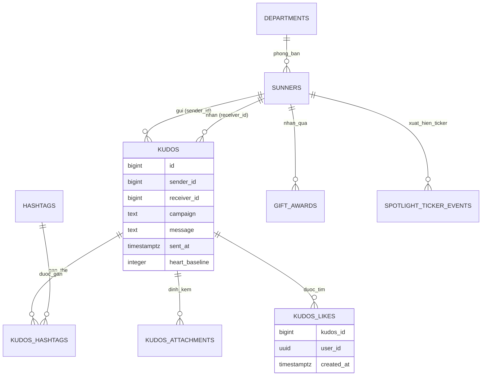
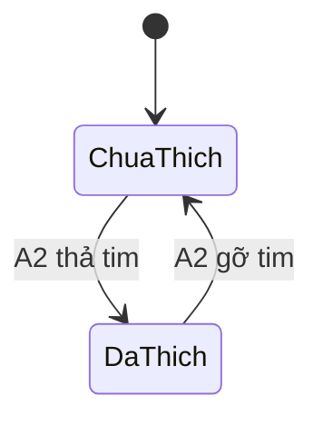

# F004_KudosLiveBoard

## 1. Technical Overview

Server Component công khai tại `/kudos` thay thế `ComingSoon` hiện có (`app/kudos/page.tsx`), đọc toàn bộ dữ liệu Kudos (phòng ban, hashtag, Sunner, kudos, hashtag của kudos, ảnh đính kèm, lượt thích, quà tặng, sự kiện ticker) từ Supabase local qua `lib/supabase/server.ts` — schema Postgres đầu tiên repo này sở hữu (migration + RLS + seed). Bộ lọc, carousel, cuộn vô hạn và tìm kiếm Spotlight là state phía client trên tập dữ liệu đã fetch; chỉ hành động thả tim là ghi thật xuống `kudos_likes`, ràng buộc bởi RLS phân biệt `anon`/`authenticated`.

## 2. Action Index

| # | Action (handler) | Method · Path | Codes | Writes | Detail |
|---|---|---|---|---|---|
| **A0** | *cross-cutting — belongs to no single action* | — | FR-001, FR-002, FR-601 | — | § 4.4 |
| **A1** | `KudosLiveBoardPage#Page` (planned) | `GET` `/kudos` | FR-101, FR-201, FR-202, FR-203, FR-204, FR-205, FR-206, FR-207, FR-402, FR-403, BR-001, BR-003, BR-004, DEC-001, DEC-002, US001, US002, US003, US005, US006, US007, US008 | — *(read-only)* | § 3.1 |
| **A2** | `toggleKudosLike` (planned, Server Action) | `POST` (server action) `/kudos` | FR-401, FR-602, BR-001, BR-002, BR-003, SM-001, DEC-003, US004 | `kudos_likes` | § 3.2 |

## 3. Actions

### 3.1 CAP-01 — Xem & lọc kudos

#### A1 · Đọc và dựng toàn bộ màn hình Kudos Live Board
`GET` `/kudos` → `` `KudosLiveBoardPage#Page` `` (planned)
`FR-101` `FR-201` `FR-202` `FR-203` `FR-204` `FR-205` `FR-206` `FR-207` `FR-402` `FR-403` · `US001` `US002` `US003` `US005` `US006` `US007` `US008`

**Who** · Sunner đã đăng nhập hoặc khách ẩn danh *(gate A0 — § 4.4, FR-601)*
**FE** · Server Component đơn dựng hero + `HIGHLIGHT KUDOS` (carousel top-5) + bộ lọc Hashtag/Phòng ban + `SPOTLIGHT BOARD` (word-cloud + ticker + tìm kiếm) + `ALL KUDOS` (feed cuộn vô hạn) + sidebar cá nhân, theo đúng thứ tự trong `clarifications.md` § "Resolved from source data". Bộ lọc, carousel, cuộn vô hạn, tìm kiếm Spotlight và Copy Link (`FR-402`) đều là state/hành vi phía client trên dữ liệu đã fetch một lần — không gọi lại server khi tương tác.
**Request** · không có tham số bắt buộc; `NEXT_LOCALE` cookie quyết định `vi`/`en` như mọi trang khác (đã có sẵn, không đổi).
**BE** · Đọc `departments`, `hashtags`, `sunners`, `kudos`, `kudos_hashtags`, `kudos_attachments`, `kudos_likes`, `gift_awards`, `spotlight_ticker_events` qua `lib/supabase/server.ts`, theo đúng khuôn `getPageContext()` đã dùng ở `/awards-information`.
**Rule**
- **BR-001 — Số tim hiển thị = `kudos.heart_baseline` cộng số dòng `kudos_likes` của kudos đó.** Trang tính giá trị này khi render để số liệu seed từ frame ("1.000") đúng cho tới khi có lượt tim thật đầu tiên. *(§ 4.4)*
- **BR-003 — Người gửi không tự thả tim cho kudos của chính mình.** Trang render nút tim ở trạng thái `disabled` khi `viewer.id == kudos.sender_id`. *(§ 4.4)*

| DEC | subtype | Condition | What the user sees | Source |
|---|---|---|---|---|
| **DEC-001** | render | `[...kudos_đã_lọc].sort(hearts desc).slice(0, 5)`, tính lại mỗi khi bộ lọc đổi | Carousel Highlight luôn hiện đúng 5 kudos nhiều tim nhất còn lại sau lọc, quay về slide 1 | TBD |
| **DEC-002** | interaction | chọn hashtag/phòng ban (AND-combine); chọn lại option đang chọn | Cả Highlight và All Kudos lọc lại đồng thời; chọn lại để bỏ lọc | TBD |

**Result** · Không ghi DB — chỉ đọc. Điều hướng: thanh soạn Kudos → `/kudos/new`, "Mở Secret Box" → `/kudos/secret-box`, "Xem chi tiết"/avatar/tên → `/kudos/[id]` hoặc `/profile`, ô tìm Sunner ở hero submit tới `/profile?q=...` — cả bốn route đích đều render `ComingSoon` (route đã có hoặc mới, không thuộc phạm vi bản vẽ này).
**Source:** TBD (draft)

<!-- Không có diagram: đọc dữ liệu tĩnh, không ghi bảng nào, không phải hành động nền — dưới ngưỡng cả hai tiêu chí. -->

---

### 3.2 CAP-02 — Tương tác với một kudos

#### A2 · Thả/gỡ tim một kudos
`POST` (server action) `/kudos` → `` `toggleKudosLike` `` (planned)
`FR-401` `FR-602` · `US004` · `SM-001`

**Who** · Sunner đã đăng nhập *(gate A0 — § 4.4, FR-601 chỉ cấp quyền đọc cho `anon`)*
**FE** · Nút tim trên mỗi card kudos, `disabled` khi không có session hoặc khi `viewer.id == kudos.sender_id`. Bấm gọi Server Action, không reload trang; UI cập nhật lạc quan rồi đồng bộ lại theo kết quả ghi.
**Request** · `kudos_id` *(uuid)*
**BE** · `` `toggleKudosLike` `` chèn hoặc xoá đúng một dòng `kudos_likes` khớp `(kudos_id, user_id)` — insert nếu chưa có, delete nếu đã có (toggle).
**Rule**
- **BR-002 — Mỗi (kudos, người xem) chỉ có tối đa một dòng `kudos_likes`.** Ép bằng ràng buộc `unique(kudos_id, user_id)` — đây là quy tắc thả tim duy nhất mà frame có thể biểu đạt được ở mức dữ liệu. *(inline)*
- **BR-001 — Số tim hiển thị = `kudos.heart_baseline` cộng số dòng `kudos_likes`.** Hành động này thay đổi vế thứ hai của công thức; vế `heart_baseline` không đổi. *(§ 4.4)*
- **BR-003 — Người gửi không tự thả tim cho kudos của chính mình.** Được ép lại ở tầng ghi (không chỉ ẩn ở UI) qua RLS `insert`/`delete` chỉ cho `authenticated` và ràng buộc `user_id <> kudos.sender_id`. *(§ 4.4)*

| DEC | subtype | Condition | What the user sees | Source |
|---|---|---|---|---|
| **DEC-003** | interaction | `session == null` HOẶC `viewer.id == kudos.sender_id` | Nút tim `disabled`, không nhận click | TBD |

**Result** · Ghi/xoá `kudos_likes.(kudos_id, user_id)` — số tim hiển thị (BR-001) và `aria-pressed` cập nhật theo đúng một trong hai chiều, không có chiều thứ ba.
**State** · `SM-001`: `Chưa thích` → `Đã thích` *(§ 4.3)*
**Source:** TBD (draft)

<!-- Không có diagram: ghi đúng 1 bảng (kudos_likes), không phải hành động nền — dưới ngưỡng cả hai tiêu chí. -->

---

### 3.3 CAP-03 — Khám phá Spotlight board

Khu vực `SPOTLIGHT BOARD` (`FR-205`, `US006`) không có action riêng — toàn bộ word-cloud, ticker, và ô tìm kiếm được dựng và tương tác trong `A1` (§ 3.1) như một phần của cùng một lần đọc trang; tìm kiếm chỉ lọc mảng đã fetch phía client, không gọi lại server.

### 3.4 CAP-04 — Xem vị trí ghi nhận cá nhân

Sidebar (`FR-207`, `US007`, `BR-004`) cũng được dựng trong `A1` (§ 3.1) — cùng một lần đọc lấy số liệu của Sunner đang đăng nhập (khớp qua `sunners.auth_user_id`), hoặc rơi về Sunner mẫu đã seed (`sunners.auth_user_id IS NULL`) cho khách ẩn danh.

### 3.5 CAP-05 — Tiếp cận các bề mặt Kudos liên quan

Các CTA điều hướng (`FR-101`, `US008`) là các thẻ `<a>`/`<Link>` tĩnh được `A1` dựng ra (§ 3.1, rung **Result**) — không có handler riêng vì các route đích (`/kudos/new`, `/kudos/secret-box`, `/kudos/[id]`, `/profile`) đều hiển thị `ComingSoon`, đã ngoài phạm vi bản vẽ này.

### 3.6 Edge cases

| Action | Scenario | Behavior |
|---|---|---|
| A1 | Bộ lọc lọc ra 0 kudos | Cả Highlight và All Kudos hiện "Hiện tại chưa có Kudos nào." |
| A1 | Feed đã tải hết dữ liệu khớp bộ lọc | Sentinel không tải thêm trang nào nữa, dừng lặng lẽ |
| A2 | Hai request thả tim cùng lúc cho cùng `(kudos_id, user_id)` | Ràng buộc `unique` (BR-002) chặn dòng thứ hai; client hội tụ về đúng một trạng thái sau khi đồng bộ lại |
| A1, A2 | Khách ẩn danh cố gọi `toggleKudosLike` trực tiếp (bỏ qua UI) | RLS `insert`/`delete` chỉ cấp cho `authenticated` → request bị từ chối ở tầng DB, không phụ thuộc UI |

## 4. Shared Foundation

### 4.1 Components

| Component | Responsibility | Used in | File |
|---|---|---|---|
| `KudosLiveBoardPage` (planned) | Server Component duy nhất của route — đọc dữ liệu, dựng hero/highlight/spotlight/all-kudos/sidebar | A1 | `app/kudos/page.tsx` (thay thế nội dung `ComingSoon` hiện có) |
| `toggleKudosLike` (planned) | Server Action ghi/xoá một dòng `kudos_likes` | A2 | TBD (draft) — dự kiến `app/kudos/_actions/toggle-kudos-like.ts` |

### 4.2 Data Model



Every `id` (and every FK to one) is `bigint generated always as identity`, not `uuid` — reconciled
against the shipped migration (`supabase/migrations/20260906140914_kudos_live_board.sql`); the test
suite asserts `/\/kudos\/\d+/` on `kudos-detail-link`/`kudos-edit`/`spotlight-node`, which a uuid
href would fail (test-contract.md ratification #1). `KUDOS_LIKES.user_id` is the one column that
stays `uuid` — it references `auth.users(id)` directly, never `sunners(id)` (ratification #4), so
the `SUNNERS ||--o{ KUDOS_LIKES` relationship above is removed rather than redrawn against an
entity (`auth.users`) this diagram doesn't otherwise model.

| Entity | Table | Key Columns | Purpose |
|--------|-------|-------------|---------|
| Department | `departments` | `id`, `name`, `filter_position` (nullable, unique) | 48 phòng ban của danh sách filter (chép nguyên văn frame); `filter_position` là thứ tự trong dropdown — `NULL` cho phòng ban tồn tại trên người đã seed nhưng không có trong menu (vd. `CEVC10`) |
| Hashtag | `hashtags` | `id`, `name` | 13 hashtag của danh sách filter (chép nguyên văn frame) |
| Sunner | `sunners` | `id`, `auth_user_id` (nullable, unique), `full_name`, `department_id`, `kudos_received_baseline`, `secret_box_opened_count`, `secret_box_unopened_count` | Người gửi/nhận kudos; `auth_user_id IS NULL` = Sunner mẫu đã seed dùng cho fallback ẩn danh (BR-004). Số kudos nhận/gửi và số tim nhận được TÍNH (COUNT/SUM), không lưu cột riêng — tránh lệch dữ liệu (DRY). `kudos_received_baseline` là mốc seed cùng idiom với `heart_baseline`: khớp badge `Legend Hero` (≥ 50 nhận) mà 50 dòng kudos thật không seed nổi |
| Kudos | `kudos` | `id`, `sender_id`, `receiver_id`, `campaign`, `message`, `sent_at`, `heart_baseline` | Một lời cảm ơn; `heart_baseline` là mốc seed dùng trong công thức BR-001 |
| KudosHashtag | `kudos_hashtags` | `kudos_id`, `hashtag_id`, `position` | Bảng nối nhiều-nhiều giữ thứ tự hiển thị hashtag trên card |
| KudosAttachment | `kudos_attachments` | `id`, `kudos_id`, `image_url`, `position` | Ảnh đính kèm, tối đa 5, chỉ hiện trên card feed |
| KudosLike | `kudos_likes` | `id`, `kudos_id`, `user_id` (→ `auth.users.id`, không phải `sunners.id`), `created_at` | Lượt thích thật, `unique(kudos_id, user_id)` ép BR-002 |
| GiftAward | `gift_awards` | `id`, `sunner_id`, `gift_label`, `awarded_at` | Nguồn dữ liệu bảng "10 SUNNER NHẬN QUÀ MỚI NHẤT" (sắp theo `awarded_at desc`, giới hạn 10) |
| SpotlightTickerEvent | `spotlight_ticker_events` | `id`, `sunner_id`, `occurred_at` | Nguồn dữ liệu ticker hoạt động trực tiếp và node "vừa cập nhật" (màu đỏ) trên Spotlight board |

#### Polymorphic Behavior

N/A — no discriminator fields in Key Entities. Badge tier (`New Hero`/`Rising Hero`/`Super Hero`/`Legend Hero`) là giá trị TÍNH từ số kudos đã nhận đối chiếu với ba mốc 10/20/50 (`clarifications.md` § quyết định badge) — không phải cột enum lưu trong DB, nên không đủ điều kiện DISC-###.

### 4.3 State Management

### Trạng thái lượt thích một kudos của một người xem (SM-001)
**kind:** entity
**Linked FR:** FR-401
**Source:** TBD (draft)



**Action transitions:** guard và side effect của mỗi cạnh nằm ở rung **Result** của `A2` (§ 3.2) — không lặp lại ở đây.

### 4.4 Shared Rules

#### Bin 2 — used by ≥2 named actions

**BR-001 — Số tim hiển thị bằng `kudos.heart_baseline` cộng số dòng `kudos_likes` của kudos đó.**
Used in: **A1** · **A2**. `A1` tính công thức này khi render số đếm trên mọi card; `A2` là hành động duy nhất thay đổi vế thứ hai (số dòng `kudos_likes`) của công thức. Cách này giữ nguyên số liệu seed từ frame ("1.000") mà không cần tạo dòng `auth.users` giả — `heart_baseline` chỉ là một cột số nguyên trên `kudos`, không đụng tới bảng `auth.*` do GoTrue sở hữu.
**Source:** TBD (draft)
```text
displayed_hearts(kudos) = kudos.heart_baseline + count(kudos_likes WHERE kudos_id = kudos.id)
```

**BR-003 — Người gửi không thể tự thả tim cho kudos của chính mình.**
Used in: **A1** · **A2**. `A1` render nút tim ở trạng thái `disabled` khi `viewer.id == kudos.sender_id`; `A2` ép lại đúng quy tắc này ở tầng ghi (RLS + ràng buộc) để không thể bỏ qua bằng cách gọi thẳng Server Action.
**Source:** TBD (draft)
```text
can_like(viewer, kudos) = viewer.session != null AND viewer.id != kudos.sender_id
```

#### Bin 3 — cross-cutting, belongs to no single action

None — không có rule nào thuộc diện "không action nào sở hữu"; tư thế đọc-công-khai cho `anon` được ghi nhận trực tiếp là `FR-601`, do `A0` sở hữu trong § 2.

### 4.5 Algorithms & Integrations

### Chọn 5 kudos nổi bật cho carousel Highlight (ALG-001)
**Linked FR:** FR-202
**Used in:** A1
**Source:** TBD (draft)
**Input:** danh sách kudos đã qua bộ lọc Hashtag/Phòng ban hiện tại · **Output:** tối đa 5 kudos, sắp theo số tim giảm dần · **Complexity:** O(n log n)

**Description:** Sắp toàn bộ kudos đã lọc theo `displayed_hearts` (BR-001) giảm dần rồi lấy 5 phần tử đầu; tính lại từ đầu mỗi khi bộ lọc đổi — không phải một danh sách chọn tay cố định.

**Pseudocode:**
```text
function pickHighlight(filteredKudos):
    sorted = sortDescBy(filteredKudos, k => k.heartBaseline + k.likeCount)
    return sorted.slice(0, 5)
```

### Bố cục xác định trước cho word-cloud Spotlight (ALG-002)
**Linked FR:** FR-205
**Used in:** A1
**Source:** TBD (draft)
**Input:** danh sách tên người nhận trong dữ liệu Spotlight · **Output:** toạ độ + tier kích thước cho mỗi node · **Complexity:** O(n)

**Description:** PRNG có seed cố định đặt vị trí từng tên vào một trong ba tier kích thước, cho ra cùng một bố cục mỗi lần với cùng một tập dữ liệu — để lần render đầu tiên trên server và trên trình duyệt khớp byte-cho-byte, tránh hydration mismatch. Không dùng thư viện word-cloud ngoài (YAGNI — chỉ 7 tên trong dữ liệu mẫu của frame).

**Pseudocode:**
```text
function layoutSpotlight(names, seed):
    rng = seededPRNG(seed)
    return names.map(name => ({
        name,
        x: rng.nextInRange(canvas.minX, canvas.maxX),
        y: rng.nextInRange(canvas.minY, canvas.maxY),
        tier: rng.pick([SMALL, MEDIUM, LARGE]),
    }))
```

### 4.6 Configuration

N/A — no technical configuration beyond framework defaults. `/kudos` tái sử dụng các biến môi trường Supabase đã có sẵn toàn dự án (`NEXT_PUBLIC_SUPABASE_URL`, `NEXT_PUBLIC_SUPABASE_ANON_KEY`) — không thêm biến mới.

**Client behavior:** see
[`behavior-logic.md`](../../docs/generated/behavior-logic.md) (client-side patterns — debounce, optimistic UI, polling, upload, realtime),
[`permissions.md`](../../docs/system/permissions.md) (feature flags / experiments / env / locale gates),
[`architecture.md`](../../docs/system/architecture.md) (guards / deep-link state restoration / unsaved-changes protection).

## 5. Verification & Technical Notes

### 5.1 Technical Verification

- **SC-001** *(A1)* Carousel Highlight luôn hiện đúng `min(5, số kudos đã lọc)` slide, sắp theo số tim giảm dần (khớp `test-contract.md` `highlight-slide`/`carousel-pagination`).
- **SC-002** *(A1)* Chọn một filter option lọc lại cả `highlight-section` và `all-kudos-section` cùng lúc và đưa carousel về slide 1 (khớp `test-contract.md` § Filters).
- **SC-003** *(A2)* Bấm tim rồi tải lại trang giữ nguyên `aria-pressed` và `kudos-heart-count` mới — đây là assertion K-25 chứng minh dữ liệu là thật, không phải state client (`test-contract.md` § Supabase amendment).
- **SC-004** *(A2)* Mọi `kudos-heart` bị `disabled` với khách ẩn danh, không click nào đổi được `kudos-heart-count` (K-24).

#### US004_HeartKudos *(A2)*

**Independent Test:** Đăng nhập, bấm tim một kudos không phải do mình gửi, quan sát `aria-pressed` và `kudos-heart-count` đổi đúng 1 đơn vị, tải lại trang, xác nhận cả hai giá trị còn nguyên.

**Acceptance Scenarios:**
1. **Given** Sunner đã đăng nhập xem kudos của người khác, **When** bấm tim, **Then** `aria-pressed="true"` và số đếm tăng đúng 1.
2. **Given** cùng trạng thái đã thích ở kịch bản 1, **When** tải lại trang, **Then** `aria-pressed="true"` và số đếm mới vẫn giữ nguyên (không rơi về giá trị seed cũ).

#### US002_FilterKudosByHashtagAndDepartment *(A1)*

**Independent Test:** Chọn một hashtag, xác nhận cả hai khu vực lọc lại đồng thời và carousel reset; chọn lại đúng option đó, xác nhận bộ lọc bị bỏ.

**Acceptance Scenarios:**
1. **Given** carousel đang ở slide 2, **When** chọn một hashtag, **Then** carousel reset về slide 1 và cả hai khu vực chỉ còn kudos khớp hashtag.
2. **Given** hashtag đó đang được chọn, **When** bấm lại chính option đó, **Then** `aria-selected` trở về false và cả hai khu vực trả về đầy đủ.

### 5.2 Assumptions

- *(A1)* **A1 — Bản chép từ `clarifications.md`:** dữ liệu mẫu (mock dataset) là tầng dữ liệu. **Được tinh chỉnh bởi override Supabase (session b):** tầng dữ liệu thật giờ là các bảng Postgres của Supabase local (migration + seed), không còn là module TS đông cứng; phần khẳng định "bộ lọc/carousel/tìm kiếm là state phía client, reset khi reload" của A1 vẫn đúng nguyên vẹn — chỉ hàng dữ liệu bên dưới đổi từ TS sang Supabase.
- *(A1)* **A2 — SUPERSEDED bởi override Supabase (session b):** A2 gốc nói sidebar luôn dựng từ viewer mẫu bất kể session. Nay sidebar đọc số liệu thật của Sunner đang đăng nhập (khớp qua `sunners.auth_user_id`); chỉ khách ẩn danh mới rơi về Sunner mẫu đã seed (`sunners.auth_user_id IS NULL`) — xem BR-004.
- *(A1)* **A3 — không đổi:** ảnh đính kèm và avatar là ảnh mẫu (`MM_MEDIA_Sample Image`) ngay trong chính thiết kế; một ảnh mẫu dùng chung cho mỗi vai trò là trung thực với frame, không phải tuyên bố về ảnh người thật.
- *(A1, A2)* **A4 — không đổi:** cuộn vô hạn trên một feed mẫu hữu hạn nghĩa là "hiện thêm theo trang N khi sentinel lọt vào khung nhìn, rồi dừng". Seed cần đủ dòng để phân trang được ít nhất hai lần cho cơ chế này quan sát được.

### 5.3 Unresolved Questions

1. **Auth guard toàn màn hình** *(A0)*: test case `71b3ef43` của spec CSV yêu cầu redirect về `/login` cho khách ẩn danh — mâu thuẫn với quyết định giữ route công khai (`clarifications.md` quyết định #3) và với 6 test `anon` đã pass tới `/kudos` không cần đăng nhập. Cần một quyết định sản phẩm liệu toàn bộ Kudos có nên trở thành members-only hay không; hiện route vẫn công khai, test case này ghi nhận nhưng không cài đặt.
2. **Cộng dồn tim vào tài khoản người gửi + ngày đặc biệt x2** *(A2)*: test case `31936b72` và nửa account-balance của `63645b03`/`91e102ba` cần persistence cộng dồn cho người gửi và một màn `Admin - Setting` để cấu hình ngày đặc biệt — cả hai chưa tồn tại. Cờ `x2` (flame glyph) trên sidebar chỉ HIỂN THỊ, không mô phỏng cộng dồn thật.
3. **Phân biệt lượt tim thường và lượt tim đặc biệt để thu hồi đúng** *(A2)*: ghi chú `qa` trong spec CSV item C.4.1 là một vấn đề backend không có biểu hiện phía client ở bản vẽ này — chuyển cho commission nào xây dựng đầy đủ cơ chế cộng dồn tim.
4. **Đích tìm kiếm Sunner ở hero** *(A1)*: ô tìm ở hero (`sunner-search`) không có màn kết quả thật — submit tới `/profile` (`ComingSoon`) kèm từ khoá; màn tìm Sunner thật (tương đương `[iOS] Sun*Kudos_Search Sunner`) chưa tồn tại ở web.
5. **Xử lý khi trình duyệt chặn quyền clipboard** *(A1)*: `clarifications.md` không mô tả hành vi khi Clipboard API bị trình duyệt chặn cho `kudos-copy-link` — cần đọc thêm code khi hiện thực để chọn cách báo lỗi (toast lỗi, fallback chọn text thủ công, hay im lặng), chưa quyết định ở bản vẽ này.

### 5.4 Source References

<!-- Các file dưới đây ĐÃ TỒN TẠI trong repo hôm nay — đây không phải Source rung của một action (chưa có code nào được viết cho feature này), mà là các file có sẵn mà bản vẽ này phụ thuộc vào / sẽ chỉnh sửa. -->

| Action | Order | Symbol | Path | Purpose |
|---|---|---|---|---|
| — | 1 | `ComingSoon` placeholder hiện tại | `app/kudos/page.tsx:1-14` | Nội dung sẽ bị thay thế; giữ nguyên convention `metadata` title `"Sun* Kudos — Sun* Annual Awards 2025"` (dòng 5) |
| A1, A2 | 2 | `createClient` | `lib/supabase/server.ts:11` | Client Supabase phía server, `cookies()` đã là async — mẫu đọc dữ liệu tái sử dụng cho A1 |
| A1 | 3 | `getPageContext` | `app/_page-context.ts:27-42` | Nguồn `locale`/`dictionary`/`isAuthenticated` duy nhất; chỉ hai boolean này (không phải object `user`) được truyền xuống Client Component, theo đúng quy tắc ở dòng 22-25 |
| A0 | 4 | route guard | `proxy.ts:41-46` | Chỉ canh `/todo` và `/login` — xác nhận `/kudos` nằm ngoài guard, khớp quyết định #3 của clarifications.md |
| A0 | 5 | cấu hình migration/seed | `supabase/config.toml:58-63,65-70` | `[db.migrations]` và `[db.seed]` đã bật; `seed.sql` được khai báo nhưng chưa tồn tại — bản vẽ này là schema SQL đầu tiên repo sở hữu |

#### Data Flow

```text
{Server render request /kudos} -> {A1 đọc 9 bảng qua lib/supabase/server.ts} -> {tính BR-001 cho từng kudos, dựng hero/highlight/spotlight/all-kudos/sidebar} -> {HTML render, state lọc/carousel/tìm kiếm sống ở client}
{Bấm nút tim} -> {A2 Server Action nhận kudos_id} -> {insert/delete kudos_likes theo RLS authenticated} -> {trả trạng thái mới, FE cập nhật aria-pressed + count}
```

### 5.5 Artifact References

| Artifact | File | Codes Used | Reviewed |
|----------|------|------------|----------|
| System Overview | [system-overview.md](../../docs/system/system-overview.md) | — | [ ] |
| Architecture | [architecture.md](../../docs/system/architecture.md) | — | [ ] |
| Feature List | [feature-list.md](../../docs/generated/feature-list.md) | TBD (draft) | [ ] |
| Entities | [entities.md](../../docs/generated/entities.md) | TBD (draft) | [ ] |
| Screens | [functional-spec.md § 6](./functional-spec.md#6-screens) | TBD (draft) | [ ] |
| User Stories | [user-stories.md](../../docs/generated/user-stories.md) | TBD (draft) | [ ] |
