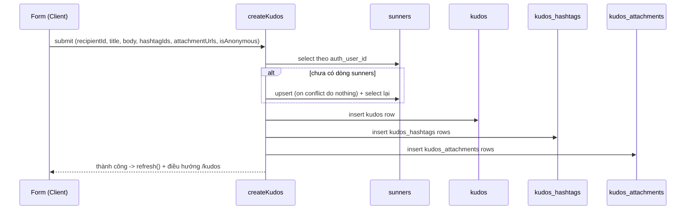

# F005_VietKudo

## 1. Technical Overview

Trang `/kudos/new` (Client Component form + Server Action) thay thế nội dung `ComingSoon` hiện có, chỉ vào được khi đã đăng nhập — guard đầu tiên `proxy.ts` thêm kể từ F001. Ghi thật xuống Postgres qua ba cột mới trên `kudos` (`is_anonymous`, `anonymous_name`, `message_format`) cùng policy INSERT mới cho `kudos`/`kudos_hashtags`/`kudos_attachments`/`sunners`, tự động cấp một dòng `sunners` cho Sunner đăng nhập lần đầu, và tải ảnh thật lên một bucket Supabase Storage mới. Nội dung định dạng được lưu dưới dạng một document JSON tối giản, dựng lại thành React element — không bao giờ `dangerouslySetInnerHTML` — để không mở thêm bề mặt XSS trên một bảng tin công khai.

## 2. Action Index

| # | Action (handler) | Method · Path | Codes | Writes | Detail |
|---|---|---|---|---|---|
| **A0** | *cross-cutting — belongs to no single action* | — | FR-101, FR-601, FR-602 | — | § 4.4 |
| **A1** | `KudosComposePage#Page` (planned) | `GET` `/kudos/new` | FR-102, FR-201, FR-202, FR-203, FR-204, FR-205, FR-206, FR-207, FR-208, FR-209, FR-210, FR-211, FR-212, FR-401, FR-403, BR-002, BR-003, DEC-001, DEC-002, US001, US002, US003 | — *(read-only)* | § 3.1 |
| **A2** | `uploadKudosAttachment` (planned, client → Storage) | `POST` (Storage upload) `kudos-attachments/*` | FR-001, FR-206, BR-004, US002 | Storage object (`kudos-attachments` bucket) | § 3.2 |
| **A3** | `createKudos` (planned, Server Action) | `POST` (server action) `/kudos/new` | FR-002, FR-003, FR-402, FR-403, BR-001, BR-002, BR-004, BR-005, US001, US002, US003 | `sunners`, `kudos`, `kudos_hashtags`, `kudos_attachments` | § 3.3 |

## 3. Actions

### 3.1 CAP-01 — Soạn nội dung Kudos

#### A1 · Dựng trang soạn Kudos và xử lý toàn bộ tương tác nhập liệu
`GET` `/kudos/new` → `` `KudosComposePage#Page` `` (planned)
`FR-102` `FR-201` `FR-202` `FR-203` `FR-204` `FR-205` `FR-206` `FR-207` `FR-401` `FR-403` · `US001` `US002` `US003`

**Who** · Sunner đã đăng nhập *(gate A0 — § 4.4, FR-101/FR-601)*
**FE** · Client Component dựng form một trang (không phải modal chồng route) theo đúng thứ tự trường của `test-contract.md` § "Field order": Người nhận → Danh hiệu → ô soạn nội dung (toolbar 6 nút + textarea + hint) → Hashtag → Image → checkbox ẩn danh → footer Hủy/Gửi. Ô tìm Người nhận và mention `@` đều lọc client-side (substring, đã trim, không phân biệt hoa/thường — `ALG-001`, § 4.5) trên danh sách Sunner đã fetch một lần khi trang render, cùng khuôn với cách F004 lọc Highlight/All Kudos trên dữ liệu đã fetch. Dropdown Hashtag (`+ Hashtag`) cũng lấy danh sách hashtag đã fetch cùng lúc.
**Request** · không tham số bắt buộc.
**BE** · Đọc `sunners` (autocomplete Người nhận + mention) và `hashtags` (dropdown) qua `lib/supabase/server.ts`, cùng khuôn `getPageContext()` đã dùng ở mọi trang khác.
**Rule**
- **BR-002 — Một Kudos phải có tối thiểu 1 và tối đa 5 hashtag.** Trang này ép nửa "tối đa 5" bằng cách vô hiệu hoá các dòng hashtag chưa chọn khi đã đủ 5, kèm `Tối đa 5 hashtag` hiển thị thường trực làm lý do (FR-210, FR-211); reducer vẫn giữ guard `MAX_HASHTAGS` phía sau. Nửa "tối thiểu 1" được server ép lại khi gửi. *(§ 4.4)*
- **BR-003 — Một Kudos đính kèm tối đa 5 ảnh.** Nút `+ Image` bị ẩn hoàn toàn (không phải disabled) khi đã đủ 5, và hiện lại ngay khi một ảnh bị xoá. *(inline)*

| DEC | subtype | Condition | What the user sees | Source |
|---|---|---|---|---|
| **DEC-001** | interaction | `anonymousChecked === true` | Ô nhập tên hiển thị ẩn danh hiện ra ngay dưới checkbox; tắt lại checkbox ẩn ô đó đi | `app/kudos/new/page.tsx:1` (planned) |
| **DEC-002** | render, interaction | `recipient` VÀ `title` VÀ `body` VÀ `hashtags.length >= 1` đều có giá trị | Nút Gửi chuyển từ `disabled` sang có thể bấm; thiếu bất kỳ điều kiện nào nút vẫn `disabled` | `app/kudos/new/page.tsx:1` (planned) |

**Result** · Không ghi DB — chỉ đọc. Bấm Hủy đóng form ngay và điều hướng về `/kudos`, không gọi server, không lưu gì (FR-403 nửa Hủy). Bấm Gửi (khi nút đã mở khoá) chuyển sang A3.
**Source:** TBD (draft)

<!-- Không có diagram: đọc dữ liệu tĩnh (sunners, hashtags), không ghi bảng nào, không phải hành động nền — dưới ngưỡng cả hai tiêu chí. -->

---

### 3.2 CAP-02 — Đính kèm hashtag và ảnh

Dropdown Hashtag (`+ Hashtag`, danh sách lấy động từ `hashtags` theo `position`, tối đa 5 lựa chọn) được dựng và tương tác ngay trong `A1` (§ 3.1) — cùng một lần render, không có handler riêng. Danh sách là một multi-select có trạng thái (FR-208..FR-212, MoMorph `p9zO-c4a4x`): mỗi dòng tự vẽ trạng thái selected của nó, bấm để bật/tắt qua đúng hai callback `onAdd`/`onRemove` đã có trong `compose-contract.ts`, và khi đủ 5 thì các dòng chưa chọn nhận `disabled`. Giao diện không bao giờ tự ép cap — `composeReducer` (`compose-state.ts`) vẫn là nơi duy nhất giữ guard `MAX_HASHTAGS`, `disabled` chỉ là lớp hiển thị đứng trước nó. Chỉ việc tải ảnh thật lên Storage cần một hành động ghi riêng, vì nó chạm tới Supabase Storage ngay khi người dùng chọn file, trước khi form được gửi.

#### A2 · Tải ảnh lên Supabase Storage khi chọn file
`POST` (Storage upload) `kudos-attachments/*` → `` `uploadKudosAttachment` `` (planned)
`FR-001` `FR-206` · `US002`

**Who** · Sunner đã đăng nhập *(gate A0 — § 4.4)*
**FE** · Bấm `+ Image` mở file picker của trình duyệt (input file, chấp nhận ảnh, cho chọn nhiều file); mỗi file được kiểm tra định dạng ngay khi chọn — sai định dạng bị từ chối tại chỗ, không gọi Storage. File hợp lệ hiện thumbnail đúng ảnh vừa chọn kèm nút xoá ngay khi tải lên xong.
**Request** · file ảnh nhị phân từ input, gửi trực tiếp qua Supabase client phía trình duyệt tới bucket `kudos-attachments`.
**BE** · `storage.objects` INSERT giới hạn bởi policy owner-scoped (§ 4.2) — object được lưu dưới một path riêng cho phiên đăng nhập đó; không có bảng Postgres nào bị ghi ở bước này — `kudos_attachments` chỉ được ghi ở A3, sau khi biết `kudos_id`. Bucket `kudos-attachments` (FR-001) phải tồn tại và bật RLS trước khi A2 chạy được lần đầu.
**Rule**
- **BR-004 — Chỉ file đúng định dạng ảnh mới được đính kèm.** Kiểm tra ngay tại đây (client, trước khi gọi Storage) và kiểm tra lại lần nữa ở A3 khi ghi `kudos_attachments` — client không được tin tưởng một mình. *(§ 4.4)*

**Result** · Ghi một object mới vào bucket `kudos-attachments`, trả về URL cho thumbnail hiển thị ngay; URL này được giữ ở state phía client cho tới khi A3 ghi nó vào `kudos_attachments.image_url`. Xoá một thumbnail chỉ xoá khỏi state hiển thị (không xoá object khỏi Storage ở bản vẽ này — object mồ côi không phải rủi ro bảo mật, chỉ là dọn dẹp có thể làm sau).
**Source:** TBD (draft)

<!-- Không có diagram: ghi đúng một object Storage, không phải hành động nền — dưới ngưỡng cả hai tiêu chí. -->

---

### 3.3 CAP-03 — Gửi hoặc hủy Kudos

Hủy đóng form ngay và điều hướng về `/kudos`, không gọi server — xử lý trong `A1` (§ 3.1, rung **Result**), không có handler riêng.

#### A3 · Gửi Kudos — validate, ghi dữ liệu, điều hướng về bảng tin
`POST` (server action) `/kudos/new` → `` `createKudos` `` (planned)
`FR-002` `FR-003` `FR-402` `FR-403` · `US001` `US002` `US003`

**Who** · Sunner đã đăng nhập *(gate A0 — § 4.4, FR-601/FR-602)*
**FE** · Client Component gọi Server Action qua `useActionState` (API hiện tại của Next 16.3.4 — `node_modules/next/dist/docs/01-getting-started/07-mutating-data.md:190-274`), hiện trạng thái đang xử lý trong lúc chờ, và dựng lại lỗi theo trường từ state trả về nếu server từ chối.
**Request** · `recipientId` *(sunner id đã chọn)*, `title` *(Danh hiệu)*, `body` *(document JSON — § 4.2)*, `hashtagIds` *(1–5)*, `attachmentUrls` *(0–5, từ A2)*, `isAnonymous` *(boolean)*, `anonymousName` *(tuỳ chọn)*.
**BE** · Chỉ chạy được sau khi migration của FR-002 (ba cột mới + bốn policy INSERT) và seed của FR-003 (phòng ban `Unassigned`) đã áp dụng. Trong một transaction:
  1. Suy ra `sunnerId` của actor từ session (`sunners.auth_user_id = auth.uid()`); nếu chưa có dòng `sunners` nào khớp, upsert một dòng mới với `department_id` trỏ vào phòng ban `Unassigned` đã seed (`on conflict (auth_user_id) do nothing`) rồi select lại — chống double-submit tạo trùng.
  2. Validate lại toàn bộ rule bắt buộc (Người nhận, Danh hiệu, nội dung, tối thiểu 1 hashtag) — không chỉ dựa vào trạng thái nút Gửi phía client.
  3. Insert một dòng `kudos` (`sender_id` = sunnerId vừa suy ra, `receiver_id`, `campaign` = Danh hiệu, `message` = document JSON đã serialize, `message_format = 'doc'`, `is_anonymous`, `anonymous_name`, `sent_at = now()`).
  4. Insert các dòng `kudos_hashtags` và `kudos_attachments` tương ứng, tham chiếu `kudos.id` vừa tạo.



**Rule**
- **BR-001 — Sunner viết Kudos lần đầu được tự động cấp một dòng `sunners`.** `full_name`/`avatar_url` lấy từ `user_metadata` của phiên Google OAuth (`full_name`/`name`, `avatar_url`/`picture`), rơi về phần trước `@` của email và ảnh mẫu đã commit (`public/images/kudos/sample-avatar.png`) nếu hồ sơ thiếu; `department_id` luôn là phòng ban `Unassigned` đã seed (§ 4.2), `filter_position NULL` nên không lọt vào dropdown lọc Phòng ban của F004. *(inline)*
- **BR-002 — Một Kudos phải có tối thiểu 1 và tối đa 5 hashtag.** Nửa "tối thiểu 1" được ép lại ở đây — thiếu hashtag khiến request bị từ chối dù nút Gửi đã mở khoá bằng cách nào đó. *(§ 4.4)*
- **BR-004 — Chỉ file đúng định dạng ảnh mới được đính kèm.** Kiểm tra lại URL/metadata của từng `attachmentUrls` trước khi ghi `kudos_attachments`, không tin riêng kết quả kiểm tra ở A2. *(§ 4.4)*
- **BR-005 — Kudos ẩn danh ẩn người gửi thật trên bảng tin công khai.** Cột `is_anonymous`/`anonymous_name` được ghi ở đây; card Kudos trên `/kudos` (F004, ngoài phạm vi bản vẽ này) là nơi thật sự đổi cách hiển thị — bản vẽ này chỉ đảm bảo dữ liệu được ghi đúng để F004 đọc được. *(inline)*

**Result** · Insert `sunners` (nếu cần), `kudos`, `kudos_hashtags`, `kudos_attachments` trong cùng một transaction. Thành công → `refresh()` (theo đúng khuôn `toggleKudosLike`) rồi điều hướng trình duyệt về `/kudos`, nơi Kudos mới đã hiển thị. Thất bại (validate hoặc ghi lỗi) → trả về state lỗi theo trường, không điều hướng, không có gì được ghi (transaction rollback).
**Source:** TBD (draft)

### 3.4 Edge cases

| Action | Scenario | Behavior |
|---|---|---|
| A1 | Cố thêm hashtag thứ 6 | Bị chặn tại chỗ, hiện `Tối đa 5 hashtag`, 5 hashtag cũ giữ nguyên |
| A1 | Đã đủ 5 ảnh, xoá bớt 1 | Nút `+ Image` hiện lại ngay, không cần tải lại trang |
| A2 | Chọn file `.pdf`/`.mp4`/`.txt` | Bị từ chối tại chỗ, không gọi Storage, không có thumbnail nào được thêm |
| A3 | Hai request Gửi cùng lúc từ một Sunner chưa từng có dòng `sunners` | Upsert `on conflict (auth_user_id) do nothing` + select lại đảm bảo chỉ một dòng `sunners` được tạo |
| A3 | Nút Gửi đã mở khoá (state client cũ) nhưng thiếu hashtag khi request tới server | Server vẫn từ chối theo BR-002, không có gì được ghi |
| A0 | Khách chưa đăng nhập cố truy cập `/kudos/new` trực tiếp | `proxy.ts` chuyển hướng sang `/login` trước khi trang render |

## 4. Shared Foundation

### 4.1 Components

| Component | Responsibility | Used in | File |
|---|---|---|---|
| `KudosComposePage` (planned) | Client Component duy nhất của route — dựng toàn bộ form, quản lý state client (hashtag chip, thumbnail, checkbox ẩn danh, trạng thái nút Gửi) | A1 | `app/kudos/new/page.tsx` (thay thế nội dung `ComingSoon` hiện có) |
| `uploadKudosAttachment` (planned) | Hàm phía client gọi Supabase Storage khi chọn file ảnh | A2 | TBD (draft) — dự kiến `app/kudos/new/_actions/upload-kudos-attachment.ts` |
| `createKudos` (planned) | Server Action validate + ghi `sunners`/`kudos`/`kudos_hashtags`/`kudos_attachments` | A3 | TBD (draft) — dự kiến `app/kudos/new/_actions/create-kudos.ts`, cùng thư mục `_actions` mà `app/kudos/_actions/toggle-kudos-like.ts` đã dùng cho F004 |

### 4.2 Data Model

Chín trong mười bảng F004 đã tạo (`departments`, `hashtags`, `sunners`, `kudos`, `kudos_hashtags`, `kudos_attachments`, `kudos_likes`, `gift_awards`, `spotlight_ticker_events`, `board_stats`) không bị định nghĩa lại ở đây — xem `docs/features/F004_KudosLiveBoard/technical-spec.md § 4.2`. Phần dưới đây là **phần thêm mới** riêng cho bản vẽ này.

#### Key Entities

| Entity | Table | Key Columns (mới thêm) | Purpose |
|--------|-------|-------------|---------|
| Kudos (delta) | `kudos` | `is_anonymous boolean not null default false`, `anonymous_name text null`, `message_format text not null default 'plain'` | Ba cột mới; `message_format` phân biệt Kudos cũ (`'plain'`, 57 dòng F004 đã seed) với Kudos mới soạn qua form này (`'doc'`) |
| Sunner (không đổi cấu trúc) | `sunners` | *(không đổi)* | Chỉ thêm cách một dòng mới được tạo (auto-provision, BR-001) — không đổi cột |
| Phòng ban Unassigned (dòng seed mới) | `departments` | `name = 'Unassigned'`, `filter_position = NULL` | Phòng ban mặc định cho Sunner tự động cấp; `filter_position NULL` giữ nguyên số lượng 50 option trong dropdown lọc Phòng ban của F004 |
| Bucket ảnh đính kèm (mới) | Supabase Storage — `storage.buckets` | `id/name = 'kudos-attachments'` | Bucket thật cho ảnh đính kèm; `supabase/config.toml:114-120` hiện đang comment phần khai báo bucket, bản vẽ này bật nó lên |

#### Polymorphic Behavior

**DISC-001 — `kudos.message_format`** (`'plain' \| 'doc'`)

| Value | Behavior |
|---|---|
| `'plain'` | Dựng y hệt như F004 đã làm — text thuần, line-clamp theo đúng card hiện có. Toàn bộ 57 dòng seed của F004 và mọi dòng cũ giữ giá trị này. |
| `'doc'` | Dựng bằng cách duyệt document JSON (bên dưới) thành React element — không bao giờ `dangerouslySetInnerHTML`. Chỉ Kudos soạn qua `/kudos/new` mang giá trị này. |

**Document JSON cho nội dung định dạng** (giá trị của cột `kudos.message` khi `message_format = 'doc'`; document tối giản, đóng theo đúng 6 nút toolbar — không lồng sâu hơn thế):

```ts
type KudosDoc = { blocks: KudosBlock[] };

type KudosBlock =
  | { type: "paragraph"; runs: KudosRun[] }
  | { type: "ordered-list-item"; runs: KudosRun[] }
  | { type: "quote"; runs: KudosRun[] };

type KudosRun =
  | { type: "text"; text: string; bold?: boolean; italic?: boolean; strike?: boolean }
  | { type: "link"; text: string; href: string }
  | { type: "mention"; sunnerId: number; label: string };
```

`mention` giữ `sunnerId` để khi hiển thị lại không cần resolve tên một lần nữa — chỉ in `label` đã lưu tại thời điểm mention.

**INSERT policy mới, cùng idiom bridge qua `sunners.auth_user_id = (select auth.uid())` mà `kudos_likes_insert_own` đã dùng** (`supabase/migrations/20260906140914_kudos_live_board.sql:172-179`):

```sql
-- kudos: sender_id phải resolve đúng về sunners của chính người gọi
create policy "kudos_insert_own" on public.kudos for insert to authenticated
with check (exists (
  select 1 from public.sunners s
  where s.id = sender_id and s.auth_user_id = (select auth.uid())
));
-- kudos_hashtags / kudos_attachments: cùng shape, bắc cầu qua kudos cha
create policy "kudos_hashtags_insert_own" on public.kudos_hashtags for insert to authenticated
with check (exists (
  select 1 from public.kudos k join public.sunners s on s.id = k.sender_id
  where k.id = kudos_id and s.auth_user_id = (select auth.uid())
));
-- kudos_attachments_insert_own: cùng WITH CHECK, đổi tên bảng.
-- sunners: một Sunner chỉ tự tạo được đúng dòng của chính mình
create policy "sunners_insert_own" on public.sunners for insert to authenticated
with check ((select auth.uid()) = auth_user_id);
```

Không có UPDATE/DELETE policy nào được thêm ở bản vẽ này — sửa/xoá Kudos là commission khác (`clarifications.md` § Unresolved question 5).

### 4.3 State Management

None. Không có state machine nào đạt ngưỡng phân loại (`kind: ui` chỉ áp dụng cho ≥3 trạng thái HOẶC ≥2 chuyển tiếp) — checkbox ẩn danh và trạng thái nút Gửi chỉ là 2 trạng thái/1 chuyển tiếp mỗi cái, đã mô tả đủ bằng `DEC-001`/`DEC-002` (§ 3.1) mà không cần một `SM-###` riêng.

### 4.4 Shared Rules

#### Bin 2

- **BR-002 — Một Kudos phải có tối thiểu 1 và tối đa 5 hashtag.** Nửa "tối đa 5" được A1 chặn ngay khi thêm hashtag (client); nửa "tối thiểu 1" được A3 ép lại khi ghi (server) — hai lớp độc lập, không tin riêng lớp client. **Used in:** A1, A3.
- **BR-004 — Chỉ file đúng định dạng ảnh mới được đính kèm.** A2 kiểm tra ngay khi chọn file (client, trước khi gọi Storage); A3 kiểm tra lại URL/metadata trước khi ghi `kudos_attachments` (server) — cùng lý do defense-in-depth mà `docs/system/permissions.md:91` đã phát biểu cho `kudos_likes`: "Hai lớp này phải cùng đúng, và nếu chỉ một lớp đúng thì lớp phải đúng là RLS". **Used in:** A2, A3.

#### Bin 3

- **BR — Không có ghi nào của tính năng này chấp nhận actor id từ client.** `sender_id`/`sunnerId` luôn suy ra từ session qua `sunners.auth_user_id = (select auth.uid())` (§ 4.2) — không bao giờ nhận trực tiếp từ request body, cùng idiom `toggleKudosLike` (`app/kudos/_actions/toggle-kudos-like.ts:60-75`) đã dùng cho F004. Cross-cutting: áp dụng cho mọi ghi của A2 và A3, không riêng một action. **Claimed by:** A0.

### 4.5 Algorithms & Integrations

### Lọc gợi ý Người nhận và mention theo chuỗi tìm kiếm đã trim (ALG-001)
**Linked FR:** FR-202
**Used in:** A1
**Source:** `TBD (draft)`

Substring match, không phân biệt hoa/thường, trên danh sách `sunners` đã fetch một lần khi A1 render — khoảng trắng đầu/cuối chuỗi tìm được trim trước khi so khớp (khớp `test-contract.md` § Fields, ID-10). Không gọi lại server khi gõ tiếp — cùng khuôn dữ liệu-đã-fetch-lọc-ở-client mà F004 dùng cho bộ lọc Hashtag/Phòng ban.

### Tải ảnh thật lên Supabase Storage (INT-001)
**Linked FR:** FR-206
**Used in:** A2
**Source:** `TBD (draft)`

A2 gọi Supabase client phía trình duyệt (`@supabase/ssr`, đã là dependency có sẵn) upload trực tiếp tới bucket `kudos-attachments` khi người dùng chọn file — không qua Server Action trung gian cho bước upload, chỉ URL kết quả mới đi qua A3 khi gửi form.

### 4.6 Configuration

None.

**Client behavior:** see behavior-logic.md, permissions.md, architecture.md

## 5. Verification & Technical Notes

### 5.1 Technical Verification

- **SC-001** *(A1)* Mọi hook trong `test-contract.md` (`compose-form`, `recipient-input`/`recipient-menu`/`recipient-empty`/`recipient-selected`, `title-input`/`title-hint`, `body-editor`/`body-hint`, `toolbar-*`, `link-dialog`/`link-url-input`, `mention-menu`/`mention-option`, `hashtag-*`, `image-*`, `anonymous-checkbox`/`anonymous-name-input`, `field-error-*`, `compose-submit`/`compose-cancel`) render đúng thuộc tính đã liệt kê ở đó — nguồn xác nhận duy nhất khi implement, không lặp lại nội dung ở đây.
- **SC-002** *(A1)* Nút Gửi chỉ chuyển sang có thể bấm khi cả 4 điều kiện của `DEC-002` đều đúng cùng lúc — xoá lại bất kỳ điều kiện nào phải khoá nút ngay.
- **SC-003** *(A3)* Gửi thành công phải chứng minh được bằng dữ liệu thật: Kudos mới xuất hiện trên `/kudos` sau điều hướng, không chỉ là form đóng lại (`test-contract.md` § Submit state).
- **SC-004** *(A2, A3)* Một file `.pdf`/`.mp4`/`.txt` bị từ chối ở cả hai lớp — chọn file đó không tạo thumbnail (A2) và không thể lách qua bằng cách gọi thẳng `createKudos` với một URL giả mạo đuôi ảnh (A3 kiểm tra lại).

### 5.2 Assumptions

- **A1 — Một phòng ban `Unassigned` (`filter_position NULL`) backing Sunner tự động cấp.** Schema đòi hỏi `department_id not null`, một Sunner Google OAuth mới đăng nhập không có phòng ban thật, và thiết kế không trả lời câu này. `filter_position NULL` giữ dropdown lọc Phòng ban của F004 đúng nguyên 50 option.
- **A2 — Danh hiệu là bắt buộc và map vào `kudos.campaign`.** Bắt buộc theo dấu `*` trên frame; cột vẫn `nullable` vì các Kudos cũ/seed không có Danh hiệu.
- **A3 — Ẩn danh ẩn người gửi trên bảng tin công khai.** Khi `is_anonymous = true`, card F004 (ngoài phạm vi bản vẽ này) hiển thị tên hiển thị ẩn danh (hoặc một nhãn trung lập nếu bỏ trống) thay cho chip người gửi thật; người nhận luôn hiển thị đúng — ẩn danh bảo vệ người gửi, không bảo vệ người nhận.
- **A4 — Nội dung không có giới hạn độ dài.** Không có `maxLength` nào trong CSV thiết kế và không test case nào assert giới hạn, nên không ép giới hạn nào và không dựng bộ đếm ký tự, dù tên item `D.1` ("Gợi ý và bộ đếm ký tự") gợi ý có một cái.
- **A5 — Ảnh tải lên là file thật của người dùng, lưu trên Supabase Storage**, không phải placeholder `MM_MEDIA_Sample Image` của thiết kế. Khác với assumption A3 của F004 (nơi ảnh chỉ *hiển thị* placeholder) — test case của màn này (`ID-37`) đòi hỏi đúng file đã chọn phải round-trip lại thành thumbnail.

### 5.3 Unresolved Questions

1. **`Danh hiệu` không có spec item hay test case nào trong CSV thiết kế.** Đang được xây dựa trên dấu `*` bắt buộc trên frame (node `1688:10436`). Error copy riêng, giới hạn độ dài, và vị trí chính xác trong `ID-3` field order đều chưa có tài liệu — cần một lượt refresh design/spec để bắt kịp node family `1688:*`.
2. **`D.1` hứa hẹn một bộ đếm ký tự** ("Gợi ý và bộ đếm ký tự") mà frame không vẽ và không test case nào assert, cũng không có giới hạn độ dài nào được ghi ở bất kỳ đâu — không xây (assumption A4). Nếu sau này cần một giới hạn, cả con số lẫn vị trí đặt bộ đếm đều cần thiết kế lại.
3. **Hai companion frame trong phạm vi (`zJzaC9GgXt` — dropdown Người nhận, `5c7PkAibyD` — trạng thái lỗi) không có nội dung spec đã được author.** Hành vi của chúng đang được suy ra từ test case thay vì từ spec thật — một lượt spec riêng cho hai frame này sẽ xác nhận hoặc sửa lại suy luận đó.
4. **Ô nhập tên hiển thị ẩn danh được `ID-43`/`ID-44` yêu cầu nhưng không có trong phần render thấy được của frame.** Nhãn, placeholder, validation và giới hạn độ dài đều chưa có tài liệu — bản vẽ này cho ra một input text tuỳ chọn với nhãn đã dịch, chờ thiết kế bổ sung.
5. **Sửa và xoá một Kudos đã gửi cố tình không nằm trong phạm vi này** — không có UPDATE/DELETE policy nào được tạo. `Màn Sửa bài viết- edit mode` và `Admin - Review content` là các commission riêng; nút bút sửa trên bảng tin (F004) vẫn dẫn tới `ComingSoon`.
6. **Một số đo `1006px` đáng ngờ trên toolbar** được ghi nhận ở `reports/design-source-analysis.md` chứ không được tin dùng trực tiếp — bản thân modal đo được `752px`. Người hiện thực cần đo lại thay vì lan truyền con số này.

### 5.4 Source References

<!-- Các file dưới đây ĐÃ TỒN TẠI trong repo hôm nay — đây không phải Source rung của một action (chưa có code nào được viết cho feature này), mà là các file có sẵn mà bản vẽ này phụ thuộc vào / sẽ chỉnh sửa. -->

| Action | Order | Symbol | Path | Purpose |
|---|---|---|---|---|
| — | 1 | `Page` placeholder hiện tại | `app/kudos/new/page.tsx:1-15` | Nội dung sẽ bị thay thế; route đã tồn tại và render `ComingSoon` (F004 đã dẫn link tới đây) |
| A0 | 2 | route guard | `proxy.ts:41-46` | Danh sách prefix hiện chỉ canh `/todo` và `/login` — bản vẽ này thêm `/kudos/new` vào cùng nhóm với `/todo` |
| A1 | 3 | `getPageContext` | `app/_page-context.ts:27-42` | Mẫu đọc `locale`/`dictionary`/`isAuthenticated` dùng lại nguyên vẹn cho trang mới |
| A1, A2, A3 | 4 | `createClient` | `lib/supabase/server.ts:11-35` | Client Supabase phía server, mẫu tái sử dụng cho mọi lần đọc/ghi của bản vẽ này |
| A3 | 5 | `toggleKudosLike` | `app/kudos/_actions/toggle-kudos-like.ts:1-117` | Idiom Server Action duy nhất repo đã có: actor luôn suy từ session (không nhận argument), `refresh()` sau khi ghi thành công, lỗi trả về state chứ không throw ra client — `createKudos` theo đúng khuôn này |
| A1, A3 | 6 | `resolveViewer` | `lib/kudos/viewer.ts:24-57` | Cách hiện có để resolve `sunnerId` từ `auth_user_id = auth.uid()`; bản vẽ này thêm bước tự-cấp khi resolve trả về `null` (BR-001) |
| A2 | 7 | cấu hình Storage | `supabase/config.toml:114-120` | `[storage] enabled = true` nhưng khối khai báo bucket đang bị comment — bản vẽ này bật một bucket `kudos-attachments` thật |
| A3 | 8 | schema/RLS hiện có | `supabase/migrations/20260906140914_kudos_live_board.sql:172-179` | Idiom `kudos_likes_insert_own` bắc cầu qua `sunners.auth_user_id = (select auth.uid())` — migration mới của bản vẽ này lặp lại đúng idiom cho `kudos`/`kudos_hashtags`/`kudos_attachments`/`sunners` |

#### Data Flow

```text
{Sunner bấm thanh soạn Kudos trên /kudos} -> {A1 render /kudos/new, đọc sunners+hashtags} -> {nhập liệu, mention/hashtag lọc client-side (ALG-001)} -> {chọn ảnh -> A2 upload thẳng lên Storage, trả URL cho thumbnail} -> {bấm Gửi (nút đã mở khoá theo DEC-002) -> A3 nhận payload}
{A3} -> {suy actor từ session, upsert sunners nếu cần (BR-001)} -> {validate lại toàn bộ rule bắt buộc} -> {insert kudos + kudos_hashtags + kudos_attachments trong 1 transaction} -> {refresh() + điều hướng /kudos} -> {Kudos mới hiển thị trên bảng tin (F004)}
```

### 5.5 Artifact References

| Artifact | File | Codes Used | Reviewed |
|----------|------|------------|----------|
| System Overview | [system-overview.md](../../docs/system/system-overview.md) | — | [ ] |
| Architecture | [architecture.md](../../docs/system/architecture.md) | — | [ ] |
| Feature List | [feature-list.md](../../docs/generated/feature-list.md) | TBD (draft) | [ ] |
| Entities | [entities.md](../../docs/generated/entities.md) | TBD (draft) | [ ] |
| Screens | [functional-spec.md § 6](./functional-spec.md#6-screens) | TBD (draft) | [ ] |
| User Stories | [user-stories.md](../../docs/generated/user-stories.md) | TBD (draft) | [ ] |
