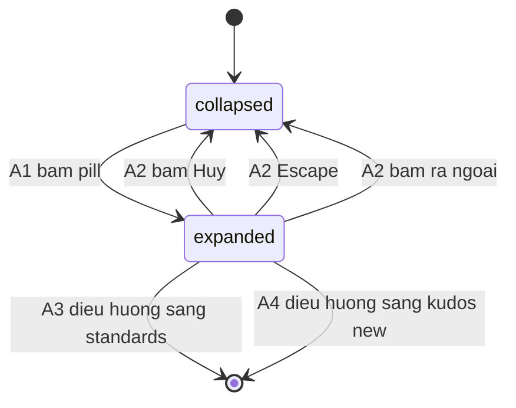

# F008_FloatingActionButton

## 1. Technical Overview

`app/_components/floating-widget.tsx` chuyển từ hai `<Link>` tĩnh thành một client component có state `open`: pill nổi (`fab-trigger`) là cần mở/đóng, nhóm ba nút (`fab-standards`/`fab-write-kudos`/`fab-close`) chỉ render khi `open === true`. Đóng dùng lại nguyên `use-dismiss-on-outside.ts` cho `Escape` và bấm-ra-ngoài. Hai nút chính điều hướng bằng `<Link>` sang `/standards` và `/kudos/new` — cả hai route đã ship (F007, F005); không endpoint mới, không bảng mới, không Server Action.

## 2. Action Index

| # | Action (handler) | Method · Path | Codes | Writes | Detail |
|---|---|---|---|---|---|
| **A0** | *cross-cutting — belongs to no single action* | — | FR-001, FR-101, BR-002, BR-006 | — | § 4.4 |
| **A1** | `FloatingWidget` *(planned)* | — | FR-201, FR-202, BR-001, BR-005, SM-001, US001 | — *(read-only)* | § 3.1 |
| **A2** | `FloatingWidget` dismiss handler, via `useDismissOnOutside` *(planned)* | — | FR-205, FR-401, BR-004, SM-001, US002 | — *(read-only)* | § 3.2 |
| **A3** | `<Link href="/standards">` *(planned)* | `GET` `/standards` *(navigation)* | FR-203, DEC-001, US003 | — *(read-only)* | § 3.3 |
| **A4** | `<Link href="/kudos/new">` *(planned)* | `GET` `/kudos/new` *(navigation)* | FR-204, FR-601, BR-003, DEC-002, US004 | — *(read-only)* | § 3.4 |

## 3. Actions

### 3.1 CAP-01 — Mở menu nhanh

#### A1 · Bấm pill nổi để mở nhóm ba nút
`—` → `` `FloatingWidget` `` *(planned, client component)*
`FR-201` `FR-202` `BR-001` `BR-005` `SM-001` · `US001`

**Who** · Bất kỳ ai ở trang chủ `/` — không phân biệt đã đăng nhập.
**FE** · `app/_components/floating-widget.tsx` chuyển sang `"use client"`, giữ state `open` (`useState`). Pill (`data-testid="fab-trigger"`, `aria-expanded={open}`, `aria-controls` trỏ id nhóm nút) render 106×64, `box-shadow: 0 4px 4px rgba(0,0,0,.25), 0 0 6px #FAE287`, nội dung hai icon + `/` giữ nguyên (`design/geometry.md`). Bấm pill lật `open` sang `true`, hiện nhóm nút (`data-testid="fab-menu"`) 214×224, cột dọc `gap:20px`, neo cùng cạnh phải-dưới `endY 904` như pill. Dưới 1024px các nút co theo nội dung thay vì giữ cứng 149/214px (`BR-005`).
**Rule** · **BR-001 — Pill là một cần mở duy nhất, không phải hai liên kết trực tiếp.** Cạnh điều hướng đo được của thiết kế (node `313:9138` → `313:9139`) chỉ ra pill dẫn tới trạng thái mở, không dẫn thẳng tới một đích — giữ hai liên kết cũ song song với một menu sẽ cho cùng hai đích hai kiểu bấm khác nhau trên một màn hình. Hai icon và dấu `/` giữ nguyên, trở thành nội dung của nút bấm duy nhất chứ không còn là hai hit-target. *(inline)*
**Result** · Không request, không ghi DB. Component tự lật `open` trong state nội bộ; không điều hướng.
**State** · `SM-001`: `collapsed` → `expanded` *(§ 4.3)*
**Source:** `TBD (draft)`

<!-- Không diagram: không ghi bảng nào, không phải hành động nền. -->

---

### 3.2 CAP-02 — Đóng menu quay về pill

#### A2 · Đóng bằng nút Hủy, Escape, hoặc bấm ra ngoài
`—` → `` `FloatingWidget` `` dismiss handler, tái dùng `useDismissOnOutside` *(planned)*
`FR-205` `FR-401` `BR-004` `SM-001` · `US002`

**Who** · Bất kỳ ai đang thấy nhóm ba nút mở.
**FE** · Nút tròn đỏ `Hủy` (`data-testid="fab-close"`), 56×56 bo tròn hết cỡ, nền `#D4271D`, icon 24×24 — tái dùng nguyên `public/images/rules/close-icon.svg` (đã đúng màu trắng trên nền đỏ), không tạo bản sao. `onClick` của `Hủy` gọi callback `closeAndRestoreFocus` riêng (đóng menu + `triggerRef.current?.focus()`) — không đi qua `useDismissOnOutside`. Hook đó chỉ gắn cho `Escape` (đóng + trả focus, xử lý ngay trong hook) và bấm-ra-ngoài (đóng, không trả focus) — đúng hợp đồng đang phục vụ chuông thông báo, account menu và language selector.
**Rule** · **BR-004 — `Hủy` và `Escape` đều trả focus về pill; bấm ra ngoài thì không.** `Escape` trả focus qua hợp đồng `useDismissOnOutside` đã chứng minh ở ba popover khác trên header; `Hủy` trả focus qua callback `closeAndRestoreFocus` của riêng nó, vì `onDismiss` dùng chung cho bấm-ra-ngoài không tự trả focus — tách hai callback để bấm-ra-ngoài không vô tình thừa hưởng hành vi trả-focus của `Hủy`. *(inline)*
**Result** · Component lật `open` về `false`; không request, không ghi DB.
**State** · `SM-001`: `expanded` → `collapsed` *(§ 4.3)*
**Source:** `TBD (draft)`

---

### 3.3 CAP-03 — Đi tới Thể lệ

#### A3 · `Thể lệ` dẫn tới `/standards`
`GET` `/standards` *(navigation)* → `` `<Link href="/standards" data-testid="fab-standards">` ``
`FR-203` `DEC-001` · `US003`

**Who** · Bất kỳ ai; `/standards` là route công khai, đã ship ở F007.
**FE** · Nút 149×64, bo góc 4px, nền `#FFEA9E`, icon `MM_MEDIA_LOGO` + nhãn `Thể lệ` (Montserrat 700, 24/32, `#00101A`) — kích thước và màu đo trực tiếp từ `design/geometry.md`.
**Rule**

| DEC | subtype | Condition | What the user sees | Source |
|---|---|---|---|---|
| **DEC-001** | flow | bấm `Thể lệ` | điều hướng thẳng sang `/standards` (F007, đã ship) thay vì mở modal | tbd |

**DEC-001 — mô tả thiết kế nói "Mở modal/section 'Thể lệ'"; hệ thống này điều hướng sang route thật.** Yêu cầu gốc — "bấm Thể lệ thấy được nội dung thể lệ" — giữ nguyên; chỉ cơ chế được dịch sang thứ đã tồn tại (F007 đã dựng drawer thật tại route đó, cùng bản dịch F007 đã ghi cho `TC_THELE_FUN_004`). *(functional-spec.md § 3)*
**Result** · Điều hướng. Không ghi DB.
**Source:** `TBD (draft)`

---

### 3.4 CAP-04 — Đi tới Viết KUDOS

#### A4 · `Viết KUDOS` dẫn tới `/kudos/new`
`GET` `/kudos/new` *(navigation)* → `` `<Link href="/kudos/new" data-testid="fab-write-kudos">` ``
`FR-204` `FR-601` `BR-003` `DEC-002` · `US004`

**Who** · Bất kỳ ai; `proxy.ts` quyết định ai đi tiếp được.
**FE** · Nút 214×64, bo góc 4px, nền `#FFEA9E`, icon `MM_MEDIA_Pen` + nhãn `Viết KUDOS`. Icon bút cần đổi `fill` sang `#00101A` (§ 5.2 Assumptions) để không lặp lại lỗi gần-như-vô-hình đang có trên pill hiện tại.
**Rule**

| DEC | subtype | Condition | What the user sees | Source |
|---|---|---|---|---|
| **DEC-002** | flow | bấm `Viết KUDOS` | điều hướng sang `/kudos/new`; nếu chưa đăng nhập, guard sẵn có chuyển tiếp về `/login` | tbd |

**DEC-002 — cùng bản dịch modal → route như DEC-001, áp dụng cho `Viết KUDOS`.** *(functional-spec.md § 3)*
**BR-003 — Nút không tự phán quyền.** `/kudos/new` đã nằm trong danh sách guarded của `proxy.ts` từ F005 (khớp chính xác đường dẫn hoặc subpath, không phải `startsWith("/kudos")`); một người chưa đăng nhập bấm vào rơi về `/login` theo đúng luật sẵn có. Nhân bản luật đó ở đây tạo ra hai nguồn sự thật cho cùng một quyết định. *(inline)*
**Result** · Điều hướng. Không ghi DB.
**Source:** `TBD (draft)`

### 3.5 Edge cases

| Action | Scenario | Behavior |
|---|---|---|
| A1 | Bấm pill nhiều lần liên tiếp (double-click) | `open` chỉ lật một lần trên state React — không có race, không cần debounce |
| A2 | `Escape` gõ khi menu đã đóng | Không có gì để đóng; listener chỉ gắn khi `open === true` (`use-dismiss-on-outside.ts`) |
| A3 · A4 | Bấm một nút trong menu rồi điều hướng khỏi trang | Không side effect còn treo lại — component unmount cùng lúc điều hướng Next.js; không timer, không subscription cần dọn |
| A1-A4 | Tải lại trang (`F5`) trong khi menu đang mở | `open` reset về `false` — trạng thái là client-local, không persist qua reload (`BR-006`) |
| A4 | Chưa đăng nhập bấm `Viết KUDOS` | `proxy.ts` chuyển hướng `/login`; nút không tự ẩn, không tự khoá (`BR-003`) |

## 4. Shared Foundation

### 4.1 Components

| Component | Kind | Purpose |
|-----------|------|---------|
| `app/_components/floating-widget.tsx` | client *(planned — hiện là server component tĩnh)* | Vỏ pill nổi + nhóm ba nút; state `open` (§ 3.1, § 3.2) |
| `app/_components/use-dismiss-on-outside.ts` | client *(existing, tái dùng nguyên)* | `Escape` + bấm-ra-ngoài (§ 3.2) |

### 4.2 Data Model

N/A — feature này không đọc và không ghi bảng Supabase nào (`clarifications.md`: FAB không lưu và không đọc gì; hai đích của nó — `/standards`, `/kudos/new` — mới là nơi chạm Supabase, đã ship riêng ở F007/F005).

#### Polymorphic Behavior

N/A — no discriminator fields in Key Entities.

### 4.3 State Management

### FAB mở/đóng nhóm nút nhanh (SM-001)
**kind:** ui
**Linked FR:** FR-201, FR-202, FR-205, FR-401
**Source:** `TBD (draft)`



**Action transitions:** guard và side effect của mỗi cạnh nằm trong rung **Result** của action ghi trên cạnh đó (§ 3.1, § 3.2) — không lặp lại ở đây.

### 4.4 Shared Rules

#### Bin 3 — cross-cutting, belongs to no single action

**A0 · FR-001 — Khối `home.widget` trong `Dictionary` được bổ sung nhãn cho cả hai state (trigger, close, hai nút menu), cả `vi` lẫn `en`.** Áp dụng cho toàn bộ component, không riêng một action nào — mọi nhãn hiển thị đều đọc từ khối này.
**Source:** `TBD (draft)`

**A0 · FR-101 / BR-002 — FAB chỉ render trên trang chủ `/`, không đổi.** `app/page.tsx` là nơi composer duy nhất của `FloatingWidget`; `/awards-information`, `/kudos`, `/kudos/new`, `/standards` đều đã có docblock ghi rõ khung hình của chúng không có widget này. Mở rộng bề mặt không nằm trong commission — **không phải rule của riêng action nào**, mà là ranh giới scope của cả feature.
**Source:** `TBD (draft)`

**A0 · BR-006 — Feature không lưu và không đọc gì.** State `open` là client-local (`useState`), không có Server Action, không có bảng mới, không có migration. Hai đích điều hướng của nó (`/standards`, `/kudos/new`) sở hữu dữ liệu riêng của chúng.
**Source:** `TBD (draft)`

### 4.5 Algorithms & Integrations

None.

### 4.6 Configuration

N/A — no technical configuration beyond framework defaults.

**Client behavior:** see behavior-logic.md, permissions.md, architecture.md

## 5. Verification & Technical Notes

### 5.1 Technical Verification

- **testPolicy: `e2e-red-first`** — auto-chọn theo rule 3 của bảng resolution (`.claude/rules/momorph/momorph-development.md`): component có chuyển trạng thái thật (collapsed ⇄ expanded) cộng hai điều hướng — không phải bản đồ tĩnh.
- **Runner có thật** — `@playwright/test ^1.62.1`, `npx playwright test`. Web, không phải mobile. Không cài, không scaffold gì cho lần chạy này.
- **Command cố định (RED lẫn GREEN)** — `npx playwright test e2e/floating-action-button.spec.ts --project=anon`. Cần thêm `floating-action-button` vào regex `testMatch` của project `anon` (`playwright.config.ts:82`, hiện liệt kê `smoke|login-screen|route-guard|callback-security|homepage|award-system|profile-anon|the-le|kudos-live-board`).
- **Project: `anon`** — trang chủ công khai, và chuyển hướng `/kudos/new` → `/login` của guard chính là một trong các assertion.
- **Test contract (`data-testid`)** — chốt trong `clarifications.md § "Test contract"`, ràng buộc cả spec RED lẫn agent dựng UI: `fab-trigger`, `fab-menu`, `fab-standards`, `fab-write-kudos`, `fab-close`.
- **Adaptation bắt buộc trên spec đã ship** — `e2e/the-le.spec.ts` `FUN_003` (dòng 198-215) hiện bấm một `<Link>` tên `WIDGET_STANDARDS_LABEL` thẳng trên `/`; sau chuyển đổi này không còn liên kết đó trên trang chủ. `clarifications.md § "Late finding"` chốt: mở FAB trước (`fab-trigger`), rồi bấm `fab-standards`, cùng một assertion lịch sử/đóng như cũ — không nới lỏng gì, chỉ đổi đường tới cùng khẳng định. Hằng số `WIDGET_STANDARDS_LABEL` (`e2e/fixtures/the-le-constants.ts:91`) giữ nguyên vai trò tên accessible của mục menu.
- **Fixture** — không cần seed riêng: spec không ghi dữ liệu, chỉ đọc nhãn qua hằng số export từ một fixture mới (`e2e/fixtures/floating-action-button-constants.ts`, phiên âm từ `dictionary.home.widget`, không literal inline) và xác nhận `/standards` render nội dung database-backed (đã có sẵn từ F007) sau khi điều hướng.

- **SC-001** *(A1)* Pill mang `aria-expanded="false"` khi đóng, `"true"` khi mở, `aria-controls` trỏ đúng id nhóm nút (covers FR-201)
- **SC-002** *(A1)* Bấm `fab-trigger` hiện đủ ba nút `fab-standards`, `fab-write-kudos`, `fab-close` (covers FR-202)
- **SC-003** *(A2)* `fab-close`, `Escape`, và bấm ra ngoài đều đưa `aria-expanded` về `"false"`; `fab-close` và `Escape` trả focus về `fab-trigger` (qua hai callback khác nhau — `closeAndRestoreFocus` và hợp đồng `useDismissOnOutside`), bấm ra ngoài thì không (covers FR-205, FR-401, BR-004)
- **SC-004** *(A3)* Bấm `fab-standards` điều hướng sang `/standards` và trang đó render nội dung Thể lệ (covers FR-203)
- **SC-005** *(A4)* Bấm `fab-write-kudos` khi ở project `anon` (chưa đăng nhập) kết thúc ở `/login` (covers FR-204, FR-601)

#### US001 *(A1)*

**Independent Test:** Vào `/`, bấm pill, xác nhận `aria-expanded` chuyển `true` và ba nút xuất hiện.

**Acceptance Scenarios:**
1. **Given** đang ở `/` với pill đóng, **When** bấm pill, **Then** ba nút `Thể lệ`/`Viết KUDOS`/`Hủy` hiện ra và `aria-expanded="true"`.

#### US002 *(A2)*

**Independent Test:** Với menu đang mở, thử cả ba lối đóng (`Hủy`, `Escape`, bấm ra ngoài) và xác nhận cả ba đưa `aria-expanded` về `false`.

**Acceptance Scenarios:**
1. **Given** menu đang mở, **When** bấm `Hủy`, **Then** menu đóng, pill hiện lại.
2. **Given** menu đang mở, **When** gõ `Escape`, **Then** menu đóng và focus quay về pill.
3. **Given** menu đang mở, **When** bấm ra ngoài vùng menu, **Then** menu đóng, focus không di chuyển.

#### US003 *(A3)*

**Independent Test:** Bấm `fab-standards`, xác nhận URL đổi sang `/standards` và trang đó render tiêu đề `Thể lệ`.

**Acceptance Scenarios:**
1. **Given** menu đang mở, **When** bấm `Thể lệ`, **Then** trình duyệt tới `/standards`.

#### US004 *(A4)*

**Independent Test:** Chạy dưới project `anon`, bấm `fab-write-kudos`, xác nhận URL cuối cùng là `/login`.

**Acceptance Scenarios:**
1. **Given** đã đăng nhập, **When** bấm `Viết KUDOS`, **Then** tới `/kudos/new`.
2. **Given** chưa đăng nhập, **When** bấm `Viết KUDOS`, **Then** `proxy.ts` chuyển về `/login`.

### 5.2 Assumptions

- *(A1, A4)* Icon bút hiện có (`public/images/home/widget-pen-icon.svg`, `fill="white"`) đo được là gần như vô hình trên nền `#FFEA9E` của cả pill lẫn nút `Viết KUDOS` — cùng dạng phát hiện với F007's A2 (`docs/features/F007_TheLe/technical-spec.md § 5.2`, về `pen-icon.svg` riêng cho `/standards`). File này thuộc scope feature này và cần đổi `fill` sang `#00101A`; không tạo bản sao mới vì cùng một icon phục vụ cả hai state của FAB.
- *(A2)* Icon đóng dùng lại nguyên `public/images/rules/close-icon.svg` (24×24, `fill="white"`, đã đúng màu trên nền đỏ `#D4271D`) — không có gì phải đo lại hay tạo mới cho `Hủy`.
- *(A3, A4)* `/standards` và `/kudos/new` được giả định đã ổn định như hai spec F007/F005 mô tả — feature này không sửa gì ở hai route đó, chỉ thêm đường dẫn điều hướng tới.

### 5.3 Unresolved Questions

1. **Icon Thể lệ trong nhóm nút mở** *(A3)*: `widget-saa-kudos-glyph.svg` gốc 20×19 trong khi thiết kế nhóm nút mở gọi 24×24 — chưa xác nhận phóng SVG lên có vỡ nét không, hay cần một file mới đúng kích thước. Cần đọc file thật khi bắt tay dựng UI.
2. **`aria-controls` id** *(A1, A2)*: chưa xác nhận component sẽ dùng `useId()` (như `language-selector.tsx`) hay một id tĩnh — quyết định thuộc lượt viết code, không phải domain.

### 5.4 Source References

Chưa có mã nguồn mới nào được viết — đây là bản nháp greenfield. Các file đã tồn tại, đọc để lấy ngữ cảnh, sẽ bị **SỬA** (không tạo mới) khi triển khai: `app/_components/floating-widget.tsx` (chuyển sang client component có state, § 3.1/§ 3.2), `public/images/home/widget-pen-icon.svg` (đổi `fill`, § 5.2), `lib/i18n/messages/vi-home.ts` / `en-home.ts` / `dictionary.ts` (mở rộng khối `home.widget`, § 4.4 A0·FR-001), `e2e/the-le.spec.ts:198-215` (thích nghi `FUN_003`, § 5.1). Đọc nguyên, không sửa: `app/_components/use-dismiss-on-outside.ts`, `proxy.ts:51-57`. Không trích `**Source:** path:N-M` nào ở trên vì component thật của feature này chưa tồn tại — trích dẫn thật vào ở lượt promote.

#### Data Flow

```text
Bam pill (fab-trigger) -> setOpen(true) client state -> render fab-menu
  -> bam fab-standards | fab-write-kudos -> Next.js Link dieu huong
  -> (proxy.ts guard cho /kudos/new neu chua dang nhap -> /login)
```

### 5.5 Artifact References

| Artifact | File | Codes Used | Reviewed |
|----------|------|------------|----------|
| Feature List | [feature-list.md](../../generated/feature-list.md) | F008 (allocated at promote 2026-09-10) | [ ] |
| System Overview | TBD (draft) | TBD (draft) | [ ] |
| Architecture | TBD (draft) | TBD (draft) | [ ] |
| Screens | [functional-spec.md § 6](./functional-spec.md#6-screens) | TBD (draft) | [ ] |
| Permissions Matrix | TBD (draft) | TBD (draft) | [ ] |
| User Stories | [functional-spec.md § 7](./functional-spec.md#7-user-stories) | TBD (draft) | [ ] |
