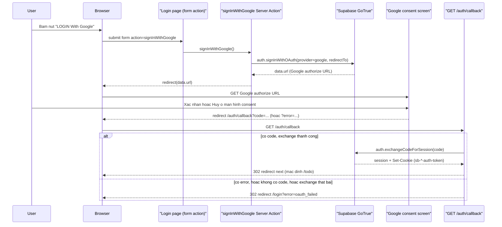

# Đăng nhập Google qua Supabase OAuth

`F001` `US001` `BL005` `PERM003`

Luồng duy nhất khiến người dùng chuyển từ khách vãng lai sang có phiên đăng nhập. Đi qua ba
biên tin cậy: app này → Supabase GoTrue (local stack) → Google, rồi quay lại app.

### Trigger Sequence

### Numbered Steps

1. Khách bấm nút "LOGIN With Google" — nút nằm trong `<form action={signInAction}>`, `signInAction` là `signInWithGoogle` truyền từ `app/login/page.tsx:55` xuống `LoginContent`. `app/login/_components/login-content.tsx:48-50`. `F001` `US001`
2. Nút chuyển sang trạng thái loading/disabled ngay khi submit, qua `useFormStatus()` — không có state cục bộ nào khác điều khiển việc này. `app/login/_components/google-sign-in-button.tsx:18,24`. `F001` `US001`
3. Server Action gọi `supabase.auth.signInWithOAuth({ provider: "google", options: { redirectTo: \`${siteUrl}/auth/callback\` } })`; nếu `NEXT_PUBLIC_SITE_URL` chưa cấu hình thì action `throw` ngay, không redirect ra một URL rỗng. `app/login/actions.ts:16-28`. `F001` `US001` `BL005`
4. Có lỗi hoặc thiếu `data.url` → redirect thẳng `/login?error=oauth_failed` mà không ra Google. `app/login/actions.ts:30-32`.
5. Thành công → `redirect(data.url)` đưa trình duyệt rời khỏi app, sang trang xác thực Google. `app/login/actions.ts:34`.
6. Google trả người dùng về `GET /auth/callback` kèm `code` (thành công) hoặc `error` (huỷ/từ chối). `app/auth/callback/route.ts:74-79`. `F001` `US001` `BL005`
7. Route handler tự chọn origin redirect từ `NEXT_PUBLIC_SITE_URL` (`resolveSiteOrigin`), **không bao giờ** từ `request.nextUrl.origin` hay header `Host` — hai nguồn đó hoặc bị Next.js rewrite `127.0.0.1` → `localhost` (làm mất cookie phiên đang pin theo `127.0.0.1`), hoặc bị người gọi thao túng (CWE-644 open-redirect, route này không cần đăng nhập để gọi tới). `app/auth/callback/route.ts:31-43`. `BL005`
8. `next` param (đích sau khi thành công) được `resolveNextPath` parse lại đúng origin của app trước khi dùng — chặn URL tuyệt đối, `//evil.com`, và biến thể `/\evil.com` (WHATWG URL chuẩn hoá cái này thành `//evil.com`, nên `startsWith("//")` đơn thuần bị lọt). Mặc định `/todo`. `app/auth/callback/route.ts:54-64`. `BL005`
9. Có `error` → bỏ qua exchange, redirect `/login?error=oauth_failed` ngay. `app/auth/callback/route.ts:83-85`.
10. Có `code` → `supabase.auth.exchangeCodeForSession(code)`; thành công → redirect `next` (mặc định `/todo`); lỗi hoặc network throw → rơi xuống cùng redirect thất bại cố định — lỗi thật của Google/GoTrue **không bao giờ** phản chiếu vào URL hay UI. `app/auth/callback/route.ts:87-107`. `F001` `US001` `BL005`
11. Redirect thất bại đưa người dùng về `/login?error=oauth_failed`; `LoginPage` đọc `searchParams.error`, hiện `ErrorBanner`, và nút quay lại trạng thái sẵn sàng (không còn `pending`). `app/login/page.tsx:40-43`, `app/login/_components/error-banner.tsx:11-22`. `F001` `US001`
12. Redirect thành công đưa người dùng tới `/todo` — nhưng mọi request kế tiếp (kể cả chính redirect này) đều đi qua `proxy.ts`, xem flow "Session refresh và route guarding" để biết `/todo` được cho qua thế nào. `PERM001`

### Edge Cases

- **Huỷ ở màn hình consent Google**: Google trả `error` (vd. `access_denied`), không có `code` — callback bỏ qua exchange, redirect `/login?error=oauth_failed`. `app/auth/callback/route.ts:81-85`.
- **`NEXT_PUBLIC_SITE_URL` chưa cấu hình**: `signInWithGoogle` `throw` trước khi gọi Supabase — không có redirect `undefined/auth/callback` bị Supabase âm thầm từ chối. `app/login/actions.ts:17-21`.
- **`exchangeCodeForSession` throw do lỗi mạng tới GoTrue**: bắt bằng `try/catch`, rơi xuống redirect thất bại cố định thay vì để lộ lỗi 500 chưa xử lý. `app/auth/callback/route.ts:94-103`.
- **Giả mạo `Host`/`X-Forwarded-Host` để mở redirect (CWE-644)**: bị chặn vì origin luôn lấy từ `NEXT_PUBLIC_SITE_URL`, không bao giờ từ request — có test hồi quy `e2e/callback-security.spec.ts:17-38`.
- **`next` param là URL tuyệt đối / `//evil.com` / `/\evil.com`**: `resolveNextPath` parse lại theo origin đã pin, không khớp thì rơi về `/todo` mặc định. `app/auth/callback/route.ts:54-64`.
- **Bấm nút đăng nhập nhiều lần liên tiếp lúc đang xử lý**: nút đã `disabled` từ `useFormStatus().pending`, không gửi thêm submit thứ hai. `app/login/_components/google-sign-in-button.tsx:24`.

### Traceability

`F001` · `US001` · `BL005` (OAuth callback) · `PERM003` (auth-callback deliberate no-guard exemption, xem flow kế tiếp) · `FR-202` `FR-401` `FR-402` `FR-601` `BR-001` (functional-spec.md F001)
