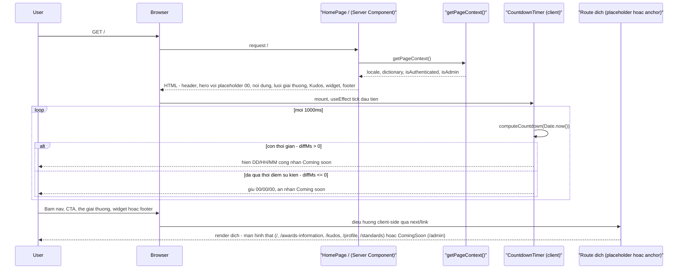

# Duyệt trang chủ SAA 2025 và điều hướng ra các route đích

`F002` `US005` `PERM003`

Trang chủ (`/`) là điểm vào công khai duy nhất không cần đăng nhập. Luồng này gồm: render tĩnh
theo trạng thái phiên, bộ đếm ngược tick client-side với hai nhánh (còn/hết hạn), và các đường
điều hướng ra các route đích: `/awards-information` (từ 2026-09-06 là màn hình Hệ thống giải
thật — F003) và `/kudos` (từ 2026-09-07 là màn hình Kudos Live Board thật — F004, xem
`kudos-live-board-view-and-heart.md`), `/profile` (từ 2026-09-08 là màn Profile thật — F006, và
được `proxy.ts` gác) và `/standards` (từ 2026-09-09 là màn Thể lệ thật — F007, vẫn công khai);
trong nhóm đích của trang chủ, chỉ còn `/admin` dùng shell `ComingSoon`. Thẻ giải thưởng thêm một
anchor (`#<slug>`) vào route `/awards-information` có sẵn, không phải một route thứ 6.

### Trigger Sequence

### Numbered Steps

1. `getPageContext()` là điểm đọc duy nhất cho locale + dictionary + `isAuthenticated` + `isAdmin`; object `user` gốc của Supabase **không** vượt biên sang `HomeHeader` (Client Component) — chỉ hai boolean suy ra đi qua. `app/_page-context.ts:27-42`, `app/page.tsx:25,32-38`. `F002` `US005`
2. `HomePage` render 7 khối theo đúng thứ tự thiết kế: header, hero, `RootFurtherBlock`, `AwardsGrid`, `KudosPromo` (trong `<main>`), `FloatingWidget`, `SiteFooter`. `app/page.tsx:24-49`.
3. `eventStartAt` (`process.env.NEXT_PUBLIC_EVENT_START_AT`) được đọc **đúng một lần** ở `HomePage` và truyền literal xuống `HomeHero` → `CountdownTimer` — không đọc lại `process.env` ở component con, để server/client luôn đồng nhất giá trị nguồn. `app/page.tsx:40`, `app/_components/home-hero.tsx:23,80-81`.
4. Lần render đầu (cả server lẫn client, trước hydrate) không đụng đồng hồ — chỉ kiểm tra `eventStartAt` có parse được không (hàm thuần của một chuỗi cố định) — nên markup ban đầu luôn khớp và không cần `suppressHydrationWarning`. `app/_components/countdown-timer.tsx:69-75`.
5. Sau mount, `useEffect` chạy `tick()` ngay rồi lặp mỗi 1000ms qua `setInterval`; mỗi tick tính lại toàn bộ hiệu số từ `Date.now()` (không cộng dồn từ tick trước) — tự sửa lỗi lệch giờ khi tab bị throttle/treo. `app/_components/countdown-timer.tsx:77-95`, `computeCountdown` tại `:49-63`.
6. Nhánh còn thời gian (`diffMs > 0`): pad `days`/`hours`/`minutes` về 2 chữ số, hiện nhãn "Coming soon". `app/_components/countdown-timer.tsx:54-62`.
7. Nhánh đã qua thời điểm sự kiện (`diffMs <= 0`): giữ `00/00/00` ở cả 3 ô, ẩn "Coming soon", không có cờ lỗi nào khác. `app/_components/countdown-timer.tsx:51-53`.
8. Bấm một thẻ giải thưởng (ảnh, tên, hoặc "Chi tiết" đều nằm trong cùng một `<Link>`) điều hướng `/awards-information#<slug>` theo đúng 1-1 mapping tĩnh từ `lib/awards.ts`. Đích là màn hình Hệ thống giải thật (F003): trang dừng ở đúng thẻ hạng mục đó và mục menu tương ứng sáng lên sau khi hydrate. `app/_components/award-card.tsx:32-59`, `lib/awards.ts:27-42`, `app/awards-information/_components/use-award-scroll-spy.ts:143-147`. `F003` `US008`
9. Bấm mục nav đang chọn ("About SAA 2025" khi đang ở `/`) chặn điều hướng lại, cuộn mượt lên đầu trang thay vì reload; mục khác điều hướng route tương ứng bình thường. `app/_components/home-nav.tsx:58-71`, `app/_components/use-scroll-to-top-if-current.ts:18-21`.
10. Nút widget nổi và khối quảng bá Kudos điều hướng tĩnh tới `/kudos`/`/standards` — hai liên kết cố định, không có decision logic. `/kudos` từ 2026-09-07 render màn hình Kudos Live Board thật (F004) và `/standards` từ 2026-09-09 render màn Thể lệ thật (F007) — cả hai đều đã thay `ComingSoon`. `app/_components/floating-widget.tsx:20,28`, `app/_components/kudos-promo.tsx:46-48`.
11. `/awards-information` (F003), `/kudos` (F004), `/profile` (F006) và `/standards` (F007) render màn hình thật; trong các route đích của trang chủ chỉ còn `/admin` (mục "Admin Dashboard" role-gated trong menu tài khoản trỏ tới đây) render shell `ComingSoon` — có header/footer thật, không phải trang tĩnh cô lập. Mọi đích đều tồn tại, nên điều hướng ra khỏi trang chủ không bao giờ gãy liên kết. `app/awards-information/page.tsx:55`, `app/kudos/page.tsx:48`, `app/_components/coming-soon.tsx:17-38`, `app/_components/account-menu.tsx:99-107`.

### Edge Cases

- **`NEXT_PUBLIC_EVENT_START_AT` thiếu hoặc sai định dạng ISO-8601**: `parseEventDate` trả `null`, `CountdownTimer` hiện `00/00/00`, ẩn "Coming soon", ghi đúng một dòng `console.warn` (chặn double-invoke của React Strict Mode bằng `warnedRef`), không bao giờ `throw`. `app/_components/countdown-timer.tsx:43-47,77-89`. `BR-004`
- **Thời điểm sự kiện đã qua khi tải trang**: xử lý giống nhánh 7 ở trên — không có cờ lỗi, không phân biệt với trạng thái "chưa từng cấu hình".
- **Số ngày đếm ngược vượt 99 (3 chữ số)**: `DigitTile` render theo từng ký tự tách từ chuỗi `days` (không cắt cứng 2 ký tự đầu), nên số 3 chữ số vẫn hiện đủ — nhưng đây là điểm mong manh đã biết: cấu hình test cố định ~45 ngày để không rơi vào biên này. `app/_components/countdown-timer.tsx:118-124`.
- **Người dùng chưa đăng nhập bấm menu tài khoản/chuông thông báo**: không xảy ra được — hai phần tử này không tồn tại trong DOM khi `isAuthenticated` là false (xem flow "Đăng xuất" và `permissions-matrix.md` PERM005), nên không có nhánh lỗi nào để mô tả ở luồng duyệt trang chủ này.

### Traceability

`F002` · `US005` · `PERM003` (route `/` không có guard mới ngoài route guard của F001) · `FR-101` `FR-102` `FR-201` `FR-204` `FR-205` `FR-206` `FR-207` `FR-401` `FR-402` `FR-405` `BR-003` `BR-004` `DEC-001` (functional-spec.md F002)

### Rejected as not-a-flow

Không tách "bấm CTA hero" hay "bấm liên kết footer" thành flow riêng — mỗi cái là một `<Link>`
tĩnh 1-hop không rẽ nhánh, đã gộp vào bước 10/11 ở trên thay vì phình thành nhiều flow một-bước.
