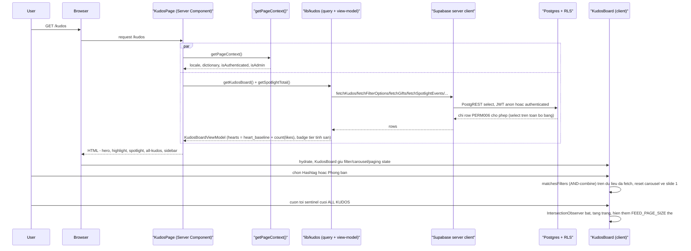
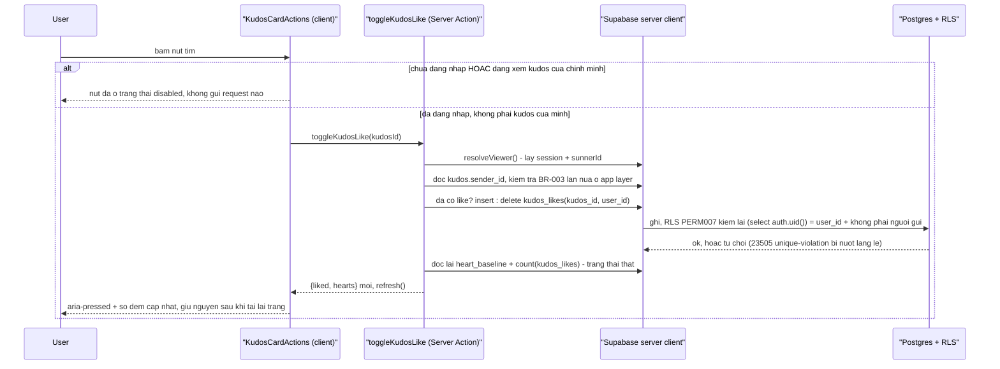

# Xem, lọc Kudos Live Board và thả tim một kudos

`F004` `US001` `US002` `US003` `US004` `PERM006` `PERM007`

`/kudos` là màn hình công khai không cần đăng nhập, và là lớp Postgres đầu tiên repo này sở hữu.
Luồng này gồm hai phần tách biệt: **đọc** (render trang, lọc, carousel, cuộn vô hạn — toàn bộ là
state phía client trên một lần fetch) và **ghi** (thả/gỡ tim một kudos qua Server Action, ràng
buộc bởi RLS). Xem `docs/system/architecture.md` § Data Flow cho sơ đồ tổng quan tương đương;
luồng dưới đây đi sâu vào từng bước và các nhánh lỗi.

## Phần 1 — Đọc: render trang, lọc, carousel, cuộn vô hạn

### Trigger Sequence

### Numbered Steps

1. `KudosPage` chạy `getPageContext()` và `getKudosBoard()`/`getSpotlightTotal()` song song
   (`Promise.all`), giống hệt khuôn `/awards-information`. `app/kudos/page.tsx:49-50`.
2. `getKudosBoard()` gọi các hàm đọc trong `lib/kudos/queries.ts` qua client server-side
   (`lib/supabase/server.ts`), rồi `board-data.ts` dựng `KudosBoardViewModel` — cộng
   `heart_baseline + count(kudos_likes)` cho từng kudos (BR-001) và tính badge tier
   (`badgeTierFor`, `lib/kudos/derive.ts:16-21`). `lib/kudos/board-data.ts`.
3. RLS chặn ở tầng DB, không phải ở query layer: mọi bảng Kudos mở `select` cho `anon` lẫn
   `authenticated` (`PERM006`), nên khách ẩn danh và người đã đăng nhập nhận cùng một tập dữ liệu
   đọc. `supabase/migrations/20260906140914_kudos_live_board.sql:161-170`.
4. `KudosBoard` (`"use client"`, ranh giới client duy nhất của màn hình) giữ state filter, carousel
   và trang cuộn — cả HIGHLIGHT và ALL KUDOS đọc từ cùng `filteredKudos`, nên không bao giờ lệch
   nhau. `app/kudos/_components/kudos-board.tsx:48-116`.
5. Chọn một hashtag hoặc phòng ban gọi `matchesFilters` (AND-combine, `lib/kudos/derive.ts:96-104`)
   và reset carousel về slide 1 (`resetPaging`); chọn lại đúng option đang chọn bỏ lọc.
   `kudos-board.tsx:68-96`. `FR-203` `DEC-002`
6. `HighlightCarousel` tính lại top-5 từ mảng đã lọc bằng `pickHighlight` (ALG-001, sort theo tim
   giảm dần, lấy 5 đầu) mỗi khi `filteredKudos` đổi. `derive.ts:84-88`. `FR-202` `DEC-001`
7. Cuộn ALL KUDOS tới sentinel cuối trang hiện tại kích hoạt `useInfiniteFeed`
   (`IntersectionObserver`, `rootMargin: 200px`), tăng `pages`, hiện thêm `FEED_PAGE_SIZE` (10)
   thẻ — dừng lặng lẽ khi hết dữ liệu đã lọc. `use-infinite-feed.ts:14-41`. `FR-206`
8. Sidebar và Spotlight board dựng từ cùng một lần đọc — không có request thứ hai; sidebar rơi về
   Sunner mẫu đã seed khi `auth_user_id` không khớp session nào (`resolveSidebarSunnerId`,
   `lib/kudos/viewer.ts:73-97`). `FR-207` `BR-004`

### Edge Cases (đọc)

- **Bộ lọc lọc ra 0 kudos**: cả `highlight-section` và `all-kudos-section` hiện "Hiện tại chưa có
  Kudos nào." — không có state trung gian nào khác. `FR-203`.
- **Feed đã tải hết dữ liệu khớp bộ lọc**: sentinel không tải thêm trang, không có thông báo
  "hết dữ liệu". `FR-206`.
- **Khách ẩn danh không có `sunners` row nào khớp**: sidebar rơi về Sunner mẫu đã seed
  (`auth_user_id IS NULL`, `order by id asc limit 1`) — luôn đúng một trạng thái hiển thị, không
  bao giờ để trống. `BR-004`.

## Phần 2 — Ghi: thả/gỡ tim một kudos

### Trigger Sequence

### Numbered Steps

1. Nút tim `disabled` ngay từ lúc render khi không có session hoặc khi
   `viewer.sunnerId === kudos.senderId` (BR-003) — không request nào rời trình duyệt trong hai
   trường hợp này. `app/kudos/_components/kudos-card-actions.tsx`, `board-data.ts`. `FR-602`
2. `toggleKudosLike(kudosId)` luôn tự lấy người dùng đang thao tác từ session hiện tại
   (`resolveViewer`, `lib/kudos/viewer.ts:37-58`) — không bao giờ nhận `userId` như tham số.
   `app/kudos/_actions/toggle-kudos-like.ts:59-67`.
3. Action đọc lại `kudos.sender_id` và tự kiểm tra BR-003 ở tầng app trước khi ghi — không dựa
   hoàn toàn vào RLS làm lớp chặn duy nhất. `toggle-kudos-like.ts:72-85`.
4. Ghi là toggle thật: đã có `kudos_likes` row thì `delete`, chưa có thì `insert` — khớp
   `unique(kudos_id, user_id)`; một race hai click đồng thời bị nuốt bằng mã lỗi `23505`, không
   crash. `toggle-kudos-like.ts:87-112`. `BR-002` `SM-001`
5. RLS (`PERM007`) kiểm lại độc lập với app layer: `insert` cần `(select auth.uid()) = user_id`
   **và** kudos đó không phải do chính người gọi gửi; `delete` chỉ cần vế đầu. Không có policy
   `update` — bỏ tim luôn là `delete`. `supabase/migrations/20260906140914_kudos_live_board.sql:174-184`.
6. Bất kể nhánh nào (thành công, bị RLS từ chối, hay lỗi khác), action luôn đọc lại trạng thái thật
   từ DB (`readHeartState`) trước khi trả về — client không bao giờ tự suy đoán số tim.
   `toggle-kudos-like.ts:20-50,114-116`. `FR-401`
7. `refresh()` (`next/cache`) làm mới cache Server Component thay vì `revalidatePath` — số đếm mới
   còn nguyên sau khi tải lại trang, chứng minh dữ liệu là thật chứ không phải state client
   (test-contract.md assertion K-25). `toggle-kudos-like.ts:4,115`.

### Edge Cases (ghi)

- **Khách ẩn danh gọi thẳng `toggleKudosLike` (bỏ qua UI disabled)**: action trả về trạng thái đọc
  hiện tại không đổi (`readHeartState(supabase, kudosId, null)`) — không insert/delete nào xảy ra;
  nếu cố tình bypass và gọi PostgREST trực tiếp, `anon` không có quyền `insert`/`delete` trên
  `kudos_likes` nên bị Postgres từ chối (`PERM007`). `FR-602`.
- **Người gửi cố thả tim kudos của chính mình qua request thủ công**: chặn hai lớp — app layer
  (bước 3) và `not exists` subquery trong policy `insert` (bước 5). `BR-003`.
- **Hai request thả tim đồng thời cho cùng `(kudos_id, user_id)`**: ràng buộc `unique` chặn dòng
  thứ hai (`23505`), action nuốt lỗi và đọc lại trạng thái thật — client hội tụ về đúng một giá trị
  sau khi đồng bộ. `BR-002`.

## Traceability

`F004` · `US001` `US002` `US003` `US004` `US005` `US006` `US007` · `PERM006` (đọc) `PERM007` (ghi)
· `FR-101` `FR-201`–`FR-207` `FR-401` `FR-402` `FR-403` `FR-601` `FR-602` · `BR-001` `BR-002`
`BR-003` `BR-004` `DEC-001` `DEC-002` `DEC-003` `SM-001` (functional-spec.md F004, technical-spec.md
F004 § 3)

## Rejected as not-a-flow

Không tách "bấm Copy Link" hay "bấm một hashtag chip để lọc" thành flow riêng — cả hai là hành vi
1-hop, thuần client, không rẽ nhánh phía server; đã đủ ghi trong `functional-spec.md` FR-402/FR-403
và không cần sơ đồ tuần tự của riêng chúng.
