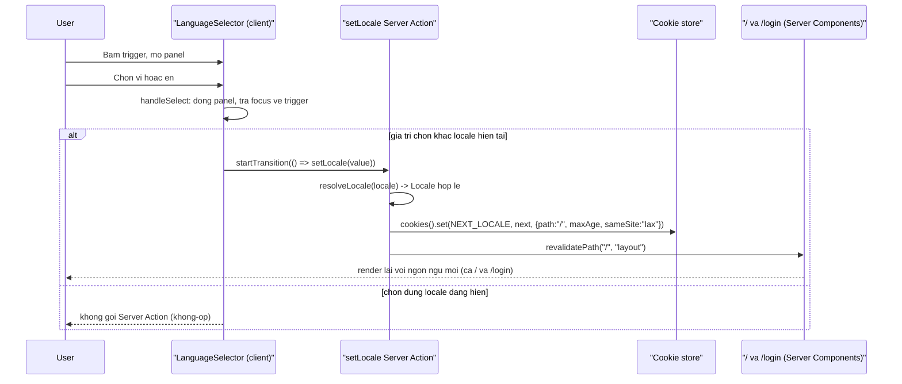

# Chọn ngôn ngữ hiển thị (VN/EN) qua cookie NEXT_LOCALE

`F001` `F002` `US003` `BL001` `BL002`

`LanguageSelector` được dùng chung giữa `/login` (F001) và header trang chủ `/` (F002) —
một Server Action `setLocale` duy nhất, một cookie duy nhất, và một `revalidatePath` bao trùm
cả layout để cả hai màn hình đổi ngôn ngữ đồng thời.

### Trigger Sequence

### Numbered Steps

1. Người dùng bấm trigger của `LanguageSelector` — mở panel, tự seed lại `activeIndex` theo locale hiện tại để focus luôn rơi vào mục đang chọn. `app/_components/language-selector.tsx:128-138`. `F001` `F002` `US003`
2. Panel dùng `role="listbox"`/`role="option"`, điều khiển được bằng bàn phím: ArrowDown/ArrowUp đổi `activeIndex` vòng tròn, Home/End nhảy đầu/cuối; Enter/Space cố tình **không** bắt riêng vì `<button>` native đã tự fire `onClick`. `app/_components/language-selector.tsx:86-111`. `FR-203.c`
3. Bấm một mục gọi `handleSelect(value)`: đóng panel, trả focus về trigger; nếu `value === locale` hiện tại thì dừng ở đây — không gọi Server Action. `app/_components/language-selector.tsx:77-84`.
4. Khác locale hiện tại → gọi `setLocale(value)` bên trong `startTransition` (không block UI trong lúc chờ). `app/_components/language-selector.tsx:81-83`. `BL001`
5. `setLocale` resolve giá trị qua `resolveLocale` **trước khi ghi cookie** — giá trị lạ/không hợp lệ không bao giờ vào được `NEXT_LOCALE` từ chính app này. `app/_actions/locale.ts:13-14`, `lib/i18n/locales.ts:22-24`. `BL001`
6. Ghi cookie `NEXT_LOCALE` với `path: "/"`, `maxAge` 1 năm, `sameSite: "lax"`. `app/_actions/locale.ts:16-20`.
7. Gọi `revalidatePath("/", "layout")` — bao trùm toàn bộ layout subtree, không chỉ `/login`, vì Server Action này giờ dùng chung cho cả `/` (F002) lẫn `/login` (F001); thiếu bước này thì trang chủ tiếp tục phục vụ nội dung ngôn ngữ cũ sau khi đổi. `app/_actions/locale.ts:21-26`.
8. Lần render kế tiếp của bất kỳ Server Component nào đọc `NEXT_LOCALE` — `app/_page-context.ts:33` (dùng bởi `/`, `/awards-information`, `/kudos`, `/kudos/new`, `/profile`, `/standards`, và 3 route placeholder còn lại qua `ComingSoon`), `app/login/page.tsx:37`, `app/todo/page.tsx:24` — đều lấy locale mới qua `resolveLocale` + `getDictionary`. `BL001` `BL002`

### Edge Cases

- **Cookie `NEXT_LOCALE` thiếu hoặc chứa giá trị không phải `vi`/`en`** (vd. bị chỉnh tay, hoặc client cũ để lại `"fr"`): `resolveLocale` trả về `DEFAULT_LOCALE` (`"vi"`) — trang render đúng mặc định VN, không lỗi trắng trang. `lib/i18n/locales.ts:16-24`. `BR-003`
- **Chọn đúng locale đang hiển thị**: `handleSelect` dừng sớm ở guard `value === locale`, không có network round-trip thừa. `app/_components/language-selector.tsx:80`.
- **Bấm ra ngoài panel (outside pointerdown)**: đóng panel, **không** trả focus về trigger (người dùng đang nhắm chỗ khác trên trang). `app/_components/use-dismiss-on-outside.ts:19-24` (dùng bởi bell/account-menu; `language-selector.tsx` giữ bản copy nội tuyến tương đương ở `:56-61`).
- **Nhấn Escape khi panel đang mở**: đóng panel **và** trả focus về trigger. `app/_components/language-selector.tsx:62-66`.

### Traceability

`F001` · `F002` · `US003` · `BL001` (locale resolution + fallback) · `BL002` (dictionary selection) · `FR-203` `FR-203.a` `FR-203.b` `FR-203.c` `BR-003` (functional-spec.md F001)
