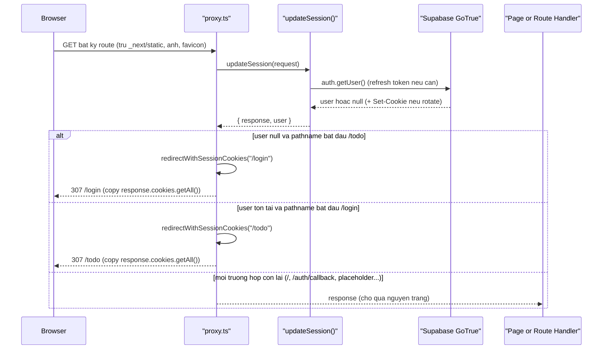

# Refresh phiên và gác cổng route trong proxy.ts

`F001` `US002` `BL003` `BL004` `PERM001` `PERM002` `PERM003`

Chạy trên **mọi** request không phải asset tĩnh — không riêng một action hay một feature nào.
Ba nhánh: `/todo` không có session, `/login` đã có session, và phần còn lại (bao gồm `/`,
`/auth/callback`, 6 route placeholder) đi qua nguyên trạng.

### Trigger Sequence

### Numbered Steps

1. `proxy.ts` khớp mọi route trừ `_next/static`, `_next/image`, `favicon.ico`, và 9 phần mở rộng ảnh/font tĩnh — không làm chậm việc tải asset. `proxy.ts:51-56`. `BL004`
2. Gọi `updateSession(request)` trước tiên, không phụ thuộc route đích là gì. `proxy.ts:16`. `BL004`
3. `updateSession` dựng `createServerClient` với cookie adapter đọc/ghi trực tiếp trên `request`/`response`; `supabase.auth.getUser()` là lệnh gọi thực sự thực hiện refresh token khi cần. `lib/supabase/update-session.ts:11-43`. `BL004`
4. Nếu GoTrue rotate refresh token, callback `setAll` dựng lại `NextResponse.next({ request })` **mới** và ghi `Set-Cookie` rotate lên đó, đồng thời copy toàn bộ header gốc để CDN/reverse proxy không cache nhầm response mang cookie auth của người khác. `lib/supabase/update-session.ts:22-34`. `BL004`
5. Nhánh chưa đăng nhập cố vào `/todo` → gọi `redirectWithSessionCookies("/login")`. `proxy.ts:41-43`. `PERM001`
6. Nhánh đã đăng nhập cố vào `/login` → gọi `redirectWithSessionCookies("/todo")`. `proxy.ts:44-46`. `PERM002`
7. **Bước bắt buộc trong cả hai nhánh redirect ở trên**: hàm `redirectWithSessionCookies` copy toàn bộ `response.cookies.getAll()` (kết quả refresh ở bước 4) sang response redirect vừa dựng — một `NextResponse.redirect()` trần sẽ là response **thứ ba** chưa từng thấy cookie rotate đó; vì refresh token của Supabase dùng một lần, người dùng sẽ bị đăng xuất ngầm ở request kế tiếp. `proxy.ts:30-39`. `BL003`
8. Mọi trường hợp còn lại — `/`, `/auth/callback`, 6 route placeholder — trả thẳng `response` (đã refresh session) mà không rẽ nhánh redirect nào; guard hai route trên không đụng tới các route này. `proxy.ts:48`. `PERM003`

### Failure / Edge Branches

- **Session hết hạn giữa chừng khi đang ở `/todo`**: `updateSession` trả `user = null` sau lần `getUser()` kế tiếp; request sau đó bị redirect `/login` ở bước 5, không có thông báo lỗi riêng cho người dùng.
- **Refresh token đã bị dùng (single-use) do một request trước đó quên copy cookie**: sẽ khiến `getUser()` trả `null` ở request kế — đây chính là lý do bước 7 là bắt buộc, không phải tối ưu tuỳ chọn. `proxy.ts:19-28` (comment).
- **`/auth/callback` bị guard nhầm**: không xảy ra vì route này không khớp `pathname.startsWith("/todo")` hay `"/login"` — nếu bị guard, vòng OAuth không thể hoàn tất vì request tới đây luôn chưa có session. `proxy.ts:11-13`. `PERM003`
- **Dán URL `/todo` khi chưa đăng nhập, hoặc `/login` khi đã đăng nhập**: cùng cơ chế bước 5/6 — chặn trước khi page kịp render. Đây chính là US002's acceptance scenario.

### Traceability

`F001` · `US002` · `BL003` (cookie-preserving redirect) · `BL004` (session refresh) · `PERM001` (todo route guard) · `PERM002` (login route bounce) · `PERM003` (callback exemption) · `FR-101` `FR-102` `FR-602` `BR-002` (functional-spec.md F001)
