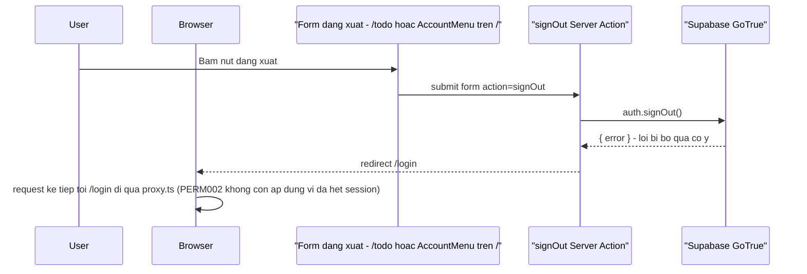

# Đăng xuất

`F001` `F002` `US004` `US006`

Một Server Action dùng chung, hai điểm gọi: form đăng xuất trên `/todo` (F001, trang gốc của
action) và mục "Sign out" trong menu tài khoản trên `/` (F002, dùng lại qua props). Cả hai hội
tụ về cùng một hàm `signOut()`.

> **Xác nhận**: `supabase.auth.signOut()` trong code hiện tại được gọi **không kèm tham số**,
> nhưng đó chính là global sign-out — SDK đặt `options = { scope: 'global' }` làm giá trị mặc
> định của tham số (`node_modules/@supabase/auth-js/dist/module/GoTrueClient.js:3402`:
> `async signOut(options = { scope: 'global' })`). Không truyền `options` nghĩa là dùng đúng
> default đó, không phải sign-out cục bộ. `app/_actions/auth.ts:17-19`.

### Trigger Sequence

### Numbered Steps

1. Trên `/todo`, nút đăng xuất nằm trong `<form action={signOut}>`. `app/todo/page.tsx:31,39-44`. `F001` `US004`
2. Trên mọi route dùng `HomeHeader` — `/`, `/awards-information`, `/kudos`, `/kudos/new`, `/profile`, `/standards`, và 3 route `ComingSoon` còn lại (`/admin`, `/kudos/secret-box`, `/kudos/[id]`) — `AccountMenu` nhận `signOutAction` truyền từ page (chính là `signOut` import từ `app/_actions/auth.ts`) và đặt trong `<form action={signOutAction}>` cuối menu. `app/page.tsx:1,37`, `app/awards-information/page.tsx:3,74`, `app/_components/coming-soon.tsx:1,29`, `app/_components/account-menu.tsx:108-112`. `F002` `US006`
3. `signOut()` gọi `supabase.auth.signOut()` — không truyền `options`, nên GoTrue dùng default `{ scope: 'global' }` của chính nó (`GoTrueClient.js:3402`), tức thu hồi refresh token ở mọi phiên/thiết bị chứ không chỉ phiên hiện tại. `app/_actions/auth.ts:17-19`.
4. Kết quả `{ error }` bị **bỏ qua có chủ đích** — một phiên đã hết hạn hoặc đã bị thu hồi từ trước vẫn phải đưa người dùng về `/login` thay vì kẹt ở màn hình lỗi. `app/_actions/auth.ts:18-19` (comment).
5. `redirect("/login")` — nằm ngoài mọi `try/catch` vì `redirect()` throw `NEXT_REDIRECT` nội bộ; bọc try/catch quanh nó sẽ nuốt mất điều hướng và báo lỗi giả. `app/_actions/auth.ts:20`.
6. Request kế tiếp của trình duyệt tới `/login` đi qua `proxy.ts` như mọi request khác — nhưng vì session đã bị GoTrue thu hồi ở bước 3, `updateSession()` trả `user = null`, nên nhánh PERM002 ("đã đăng nhập mà vào `/login` thì bounce `/todo`") không áp dụng — `/login` render bình thường. Xem flow "Session refresh và route guarding". `proxy.ts:44-46`.

### Edge Cases

- **Phiên đã hết hạn trước khi bấm đăng xuất**: `supabase.auth.signOut()` vẫn trả về (có thể kèm `error`), nhưng lỗi đó bị bỏ qua ở bước 4 — người dùng vẫn được đưa về `/login`, không thấy màn hình lỗi. `app/_actions/auth.ts:10-15` (comment), `US004` scenario "Error".
- **Đăng xuất từ `/todo` so với từ menu tài khoản trên `/`**: cùng một hàm `signOut()`, khác nơi gọi — không có phân nhánh hành vi giữa hai điểm gọi này ngoài việc form bao nó nằm ở component khác nhau.
- **Đăng xuất khỏi mọi thiết bị**: đúng như mô tả — vì `options` không được truyền, GoTrue áp dụng default `{ scope: 'global' }` của chính SDK (`GoTrueClient.js:3402`), thu hồi refresh token trên mọi thiết bị/phiên, không chỉ phiên hiện tại.

### Traceability

`F001` · `F002` · `US004` · `US006` · `FR-403` (functional-spec.md F001) — không có `BL###`/`PERM###` gắn riêng cho action này (US004 trong `user-stories.md` § Background Logic ghi rõ: lỗi bị bỏ gạt có chủ đích, không phải một BL item).
