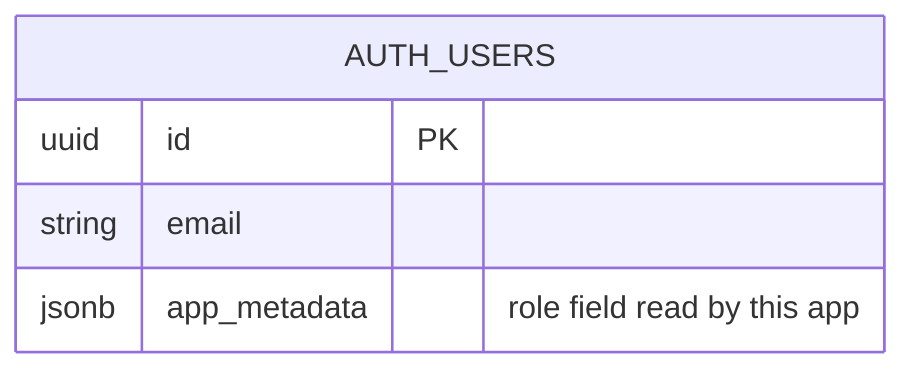

<!-- Output path (as-built, once promoted): docs/generated/entities.md -->

# Entities

**Project**: my-app (SAA 2025)
**Generated**: 2026-09-05

## The honest answer: this app owns no database schema

> **SUPERSEDED — this section stopped being true on 2026-09-06 (F004).** Everything under this
> heading describes the repository as it stood at the Core pass of 2026-09-05, and is retained
> only so the change is visible rather than silently rewritten. Measured on 2026-09-09:
> `supabase/migrations/` holds **four** migrations (`20260906140914_kudos_live_board.sql`,
> `20260907025909_viet_kudo_write_path.sql`, `20260908100000_profile_reader_view.sql`,
> `20260909093000_the_le_rules_content.sql`), `supabase/seed.sql` exists and now carries product
> content as well as dev data, and the app owns **12 base tables** in schema `public` —
> `board_stats`, `departments`, `gift_awards`, `hashtags`, `kudos`, `kudos_attachments`,
> `kudos_hashtags`, `kudos_likes`, `rule_items`, `rule_sections`, `spotlight_ticker_events`,
> `sunners` — plus one view, `kudos_readable` (list read off the running database, not off the
> migrations). Do not treat the bullets below as current state.
>
> The MODEL001–MODEL004 entries further down remain accurate as far as they go — they describe
> `auth.users` and three in-memory TypeScript contracts, none of which F004–F007 changed. What is
> missing is a MODEL entry per application-owned table. Writing those is a regeneration, not a row
> edit: run `/tkm:rebuild-spec --artifact entities`. Until then the authoritative schema
> descriptions are the per-feature specs — `docs/features/F004_KudosLiveBoard/technical-spec.md`
> § 4.2, `F005_VietKudo` § 4.2, `F006_ProfileBanThan` § 4.2 and `F007_TheLe` § 4.2 — plus the
> migrations themselves.

Confirmed by direct inspection, not inferred:

- `supabase/migrations/` **does not exist** (`ls` → no such directory).
- `supabase/seed.sql` **does not exist**, even though `supabase/config.toml` declares
  `[db.seed] sql_paths = ["./seed.sql"]` — the config references a file that was never created.
- `find . -name "*.sql"` outside `node_modules` returns **nothing**.
- No ORM, no query builder, no `.from("...")` call anywhere in `app/` or `lib/`. Every Supabase
  call in the codebase is `auth.*` (`getUser`, `signOut`, `signInWithOAuth`,
  `exchangeCodeForSession`, `signUp`, `setSession`) — confirmed by `scout-report.md` §4.

**There are zero tables, zero migrations, zero SQL, and zero application-owned entities.**
Any artifact claiming a `users`, `awards`, or `notifications` table would be invented — do not
add one downstream.

## What actually exists: GoTrue's managed auth schema + client-side type contracts

The only persistent "entity" is Supabase's own `auth.users`, created and owned by GoTrue —
not by this repo. Everything else below is a frozen TypeScript data shape with no persistence
layer at all. None of these are database tables; they are documented here because they are the
closest thing this app has to a data model.

No relationship lines are drawn to any other box below, because none exist: `Award`,
`Dictionary`, and `Locale` are static in-memory TypeScript literals with no foreign key,
no join, and no reference to `auth.users` or to each other beyond a shared string-literal key
(`AwardKey`) used purely to zip identity (`lib/awards.ts`) to copy (`lib/i18n/messages/*.ts`)
at render time.

---

### MODEL001_AuthUser — externally managed, not owned by this app

**Description**: Supabase GoTrue's managed `auth.users` table, provisioned and mutated entirely
outside this repository (no migration, no seed, no admin UI touches it here). Documented because
the app reads two of its fields.

| Attribute | Type | Constraints | Description |
|-----------|------|-------------|--------------|
| `id` | uuid | PK (GoTrue-managed) | Not read directly by app code; implicit via `getUser()`'s null/non-null result. |
| `email` | string | GoTrue-managed | Read at `app/todo/page.tsx:30` — display only, not used for any logic branch. |
| `app_metadata.role` | string \| undefined | GoTrue-managed, JSONB | Read at `app/_page-context.ts:40`: `user?.app_metadata?.role === "admin"`. **Never written by this codebase** — no code sets it; assumed provisioned out-of-band in Supabase. |

**Relationships**: None owned by this app — GoTrue also manages session/refresh-token rows
internally, but this repo never queries them directly (only `supabase.auth.getUser()` /
`.signOut()` / `.signInWithOAuth()` / `.exchangeCodeForSession()`).

**Discriminator Fields**:

| Field | DISC-### | Values | Description |
|-------|----------|--------|--------------|
| `app_metadata.role` | DISC-001 | `"admin"`, anything else (including absent) | Drives `isAdmin` (`app/_page-context.ts:40`) → controls only whether the Admin Dashboard `<Link>` renders in `account-menu.tsx:99-107`. Not a route guard — see `permissions-matrix.md`. |

---

### MODEL002_Dictionary — client-side type contract, not a database table

**Description**: The `Dictionary` interface (`lib/i18n/messages/dictionary.ts:24`) is the
compile-time shape of one locale's copy set. `vi.ts`/`vi-home.ts` and `en.ts`/`en-home.ts` are
static objects satisfying this interface — not rows, not a translations table. A key present in
`vi` but missing from `en` fails `npm run typecheck`, not a runtime lookup.

| Field group | Type | Notes |
|-------------|------|-------|
| `login.*` | `string` fields | Login screen copy (9 keys) |
| `footer.*` | `string` fields | Footer copy incl. `standards` (4th link) |
| `header.*` (implied by usage) | `string` fields | `header.accountLabel`, `header.profile`, `header.adminDashboard`, `header.signOut` (read in `account-menu.tsx:75,89,97,105,110`) |
| `home.awards.cards` | `Record<AwardKey, {...}>` | Keyed by the 6-member `AwardKey` union — a missing card is a compile error, not a silent grid gap. |
| `awardSystem.*` | nested object (`dictionary.ts:112-146`) | Award System screen copy (F003): `hero`, `navAriaLabel`, `quantityLabel`, `prizeLabel`, `prizeOr`, `units: Record<AwardUnitKey, string>`, and `cards: Record<AwardKey, {title, navLabel, paragraphs[], quantity, prizes[]}>`. `prizes[].note` is **optional** — "Best Manager carries no note line" is a type-level fact, not an empty string. |
| `home.eventTimeValue` | `string` | Hardcoded copy `"26/12/2025"` (`vi-home.ts`) — independent of `NEXT_PUBLIC_EVENT_START_AT`; the two can drift (scout §7). |

**Relationships**: `home.awards.cards` and `awardSystem.cards` are both keyed by `AwardKey`, the
same union `Award.key` (MODEL003) uses; `awardSystem.units` is keyed by `AwardUnitKey`, which
`AWARD_UNITS` (MODEL003) maps into. These are the app's only cross-structure links, and all of them
are shared string-literal types, not foreign keys.

**Discriminator Fields**: None — `Dictionary` fields are plain `string`, not an enum
(`dictionary.ts:2-4`, deliberate: lets `en.ts` hold different copy under the same type).

---

### MODEL003_Award — client-side type contract, not a database table

**Description**: `AWARDS` (`lib/awards.ts:27-42`) — 6 hardcoded records, frozen in design order.
Award *identity* lives here; award *copy* lives in the dictionary and is zipped in at render time —
`Dictionary.home.awards.cards` by `award-card.tsx` on the homepage, `Dictionary.awardSystem.cards`
by `app/awards-information/page.tsx:99-109` on the Award System screen. A third, non-locale facet —
*which unit* each award is counted in — lives in `AWARD_UNITS: Record<AwardKey, AwardUnitKey>`
(`lib/award-system.ts:25-32`), exhaustive so a seventh award cannot compile until its unit is
declared. `lib/award-system.ts` deliberately does **not** redefine `AwardSlug`/`AwardKey`/`AWARDS`
(`:7-12`): a second slug list would silently strand every `/awards-information#<slug>` deep link the
moment the two drifted.

| Attribute | Type | Constraints | Description |
|-----------|------|-------------|--------------|
| `slug` | `AwardSlug` (6-member string-literal union) | Fixed set, no runtime validation needed (compile-time exhaustive) | URL fragment target: `/awards-information#<slug>` (FR-405). |
| `key` | `AwardKey` (6-member string-literal union) | Must exist in `Dictionary.home.awards.cards`, `Dictionary.awardSystem.cards` and `AWARD_UNITS` | Dictionary key for this award's copy, and lookup key for its counting unit. |
| `image` | `string` | Static path under `/images/home/` | Composed thumbnail path. |

**Relationships**: `key` maps 1:1 into `Dictionary.home.awards.cards` (MODEL002). No relationship
to `AUTH_USERS`.

**Discriminator Fields**:

| Field | DISC-### | Values | Description |
|-------|----------|--------|--------------|
| `slug` | DISC-002 | `top-talent`, `top-project`, `top-project-leader`, `best-manager`, `signature-2025-creator`, `mvp` | Each value is the `id` of one award `<section>` on `/awards-information` and the `#<slug>` deep-link fragment the homepage cards point at; it is also the category-menu scroll-spy's key (F003 ALG-001). No other behavioral branch reads this field. |

---

### MODEL004_Locale — client-side type contract, not a database table

**Description**: `Locale` (`lib/i18n/locales.ts:8`) — a 2-member string-literal union backing the
cookie-based i18n scheme. Not persisted anywhere but the one `NEXT_LOCALE` cookie the app owns.

| Attribute | Type | Constraints | Description |
|-----------|------|-------------|--------------|
| value | `"vi" \| "en"` | Exhaustive union | `LOCALES` array (`locales.ts:10`); `DEFAULT_LOCALE = "vi"` (`:12`). |

**Relationships**: Selects which `Dictionary` object (MODEL002) `getDictionary()` returns
(`lib/i18n/dictionaries.ts:16-20`). No relationship to `AUTH_USERS` or `Award`.

**Discriminator Fields**:

| Field | DISC-### | Values | Description |
|-------|----------|--------|--------------|
| `Locale` value | DISC-003 | `"vi"`, `"en"` | Drives which static `Dictionary` object is selected (BL002); `"vi"` is default and authoritative copy source (`vi.ts:6-9`). |

---

## Client-side persisted state (not a table, but the only app-owned durable state)

| State | Owner | Notes |
|-------|-------|-------|
| `NEXT_LOCALE` cookie | This app (`lib/i18n/locales.ts:14`) | `path: "/"`, `maxAge` 1 year, `sameSite: "lax"` (`app/_actions/locale.ts:16-20`). The only cookie this app writes. |
| `sb-*-auth-token` cookies | GoTrue (`@supabase/ssr`) | Written/rotated by the Supabase client library, not by app code directly. |

## Validation Rules

None to report — there are no entity fields under this app's own validation (no Zod/Yup, no
form library — scout §4). The only "validation" in this surface is `resolveLocale()`'s total
function over untrusted cookie input (see BL001 in `behavior-logic.md`), which is a fallback
rule, not a field constraint.

## Summary

- **Total Entities**: 4 (1 externally-managed, 3 client-side type contracts — 0 application-owned database tables). `AWARD_UNITS` / `AwardUnitKey` (`lib/award-system.ts`) is folded into MODEL003 rather than given its own code: it is a lookup facet of `Award`, not a separate entity.
- **Total Relationships**: 3, all static in-memory structures — `Award.key` ↔ `Dictionary.home.awards.cards`; `Award.key` ↔ `Dictionary.awardSystem.cards`; `AWARD_UNITS[Award.key]` ↔ `Dictionary.awardSystem.units`
