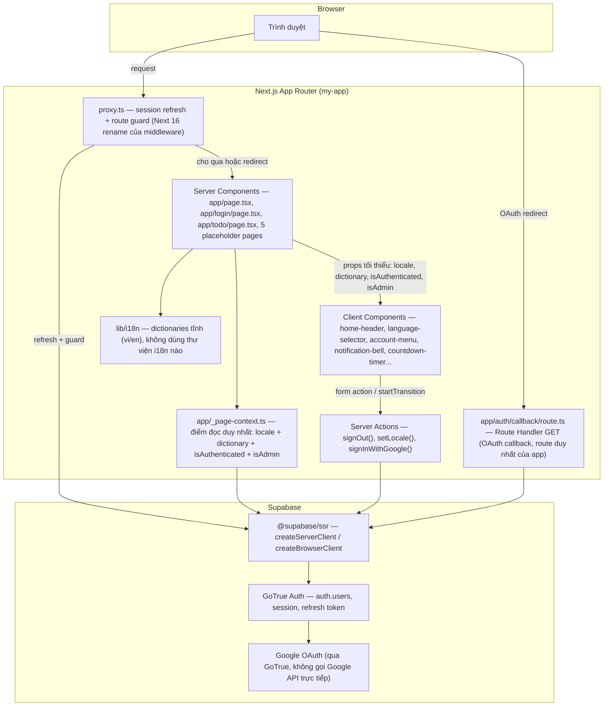
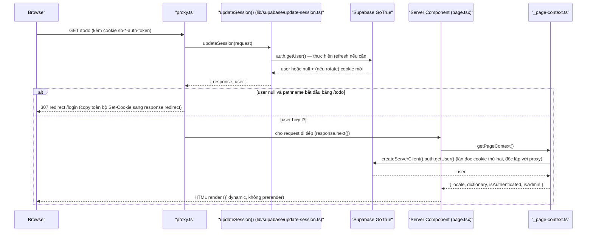

# Architecture

**Project**: my-app (SAA 2025) — Core pass draft, reconciled từ `scout-report.md`.

## System Architecture

Next.js 16 App Router, mọi route render động (`ƒ`) vì đụng `cookies()` — không route nào
prerender tĩnh (`scout-report.md § 2`). Không có API layer riêng của ứng dụng ngoài một route
handler OAuth callback; không có database do repo tự quản (§ Data Model bên dưới nói rõ).

**Không có API layer riêng của ứng dụng** ngoài `app/auth/callback/route.ts` — xác nhận tại
`scout-report.md § 4, § 9`; không có REST/GraphQL endpoint nào khác trong repo.

## Tech Stack

| Layer | Technology | Version | Nguồn |
|-------|------------|---------|-------|
| Frontend framework | Next.js (App Router) | 16.3.4 | `package.json:14-29` |
| UI runtime | React | 19.2.8 | `package.json:14-29` |
| Ngôn ngữ | TypeScript (strict) | theo `tsconfig.json` | `tsconfig.json` |
| Styling | Tailwind CSS v4 (`@tailwindcss/postcss`) | v4 | `postcss.config.mjs` |
| Auth / session | `@supabase/ssr` + `@supabase/supabase-js` (GoTrue) | 0.12.5 | `package.json:14-20` |
| i18n | Tự viết — cookie `NEXT_LOCALE` + dictionary tĩnh, **không dùng thư viện** (không next-intl, không next-i18next) | — | `lib/i18n/locales.ts`, `lib/i18n/dictionaries.ts` |
| E2E test | Playwright | 1.62 | `package.json:14-29` |
| Database | **Không có** — không schema, không migration, không SQL nào của app | N/A | `scout-report.md § 4` |
| Cache | **Không có** cache layer riêng | N/A | — |
| Queue | **Không có** | N/A | — |
| State/data-fetching lib | **Không có** (không Redux/Zustand/Jotai, không SWR/TanStack Query) — state là `useState` cục bộ ở 5 client component | N/A | `scout-report.md § 4` |
| Validation lib | **Không có** (không Zod/Yup) | N/A | `scout-report.md § 4` |
| Unit test runner | **Không có** — Playwright E2E là harness kiểm thử duy nhất | N/A | `package.json:5-12` |

## Data Flow

Sơ đồ dưới minh hoạ một request điển hình vào route được guard (`/todo`), gồm cả nhánh xác
thực Google qua callback. `proxy.ts` chạy trên mọi request trừ asset tĩnh (`proxy.ts:52-56`).

**Luồng OAuth** (tách biệt, không đi qua sơ đồ trên): `/login` → server action
`signInWithGoogle()` → `supabase.auth.signInWithOAuth(...)` → redirect Google → Google trả về
`/auth/callback` (route handler, **cố ý không bị `proxy.ts` guard** vì guard nó sẽ làm vòng
OAuth không thể hoàn tất — `proxy.ts:11-13`) → `exchangeCodeForSession(code)` → redirect tới
`next` (mặc định `/todo`) hoặc `/login?error=oauth_failed` khi thất bại
(`scout-report.md § 6`, BL-07).

**Ghi chú kiến trúc quan trọng**:
- `_page-context.ts` là **điểm đọc duy nhất** cho locale + dictionary + hai cờ suy ra
  (`isAuthenticated`, `isAdmin`) — object `user` gốc của Supabase **không bao giờ** vượt biên
  sang Client Component, chỉ hai boolean suy ra từ nó đi qua (`scout-report.md § 3`).
- `proxy.ts` và `_page-context.ts` gọi `getUser()` **độc lập** — proxy đọc để quyết định
  redirect, page context đọc lại để dựng props hiển thị. Không có cache chia sẻ giữa hai lần
  đọc này trong request hiện tại.
- Redirect của guard phải copy `response.cookies.getAll()` sang response redirect
  (`proxy.ts:30-39`) — bỏ qua bước này làm mất cookie rotate vừa ghi, và vì refresh token của
  Supabase dùng một lần, người dùng sẽ bị đăng xuất ngầm ở request kế tiếp.
- i18n không dùng middleware/URL segment — cookie `NEXT_LOCALE` đọc trực tiếp trong từng
  Server Component (`_page-context.ts:33`, `login/page.tsx:37`, `todo/page.tsx:24`), không có
  bước negotiation nào ở tầng proxy.

## Deployment View

> Derived from repository infrastructure-as-code — not verified against production.

**N/A — không tìm thấy infrastructure-as-code nào trong repo.**

Đã kiểm tra và xác nhận không tồn tại: không `Dockerfile`, không `docker-compose.yml`, không
manifest Kubernetes, không thư mục Terraform, không unit `systemd`, không `Procfile`, không
cấu hình nginx, không manifest PaaS nào (`vercel.json`, `netlify.toml`) —
(`scout-report.md § 9`: "no CI workflow (`.github/` absent), no Dockerfile, no deployment
config (`vercel.json`/`netlify.toml` absent)"). `supabase/config.toml` chỉ mô tả **local dev
stack** của Supabase CLI, không phải hạ tầng triển khai production — không dùng để suy ra
deployment topology.

Không dựng sơ đồ hay bảng node/edge thay cho phần này — không có nguồn `file:line` nào để
trích dẫn cho một topology, và bịa ra hạ tầng ở đây là sai nghiêm trọng hơn để trống.
