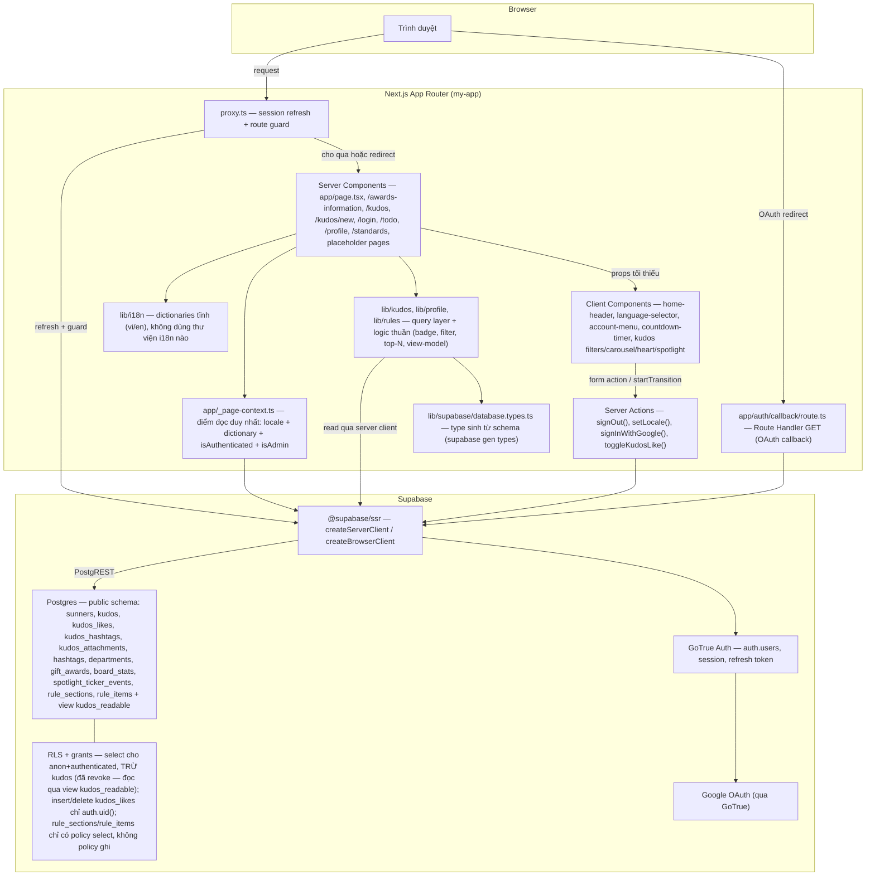
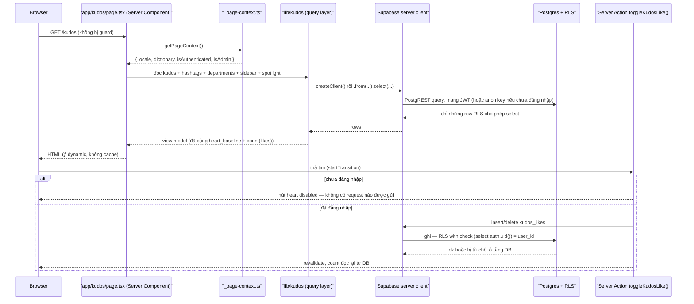
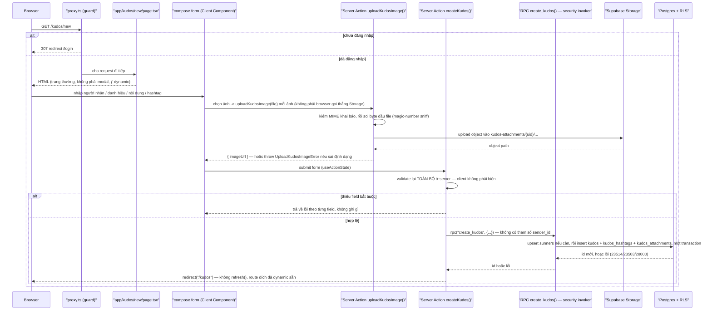
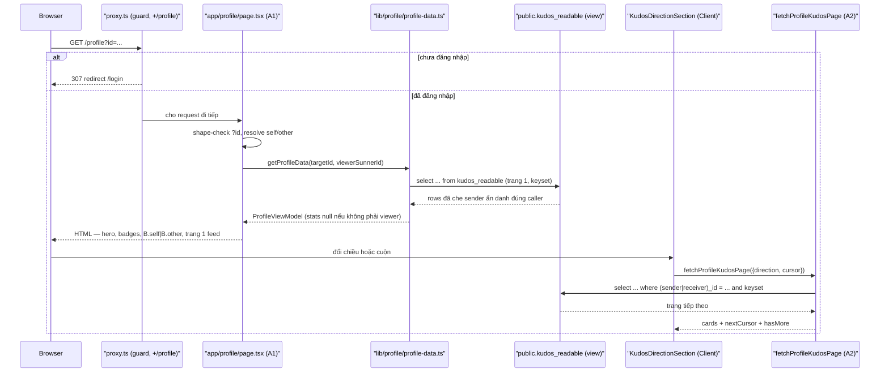

# Architecture

**Project**: my-app (SAA 2025) — mô tả tới F009 (Open Secret Box).

## System Architecture

Next.js 16 App Router, mọi route render động (`ƒ`) vì đụng `cookies()` — không route nào
prerender tĩnh. Không có API layer riêng của ứng dụng ngoài route handler OAuth callback.

**Thay đổi lớn nhất so với bản trước:** repo giờ **có** database do mình quản. Trước Kudos Live
Board, Supabase chỉ được dùng cho `auth.*` — không schema, không migration, không SQL. Màn hình
này mang vào lớp Postgres đầu tiên: migration trong `supabase/migrations/`, seed
`supabase/seed.sql`, và RLS policy đầu tiên của dự án. Từ đây, "không có database" không còn
đúng, và mọi tính năng sau đều thừa hưởng tiền lệ RLS mà nó đặt ra.

**Thay đổi của vòng F005 (Viết Kudo):** trước màn đó, mọi thứ repo làm với database là **đọc**,
cộng đúng một thao tác ghi nhỏ (thả tim). Viết Kudo là **form ghi đầu tiên của người dùng**, và nó
mang vào ba thứ mới:
- **Supabase Storage** — object storage đầu tiên. Ảnh đính kèm là file thật của người dùng, upload
  lên bucket riêng, không phải ảnh mẫu committed trong repo. `next.config.ts` phải khai báo
  `images.remotePatterns` trỏ vào host Storage (`${NEXT_PUBLIC_SUPABASE_URL}/storage/v1/object/public/**`)
  — thiếu dòng này thì `next/image` throw ngay khi gặp ảnh Storage đầu tiên và kéo sập cả `/kudos`.
- **Một tài liệu rich-text** thay cho chuỗi phẳng: `kudos.message` giữ nguyên kiểu `text`, nhưng
  cột mới `kudos.message_format` (`'plain' | 'doc'`) cho biết nội dung là chuỗi thường hay là một
  document JSON. Nhờ discriminator này, 57 dòng seed của F004 vẫn là `'plain'` và thẻ Kudos đã
  ship không phải đổi cách render chúng.
- **Tự cấp `sunners` row khi ghi lần đầu.** Seed để `auth_user_id` NULL trên mọi dòng, nên một
  người vừa đăng nhập Google chưa có danh tính người gửi. Action tự tạo dòng đó (upsert theo
  `auth_user_id`, vốn đã `unique`) trước khi insert kudos.

**Thay đổi của vòng này (F006 — Profile bản thân):** trước màn này, mọi bảng `public.*` mở `select`
thẳng cho `anon`+`authenticated` (tiền lệ F004, `kudos_select_all`). F006 là lần đầu tiên một bảng
bị **revoke** quyền đọc trực tiếp: `public.kudos` không còn cho `select` từ `anon`/`authenticated`
— mọi đọc phải qua view `public.kudos_readable` (§ Data Flow → "Reader-view data layer"). Đây là
ranh giới đọc thật đầu tiên của repo, khác hẳn "mọi bảng đọc công khai" đã đúng từ F004 tới F005.

Route `/profile` cũng là route guarded thứ ba (sau `/todo`, `/kudos/new`) — vẫn cùng một điều kiện
`isGuarded` trong `proxy.ts`, không phải cơ chế mới.

**Thay đổi của vòng F007 (Thể lệ):** cho tới F006, mọi thứ nằm trong Postgres đều là **dữ liệu giao
dịch** — người, Kudos, tim, hashtag, sự kiện ticker. Nội dung biên tập thì hardcode trong `lib/`:
`/awards-information` đọc `lib/awards.ts` và `lib/award-system.ts`, hai file TypeScript. F007 là lần
đầu **nội dung biên tập được đưa vào database**: `public.rule_sections` (ba mục văn xuôi có thứ tự) và
`public.rule_items` (bốn bậc huy hiệu Hero + sáu icon sưu tập, phân biệt bằng cột `kind`).

Hệ quả kiến trúc, nói thẳng vì nó tạo tiền lệ: repo giờ có **hai** chỗ hợp lệ để nội dung màn hình
sống — `lib/*.ts` (F003) và bảng Postgres (F007) — và không có luật nào trong repo phân xử chỗ nào
đúng cho màn tiếp theo. F007 chọn database vì commission yêu cầu tường minh ("use Supabase local
project"), không vì một nguyên tắc đã được thống nhất. Ai đóng khoảng trống này nên đóng bằng một
quyết định được ghi lại, không bằng cách bắt chước màn gần nhất.

Điều F007 **không** mang vào, ghi lại để không phải tìm: không Server Action, không thao tác ghi,
không Storage bucket, không route mới. Ảnh huy hiệu và icon nằm trên đĩa dưới `public/images/rules/`,
dòng database chỉ giữ đường dẫn (`image_path`) — cùng cách mọi màn khác đối xử với asset Figma của nó.

**Vẫn không có API layer riêng của ứng dụng** ngoài `app/auth/callback/route.ts`. Kudos không
thêm REST endpoint nào: Server Component đọc thẳng qua `lib/supabase/server.ts`, và thao tác ghi
duy nhất (thả tim) đi qua Server Action. Không có `/api/kudos`.

## Tech Stack

| Layer | Technology | Version | Nguồn |
|-------|------------|---------|-------|
| Frontend framework | Next.js (App Router) | 16.3.4 | `package.json` |
| UI runtime | React | 19.2.8 | `package.json` |
| Ngôn ngữ | TypeScript (strict) | theo `tsconfig.json` | `tsconfig.json` |
| Styling | Tailwind CSS v4 (`@tailwindcss/postcss`) | v4 | `postcss.config.mjs` |
| Auth / session | `@supabase/ssr` + `@supabase/supabase-js` (GoTrue) | 0.12.5 | `package.json` |
| Rich text | **Tự viết** — document JSON render ra React element, **không** `dangerouslySetInnerHTML`, không thư viện sanitize (repo không có `dompurify`/`sanitize-html`/`marked`) | — | `lib/kudos/` |
| **Database** | **Postgres qua Supabase local stack** — migration + seed + RLS do repo quản | theo `supabase/config.toml` | `supabase/config.toml`, `supabase/migrations/` |
| **DB types** | **Sinh bằng `supabase gen types typescript --local`**, commit vào repo | — | `lib/supabase/database.types.ts` |
| **Object storage** | **Supabase Storage** — bucket `kudos-attachments` riêng cho ảnh đính kèm Kudos, có policy riêng | `[storage] enabled = true` (`config.toml`); bucket + policy tạo bằng SQL migration, **không** qua khối `[storage.buckets.*]` (khối đó vẫn đang comment trong `config.toml`) — SQL được `supabase db reset` tạo lại tự động, khối config.toml thì cần restart container | `supabase/config.toml` (`storage.enabled = true`), `supabase/migrations/20260907025909_viet_kudo_write_path.sql` |
| i18n | Tự viết — cookie `NEXT_LOCALE` + dictionary tĩnh, **không dùng thư viện** | — | `lib/i18n/locales.ts` |
| E2E test | Playwright | 1.62 | `package.json` |
| Cache | **Không có** cache layer riêng — route động, đọc mỗi request | N/A | — |
| Queue | **Không có** | N/A | — |
| ORM / query builder | **Không có** — dùng trực tiếp `supabase-js` (PostgREST), không Prisma/Drizzle | N/A | `lib/kudos/` |
| State/data-fetching lib | **Không có** (không Redux/Zustand, không SWR/TanStack Query) — state là `useState` cục bộ | N/A | — |
| Validation lib | **Không có** (không Zod/Yup) — predicate tự viết trong `lib/kudos/`, kiểm **cả ở server** trong Server Action, không tin client | N/A | `lib/kudos/` |
| Unit test runner | **Không có** — Playwright E2E là harness kiểm thử duy nhất | N/A | `package.json` |

## Data Flow

**Route-guard đổi ở vòng F005.** `proxy.ts` vẫn chạy trên mọi request trừ asset tĩnh và vẫn gọi
`updateSession()`, nhưng danh sách guard không còn là hai route: `/kudos/new` được thêm vào cùng
`/todo`. Đây là guard đầu tiên kể từ F001. Lý do đơn giản — viết một lời cảm ơn cần có danh tính,
nên ở đây thật sự có thứ cần bảo vệ, khác với bảng đọc công khai. Bề mặt đọc của Kudos (`/kudos`,
`/kudos/[id]`, `/kudos/secret-box`) **không đổi**, vẫn công khai có chủ đích. **F009 không thêm
route guard** cho `/kudos/secret-box` dù màn đó giờ có một hành động ghi thật (mở hộp) —
ranh giới nằm ở tầng database (`EXECUTE` trên `open_secret_box()` không cấp cho `anon`, xem dưới),
không ở `proxy.ts`.

**Vòng F006 thêm route guarded thứ ba:** `/profile`, cùng điều kiện `isGuarded`, cộng thêm việc
page tự re-check session lần nữa (defense in depth).

Sơ đồ dưới là luồng riêng của Kudos Live Board: đọc khi render, và ghi khi thả tim.

Sơ đồ dưới là luồng ghi của màn Viết Kudo — form ghi đầu tiên của người dùng trong repo.

### Reader-view data layer (view giữa app và bảng `kudos`) — mới ở F006

Từ F006, không còn điểm nào trong `app/` hay `lib/` đọc `public.kudos` trực tiếp — `grep` cho
`from("kudos")` trả về 0 kết quả. Bảy điểm đọc, trải trên ba file, đều đi qua
`public.kudos_readable`:

| File | Số điểm đọc |
|---|---|
| `lib/kudos/queries.ts` (`fetchKudos`) | 1 |
| `app/kudos/_actions/toggle-kudos-like.ts` | 2 |
| `lib/profile/profile-queries.ts` | 4 |

View null hoá **cả năm cột `sender_*`** (`sender_id`, `sender_full_name`, `sender_avatar_url`,
`sender_kudos_received_baseline`, `sender_department_name`) của một Kudos ẩn danh trừ khi caller
chính là người gửi — không chỉ `sender_id`; che một mình `sender_id` mà để lại `sender_full_name`
thì tên người gửi vẫn lộ. `receiver_id` giữ nguyên (người nhận vẫn công khai kể cả trên Kudos ẩn
danh), và cùng với `id` nó là cột phẳng truy được, nên bốn embed của `fetchKudos` vẫn resolve qua
view này. View chạy dưới quyền chủ sở hữu (Postgres mặc định, **không** set `security_invoker`) —
tương đương "security definer" ở cấp function, cho phép view vẫn đọc được `kudos` sau khi bảng gốc
bị revoke khỏi `anon`/`authenticated`. Chi tiết cột và predicate:
`docs/features/F006_ProfileBanThan/technical-spec.md § 4.2`.

**Hệ quả kiến trúc:** từ nay "đọc Kudos" có hai lớp — bảng gốc (chỉ chủ sở hữu/migration đọc được)
và view công khai (mọi read-path của app đi qua đây). Một tính năng sau này thêm một điểm đọc
`kudos` mới PHẢI trỏ vào `kudos_readable`, không phải `kudos` — trỏ thẳng vào bảng gốc sẽ vỡ ngay
vì quyền đã bị revoke.

### Read path của nội dung biên tập (`lib/rules/`) — mới ở F007

`lib/rules/` theo đúng khuôn `lib/kudos/` và `lib/profile/` đã dựng: `queries.ts` chỉ chứa read có
kiểu (client luôn là tham số, không bao giờ tạo bên trong), `rules-data.ts` là orchestrator tạo một
client mỗi request rồi bắn hai read độc lập qua một `Promise.all`, `view-model.ts` giữ shape đóng băng
mà component tiêu thụ. Dòng database không chạm tới component — cùng ranh giới `board-data.ts` và
`profile-data.ts` đã đặt ra.

Mọi query của feature này mang `order by position` tường minh. Đây là idiom sẵn có
(`hashtags.position`, `departments.filter_position`, `kudos_hashtags.position`), không phải quy ước
mới. Việc tách `rule_items.kind` thành `heroTiers` / `collectibleIcons` xảy ra đúng một lần, trong
`rules-data.ts`; không component nào tự lọc lại.

### Đường ghi qua `security definer` (`open_secret_box()`) — mới ở F009

Mọi hàm ghi trước đó (`create_kudos()`) chạy `security invoker`: RLS vẫn áp lên người gọi, hàm chỉ
gộp nhiều bảng vào một transaction. `open_secret_box()` là hàm `security definer` **đầu tiên** của
repo — chạy với quyền chủ hàm, bỏ qua RLS theo đúng thiết kế, vì việc trừ một hộp phải `UPDATE
public.sunners`, và bảng đó cố tình không có policy `UPDATE` nào (mở một policy như vậy sẽ cho
phép bất kỳ phiên nào tự viết lại số hộp của mình qua PostgREST). Ba biện pháp thay RLS làm việc
chặn: `search_path` ghim cứng, hàm không nhận tham số danh tính nào, và `execute` bị revoke khỏi
`anon`/`public`, chỉ cấp cho `authenticated`. Chi tiết đầy đủ:
`docs/features/F009_OpenSecretBox/technical-spec.md § 1, § 4` và
`docs/system/permissions.md` § "Ranh giới mới của vòng F009".

**Hệ quả kiến trúc:** từ nay có hai kiểu hàm ghi trong repo, và một tính năng sau này PHẢI chọn rõ
kiểu nào trước khi viết migration — `security invoker` khi RLS đã đủ diễn đạt ranh giới (đa số
trường hợp), `security definer` chỉ khi ranh giới cần một cột/bảng mà RLS không thể mở an toàn
(như `sunners.secret_box_*`). Chọn `security definer` mà không ghim `search_path`, không revoke
`execute` khỏi `anon`, hoặc để hàm nhận tham số danh tính là ba cách cụ thể làm hỏng chính biện
pháp mà F009 dựng lên.

### Hai chiến lược phân trang cùng tồn tại (ghi nhận, chưa hợp nhất)

F004's `all-kudos-feed.tsx` đọc hết bảng `kudos` một lần rồi cắt phía client theo `FEED_PAGE_SIZE`
(giả định A4: bảng nhỏ). F006's feed hồ sơ (`fetchProfileKudosPage`) là điểm phân trang SERVER
thật đầu tiên của repo — keyset cursor `(sent_at, id)`, mỗi lần cuộn là một truy vấn mới, không đọc
lại phần đã có. Hai chiến lược này cùng tồn tại có chủ đích ở bản vẽ này (ADV-1,
`technical-spec.md § 5.3`) — ai chạm lại `all-kudos-feed.tsx` sau này nên biết keyset cursor đã có
tiền lệ ở `lib/profile/`, không cần phát minh lại cách tiếp cận.

### Sequence diagram — đọc hồ sơ + đổi chiều KUDOS (F006)

**Ghi chú kiến trúc quan trọng**:
- `_page-context.ts` vẫn là **điểm đọc duy nhất** cho locale + dictionary + hai cờ suy ra. Object
  `user` gốc của Supabase **không bao giờ** vượt biên sang Client Component. Kudos không phá lệ
  này: sidebar và trạng thái tim được Server Component giải quyết xong rồi mới truyền xuống dưới
  dạng dữ liệu thuần.
- **Số tim = `kudos.heart_baseline` + `count(kudos_likes)`.** Seed không được ghi vào
  `auth.users` (GoTrue sở hữu schema đó), nên số `1.000` trên frame sống ở cột baseline, còn
  `kudos_likes` chỉ chứa like thật của người dùng thật. Nhờ vậy ràng buộc "một người một like
  trên mỗi kudos" vẫn cưỡng chế được ở tầng DB.
- **Sunner ẩn danh đọc được hết, ghi thì không.** RLS mở `select` cho `anon` và `authenticated`;
  `insert`/`delete` trên `kudos_likes` chỉ mở cho `authenticated` và khớp `auth.uid()`. Nút tim
  disabled ở UI chỉ là lớp thứ hai — chặn thật nằm ở DB.
  **Sửa ở F006:** câu trên không còn đúng nguyên văn với `public.kudos`. Bảng đó đã bị revoke
  `select` khỏi cả `anon` và `authenticated`; người xem ẩn danh vẫn đọc được nội dung Kudos, nhưng
  qua view `kudos_readable` chứ không phải bảng gốc (xem § "Reader-view data layer" ở trên). Các
  bảng khác giữ nguyên như câu gốc mô tả.
- **Không cache.** Route đụng `cookies()` nên render động mỗi request; trạng thái tim theo từng
  người xem, nên cache trang sẽ sai. Đây là lý do không dùng `use cache` ở đây.
- **`db reset` là bước trước khi chạy test, không bao giờ giữa phiên.** Nó truncate cả schema
  `auth`, nên gọi giữa lúc suite đang chạy sẽ làm `getUser()` trả null và đẩy browser đã đăng
  nhập về `/login`.
- **Người gửi luôn suy từ session, không bao giờ nhận từ client.** `createKudos()` (Server Action)
  không có tham số actor, giống `toggleKudosLike()`. Ghi thật đi qua RPC `create_kudos` — hàm này
  cũng **không nhận tham số `sender_id`** (`v_uid := auth.uid()` bên trong hàm), nên mạo danh người
  gửi không phải là điều *bị RLS từ chối*, mà là điều **không có chỗ nào để biểu diễn được** ngay
  từ đầu. Hàm chạy `security invoker` (**không phải** `security definer` — xác nhận trực tiếp trên
  DB: `pg_proc.prosecdef = f`), nên bốn policy `insert` bên dưới vẫn áp dụng đầy đủ dù đi qua hàm;
  hàm chỉ gộp ba bảng ghi vào một transaction, không né RLS. RLS vẫn là lớp chốt cuối:
  `sender_id` phải nằm trong `select id from sunners where auth_user_id = (select auth.uid())`.
- **Validate hai lớp, nhưng chỉ một lớp là biên.** Client validate để hiện lỗi ngay và để disable
  nút `Gửi`; server validate lại toàn bộ vì client không đáng tin. Kiểu file ảnh cũng vậy.
- **Ẩn danh che người gửi, không che người nhận.** `is_anonymous` chỉ đổi cách thẻ Kudos hiển thị
  phía người gửi; `sender_id` vẫn được lưu thật để còn truy được khi cần kiểm duyệt.
  **Sửa ở F006:** phần "vẫn được lưu thật" đúng, nhưng "chỉ đổi cách hiển thị" thì không còn đúng —
  từ F006 việc che người gửi là bảo đảm ở **tầng đọc**, không phải quy ước hiển thị. Xem
  `docs/system/permissions.md` § Special Conditions để có phát biểu đầy đủ.
- **Không có policy UPDATE/DELETE nào cho `kudos`.** Sửa và xoá bài là commission khác
  (`Màn Sửa bài viết`, `Admin - Review content`). Không mở sẵn quyền chưa có màn nào dùng.
- **Ba policy `INSERT` đã được viết lại ở F006 để sống qua đợt revoke.** `kudos_likes_insert_own`,
  `kudos_hashtags_insert_own` và `kudos_attachments_insert_own` từng join `public.kudos` ngay trong
  `with check`; policy được đánh giá bằng quyền của **caller**, nên revoke sẽ tự vô hiệu hoá chính
  chúng và giết thao tác thả tim của F004. Phần đọc đó giờ nằm trong một biên `security definer`:
  `public.is_kudos_sender(bigint)`, trả `boolean` và không bao giờ trả id người gửi.

## Deployment View

> Derived from repository infrastructure-as-code — not verified against production.

**N/A — không tìm thấy infrastructure-as-code nào trong repo.**

Không `Dockerfile`, không `docker-compose.yml`, không manifest Kubernetes, không Terraform, không
`vercel.json`/`netlify.toml`, không CI workflow. `supabase/config.toml` chỉ mô tả **local dev
stack** của Supabase CLI, không phải hạ tầng production — không dùng để suy ra deployment
topology.

Một điểm mới cần ghi lại: từ nay việc triển khai **có** bước schema. `supabase/migrations/` phải
được apply vào database đích trước khi bản build đọc được gì.

**Đổi ở F007:** câu "`supabase/seed.sql` là dữ liệu dev/test, **không** phải dữ liệu production"
**không còn đúng trọn vẹn**. File này từ nay chứa cả **nội dung sản phẩm** — chữ thể lệ hiển thị cho
người dùng, ở `seed.sql:347-397` (`rule_sections` + `rule_items`). Các dòng đó cần có mặt ở mọi môi
trường thì `/standards` mới có gì để hiển thị; một môi trường chạy migration mà không chạy seed sẽ
render panel rỗng chứ không lỗi. Repo vẫn chưa có nơi nào mô tả cách nội dung đó tới được môi trường
thật — khoảng trống đã ghi nhận, và F007 làm nó rộng thêm chứ không thu hẹp. Không suy diễn thêm ở
đây.
