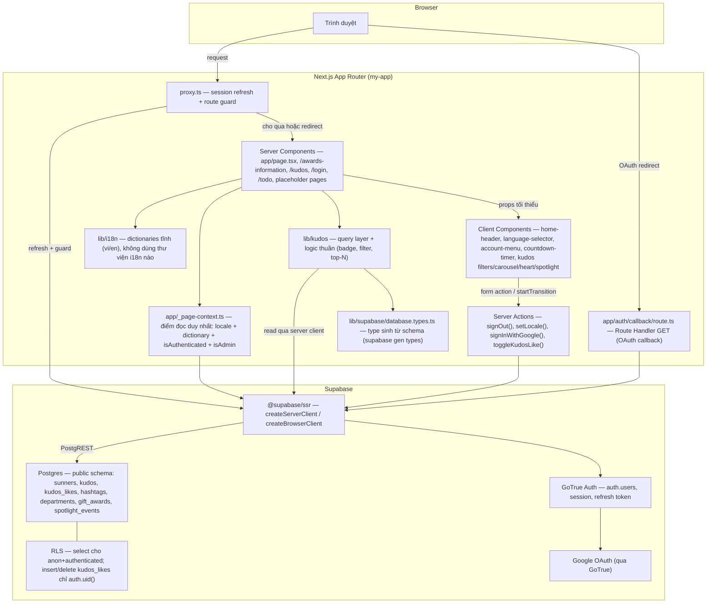
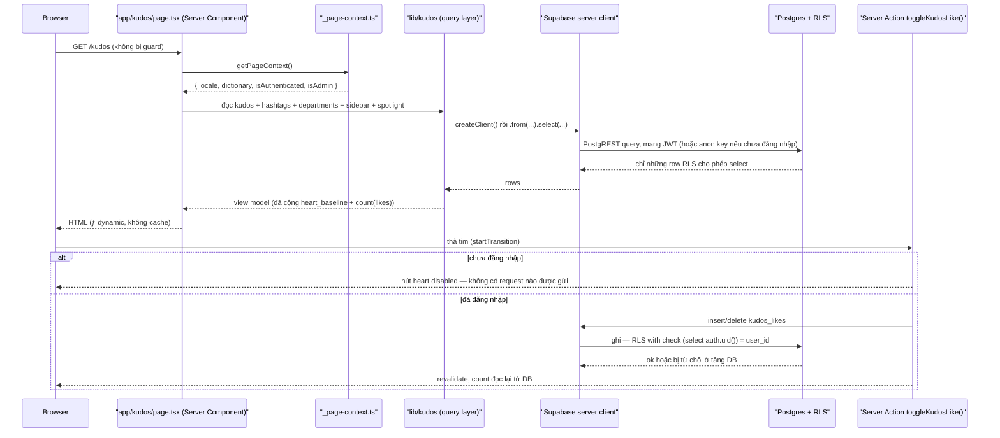

# Architecture

**Project**: my-app (SAA 2025) — forward-draft cho Kudos Live Board, viết trước khi code (SDD).

## System Architecture

Next.js 16 App Router, mọi route render động (`ƒ`) vì đụng `cookies()` — không route nào
prerender tĩnh. Không có API layer riêng của ứng dụng ngoài route handler OAuth callback.

**Thay đổi lớn nhất so với bản trước:** repo giờ **có** database do mình quản. Trước Kudos Live
Board, Supabase chỉ được dùng cho `auth.*` — không schema, không migration, không SQL. Màn hình
này mang vào lớp Postgres đầu tiên: migration trong `supabase/migrations/`, seed
`supabase/seed.sql`, và RLS policy đầu tiên của dự án. Từ đây, "không có database" không còn
đúng, và mọi tính năng sau đều thừa hưởng tiền lệ RLS mà nó đặt ra.

**Vẫn không có API layer riêng của ứng dụng** ngoài `app/auth/callback/route.ts`. Kudos không
thêm REST endpoint nào: Server Component đọc thẳng qua `lib/supabase/server.ts`, và thao tác ghi
duy nhất (thả tim) đi qua Server Action. Không có `/api/kudos`.

## Tech Stack

| Layer | Technology | Version | Nguồn |
|-------|------------|---------|-------|
| Frontend framework | Next.js (App Router) | 16.3.4 | `package.json` |
| UI runtime | React | 19.2.8 | `package.json` |
| Ngôn ngữ | TypeScript (strict) | theo `tsconfig.json` | `tsconfig.json` |
| Styling | Tailwind CSS v4 (`@tailwindcss/postcss`) | v4 | `postcss.config.mjs` |
| Auth / session | `@supabase/ssr` + `@supabase/supabase-js` (GoTrue) | 0.12.5 | `package.json` |
| **Database** | **Postgres qua Supabase local stack** — migration + seed + RLS do repo quản | theo `supabase/config.toml` | `supabase/config.toml`, `supabase/migrations/` |
| **DB types** | **Sinh bằng `supabase gen types typescript --local`**, commit vào repo | — | `lib/supabase/database.types.ts` |
| i18n | Tự viết — cookie `NEXT_LOCALE` + dictionary tĩnh, **không dùng thư viện** | — | `lib/i18n/locales.ts` |
| E2E test | Playwright | 1.62 | `package.json` |
| Cache | **Không có** cache layer riêng — route động, đọc mỗi request | N/A | — |
| Queue | **Không có** | N/A | — |
| ORM / query builder | **Không có** — dùng trực tiếp `supabase-js` (PostgREST), không Prisma/Drizzle | N/A | `lib/kudos/` |
| State/data-fetching lib | **Không có** (không Redux/Zustand, không SWR/TanStack Query) — state là `useState` cục bộ | N/A | — |
| Validation lib | **Không có** (không Zod/Yup) — ràng buộc nằm ở schema + `maxLength` trên input | N/A | — |
| Unit test runner | **Không có** — Playwright E2E là harness kiểm thử duy nhất | N/A | `package.json` |

## Data Flow

Luồng auth và route-guard **không đổi**: `proxy.ts` chạy trên mọi request trừ asset tĩnh, gọi
`updateSession()`, guard đúng hai route `/todo` và `/login`. `/kudos` nằm ngoài guard — công khai
có chủ đích.

Sơ đồ dưới là luồng riêng của Kudos Live Board: đọc khi render, và ghi khi thả tim.

**Ghi chú kiến trúc quan trọng**:
- `_page-context.ts` vẫn là **điểm đọc duy nhất** cho locale + dictionary + hai cờ suy ra. Object
  `user` gốc của Supabase **không bao giờ** vượt biên sang Client Component. Kudos không phá lệ
  này: sidebar và trạng thái tim được Server Component giải quyết xong rồi mới truyền xuống dưới
  dạng dữ liệu thuần.
- **Số tim = `kudos.heart_baseline` + `count(kudos_likes)`.** Seed không được ghi vào
  `auth.users` (GoTrue sở hữu schema đó), nên số `1.000` trên frame sống ở cột baseline, còn
  `kudos_likes` chỉ chứa like thật của người dùng thật. Nhờ vậy ràng buộc "một người một like
  trên mỗi kudos" vẫn cưỡng chế được ở tầng DB.
- **Sunner ẩn danh đọc được hết, ghi thì không.** RLS mở `select` cho `anon` và `authenticated`;
  `insert`/`delete` trên `kudos_likes` chỉ mở cho `authenticated` và khớp `auth.uid()`. Nút tim
  disabled ở UI chỉ là lớp thứ hai — chặn thật nằm ở DB.
- **Không cache.** Route đụng `cookies()` nên render động mỗi request; trạng thái tim theo từng
  người xem, nên cache trang sẽ sai. Đây là lý do không dùng `use cache` ở đây.
- **`db reset` là bước trước khi chạy test, không bao giờ giữa phiên.** Nó truncate cả schema
  `auth`, nên gọi giữa lúc suite đang chạy sẽ làm `getUser()` trả null và đẩy browser đã đăng
  nhập về `/login`.

## Deployment View

> Derived from repository infrastructure-as-code — not verified against production.

**N/A — không tìm thấy infrastructure-as-code nào trong repo.**

Không `Dockerfile`, không `docker-compose.yml`, không manifest Kubernetes, không Terraform, không
`vercel.json`/`netlify.toml`, không CI workflow. `supabase/config.toml` chỉ mô tả **local dev
stack** của Supabase CLI, không phải hạ tầng production — không dùng để suy ra deployment
topology.

Một điểm mới cần ghi lại: từ nay việc triển khai **có** bước schema. `supabase/migrations/` phải
được apply vào database đích trước khi bản build đọc được gì, và `supabase/seed.sql` là dữ liệu
dev/test, **không** phải dữ liệu production. Repo hiện chưa có nơi nào mô tả bước đó cho môi
trường thật — vẫn là khoảng trống, không suy diễn thêm ở đây.
