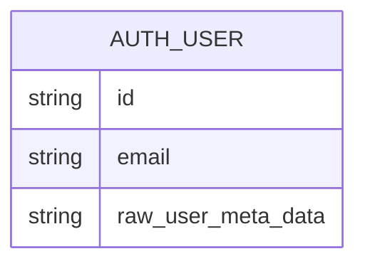
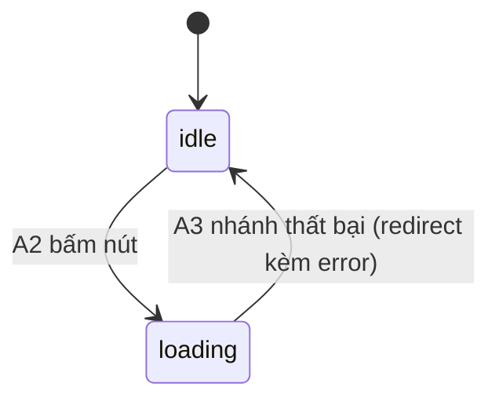

# F000_Login

## 1. Technical Overview

Đăng nhập cho SAA 2025 dùng Google OAuth qua Supabase Auth (local stack). Khách chưa xác thực vào `/login`, bấm "LOGIN With Google", được chuyển hướng ra Google, quay lại qua `/auth/callback`, rồi vào `/todo`. `proxy.ts` (đã có `updateSession`) nhận thêm việc gác cổng route theo trạng thái đăng nhập. Ngôn ngữ hiển thị (VN/EN) lưu qua cookie `NEXT_LOCALE`, không dùng thư viện i18n.

## 2. Action Index

| # | Action (handler) | Method · Path | Codes | Writes | Detail |
|---|---|---|---|---|---|
| **A0** | *cross-cutting — route guard + session refresh* | — | FR-101, FR-102, FR-602, BR-002 | — | § 4.4 |
| **A1** | `LoginPage#render` (planned) | `GET` `/login` | FR-201, FR-202, FR-203, DEC-001, US001, US003 | — *(read-only)* | § 3.1 |
| **A2** | `signInWithGoogle` (planned) | Server Action · `/login` | FR-202, FR-601, BR-001, US001, SM-001 | — *(external redirect, no local write)* | § 3.1 |
| **A3** | `GET /auth/callback` (planned) | `GET` `/auth/callback` | FR-401, FR-402, DEC-002, US001, SM-001 | — *(session held by Supabase Auth, not an app-owned table)* | § 3.1 |
| **A4** | `setLocale` (planned) | Server Action · `/login` | FR-203, BR-003, US003 | — *(cookie only)* | § 3.2 |
| **A5** | `TodoPage#render` (planned) | `GET` `/todo` | US004 | — *(read-only)* | § 3.3 |
| **A6** | `signOut` (planned) | Server Action · `/todo` | FR-403, US004 | — *(session cleared, not an app-owned table)* | § 3.3 |

## 3. Actions

### 3.1 CAP-01 — Đăng nhập bằng Google

#### A1 · Hiển thị màn hình Login
`GET` `/login` → `` `LoginPage#render` `` (planned)
`FR-201` `FR-202` `FR-203` `DEC-001` `US001` `US003` · `SCR-login`

**Who** · Khách truy cập chưa đăng nhập
**FE** · Server Component (planned `app/login/page.tsx`) đọc cookie `NEXT_LOCALE` để chọn từ điển VN/EN, đọc query `error` để quyết định hiện banner lỗi, render header (logo + bộ chọn ngôn ngữ), khối wordmark "ROOT FURTHER" + mô tả, nút "LOGIN With Google", và footer.
**Request** · query `error` *(tuỳ chọn — chỉ có khi quay về từ Google với lỗi)*
**BE** · không có — thuần render phía server, không gọi service riêng.
**Rule** · Quyết định hiện banner lỗi khi có tham số `error`:

| DEC | subtype | Condition | What the user sees | Source |
|---|---|---|---|---|
| **DEC-001** | render | `searchParams.error` tồn tại | Hiện dòng "Đăng nhập không thành công. Vui lòng thử lại." phía trên nút đăng nhập | `TBD (draft)` |

**Result** · Chỉ render — không ghi dữ liệu. Không có `DISC-###` nào chi phối màn hình này.
**Source:** `TBD (draft)`

<!-- Không cần sequence diagram: dưới ngưỡng — read-only, một hop, đồng bộ. -->

---

#### A2 · Bấm "LOGIN With Google"
Server Action · `/login` → `` `signInWithGoogle` `` (planned)
`FR-202` `FR-601` `BR-001` `US001` · `SM-001` · `INT-001`

**Who** · Khách truy cập chưa đăng nhập
**FE** · Nút đăng nhập (Client Component) submit Server Action; ngay khi bấm, nút chuyển sang disabled + hiện loader (SM-001: `idle` → `loading`).
**Request** · không có tham số — hành động không nhận input từ người dùng.
**BE** · `` `signInWithGoogle` `` (planned) gọi `supabase.auth.signInWithOAuth({ provider: 'google', options: { redirectTo: '{origin}/auth/callback' } })`, sau đó `redirect(data.url)` ra ngoài ứng dụng.
**Rule** · **BR-001 — Mọi tài khoản Google hợp lệ đều được phép đăng nhập, không áp dụng domain allow-list.** Không có bước kiểm tra domain nào được thêm trước hay sau khi gọi `signInWithOAuth`.
**Result** · Không ghi dữ liệu cục bộ — trình duyệt được chuyển hướng toàn trang sang trang xác thực của Google qua `INT-001` (Supabase Auth phát hành URL authorize) *(§ 4.5)*.
**State** · `SM-001`: `idle` → `loading` *(§ 4.3)*
**Source:** `TBD (draft)`

<!-- Không cần sequence diagram: một action, redirect ra ngoài, không ghi ≥2 bảng. -->

---

#### A3 · Xử lý callback OAuth *(background, no FE)*
`GET` `/auth/callback` → `` `GET /auth/callback` `` (planned)
`FR-401` `FR-402` `US001` · `SM-001` · `INT-001`

**Who** · *không có thao tác trực tiếp — do Google chuyển hướng về sau khi người dùng xác nhận hoặc huỷ ở màn hình của Google*
**FE** · *không có* — route handler thuần phía server.
**Request** · query `code` *(thành công)* hoặc `error` *(thất bại/huỷ)*
**BE** · `` `GET /auth/callback` `` (planned) đọc `request.nextUrl.searchParams`; có `code` thì gọi `supabase.auth.exchangeCodeForSession(code)`; có `error` thì bỏ qua bước exchange.
**Rule** · Quyết định điều hướng theo kết quả OAuth:

| DEC | subtype | Condition | What the user sees | Source |
|---|---|---|---|---|
| **DEC-002** | flow | `searchParams.code` tồn tại và exchange thành công | Điều hướng tới `/todo` | `TBD (draft)` |
| **DEC-002** | flow | `searchParams.error` tồn tại, hoặc exchange thất bại | Điều hướng về `/login?error=oauth_failed` | `TBD (draft)` |

**Result** · Không ghi bảng do ứng dụng sở hữu — phiên đăng nhập do Supabase Auth quản lý nội bộ. Nhánh thành công: redirect `/todo`. Nhánh thất bại: redirect `/login?error=oauth_failed`, khiến A1 render lại với `DEC-001` bật, đồng thời đưa nút đăng nhập về trạng thái sẵn sàng.
**State** · `SM-001`: `loading` → `idle` *(chỉ ở nhánh thất bại)* *(§ 4.3)*
**Source:** `TBD (draft)`

<!-- Không cần sequence diagram: hai nhánh nhưng chỉ một bảng DEC, không ghi ≥2 bảng, không phải background job dạng queue/cron. -->

### 3.2 CAP-02 — Kiểm soát truy cập theo trạng thái đăng nhập

Toàn bộ hành vi của capability này nằm ở hàng cross-cutting **A0** trong § 2 — không có action riêng nào khác. Chi tiết đầy đủ (rule + source) ở **§ 4.4, Bin 3** bên dưới.

### 3.3 CAP-03 — Chọn ngôn ngữ hiển thị

#### A4 · Đổi ngôn ngữ VN/EN
Server Action · `/login` → `` `setLocale` `` (planned)
`FR-203` `BR-003` `US003`

**Who** · Khách truy cập
**FE** · Dropdown ngôn ngữ (Client Component) ở header; chọn VN hoặc EN submit Server Action với giá trị đã chọn.
**Request** · `locale` = `vi` \| `en`
**BE** · `` `setLocale` `` (planned) ghi cookie `NEXT_LOCALE` qua `cookies().set(...)`.
**Rule** · **BR-003 — Khi chưa có cookie `NEXT_LOCALE`, ngôn ngữ mặc định là `vi` (VN).** Sau khi người dùng chọn, giá trị đã chọn ghi đè mặc định ở các lần render sau.
**Result** · Ghi cookie `NEXT_LOCALE` ← giá trị người dùng chọn. Đặt cookie trong Server Action tự động render lại `/login` theo ngôn ngữ mới, không cần gọi `revalidatePath` thủ công.
**Source:** `TBD (draft)`

### 3.4 CAP-04 — Đăng xuất

#### A5 · Hiển thị trang /todo (placeholder)
`GET` `/todo` → `` `TodoPage#render` `` (planned)
`US004`

**Who** · Người dùng đã đăng nhập
**FE** · Trang placeholder tối thiểu (planned `app/todo/page.tsx`) với một điều khiển đăng xuất, chỉ để chứng minh luồng `logout → /login`; không thuộc phạm vi tính năng to-do thật.
**Request** · không có
**BE** · không có
**Result** · Chỉ render — không ghi dữ liệu.
**Source:** `TBD (draft)`

---

#### A6 · Đăng xuất
Server Action · `/todo` → `` `signOut` `` (planned)
`FR-403` `US004`

**Who** · Người dùng đã đăng nhập
**FE** · Điều khiển đăng xuất trên `/todo` submit Server Action.
**Request** · không có
**BE** · `` `signOut` `` (planned) gọi `supabase.auth.signOut()`.
**Result** · Không ghi bảng do ứng dụng sở hữu — phiên bị Supabase Auth thu hồi. Điều hướng về `/login`.
**Source:** `TBD (draft)`

### 3.5 Edge cases

| Action | Scenario | Behavior |
|---|---|---|
| A2 | Người dùng huỷ ở màn hình consent Google | A3 nhận `error`, điều hướng `/login?error=oauth_failed`, A1 hiện DEC-001 |
| A2 | Bấm nút đăng nhập nhiều lần liên tiếp trong lúc đang xử lý | Nút đã ở trạng thái disabled (SM-001: loading) nên không gửi thêm yêu cầu OAuth thứ hai |
| A0 | Người dùng đã đăng nhập cố truy cập `/login` trực tiếp (dán URL) | A0 chặn trước khi A1 render, điều hướng `/todo` |
| A0 | Người dùng chưa đăng nhập cố truy cập `/todo` trực tiếp | A0 chặn trước khi A5 render, điều hướng `/login` |
| A1-A6 | Request tới URL ngoài `/login`, `/auth/callback`, `/todo` | Ngoài phạm vi tính năng này — không có hành vi định nghĩa ở đây |

## 4. Shared Foundation

### 4.1 Components

| Component | Responsibility | Used in | File |
|---|---|---|---|
| `LoginPage` (planned) | Render màn hình đăng nhập, đọc cookie ngôn ngữ + query lỗi | A1 | `app/login/page.tsx` (planned) |
| `GoogleSignInButton` (planned) | Client Component quản lý trạng thái loading/disabled của nút | A2 | `app/login/_components/google-sign-in-button.tsx` (planned) |
| `LanguageSelector` (planned) | Dropdown chọn ngôn ngữ, submit `setLocale` | A4 | `app/login/_components/language-selector.tsx` (planned) |
| `TodoPage` (planned) | Placeholder trang đích sau đăng nhập | A5, A6 | `app/todo/page.tsx` (planned) |

### 4.2 Data Model



| Entity | Table | Used for | Action |
|---|---|---|---|
| Supabase Auth User | `auth.users` *(do Supabase quản lý, không thuộc migration của tính năng này)* | Nguồn thông tin người dùng sau khi xác thực Google | A2, A3, A5, A6 |

#### Polymorphic Behavior

N/A — no discriminator fields in Key Entities.

### 4.3 State Management

### Trạng thái nút đăng nhập Google (SM-001)
**kind:** ui
**Linked FR:** FR-202
**Source:** `TBD (draft)`



**Action transitions:** guard + hiệu ứng phụ của mỗi cạnh nằm ở rung **Result** của action tương ứng (A2 cho `idle → loading`, A3 cho `loading → idle`) — không lặp lại ở đây.

### 4.4 Shared Rules

#### Bin 3 — cross-cutting, belongs to no single action

**A0 · FR-101 / FR-102 / FR-602 / BR-002 — Điều hướng theo trạng thái đăng nhập áp dụng cho mọi request, không riêng một action nào.**
`proxy.ts` (mở rộng từ `updateSession` hiện có) kiểm tra: (1) request tới `/todo` mà không có session hợp lệ → redirect `/login`; (2) request tới `/login` mà đã có session hợp lệ → redirect `/todo`. Áp dụng cho toàn bộ route khớp `matcher` hiện tại của `proxy.ts`, không riêng A1 hay A5.
**Source:** `TBD (draft)`

### 4.5 Algorithms & Integrations

### Google OAuth qua Supabase Auth (INT-001)
**Linked FR:** FR-202
**Used in:** A2 → A3
**Source:** `TBD (draft)`
**Type:** api-call
**Target:** Supabase Auth local (`{SUPABASE_URL}/auth/v1/authorize?provider=google`) → màn hình consent của Google → `/auth/callback`
**Payload:** `provider=google`, `redirectTo={origin}/auth/callback`
**Failure handling:** Google trả `error` qua query khi người dùng từ chối/huỷ; A3 không tự thử lại, chỉ điều hướng về `/login?error=oauth_failed` để A1 hiện thông báo cố định.

### 4.6 Configuration

```text
SUPABASE_AUTH_EXTERNAL_GOOGLE_CLIENT_ID   # Google OAuth client id — dùng trong supabase/config.toml
SUPABASE_AUTH_EXTERNAL_GOOGLE_SECRET      # Google OAuth client secret — không commit
```

**Client behavior:** tính năng này không có debounce/optimistic UI/polling/upload/realtime pattern. Cổng chạy thời gian chạy duy nhất là locale-gate (cookie `NEXT_LOCALE`) — xem `permissions.md`. Guard điều hướng theo trạng thái đăng nhập — xem `architecture.md`.

## 5. Verification & Technical Notes

### 5.1 Technical Verification

- **SC-001** *(A0)* Truy cập `/todo` khi chưa đăng nhập → bị điều hướng `/login` (covers FR-101, FR-602)
- **SC-002** *(A0)* Truy cập `/login` khi đã đăng nhập → bị điều hướng `/todo` (covers FR-102)
- **SC-003** *(A2, A3)* Bấm nút đăng nhập → trình duyệt được điều hướng tới endpoint authorize của Supabase với `provider=google` (covers FR-202, FR-601)
- **SC-004** *(A3)* Callback nhận `error` → điều hướng `/login?error=oauth_failed` và A1 hiện đúng thông báo lỗi (covers FR-402)

#### US001_GoogleSignIn *(A1, A2, A3)*

**Independent Test:** Seed session hợp lệ trực tiếp vào Supabase local (không qua Google thật — xem Assumption bên dưới), xác nhận `/login` điều hướng `/todo`; ngược lại, không có session thì bấm nút xác nhận trình duyệt được điều hướng tới URL authorize của Supabase có `provider=google`.

**Acceptance Scenarios:**

1. **Given** khách chưa đăng nhập ở `/login`, **When** bấm "LOGIN With Google", **Then** nút chuyển sang loading/disabled và trình duyệt được điều hướng ra ngoài tới trang xác thực Google.
2. **Given** callback nhận được `code` hợp lệ, **When** exchange session thành công, **Then** người dùng được điều hướng tới `/todo`.

#### US002_RouteGuard *(A0)*

**Independent Test:** Không cần đăng nhập thật — set/xoá cookie session trực tiếp rồi truy cập `/login` và `/todo`, quan sát điều hướng.

**Acceptance Scenarios:**

1. **Given** đã có session hợp lệ, **When** truy cập `/login`, **Then** bị điều hướng `/todo`.
2. **Given** không có session, **When** truy cập `/todo`, **Then** bị điều hướng `/login`.

### 5.2 Assumptions

- *(A1, A2, A3)* Theo Assumption A1 trong `clarifications.md`: E2E không thể hoàn thành round-trip Google thật (màn hình consent không tự động hoá được, local Supabase không có mock provider). RED/GREEN chỉ xác nhận: màn hình render đúng spec, redirect hướng tới endpoint authorize của Supabase với `provider=google`, và điều hướng theo trạng thái phiên được seed trực tiếp vào Supabase local.
- *(A0)* Logic route-guard được thêm trực tiếp vào `proxy.ts` hiện có (cùng file với `updateSession`), không tách middleware riêng — theo quyết định trong `clarifications.md`.
- *(A2, A3)* Tên hàm/route handler ở trên (`signInWithGoogle`, `setLocale`, `signOut`, `GET /auth/callback`) là dự kiến — chưa có source code thật để xác nhận. Riêng phần API `@supabase/ssr` thì đã chốt: báo cáo `researcher-02-supabase-google-oauth.md` xác nhận đúng hai lời gọi ghi ở § 2 (`signInWithOAuth` trả `data.url`, caller tự `redirect`; `exchangeCodeForSession(code)` ở route callback).

### 5.3 Unresolved Questions

1. ~~**API chính xác của `@supabase/ssr` cho `signInWithOAuth`/`exchangeCodeForSession`**~~ — **ĐÃ ĐÓNG (2026-09-04).** `researcher-02-supabase-google-oauth.md` đã có và xác nhận cả hai chữ ký khớp với những gì spec này viết. Chốt thêm: dùng **Server Action** (không phải Client Component) để giữ đúng một cookie adapter `lib/supabase/server.ts`; trong `proxy.ts` response redirect **phải** kế thừa `response.cookies.getAll()`, nếu không token vừa xoay bị mất và user bị đăng xuất ở request kế tiếp.
2. **Vị trí file Server Action/Route Handler** *(A2, A3, A4, A6)*: tên file dự kiến ở trên có thể đổi khi implement, do chưa có source code.
3. **Asset nền hero (`public/images/login/hero.png`)** *(A1)*: chưa export được từ MoMorph (xem RISK-01 trong `functional-spec.md`) — chưa rõ khi nào sẵn sàng để A1 dùng.

### 5.4 Source References

Chưa có source code — xem `## 7. User Stories` trong `functional-spec.md` để biết hành vi dự kiến.

#### Data Flow

N/A — chưa có luồng dữ liệu triển khai để mô tả (giai đoạn draft).

### 5.5 Artifact References

| Artifact | File | Codes Used | Reviewed |
|----------|------|------------|----------|
| Feature List | feature-list.md *(chưa tạo — kỷ luật single-feature)* | F000 | [ ] |
| Architecture | [architecture.md](../system/architecture.md) | TBD (draft) | [ ] |
| Permissions | [permissions.md](../system/permissions.md) | TBD (draft) | [ ] |
| Screens | [functional-spec.md § 6](./functional-spec.md#6-screens) | TBD (draft) | [ ] |
