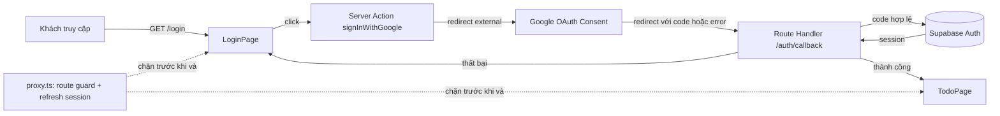

# Architecture — Login (Supabase Google OAuth)

## Tổng quan hệ thống

Ứng dụng là một Next.js 16 App Router monolith, dùng Supabase (local stack) làm backend-as-a-service cho Auth và Postgres. Lớp truy cập Supabase đã có sẵn ba client theo đúng ranh giới runtime của Next.js:

- `lib/supabase/client.ts` — `createBrowserClient`, dùng trong Client Component.
- `lib/supabase/server.ts` — `createServerClient` theo request, dùng trong Server Component/Server Action/Route Handler.
- `lib/supabase/update-session.ts` — refresh token trong `proxy.ts`, chạy trên mọi request khớp `matcher`.

Tính năng đăng nhập KHÔNG thay thế ba lớp này — chỉ tiêu thụ chúng và bổ sung một trách nhiệm mới cho `proxy.ts`.

## Thành phần mới do tính năng này đưa vào

- **Nhà cung cấp danh tính bên ngoài: Google**, qua Supabase Auth external provider (`auth.external.google` trong `supabase/config.toml`), không phải một service riêng do ứng dụng vận hành.
- **Route callback OAuth `/auth/callback`** (Route Handler) — biên nhận `code`/`error` từ Google, gọi `exchangeCodeForSession`, rồi điều hướng `/todo` hoặc `/login`. Đây là điểm nối duy nhất giữa vòng OAuth bên ngoài và phiên đăng nhập phía server.
- **`proxy.ts` nhận thêm trách nhiệm route-guard** — trước đây chỉ refresh session; nay còn quyết định điều hướng theo trạng thái đăng nhập cho `/login` và `/todo`. Vẫn là một file duy nhất, không tách middleware riêng.
- **Trang `/login`** (Server Component + một Client Component cho nút đăng nhập và bộ chọn ngôn ngữ) và **trang `/todo`** (placeholder tối thiểu, chỉ đủ để chứng minh điều hướng và đăng xuất).
- **Cookie `NEXT_LOCALE`** — cơ chế i18n nhẹ, không dùng thư viện định tuyến theo locale, không có route segment `[lang]`.

## Luồng dữ liệu

`proxy.ts` đứng trước cả `LoginPage` lẫn `TodoPage` trên mọi request — đây là nơi duy nhất quyết định "được vào hay bị điều hướng đi", không lặp lại logic đó trong từng trang.

## Vị trí mã nguồn dự kiến (planned — chưa có code)

| Thành phần | Đường dẫn dự kiến |
|---|---|
| Trang Login | `app/login/page.tsx` |
| Nút đăng nhập Google | `app/login/_components/google-sign-in-button.tsx` |
| Bộ chọn ngôn ngữ | `app/login/_components/language-selector.tsx` |
| Server Actions của Login | `app/login/actions.ts` |
| Callback OAuth | `app/auth/callback/route.ts` |
| Trang Todo (placeholder) | `app/todo/page.tsx` |
| Route guard | `proxy.ts` (file đã có, mở rộng — không tạo file mới) |

`ROUTE###` cho các route trên: `TBD (draft)` — mã chính thức được cấp khi promote/rebuild-spec chạy trên code thật.

## Ranh giới không đổi

- `lib/supabase/{client,server,update-session}.ts` giữ nguyên hợp đồng hiện có — tính năng này không sửa các file đó, chỉ gọi vào chúng.
- Không có bảng dữ liệu mới do ứng dụng sở hữu; toàn bộ phiên đăng nhập nằm trong schema `auth` do Supabase quản lý.
- Không có service/layer bên ngoài nào khác được thêm ngoài Google (qua Supabase Auth) — không message queue, không cache layer, không service riêng cho tính năng này.

## Chưa xác nhận

- ~~Chữ ký API `signInWithOAuth`/`exchangeCodeForSession`~~ — **đã xác nhận (2026-09-04)** qua `researcher-02-supabase-google-oauth.md`, đối chiếu trực tiếp với `@supabase/ssr` 0.12.5 đã cài và ví dụ chính thức của Supabase.
- Vị trí đặt ảnh nền hero (`public/images/login/hero.png`) — asset chưa export được từ MoMorph (xem `functional-spec.md` RISK-01).
