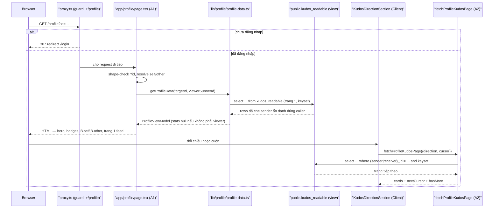

# Architecture — forward-draft delta (F006_ProfileBanThan)

**Phạm vi file này:** CHỈ phần `docs/system/architecture.md` mà F006 đổi. Không restate toàn bộ
tài liệu hiện tại — đọc `docs/system/architecture.md` (đã `implemented`, mô tả tới F005) để lấy
phần còn lại. Ba điểm dưới đây THAY THẾ đúng phần tương ứng ở tài liệu hiện tại khi Core pass
reconcile; mọi phần khác của `architecture.md` giữ nguyên.

## Thay thế § "System Architecture" — đoạn "Thay đổi lớn nhất so với bản trước"

**Thay đổi của vòng này (Profile bản thân):** trước màn này, mọi bảng `public.*` mở `select` thẳng
cho `anon`+`authenticated` (tiền lệ F004, `kudos_select_all`). F006 là lần đầu tiên một bảng bị
**revoke** quyền đọc trực tiếp: `public.kudos` không còn cho `select` từ `anon`/`authenticated` —
mọi đọc phải qua view `public.kudos_readable` (§ Data Flow bên dưới). Đây là ranh giới đọc thật
đầu tiên của repo, khác hẳn "mọi bảng đọc công khai" đã đúng từ F004 tới F005.

Route `/profile` cũng là route guarded thứ ba (sau `/todo`, `/kudos/new`) — vẫn cùng một điều kiện
`isGuarded` trong `proxy.ts`, không phải cơ chế mới.

## Thêm mới — "Reader-view data layer" (view giữa app và bảng `kudos`)

Từ F006, `lib/kudos/queries.ts:fetchKudos` (và hai điểm đọc trong `toggle-kudos-like.ts`) không còn
đọc `public.kudos` trực tiếp — cả ba đọc qua `public.kudos_readable`, một view null hoá `sender_id`
của một Kudos ẩn danh trừ khi caller chính là người gửi. View chạy dưới quyền chủ sở hữu (Postgres
mặc định, không set `security_invoker`) — tương đương "security definer" ở cấp function, cho phép
view vẫn đọc được `kudos` sau khi bảng gốc bị revoke khỏi `anon`/`authenticated`. Chi tiết cột và
predicate: `docs/features/F006_ProfileBanThan/technical-spec.md § 4.2`.

**Hệ quả kiến trúc:** từ nay "đọc Kudos" có hai lớp — bảng gốc (chỉ chủ sở hữu/migration đọc được)
và view công khai (mọi read-path của app đi qua đây). Một tính năng sau này thêm một điểm đọc
`kudos` mới PHẢI trỏ vào `kudos_readable`, không phải `kudos` — trỏ thẳng vào bảng gốc sẽ vỡ ngay
vì quyền đã bị revoke.

## Thêm mới — "Hai chiến lược phân trang cùng tồn tại" (ghi nhận, chưa hợp nhất)

F004's `all-kudos-feed.tsx` đọc hết bảng `kudos` một lần rồi cắt phía client theo `FEED_PAGE_SIZE`
(giả định A4: bảng nhỏ). F006's feed hồ sơ (`fetchProfileKudosPage`) là điểm phân trang SERVER
thật đầu tiên của repo — keyset cursor `(sent_at, id)`, mỗi lần cuộn là một truy vấn mới, không đọc
lại phần đã có. Hai chiến lược này cùng tồn tại có chủ đích ở bản vẽ này (ADV-1,
`technical-spec.md § 5.3`) — ai chạm lại `all-kudos-feed.tsx` sau này nên biết keyset cursor đã có
tiền lệ ở `lib/profile/`, không cần phát minh lại cách tiếp cận.

## Sequence diagram bổ sung — đọc hồ sơ + đổi chiều KUDOS

